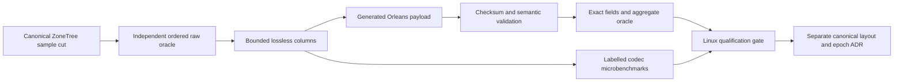

# ADR-079 — Bounded lossless time-series chunk codec qualification

Status: Accepted; codec source and local development verification delivered.
Exact-source Linux and subsequent canonical layout qualification remain pending.
Related: KL-078, REQ-SERIES-006/017–020 and AC-CHUNK-001–006 in
[TimeSeries](../Features/TimeSeries.md), architecture §27.6, ADR-035 and ADR-073.
The owner authorized completing the implementation plan; root owns this bounded
contract and the integration review.

## Decision and boundaries

Qualify a private generated Orleans chunk payload against the current native
SampleRecord oracle before choosing a canonical chunk layout. This stage does
not write chunk records, replace sample keys, change append acceptance, persist
a second authority, or alter the current native storage contract. Samples, sample-id
receipts, sequence counters and retention floors remain canonical ZoneTree data.
PartitionHost keeps all physical ownership; this codec owns only transient
buffers. Ordinary request grains and RF3 operation contracts remain unchanged.

Any future canonical chunk layout requires its own storage-layout decision,
measured codec choice, correction-generation recovery and all reader, retention
and RF3 joins. Removing the transient candidate is the rollback for this stage;
no canonical data conversion is performed and current SampleRecord aliases, IDs
and native bytes remain unchanged.

## Frozen internal contract

Core owns `Features/TimeSeries/SampleChunk*`. The internal API is
`SampleChunkCodec.Encode(ReadOnlySpan<SampleRecord>, ReadExecutionBudget,
int maximumBytes = SampleChunkCodec.MaximumEncodedBytes)`
returning owned native-envelope bytes and
`SampleChunkCodec.Decode(ReadOnlySpan<byte>, ReadExecutionBudget,
int maximumBytes = SampleChunkCodec.MaximumEncodedBytes)` returning an
owned `SampleRecord[]`. Input records must be owned and immutable for the call.
No borrowed storage span escapes a gate. The decoder's input bytes have already
been charged by the calling storage visitor; it checks the same budget without
double-charging them. Pure callers explicitly charge input before decoding.

One chunk has1..256 records from one ordinal-equal SeriesId, unique EventIds,
positive sequences and finite values. Ordering is strictly increasing by
`(Timestamp.UtcTicks, Sequence)`; sequences may decrease between different UTC
timestamps because late samples have later append sequences. Preserve every
EventId, SeriesId, exact persisted TagsJson, original timestamp offset and tick,
sequence and IEEE754 value bit, including negative zero. Do not normalize
offsets, reassociate floating-point aggregates, or use the accumulator library
as a storage codec.

The permanent private alias is `keyload.core.v1.SampleChunkPayload`. Generated
Orleans fields are fixed:0 FormatVersion:int,1 RecordCount:int,
2 UtcTicks:ReadOnlyMemory<byte>,3 Offsets:ReadOnlyMemory<byte>,
4 Sequences:ReadOnlyMemory<byte>,5 Values:ReadOnlyMemory<byte>,
6 Series:ReadOnlyMemory<byte>,7 EventIds:ReadOnlyMemory<byte>,
8 Tags:ReadOnlyMemory<byte>,9 Checksum:ReadOnlyMemory<byte>. All typed envelope
serialization uses NativeSerialization and the closed native raw-byte codec;
the compressed columns deliberately have their own versioned encoding.
FormatVersion is1. No runtime JSON fallback or alternate serializer is added.

* UtcTicks uses minimal unsigned LEB128: first absolute UTC tick, then
  nonnegative deltas. Values must remain within DateTimeOffset's UTC range.
* Offsets contains exactly2 bytes per record, signed Int16 little endian
  minutes, range-840..840. Reconstructing local ticks must also be valid.
* Sequences uses minimal unsigned LEB128 for the first positive sequence;
  subsequent signed deltas use the standard64-bit ZigZag transform. Checked
  reconstruction remains positive and cannot overflow Int64.
* Values uses minimal unsigned LEB128 of the first raw UInt64 double bit pattern
  and then XOR with the preceding pattern. Reject decoded nonfinite values.
* Series contains one length-framed string; EventIds contains RecordCount
  strings. A string prefix is `(byteLength << 1) | encoding`, encoded as minimal
  unsigned LEB128. Encoding0 is strict UTF8. Encoding1 contains raw UTF16 code
  units in little endian and is used only for strings with unpaired surrogates.
  This preserves existing identifier acceptance without replacement fallback.
  An encoding1 value must have even byte length and must need that fallback;
  otherwise the column is noncanonical. No new JSON interpretation is applied
  to persisted TagsJson.
* Tags contains a minimal-varint dictionary count1..RecordCount, distinct
  strings in order of first occurrence, then RecordCount minimal-varint indices.
  Every dictionary item is referenced and first occurrences have ordinal
  indices0,1,...; duplicate, unreferenced or out-of-order entries are corrupt.
* All columns are fully consumed; overlong varints, invalid lengths, indices,
  tuple order and trailing bytes reject. Empty or null fields reject.

Checksum is32-byte SHA256 over ASCII `keyload.sample-chunk.v1`, FormatVersion and
RecordCount as Int32 little endian, then columns2..8 in Id order, each prefixed
with its length as Int32 little endian. Compare fixed-time. It authenticates
integrity, not user authority; persisted policy is still checked at the owning
read boundary before exposing records.

## Resource and error contract

The complete native envelope is at most8,388,608 bytes, independently of the
caller budget. The explicit maximumBytes admission is1..8,388,608 and may be
smaller; the owner passes its native output/input cap rather than JSON-encoding
a byte array to measure it. A1MiB chunk ceiling would silently exclude a currently valid
maximum-size tag plus metadata, so it is not used. The shared operation budget
may be smaller. First preflight all counts and exact column sizes; allocate
exact-length buffers only after accepting their cumulative bound. Reuse string
references for the at-most256-item dictionary, without duplicating text during
preflight. Native Measure checks the complete envelope before serialization.
No geometric unbounded writer or untrusted collection-count allocation is used.

Check cancellation/deadline before native measure/encode/decode and after each,
at every record and at intervals no larger than64KiB during code-owned text/hash
walks. Bounded framework UTF8 conversion calls have checks before and after;
like the bounded synchronous native serializer, they are not advertised as
interruptible. No immediate cancellation or hard scheduling deadline is claimed.
Validate declared counts and input/column lengths before allocating decoded
record arrays or text. Bound retained decoded text by actual encoded columns,
not an unchecked declared length. A whole chunk fails; no prefix is returned.

Invalid encoder content, an empty chunk or invalid maximumBytes is Validation;
record count above256 or byte admission is BudgetExceeded. Unknown chunk or
native envelope version is FormatUnsupported.
Malformed known-version/checksum/native/column/shape data is Corruption.
Oversized supplied envelope is BudgetExceeded before native parsing.
Operation cancellation remains OperationCanceledException and deadline/work
exhaustion remains BudgetExceeded. Failure cannot mutate canonical source data.

## Ordered implementation, ownership and join

1. TASK-CHUNK-CONTRACT, root: this ADR, TimeSeries requirements, task graph and
   exact source/qualification boundaries. Start before delegated writes.
2. TASK-CHUNK-CODEC, lifecycle_wave Luna/high: new Core SampleChunk payload,
   codec and cohesive bounded column/checksum/validation helpers only. Existing
   writers, readers, public DTOs, aliases and central configuration are forbidden.
3. TASK-CHUNK-ORACLE, query_wave Luna/high: new UnitTests TimeSeries SampleChunk
   roundtrip/content/date-edge/bit/format/corruption/budget tests and independent
   fixture only. Do not derive expected values from the decoder or use mocks.
4. TASK-CHUNK-STORE-ORACLE, cluster_wave Luna/high: disjoint new real-ZoneTree
   SampleChunkStore* tests. Charge/read one actual cut, compare late/equal/dedup
   source records and exact source invariance after codec failures/reopen; do not
   invent a production chunk key or claim physical correction recovery.
5. TASK-CHUNK-MEASURE, root: labelled BenchmarkDotNet encode/decode and retained
   bytes/sample controls in BenchmarkScenarios `Features/BenchmarkComparisons/`,
   under the shared BenchmarkComparisons measurement feature, using native
   per-record persistence as the comparator. Preserve the existing executable's
   typed switcher and public generated-consumer fixture convention.
   Add only the exact benchmark friend visibility needed. Each result records
   source, machine, corpus and actual serialized bytes; these small controls are
   not database scale/comparison evidence or a public acceleration claim.
   New UnitTests `Features/BenchmarkComparisons/SampleChunkBenchmark*` own
   the fixture metadata and real external generated-consumer execution oracle;
   the existing bounded child/capture owner is reused without changing it.
   TASK-CHUNK-PROVENANCE, cluster_wave Luna/high, owns only new
   `scripts/Features/BenchmarkComparisons/sample-chunk-development*.mjs`.
   A bounded development CLI captures the complete tracked/untracked nonignored
   source inventory and actual Release benchmark dependency DLLs, including Core,
   before execution. It sets the frozen manifest environment, awaits the real
   BenchmarkDotNet child and validates all36 original cases and9 corpus manifests.
   It refuses changed source/binaries, missing/duplicate cases, failed execution,
   mismatched source or corpus and substituted artifacts. A new owned output
   directory holds original reports, bounded logs, inventories and a derived
   receipt explicitly marked local development only. Default settings match the
   fixture's1 launch,3 warmups,8 measurements and100ms iteration time, with
   explicit DontRemove outlier mode retaining every actual measurement; optional
   Dry mode remains an execution oracle with no performance qualification.
   No existing public/GitHub evidence module, workflow or website is modified.
   TASK-CHUNK-PROVENANCE-ORACLE, lifecycle_wave Luna/high, owns only new UnitTests
   BenchmarkComparisons `SampleChunkBenchmarkRejection*` helpers. After the real
   Dry consumer completes, validate its receipt and reject independently corrupted
   copies of its original reports/manifests: missing or duplicated cases, wrong
   launch/settings/parameters, nonpositive measurements, source-hash mismatch and
   forbidden qualification flags. Leave all originals byte-exact. Execute the
   actual checked-in validators in a bounded awaited child inside TUnit/Aspire;
   supplied parser fixtures never become measured or authenticated evidence.
6. TASK-CHUNK-JOIN, root: inspect every diff and acceptance mapping, enforce
   numeric complexity, strict full build/formatter/governance, run actual TUnit
   through Aspire, retain original reports and commit/push the completed stage.
   Exact-source normal/scalar Linux CI remains required. Canonical storage,
   correction recovery, retention rewrite and RF3 stay pending until
   the separate layout contract and genuine tests exist.

Coding workers stop and escalate on contract ambiguity, bound/compatibility
conflict, shared-file changes or any proposed canonical storage integration.
Unit/store suites prove codec behavior only. Process-kill, power-loss, endurance,
database performance and complete KL-078 acceptance are not inferred from them.

## Development evidence

The [2026-10-03 receipt](../implementation/sample-chunk-codec-development-2026-10-03.json)
retains the complete frozen source/runtime inventories, full Release and formatter
results, Aspire normal/scalar2852/2852 reports, two real36-case Dry consumers and
12 copied-report rejection cases per consumer. The ordinary36-case BenchmarkDotNet
control retains all8 measurements,3 warmups,9 actual corpora and original
encode/decode cost, allocations and native-envelope bytes for1/32/256 samples.
Both the initial failed validator/settings integration and its originals remain
recorded. Canonical storage, rewrite/correction recovery, RF3 and delivered-source
Linux qualification are still open.
