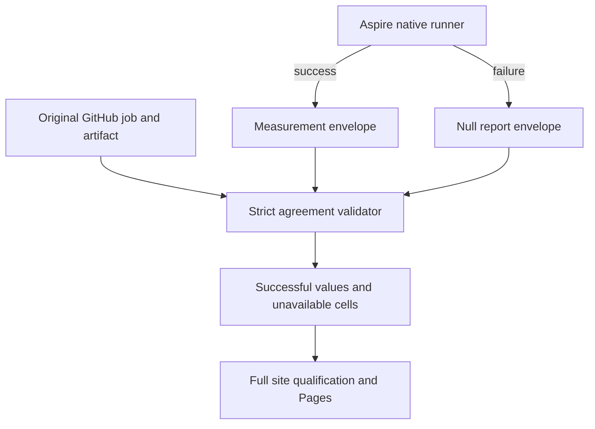

# ADR-080: Isolate benchmark failures during publication

Status: Accepted; source implemented, delivered-source verification pending.
Date: 2026-10-04. Related: REQ/AC-BC-FAIL-001..007, ADR-056/074/076.

## Decision

The owner requires all independent benchmarks to finish and publication to proceed
when one database workload fails, including unfinished KeyLoad. Preserve every
planned cell, actual native topology, bounded resources, workload contracts and
source/run/attempt/job/artifact authentication. A failed workload emits a version4
envelope with `disposition: failed`, a fixed safe reason and `report: null`. Its
original job remains failed and workload step remains failure; result upload must
succeed. Measured envelopes require successful workload jobs. Evidence mismatch,
missing artifacts, mixed sources, failed image preparation or unsuccessful site
qualification still fails publication. Partial success cannot establish a winner
against an unavailable database. No engine implementation or persisted data changes.

The alternative of stopping all publication discards useful independent results.
Treating failures as zero would invent comparative performance. Retaining raw
exception text risks exposing credentials; use a fixed public reason and link the
original GitHub job for diagnostics. Ordinary runner failures are finalized before
upload; cancellation/timeouts that prevent artifacts remain explicit blockers.

## Implementation contract

1. Root records owner policy, feature acceptance, exact baseline and shared schema.
2. Producer worker owns aggregation/GitHub selection modules and producer regression
   tests; preserve original step conclusions and require envelope/proof agreement.
3. Site worker owns isolated browser contract/metadata/report/numeric/view modules
   and dedicated TUnit projection/oracle/browser regressions. Failed cells contain
   no numeric metrics and retain their failed job links.
4. Root owns workflow always-finalization/aggregate condition, shared receipt
   validation, dependency/coverage inventory, source name tests and documentation.
   Diagnostic worker inspects native startup errors without changing KeyLoad engine.
   Under FAIL-PREP-REGISTRY, the existing image-contracts/manifests/evidence modules
   own2s real HTTP probes inside the unchanged30s readiness bound and private
   no-follow121-record/64KiB probe facts. Evidence I/O errors escape transport
   retry handling. Ten actual HTTP fixture cases belong to UnitTests; the image
   preparation job must build that runner and invoke its Aspire-owned filter.
   Run these actual loopback fixture tests before `prepare-images.mjs` owns the
   same registry port; restore/build the native test runners first. Keep the
   actual pinned image export/import checks after image construction.
   Under FAIL-PREP-KURRENT, `KurrentTarget.InitializeAsync` constructs the actual
   SDK writer only after `KurrentClusterVerifier.VerifyAsync` proves membership.
   Three SDK/resource-model tests belong to ComparisonTests and run in common
   preparation; existing native StreamAppend preflights qualify1/2/3-node semantics
   and copy/cleanup behavior. No provider replacement, URI or ACK/retry change.
5. Root reviews all diffs, builds solution, runs formatter/governance and focused
   Aspire-owned suites, then checkpoints scoped changes on current main and pushes.
6. Genuine Linux Benchmarks run qualifies all cells, aggregate, site coverage/browser
   and Pages publication. Local tests are development proof only.

Migration is additive to version4 dispositions; deploy producer/validators/site
atomically. Rollback reverts this coherent change and restores the conservative
publication gate, retaining immutable original artifacts. AC-BC-FAIL-001..007 map
to automated and actual-provider evidence in the feature specification. Root alone
owns integration and shared contract updates; workers never commit or push.

