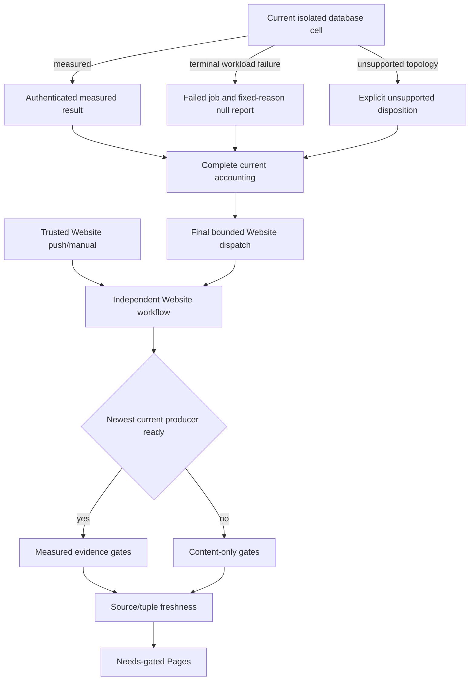

# ADR-080: Isolate benchmark failures from optional website publication

Status: Accepted implementation contract; complete current measured qualification remains pending.
Date: 2026-10-04; current workflow contract updated 2026-10-06.
Related: REQ/AC-BC-FAIL-001..021, REQ/AC-BC-CURRENT-001..004, REQ/AC-BC-WEB-001..007, ADR-056, ADR-062, ADR-064, ADR-076, ADR-112.

## Decision

Keep exactly four GitHub Actions workflows: Build and Tests, Benchmarks, Website,
and Release. Build and Tests owns solution/build/analyzer/unit/scalar/recovery/RF3
checks. Benchmarks owns native preparation, independent database workloads and
source-bound result aggregation. Website owns website source qualification and
Pages publication. Release remains its separate manually admitted workflow.

Every planned benchmark cell retains its current native topology, workload,
correctness, acknowledgement, resource, source and provenance contract. Independent
cells continue after a workload failure. The failed workload keeps its failed job
and step outcome and may emit only an authenticated terminal envelope with a fixed
safe reason and `report: null`; its result artifact must upload successfully.
Explicit unsupported-topology dispositions remain distinct from failures. A failed
or unsupported cell is never a measured zero and cannot establish a winner. Missing,
skipped, canceled-without-artifact, malformed, mixed-source or unauthenticated
inputs are not converted to null workload results: they fail the relevant plan,
cohort or publication gate. Site qualification, browser, coverage, archive,
freshness, provider and source-integrity failures remain visible and cannot be
masked by another successful database.

The final `Trigger Website` job in `.github/workflows/benchmarks.yml` runs after
the aggregate dependencies settle on trusted own-main push/manual events. Only this
job receives `actions: write`; database jobs remain read-only. It dispatches
`.github/workflows/website.yml` and passes the optional original benchmark run ID
solely as a bounded completion-wait target. Website itself runs on trusted own-main
push or manual dispatch and remains independent of Build and Tests, benchmark
success and aggregation success. There is no `workflow_run` Website executor.

Website authenticates the actual own-repository main Benchmarks run and independently
selects the newest ready completed producer whose aggregate and complete current
source/archive/proof inventory validate. An incomplete, failed, canceled or pending
producer is not ready; if no current producer is ready, Website emits no metrics
and may publish its qualified content-only artifact with `benchmarks: null`. A
selected producer with corrupt, expired, missing, duplicate or mismatched evidence,
or an API/authority error, fails closed without falling back to older measurements.
Before deployment, Website revalidates current source and the exact selected producer
tuple (including the no-producer state); a changed or newly available tuple requires
fresh qualification. Content-only success is not measured-cohort qualification.

The four workflow boundaries and optional selection contract are implemented by
`build-and-tests.yml`, `benchmarks.yml`, `website.yml`, `release.yml`, and the current selection,
receipt, proof, freshness and builder modules under `scripts/Features/BenchmarkComparisons/`
and `site/Features/BenchmarkComparisons/`. Stable detailed acceptance remains in
[BenchmarkComparisons](../Features/BenchmarkComparisons.md), including these exact
current gates: AC-BC-FAIL-006 keeps each registry probe at 2 seconds within the
30-second total, diagnostics at 121 records/64 KiB, fixture ports kernel-assigned,
and production port 5000 with optional fixture input restricted to 1..65535;
AC-BC-FAIL-007 preserves Kurrent membership-before-writer and native 1/2/3-node
ACK/copy checks; AC-BC-FAIL-008 retains ordinary-failure finalization and explicit
cancellation behavior; AC-BC-FAIL-009 retains authenticated Redis RESP/AOF/native
membership and WAIT/WAITAOF contracts; AC-BC-FAIL-010 retains the double cosine,
ordinal tie-order and bounded native TopK OpenSearch oracle; AC-BC-FAIL-011 retains
owned evidence-parent admission and collision checks; AC-BC-FAIL-012/013 retain
real native probe/error/cancellation behavior and exact canonical source bytes;
AC-BC-FAIL-015/016 retain confined browser catalog URLs, real Chrome Ready and
ICO/PNG byte-structure checks. No probe, transport, source or browser assertion is
weakened by workflow separation.

AC-BC-FAIL-014 keeps heavy builder/archive-verification admission at two active
children, a FIFO maximum of 64 queued waiters, and a 20-minute cancellable admission
deadline inside the 30-minute ordinary Site suite bound; each active child retains
its 300-second deadline. Lease ownership lasts until actual child exit and both
stdout/stderr readers settle. Unsafe or incomplete settlement poisons admission
and rejects pending waiters; queued cancellation starts no child. Current source
constants and ordinary Site timeout mapping match these frozen limits. Real-process
regressions retain capacity/FIFO, cancellation, queue-full/deadline, start failure,
active cancellation, output bounds, safe successor ordering, and poison/rejection.
AC-BC-FAIL-001..005 retains independent cells, visible terminal failure, null-only
reports, authenticated cohort agreement and native preparation/correctness.
AC-BC-FAIL-017..021 and AC-BC-WEB-001..007 define current workflow separation,
run authentication, newest-ready optional selection, complete content-only/measured
qualification, source/tuple freshness and independent lifecycle.

## Ordered implementation and verification contract

1. The feature and ADR freeze stable REQ/AC, current workflow ownership, failed/null
   semantics and the exact source-bound evidence joins before implementation.
2. Benchmark owners maintain the canonical current plan, isolated cells, provider
   archives, authenticated aggregate and original job outcomes. Website owners
   maintain bounded current-producer selection, optional evidence intake, closed
   content-only/measured qualification and exact freshness. Workflow changes stay
   in the four named workflow files and their existing feature-local composite
   actions; no alternate executor or publisher is introduced.
3. The integration owner reviews all producer/consumer, permissions, source,
   archive, TUnit, coverage, browser and provider diffs together. Native tests use
   the real existing processes, files and clients; no mock, source-text assertion,
   fake GitHub executor, fabricated artifact or skipped gate substitutes for them.
4. Verify the complete delivered source with static workflow and inventory checks,
   full solution build/format, the Aspire-owned TUnit suites with complete no-skip
   receipts, authenticated current producer evidence, Linux source-bound coverage
   and real browser gates, Website freshness, and the actual Pages provider result.
   Local development results and historical receipts remain evidence of their
   original source only.

Rollout preserves four workflow responsibilities and joins producer, consumer,
qualification and docs as one reviewed source checkpoint. Rollback restores the
last qualified site artifact and conservative evidence admission without rewriting
immutable benchmark results. Benchmark failure isolation does not alter database
storage, authorization, topology, workload, acknowledgement or public operation
contracts.

