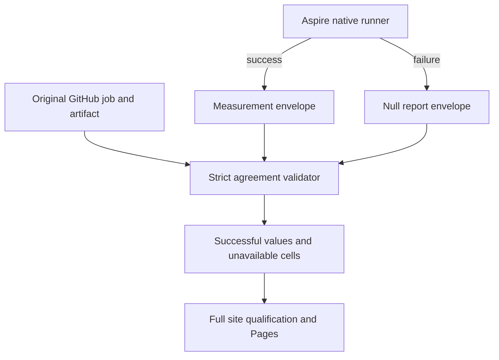

# ADR-080: Isolate benchmark failures during publication

Status: Accepted; source implemented, delivered-source verification pending.
Date: 2026-10-04. Related: REQ/AC-BC-FAIL-001..014, ADR-056/074/076.

## Decision

The owner separates database comparisons/JSON from Chrome/site qualification.
The latest clarification permits a separate static build action after JSON,
including at the end of Benchmarks. The selected implementation triggers the
independent website action through CI on own-main push/manual and completed
Benchmarks events. Exactly three workflows remain; measurements and failed/null
semantics stay intact. Website failures cannot block benchmark JSON.

REQ/AC-BC-FAIL-017..020 own this boundary. Root removes the old aggregate HTML
steps and qualify/deploy from Benchmarks, and adds independent CI website jobs.
Ordinary CI suites keep their existing push/PR/manual events. Website jobs have
no dependency on ordinary CI/RF3. Preserve every archive/source/TUnit/browser/
coverage gate and least-privilege needs-gated deployment.

Every website build selects the newest completed own-main Benchmarks run by run
number across push/workflow_dispatch producers with success/failure conclusion;
pending, skipped and canceled workflows have no completed comparison cohort and
are excluded before choosing the latest. Require its successful complete aggregate.
After selecting the newest completed run, missing/corrupt/expired/failed aggregate
evidence rejects publication without older fallback. Authenticate an actual
workflow_run trigger separately: it may refer to an older completed run while a
newer one is already ready. Actual native Linux CI context and original GitHub
REST metadata authenticate the selected source/run/attempt/event/conclusion.
Reselect latest before deployment; a changed tuple fails freshness.

Producer worker owns existing site-isolated-github context/contract/capture/runs/
receipt/proof and native producer SiteTests. Bound actual workflow_run payloads
and preserve frozen original seven-step legacy receipts; new producers require
five database aggregate steps. Root owns workflows, composites/policies,
closure/coverage inventories and docs; workflow worker owns relevant UnitTests.
Join at exact original suite/provider archives,270/277 proof, all website gates
and latest-tuple freshness. No engine, persistence, workload or topology changes.

Stages: contract -> disjoint source/test implementation -> root review/full build/
format/governance/focused Aspire verification -> scoped main checkpoint/push ->
authentic JSON and independent native CI website consumer. Rollback coherently
restores prior workflow/context together without changing immutable results or
introducing a fourth workflow or fabricated provider.

The owner requires all independent benchmarks to finish and publication to proceed
when one database workload fails, including unfinished KeyLoad. Preserve every
planned cell, actual native topology, bounded resources, workload contracts and
source/run/attempt/job/artifact authentication. A failed workload emits a version4
envelope with `disposition: failed`, a fixed safe reason and `report: null`. Its
original job remains failed and workload step remains failure; result upload must
succeed. Measured envelopes require successful workload jobs. Evidence mismatch,
missing artifacts, mixed sources, failed image preparation or unsuccessful site
qualification still fails publication. Partial success cannot establish a winner
against an unavailable database. No engine implementation or persisted data changes.

The alternative of stopping all publication discards useful independent results.
Treating failures as zero would invent comparative performance. Retaining raw
exception text risks exposing credentials; use a fixed public reason and link the
original GitHub job for diagnostics. Ordinary runner failures are finalized before
upload; cancellation/timeouts that prevent artifacts remain explicit blockers.

## Implementation contract

1. Root records owner policy, feature acceptance, exact baseline and shared schema.
2. Producer worker owns aggregation/GitHub selection modules and producer regression
   tests; preserve original step conclusions and require envelope/proof agreement.
3. Site worker owns isolated browser contract/metadata/report/numeric/view modules
   and dedicated TUnit projection/oracle/browser regressions. Failed cells contain
   no numeric metrics and retain their failed job links.
4. Root owns workflow always-finalization/aggregate condition, shared receipt
   validation, dependency/coverage inventory, source name tests and documentation.
   Diagnostic worker inspects native startup errors without changing KeyLoad engine.
   Under FAIL-PREP-REGISTRY, the existing image-contracts/manifests/evidence modules
   own2s real HTTP probes inside the unchanged30s readiness bound and private
   no-follow121-record/64KiB probe facts. Evidence I/O errors escape transport
   retry handling. Ten actual HTTP fixture cases belong to UnitTests; the image
   preparation job must build that runner and invoke its Aspire-owned filter.
   Run these actual loopback fixture tests before `prepare-images.mjs` owns the
   same registry port; restore/build the native test runners first. Keep the
   actual pinned image export/import checks after image construction.
   The readiness helper accepts an optional numeric loopback port with default
   registry.port; validate integer1..65535 before URL construction, HTTP or
   evidence I/O. Both production callers retain their no-argument default5000.
   Actual HTTP fixtures listen on kernel-assigned port0, retain that listener
   until cleanup and pass only its observed port. Extend the existing bounded
   evidence case with invalid-number/type checks, zero HTTP requests and absent
   evidence assertions; do not change OS settings/processes or accept arbitrary
   hosts/URLs/environment overrides. Root integrates this port-isolation follow-up,
   reviews the unchanged production callers and reruns the10 original scenarios
   through freshly built Aspire/TUnit before the next scoped checkpoint.
   Under FAIL-PREP-REDIS (REQ/AC-BC-FAIL-009), preserve the existing isolated
   password-authenticated RESP/TCP bootstrap and native6379 replication. Use the
   official resource-local `WithoutHttpsCertificate()` call, with compiler opt-in
   ASPIRECERTIFICATES001 limited to the native API and direct annotation checks.
   This prevents the pinned Aspire13.6 BeforeStart callback from changing the
   endpoint/discovered connection to TLS while the owned bootstrap stays plain.
   Native-failures agent owns only IsolatedRedisResources.cs, the existing Redis
   resource-model regression and actual RedisNativeReadinessRegression transport
   checks. Root owns docs, integration, build/format/Aspire verification, scoped
   checkpoint and genuine new-source1/2/3-node preflight/publication evidence.
   Resource tests require explicit certificate opt-out, fixed native port/scheme
   and authenticated non-TLS client configuration; real startup tests also retain
   PONG/write/direct-copy/cancellation and AOF/ack contracts. Never remove health
   checks, alter shared TLS/trust settings, disable certificate validation or
   change another engine's resources. Rollback is the scoped call/check removal
   and honestly restores the known readiness mismatch; no storage migration.
   Under FAIL-PREP-KURRENT, `KurrentTarget.InitializeAsync` constructs the actual
   SDK writer only after `KurrentClusterVerifier.VerifyAsync` proves membership.
   Three SDK/resource-model tests belong to ComparisonTests and run in common
   preparation; existing native StreamAppend preflights qualify1/2/3-node semantics
   and copy/cleanup behavior. No provider replacement, URI or ACK/retry change.
   Under FAIL-PREP-OPENSEARCH (REQ/AC-BC-FAIL-010), retain the existing
   float32 vector corpus, shared double cosine oracle, exact projection and
   ordinal ID tie order. The original genuine n1 job rejects the same query
   twice in each repetition; it remains failed/null in its original publication
   cohort. A float translated-score witness demonstrates that distinct exact
   scores can collapse and reverse ID order, but does not establish unrecorded
   native returned IDs. Pinned3.6.0/k-NN3.6.0.0 allows vector doc values in
   scripted-metric contexts but not NumberSortScript; generic vector get(int)
   throws. Use the supported native scripted_metric map/combine/reduce path
   over every eligible indexed vector, retaining at most TopK native candidates
   per shard and merging only those bounded states. Preserve double cosine
   descending and ordinal ID ascending. Read the existing native source payload
   only for admitted candidates; do not duplicate stored vectors or fetch/rerank
   in the client. Convert query
   parameter elements through float32 before double arithmetic to match stored
   float32 inputs. Keep finite response validation, actual native index/copies,
   cancellation and existing workload bounds; preserve non-vector response checks.
   Do not change the shared oracle, corpus, ANN mode, client reranking, TLS or
   acknowledgements. Record the native exact-double strategy in its report
   contract. Native-failures agent owns only the OpenSearch query/script/response/
   session/probe/names helpers and focused ComparisonTests precision/query/response regressions;
   root owns contract/docs, integration/build/format/Aspire checks and delivery.
   Tests must retain the independent d170/2289/1272 precision witness, native
   response rejection cases and real VectorExact1/2/3 jobs with all50000 measured
   operations per cell passing the unchanged oracle. Current run continues to
   publish honest unavailable cells; new source must retain its own entire
   authenticated270 cohort and full site/Pages gates. Rollback reverts only these
   benchmark adapter/tests/contracts, restoring the known precision rejection;
   no database migration or engine repair is involved.
   Under FAIL-SITE-STARTUP (REQ/AC-BC-FAIL-011), original270 aggregation passed
   but QualifySite shell redirection failed before any test because its evidence
   parent was absent. Root owns QualifySite/action.yml initialization, the new
   mandatory Aspire unit preparation step, closed workflow gate tests and docs.
   Create only workspace/artifacts/site-evidence after rejecting file/symlink
   collisions at its two owned path components. Preserve the exclusive
   isolated-capture child creation and every current source/archive270/277,
   no-skip/TUnit/browser/coverage/freshness/Pages contract. Producer worker owns
   only SiteQualificationStartupFixture.cs and SiteQualificationStartupTests.cs
   under UnitTests/Features/BenchmarkComparisons. Execute the actual source Bash
   initialization in disposable native filesystems: new/existing directories
   permit envelope redirection without replacing sentinels; file and base/parent
   symlink collisions reject before output and leave targets unchanged. Reuse
   bounded owned child-process lifetime; await child exit before cleanup. These
   unit workspace variables are filesystem inputs, never forged provider/run
   evidence. Root integrates source/build/format/Aspire tests and delivers with
   a fresh genuine entire270 run; old control actions cannot be rebound to newer
   source. Rollback removes only this scoped action/tests/gate change and
   restores the known missing-parent failure, never an alternate publication.
   Under FAIL-CANCEL, the three matrix workload/finalizer/upload stages use the
   explicit `!cancelled()` status condition, preserving execution after ordinary
   failure. Cleanup remains `always()` and allows cancelled image setup only
   through the existing run/attempt/repository/container ownership validation.
   Update existing workflow regressions before integration. Keep aggregate,
   site qualification and deploy dependency guards unchanged; cancelled jobs
   remain rejected as measurement/publication evidence. The registry test alone
   accepts legitimate final-budget timeout facts and exposes Node stderr; its
   production30s/2s bounds and success predicate remain unchanged.
   Under FAIL-SITE-PROBES (REQ/AC-BC-FAIL-012/013), genuine run37173267644
   qualified all270 original cells and source/archive intake, but site135/158
   passed. Nine direct failures are test-harness defects: default PascalCase
   request serialization disagrees with lowercase Node arithmetic input; numeric
   native DOMException.code is read as string; seven disposable SEO/vendor
   repositories omit the eagerly imported canonical isolated-contract.json.
   Native worker owns SiteNodeProbe.cs, SiteIsolatedNodeProgram.cs,
   SiteMetadataRejectionTests.cs and SiteVendorTestScope.cs under SiteTests;
   SiteVendorTokens.cs loses only the obsolete scratch-aggregate directory token.
   Use existing SiteTokens.JsonOptions, actual native error.name only when code
   is not a string, and exact source-byte copying of the canonical contract.
   Vendor-only source mutations retain the accepted fixture's full original
   aggregate/270-worker input directory as an unchanged read-only input. Remove
   the aggregate-only scratch copy: the native validator requires all271files,
   whose actual development inventory is2064912853bytes. Do not duplicate it
   for every vendor metadata mutation or weaken inventory/byte validation.
   Preserve median/AbortError assertions, real production builder, vendor bytes,
   every intended asset rejection, native inputs and all coverage thresholds.
   Existing16 focused cases are the regressions; root integrates/builds/formats
   and records actual source/patch/input identity for development evidence.
   Under FAIL-SITE-ADMISSION (REQ/AC-BC-FAIL-014), the same original TRX shows
   eleven independent full builders and two archive-verification children each
   reached the unchanged300s active deadline during the concurrent test burst.
   Before-session full native verification succeeded in60.14s; after-session
   verification/coverage completed in91.27s. Bounded original-input development
   profiling now measures native V8-instrumented CPU-heavy execution: one builder
   44.014s and two53.448/53.444s; full277-input verification48.428s single and
   59.707/75.799s concurrent, with peak per-child RSS below483MB on the actual
   macOS arm64 machine. These local observations do not prove GitHub saturation.
   The original TRX has25 builder cases,12 produce-rejection cases and five
   additional native inputs/verify-inputs cases matched by heavy classification.
   These42 cases permit40 pending requests with two active; multi-invocation
   cases invoke children sequentially. This is a source/TRX inventory bound,
   not an observed queue. Approve two active children, at most64
   FIFO waiters and20 minutes for cancellable admission within the existing
   30-minute Aspire site-suite budget. Classify actual builder/produce/full
   inputs or CLI verify-inputs calls; light probes and native network capture
   remain independent. Producer owns SiteHeavyChildAdmission.cs,
   SiteHeavyChildLease.cs, SiteHeavyChildTokens.cs,
   SiteHeavyChildClassification.cs, SiteHeavyChildProcessFixture.cs,
   SiteHeavyChildAdmissionTests.cs and SiteHeavyChildCleanupTests.cs, and only
   modifies SiteIsolatedNodeProcess.cs, SiteIsolatedBuilderProcess.cs,
   SiteIsolatedGitHubNodeProcess.cs and SiteIsolatedGitHubNativeProcess.cs under
   the same SiteTests feature. Scoped actual admission instances permit real
   Node-child FIFO/capacity, queued-cancel, queue-full/deadline, start-failure,
   active-cancel, output-bound and unsafe-ownership tests; no mocked process,
   clock, transport or fabricated provider replaces the native dependency.
   Admission precedes the existing active deadline and is bounded/cancellable.
   Ownership lasts through real exit and settled readers, including failed or
   cancelled children. Unsafe incomplete cleanup poisons admission and rejects
   pending requests; it must not release capacity before exit/readers settle.
   Keep full270/277/raw checks and add real-process tests for
   concurrency, queued cancellation and failure/cleanup; do not extend300s,
   fabricate input, omit tests, reduce coverage or make an alternative publisher.
   All browser starts failed before Chrome; missing browser coverage is an
   observed consequence, not permission to remove its required inventory.
   Local development uses genuine original bytes and actual source/patch identity,
   never forged CI/GitHub environment or rebound original website/control fields.
   A focused development filter cannot qualify the full suite/coverage.
   Rollback reverts only these test-harness/admission changes and truthfully
   restores the observed qualification failure. No engine/data migration.
   Under FAIL-SITE-CATALOG/ICO (REQ/AC-BC-FAIL-015/016), the complete original-input
   local development suite reached159/168 passing after the heavy-child repair.
   Five real Chrome cases exposed emitted `./data/isolated-catalog.json`, which
   the existing strict URL guard rejects before fetching. Root owns only the
   catalog attribute in site/Features/BenchmarkComparisons/index.html and its
   actual-output assertion in SiteIsolatedBuildTests.cs; emit the confined
   `data/isolated-catalog.json` without relaxing validators or Ready assertions.
   The existing ICO positive test also confuses an entry color-count byte with
   the file header type, and expects bitmap planes1 for canonical PNG-backed
   planes0 entries. Root owns only SiteMetadataTokens.cs and
   SiteMetadataBinaryAssertions.cs: name/check color-count0 and reserved0, retain
   file type1/bits32/bounds/dimensions/exact bytes, and check PNG bit-depth8 and
   RGBA color-type6. The Microsoft ICO structure and Pillow's native PNG ICO
   writer document these fields; this changes assertions, not canonical assets.
   Existing five Chrome, standalone output and icon cases are the regressions;
   source-exact local development then genuine complete Linux qualification,
   coverage and Pages remain required. Two native GitHub-context tests require
   actual Linux Actions execution and cannot pass in the local macOS environment;
   never fabricate that executor or skip the production gate. Root records the
   original159/168 report, its coverage failure and actual9m14s duration, then
   repeats relevant cases after source repair. The executed70-file dependency
   closure is unchanged by this markup/test-only repair, allowing genuine older
   measured/control source to qualify a freshly captured main website source.
   Rollback reverts these four owned files and restores the known failure;
   no data, dependency, transport, engine or storage migration is involved.
5. Root reviews all diffs, builds solution, runs formatter/governance and focused
   Aspire-owned suites, then checkpoints scoped changes on current main and pushes.
6. Genuine Linux Benchmarks run qualifies all cells, aggregate, site coverage/browser
   and Pages publication. Local tests are development proof only.

Migration is additive to version4 dispositions; deploy producer/validators/site
atomically. Rollback reverts this coherent change and restores the conservative
publication gate, retaining immutable original artifacts. AC-BC-FAIL-001..019 map
to automated and actual-provider evidence in the feature specification. Root alone
owns integration and shared contract updates; workers never commit or push.

## Delivered selection correction

Original GitHub metadata after873cd1a shows runs55/54 canceled while waiting,
run56 active and the genuine completed270-cell JSON at run53/73. Cancellation
is not a completed comparison result. Filter candidates to completed success/
failure producers before selecting highest run number; the actual canceled event
still cannot authorize publication. Preserve no-fallback rejection after the
newest eligible producer has a failed/missing/corrupt aggregate. The original
metadata digest is f8816dacf8a60b68a41b8911185b8c97f2e27cbd816980f1331972b929d19007.
