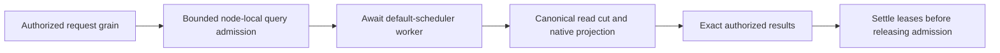

# ADR-081 — Awaited bounded native search execution

Status: Accepted implementation contract; reviewed source and local development gates passed; exact-source Linux and public RF3 qualification pending.
Related: KL-029, REQ-FTS-003/005/007 and AC-FTS-003/005/007 in
[NativeFullTextProjection](../Features/Search/NativeFullTextProjection.md),
ADR-034, ADR-078, AC-MCP-001 and AC-SQLVIEW-003.

## Problem and evidence boundary

Source inspection establishes an integration hazard: pinned ZoneTree1.9.8
`ZoneTreeMaintainer.WaitForBackgroundThreads()` synchronously waits on its async
method, whose merge-thread join await captures the current context.
ZoneTree.FullTextSearch1.0.9 calls that path during eviction/disposal. KeyLoad
currently invokes synchronous search and projection settlement inside the
Orleans read turn. A continuation can require the turn blocked by that wait.
Task.Run in the dependency does not itself inherit the Orleans scheduler; the
captured continuation is the concrete hazard.

Provider source: [ZoneTreeMaintainer at pinned13ee11e](https://github.com/ZoneTree/ZoneTree/blob/13ee11e19007301fdea72b9210de62f6257f4929/src/ZoneTree/Core/ZoneTreeMaintainer.cs).
Actual causality and repaired liveness require the real public RF3 regression.
Default-scheduler tests alone do not establish the Orleans join.

## Execution and ownership contract

Add `SearchEngine.SearchAsync` and factor existing exact search into one shared
core. Validate the request argument, create/check the existing operation budget
and acquire `DatabaseEngine.AdmitQuery` before scheduling work. Admission is the
existing finite node-local analytical gate with immediate rejection and no extra
wait queue. The budget starts before scheduling, so delay remains charged. No
second independent concurrency allowance is added.

The admitted operation awaits one Task.Run worker on the default scheduler.
That worker owns the entire canonical read action, persisted principal/resource
checks, native projection acquisition/build/reuse, canonical scoring, result
projection and complete lease settlement. No borrowed read view or native handle
crosses the storage gate or escapes the worker. The caller retains admission
until the worker completes every finally/disposal path. Backend awaits do not
capture the caller context; the grain awaits the backend while yielding its
Orleans turn. Cancellation may prevent unstarted work; once started, existing
shared budget checks and complete cleanup govern cancellation. No detached
cleanup, Task.Wait/Result in a grain or early success on cancellation.

Synchronous Search remains the exact implementation for context-free callers.
All request-grain Search dispatch uses SearchAsync. A native text search on a
nondefault scheduler/synchronization context rejects unsafe direct synchronous
use before acquisition with InvalidOperationException directing the caller to
await SearchAsync. Vector-only sync execution and context-free callers retain
their contract. No scalar fallback, alternative provider or duplicate ranking.

Preserve one grain per request, fresh quorum barrier and persisted authorization
reload, node-local PartitionHost files/journals/apply gate, exact source cuts,
generation bounds, primary-plus-cleanup failure reporting and RF3 authority.
Neither scheduling nor activation movement transfers physical storage ownership.
SearchRequest/output/native aliases and the HTTP/SDK/MCP protocol remain
unchanged. This is execution integration; canonical storage is unchanged. No
speed, hard cancellation latency, power-loss or production qualification follows.

## Independent RF3 oracle repairs

The same original run exposes stale expectations unrelated to scheduling.
Repair fixtures under existing accepted contracts, without product changes:

* MCP initially exposes the three gateway tools. Authorized on-demand discovery
  resolves canonical operations, including stream replay and series retention,
  with independent required-field/effect/schema oracles under
  [ADR-104](ADR-104-mcp-gateway-tool-discovery.md). The independent current
  canonical inventory contains 68 operation names; its complete validation and
  invocation coverage remain distinct from the initial gateway tool list.
* Aggregate replay protected payload/header writes use explicit persisted write
  grants matching field policies. Restricted-read/use cases retain write grants
  and continue proving denial of missing read/use authority.
* SQL model-view AST ordering uses canonical metadata pointers `/@id` and
  `/@revision`. Legal wildcard selection remains unchanged.
* Principal grant updates advance PolicyEpoch and return the actual updated
  identity; revocation advances that returned epoch. Active missing grants
  remain PermissionDenied; revoked-principal credential resolution is
  Unauthenticated through SDK and official MCP. No retries, skipped cases,
  relaxed errors, stale-epoch magic increments or security bypasses.

## Ordered implementation and task graph

1. TASK-FTS-ASYNC-CONTRACT, root: this ADR, feature/acceptance mapping and graph
   are frozen before delegated implementation.
2. TASK-FTS-ASYNC-INTEGRATE, root: only Query/SearchEngine.cs and new cohesive
   Query/Features/Search helpers if needed, Orleans/ClusterRouting
   GrainQueryReadCapabilities.cs and DatabaseReadGrain.cs. Preserve exact core,
   authorization/error/admission paths; no central or DTO edits. Root also
   adapts the existing NativePublicReadFixture/Elements async diagnostic bridge
   and CrashHost Search/NativeTextCrashScenario calls to the awaited API, keeping
   the same diagnostic, real-process pause and canonical-preservation oracles.
   Existing async search, relational-linkage, admission and process-recovery
   callers await the new API without weakening their results or errors. The
   allocation control retains its existing synchronous measurement helper:
   warmup and GC.GetAllocatedBytesForCurrentThread before/Search/after must run
   on the actual measured thread. Caller-thread counts around awaited worker
   execution are invalid. No generic sync adapter or diagnostic suppression.
3. TASK-FTS-ASYNC-ORACLE, lifecycle_wave Luna/high: new UnitTests/Features/Search
   NativeTextAsync* and IntegrationTests/Features/Search NativeTextAsyncRf3*
   files only. Use actual ZoneTree/native FTS and real RF3 SDK/official MCP.
   Cover first publish, same-scope reuse, replacement after mutation, fresh
   policy denial/revocation, saturation/pre-cancellation, cleanup and healthy
   following requests. Assert real node health through existing contracts;
   no custom scheduler, fake projection, mock or invented physical-owner proof.
4. TASK-RF3-ORACLE-REPAIR, query_wave Luna/high: only integration ClientApi
   McpCatalogExpectations and required protocol/tool constants, EventStreams
   AggregateReplayRf3* fixtures/assertions and QueryExecution SqlModelViewRf3*
   scenarios/authorization/test files. Apply only the independent corrections
   above, retain all exact assertions, escalate actual product defects.
5. TASK-FTS-ASYNC-JOIN, root: review every diff, strict full Release build,
   formatter/governance, TUnit unit/scalar and genuine Docker/Aspire RF3 through
   real clients, unchanged source inventory/original reports, honest docs/status,
   stage commit and push. Current-format process recovery, fault/endurance/performance,
   coverage and exact-source Linux gates retain separate required evidence.

Root alone owns shared contracts, docs, evidence and Git. Workers have disjoint
write scopes. No dependency replacement, source suppression, unsafe shutdown,
test weakening or other-worker edits. Start writes only at root's explicit
source-freeze release; never mutate source during generated-consumer tests.

## Rollout and rollback

Deploy a homogeneous exact-source RF3 build after qualification. Any rollback
must retain the current stored contract and a qualified awaited execution path;
never reintroduce a synchronous native join on an Orleans turn. A deployment
change must preserve acknowledged committed state and derived-index authority.
Frontend N/A: no UI requested.
Public DTO changes N/A: same accepted operations. Owning dependency patch N/A:
ZoneTree is third-party; KeyLoad corrects its own native execution boundary
without changing or imitating the dependency.
