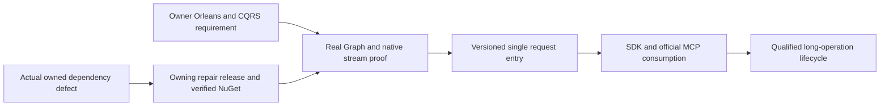

# ADR-082 — Native Orleans CQRS streams

Status: Accepted C0 runtime-compatibility and C1 request-RPCv2 implementation contracts,2026-10-04. C1 implementation depends on the published Graph repair and passing unchanged C0 oracles; C2/C3 contracts and all required product qualification remain pending.

Related: owner2026-10-04 rule in AGENTS.md, REQ/AC-NCQRS-001–005 in [NativeCqrs](../Features/ClusterRouting/NativeCqrs.md), ADR-002/010/020/022/036/057/060/077/081, and REQ/AC-ANN-007/008.

## Decision and source basis

Use our pinned ManagedCode.Communication CQRS native IAsyncEnumerable<CqrsStreamChunk<TProgress,TResult>> for streamed results and long operations through Orleans. Retain the unique request grain, canonical persisted command/retry authority, current principal/read-cut checks and node-local PartitionHost/ZoneTree ownership. Native streams must not become a second execution dispatcher, trusted client identity or durable storage authority.

Communication10.2.6 has a capacity-one cooperative Create producer, native chunk conversion and real Orleans chunk/scheduler tests. Its permissive Normalize method does not guarantee exactly one terminal chunk for arbitrary malformed input; KeyLoad must define its own well-formed producer and terminal protocol. Communication has no IQuery dispatcher. Its current SSE helper lacks frame/total/error-body admission, which requires an owning-repository repair before public use.

Pinned Graph10.0.6 filters scope history/caller state around context.Invoke, without explicit MoveNext/Dispose wrapping. Orleans10.3.1 retains and pulls a grain enumerator through its native extension, with batching, cancellation and cleanup. Neither source presence nor Communication's tests prove their combined graph context and cleanup behavior. C0 therefore implements real runtime compatibility oracles before any product request interface change.

## Ordered implementation, ownership and joins

1. TASK-NCQRS-C0-CONTRACT, root: this decision, the complete feature/AC contract, source audit, dependency choice and task graph before write delegation.
2. TASK-NCQRS-C0-RUNTIME-ORACLES, cluster_wave Luna/high: only new UnitTests/Features/ClusterRouting/NativeCqrs*.cs. Genuine TestCluster, actual Graph/Communication registration and generated typed observations; allowed/denied calls after first chunk/await, actual cancellation/early disposal, bounded producer settlement, terminal failure and concurrent identity/context isolation. No product/shared/test-oracle replacement, build or Git actions.
3. TASK-NCQRS-C0-JOIN, root: add only the centrally pinned test-only Microsoft.Orleans.TestingHost10.3.1 reference, review all code, strict build/formatter/governance, focused C0 through Aspire, full normal/scalar regressions, original artifacts and honest evidence. Diagnose a concrete dependency defect in its owning repository; no KeyLoad fallback or graph bypass. Commit each completed stage and qualify exact delivered Linux source.
4. C1: follow the accepted [NativeCqrsRequestV2](../Features/ClusterRouting/NativeCqrsRequestV2.md) REQ/AC-CRS-001–006 and exact ordered ownership. Root freezes request alias/interfacev2, native Started/terminal shape, safe bounded native drain, signed request purpose, peer envelopev3 and separately preserved discovery-MACv2, authenticated version fields, RF3-compatible majority admission, cold rollout/rollback and receipt authority. The owner's RequestContext/Identity direction adds published Identity.Core native converters/helpers, one persisted-subject claim and a generated two-GUID request state, exact prior-value restoration across full native disposal, and signed-context matching without replacing persisted authorization. Product writes start only after published dependencies make the unchanged six C0 Aspire oracles pass.
5. C2/C3: follow the remaining root-only pre-write freezes in the feature's ordered stages. Workers may not invent public progress/result formats, durable operation handles, ANN formats or maintenance authority. These stages remain required product work.

ANN algorithm work owns disjoint Search files and may proceed in parallel. Root serializes shared package/docs/status/build/test/Git joins; all writes freeze while a source/runtime cohort runs. A failed C0 blocks product-stream dependants until corrected; merely authored tests or a returned enumerable are insufficient.

## Migration, delivery and rollback

C0 changes only test infrastructure; canonical data epoch6, signed request envelope, RPCv1, discovery, HTTP/SDK/MCP responses and RF3 topology remain unchanged. No database migration is needed. The new test-only package is pinned to the current native Orleans family and adds no product dependency.

C1 explicitly versions its RPC shape and homogeneous cold rollout independently of data-format upgrades in NativeCqrsRequestV2. Existing source still lacks application-RPC cohort validation until that implementation is qualified. The accepted peer-envelope/MAC upgrade prevents cross-version replica acknowledgements; separate discovery-MACv2 preserves authenticated observation of old versions. No mixed-node rolling compatibility or runtime legacy fallback is approved. Two compatible surviving RF3 voters remain the required failure topology; a reachable authenticated incompatible voter fails public admission/readiness with a bounded cache-detection delay.

Rollback of C0 removes unused test infrastructure; it cannot establish product stream readiness. Later product rollout, rollback, long-work checkpoint authority, terminal cancellation and fault qualification require their concrete accepted contracts. Frontend N/A: no UI. Required real SDK/MCP Docker/Aspire RF3, recovery, resource and exact-source Linux gates remain mandatory.

## C0 native test construction clarification

Use the actual pinned Orleans10.3.1 IConfigureGrainTypeComponents/IGrainActivator pipeline to explicitly construct only the three empty-constructor test grains. Orleans retains instance attachment, scheduling, context, lifecycle and all routing; delegate disposal to DefaultGrainActivator and leave other grain activators intact. Use the pinned TUnit1.72.10 shared data-source factory for one per-session NativeCqrsClusterFixture with native async initialization/disposal. NativeCqrsActivation.cs and NativeCqrsDataSource.cs belong to the existing ClusterRouting test slice. No artificial constructor references, fabricated native observations or analyzer suppressions are permitted; source/compiler and runtime evidence remain separate.

## Owning Graph repair implementation contract

The demonstrated C0 failure requires the accepted REQ/AC-GSE-001–004 contract in NativeCqrs.md. First stage exact native request tracking and the startup-only factory catalog; then the server-local delegating request and scoped native enumeration; then real owning client/silo policy, lifetime, identity, catalog and delegation regressions. The query worker owns only the reviewable /private/tmp patch and its scoped owning paths. Root owns application, formatter/full build/full native TUnit, patch version, commit/push, successful canonical release and verified NuGet delivery. Update KeyLoad's central Graph pin only after publication; rerun the unchanged six Aspire C0 tests and required full gates. Graph10.0.8 source does not contain this repair, so a package update alone is not a fix. Preserve native Orleans execution/cleanup and persisted database authorization; no migration, fallback authority or custom extension implementation is authorized. Original failed runtime artifacts remain part of the evidence chain. This ADR remains Accepted until the required product stages and qualification are complete.
