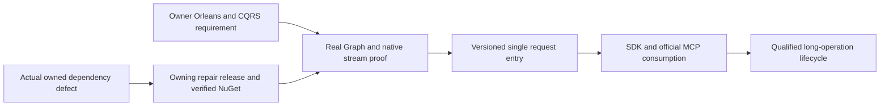

# ADR-082 — Native Orleans CQRS streams

Status: Accepted C0 runtime-compatibility and C1 request-RPCv2 implementation contracts,2026-10-04. C1 implementation depends on the published Graph repair and passing unchanged C0 oracles; C2/C3 contracts and all required product qualification remain pending.

Related: owner2026-10-04 rule in AGENTS.md, REQ/AC-NCQRS-001–005 in [NativeCqrs](../Features/ClusterRouting/NativeCqrs.md), ADR-002/010/020/022/036/057/060/077/081, and REQ/AC-ANN-007/008.

## Decision and source basis

Use our pinned ManagedCode.Communication CQRS native IAsyncEnumerable<CqrsStreamChunk<TProgress,TResult>> for streamed results and long operations through Orleans. Retain the unique request grain, canonical persisted command/retry authority, current principal/read-cut checks and node-local PartitionHost/ZoneTree ownership. Native streams must not become a second execution dispatcher, trusted client identity or durable storage authority.

Communication10.2.6 has a capacity-one cooperative Create producer, native chunk conversion and real Orleans chunk/scheduler tests. Its permissive Normalize method does not guarantee exactly one terminal chunk for arbitrary malformed input; KeyLoad must define its own well-formed producer and terminal protocol. Communication has no IQuery dispatcher. Its current SSE helper lacks frame/total/error-body admission, which requires an owning-repository repair before public use.

Pinned Graph10.0.6 filters scope history/caller state around context.Invoke, without explicit MoveNext/Dispose wrapping. Orleans10.3.1 retains and pulls a grain enumerator through its native extension, with batching, cancellation and cleanup. Neither source presence nor Communication's tests prove their combined graph context and cleanup behavior. C0 therefore implements real runtime compatibility oracles before any product request interface change.

## Ordered implementation, ownership and joins

1. TASK-NCQRS-C0-CONTRACT, root: this decision, the complete feature/AC contract, source audit, dependency choice and task graph before write delegation.
2. TASK-NCQRS-C0-RUNTIME-ORACLES, cluster_wave Luna/high: only new UnitTests/Features/ClusterRouting/NativeCqrs*.cs. Genuine TestCluster, actual Graph/Communication registration and generated typed observations; allowed/denied calls after first chunk/await, actual cancellation/early disposal, bounded producer settlement, terminal failure and concurrent identity/context isolation. No product/shared/test-oracle replacement, build or Git actions.
3. TASK-NCQRS-C0-JOIN, root: add only the centrally pinned test-only Microsoft.Orleans.TestingHost10.3.1 reference, review all code, strict build/formatter/governance, focused C0 through Aspire, full normal/scalar regressions, original artifacts and honest evidence. Diagnose a concrete dependency defect in its owning repository; no KeyLoad fallback or graph bypass. Commit each completed stage and qualify exact delivered Linux source.
4. C1: follow the accepted [NativeCqrsRequestV2](../Features/ClusterRouting/NativeCqrsRequestV2.md) REQ/AC-CRS-001–006 and exact ordered ownership. Root freezes request alias/interfacev2, native Started/terminal shape, safe bounded native drain, signed request purpose, peer envelopev3 and separately preserved discovery-MACv2, authenticated version fields, RF3-compatible majority admission, cold rollout/rollback and receipt authority. The owner's RequestContext/Identity direction adds published Identity.Core native converters/helpers, one persisted-subject claim and a generated two-GUID request state, exact prior-value restoration across full native disposal, and signed-context matching without replacing persisted authorization. Product writes start only after published dependencies make the unchanged six C0 Aspire oracles pass.
5. C2/C3: follow the remaining root-only pre-write freezes in the feature's ordered stages. Workers may not invent public progress/result formats, durable operation handles, ANN formats or maintenance authority. These stages remain required product work.

ANN algorithm work owns disjoint Search files and may proceed in parallel. Root serializes shared package/docs/status/build/test/Git joins; all writes freeze while a source/runtime cohort runs. A failed C0 blocks product-stream dependants until corrected; merely authored tests or a returned enumerable are insufficient.

## Migration, delivery and rollback

The 2026-10-05 TASK-CRS-CANCEL-FAILURE-JOIN prerequisite is frozen in
[NativeCqrsRequestV2](../Features/ClusterRouting/NativeCqrsRequestV2.md),
REQ/AC-CRS-JOIN-001. An owning Communication cancellation-callback failure must
not skip the original native producer join. Source repair and independently
controlled native tests precede canonical patch release, full owning checks,
GitHub publication and verified NuGet availability; root then updates KeyLoad
and qualifies actual Aspire consumer behavior. Source/test workers own disjoint
private Communication scopes; root owns package/docs/delivery/consumer joins.
Original failure identities, fatal priority, stream backpressure and public shape
remain unchanged. No data migration, replacement or consumer workaround is allowed.

TASK-CRS-NODE-WORK-JOIN implements REQ/AC-CRS-WORK-001 in the linked feature
spec: finite silo-local producer/capability ownership, original cancellation and
frame joins before native transport/store shutdown, exact failure retention and
no timeout-as-settlement shortcut. Source and independent test workers own
disjoint private files under the linked ordered roles: query owns owner/kernel,
cluster owns independent tests and lifecycle owns verified capability joins.
Root owns review/integration, Server shutdown/DI, native fixture joins, published
Communication repair and actual Aspire/Linux/RF3 evidence. Original storage,
RPC and authority contracts remain unchanged. Private metadata tests alone
cannot mark this decision Implemented or establish shutdown safety.

C0 changes only test infrastructure; canonical data epoch6, signed request envelope, RPCv1, discovery, HTTP/SDK/MCP responses and RF3 topology remain unchanged. No database migration is needed. The new test-only package is pinned to the current native Orleans family and adds no product dependency.

C1 explicitly versions its RPC shape and homogeneous cold rollout independently of data-format upgrades in NativeCqrsRequestV2. Existing source still lacks application-RPC cohort validation until that implementation is qualified. The accepted peer-envelope/MAC upgrade prevents cross-version replica acknowledgements; separate discovery-MACv2 preserves authenticated observation of old versions. No mixed-node rolling compatibility or runtime legacy fallback is approved. Two compatible surviving RF3 voters remain the required failure topology; a reachable authenticated incompatible voter fails public admission/readiness with a bounded cache-detection delay.

The C1 discovery client retains its constructor, ResolveAsync and IDisposable contract, and adds IAsyncDisposable for actual asynchronous silo cleanup. The owned admission/lifetime gate stops new attempts, cancels and joins admitted operations, then releases the HTTP handler, gate and credential bytes. Synchronous disposal starts the same shutdown and defers resource release until admitted work settles; it must not synchronously block Orleans or release a disposed gate. Root reviews this exact lifetime join; dedicated real-HTTP cancellation/concurrent shutdown tests and RF3 restart cleanup remain AC-CRS-003/004 requirements. No policy, storage or consensus authority moves into this disposable discovery state.

AC-CRS-002/003 RF3 restart observation reuses the existing signed discovery endpoint, original native codec and MAC through a scoped IntegrationTests test-friend assembly reference. Root owns that compile-time test boundary and the accepted NativeCqrsRequestV2 helper contract. The restart wave deterministically chooses an actual follower from authoritative runtime statuses, stops it through inspected scoped fault injection and rejoins that same voter through Aspire. The oracle verifies exact bytes, request nonce, fixed identity and actual Orleans runtime generation before comparing pre/post restart records; it adds no product endpoint, protocol field or caller authority.

AC-CRS-003 explicitly owns and disposes PeerSecurity's actual credential copy after admitted borrowers settle. Independent handlers borrow that owner; they cannot clear a live shared signer on their own disposal. The discovery exchange, actual server DI and test/observer fixtures own their respective signer instances. Signing bytes, nonce/replay rules and persisted authorization are unchanged; native disposal and use-after-disposal regressions accompany the full HTTP/RF3 lifecycle gates.

AC-CRS-003 also hardens the existing canonical offline verifier/upgrade process owner. On an observation deadline, cancellation or bounded-output failure, it stops its own native process tree and awaits actual process exit and both output readers; no cleanup timeout or continuation can stand in for settlement. Root owns the shared helper change and retains all failures. Separate genuine child-process completion, cancellation and output-limit controls supplement the real image and Aspire RF3 gates.

TASK-CRS-C1-FATAL uses published Communication10.2.9's native CqrsRuntimeFailures.FindFatal for direct and deeply nested AggregateException failures. New test-owned RequestCqrsFatalSettlement controls exercise native creation, pulls, disposal and activation cleanup, preserve exact preconstructed fatal identity with primary/disposal/activation precedence, and join every admitted cleanup before a healthy following stream. Ordinary failure and cancellation controls remain required. Owning publication and local mechanism tests alone do not qualify C1 or mark this ADR Implemented.

Checkpoint2026-10-05: TASK-CRS-CANCEL-FAILURE-JOIN is delivered through actual
published Communication10.2.11, successful Release37250149897 and verified official
NuGet restoration/DLL bytes. Owning native TUnit passed1363/1363. TASK-CRS-NODE-WORK-JOIN
is integrated with actual node drain preceding native silo stop and physical
cleanup. Aspire-selected owner/kernel tests passed7/7; full normal unit passed
3247/3248 and remains a failed gate because the actual Node process identity test
failed. Both source/runtime input inventories are unchanged. See the linked
feature's original development and delivery receipts. RF3, migration and complete
scalar/Linux/resource/endurance qualification remain open; this ADR is not marked
Implemented by a source checkpoint or an owning package release.

TASK-CRS-C1-MCP-GUARD-EVIDENCE implements REQ/AC-CRS-DIAG-002 in the linked
feature. Root freezes the follower join to the existing Epoch7WaveRunner, actual
primary-failure artifact persistence after stop/subscription join, and a separate
valid-credential malformed-transport RF3 warning oracle before delegated writes.
Luna lifecycle_wave owns only the private follower join and new prefixed
integration tests; root owns review, image/build/Aspire gates and checkpoint.
Existing deadlines, public guard/errors, authorization and V1 closed-artifact
schema stay unchanged. There is no data/wire migration; rollback removes the new
fixture and restores the previous runner join. An empty observed inventory stays
empty, and no original initialize fault is declared fixed without its own actual
passing caller-visible evidence.

Its success artifact uses a memoized Diagnostics.SaveEvidence and thin Wave
forwarder only after original disposal/subscriptions complete. Existing failure
association reuses that writer. The private implementation scope includes those
two helpers; no synthetic failure is introduced to obtain healthy-wave evidence.

Rollback of C0 removes unused test infrastructure; it cannot establish product stream readiness. Later product rollout, rollback, long-work checkpoint authority, terminal cancellation and fault qualification require their concrete accepted contracts. Frontend N/A: no UI. Required real SDK/MCP Docker/Aspire RF3, recovery, resource and exact-source Linux gates remain mandatory.

TASK-CRS-C1-IMAGE/RF3 follow the accepted same-epoch image/AppHost contract in NativeCqrsRequestV2. The immutable prior executable is377886f35928866f083806062b446056d64539e3, data epoch6/RPC1/peer2, independently inventoried against all native Git blobs. A distinct ClusterRouting producer/proof binds that source separately from the actual current Linux docker-rf3 job. Root adds only an explicitly enabled ephemeral fixed-three-voter test image seam and preserves homogeneous current and native5 proofs. Genuine cold seed, mixed rejection, homogeneous current rollout/receipt preservation, homogeneous rollback, and two-survivor/rejoin waves use SDK/official MCP through owned Aspire resources; live HTTP/cache/shutdown controls remain separate. Per-voter admission, exact image/reference metadata, typed public rejection, finite bounds, cleanup/join ownership, files, worker roles and evidence are frozen in that feature contract before writes.

## C0 native test construction clarification

Use the actual pinned Orleans10.3.1 IConfigureGrainTypeComponents/IGrainActivator pipeline to explicitly construct only the three empty-constructor test grains. Orleans retains instance attachment, scheduling, context, lifecycle and all routing; delegate disposal to DefaultGrainActivator and leave other grain activators intact. Use the pinned TUnit1.72.10 shared data-source factory for one per-session NativeCqrsClusterFixture with native async initialization/disposal. NativeCqrsActivation.cs and NativeCqrsDataSource.cs belong to the existing ClusterRouting test slice. No artificial constructor references, fabricated native observations or analyzer suppressions are permitted; source/compiler and runtime evidence remain separate.

## Owning Graph repair implementation contract

The demonstrated C0 failure requires the accepted REQ/AC-GSE-001–004 contract in NativeCqrs.md. First stage exact native request tracking and the startup-only factory catalog; then the server-local delegating request and scoped native enumeration; then real owning client/silo policy, lifetime, identity, catalog and delegation regressions. The query worker owns only the reviewable /private/tmp patch and its scoped owning paths. Root owns application, formatter/full build/full native TUnit, patch version, commit/push, successful canonical release and verified NuGet delivery. Update KeyLoad's central Graph pin only after publication; rerun the unchanged six Aspire C0 tests and required full gates. Graph10.0.8 source does not contain this repair, so a package update alone is not a fix. Preserve native Orleans execution/cleanup and persisted database authorization; no migration, fallback authority or custom extension implementation is authorized. Original failed runtime artifacts remain part of the evidence chain. This ADR remains Accepted until the required product stages and qualification are complete.

## C1 transport and outer failure boundary correction, 2026-10-04

Accepted before delegated writes: TASK-CRS-C1-BOUNDARY applies the existing REQ/AC-CRS-002/003/004 at discovery and final SDK/MCP failure joins. Normalize only the already-defined native signed-handler transport-unavailable outcome into no fresh discovery observation; do not suppress authenticated protocol/identity/corruption failures or cancellation. Keep bounded cache invalidation and actual two-survivor RF3 qualification. At both MCP dispatch and outer HTTP middleware, fatal direct/nested-Aggregate failures escape through the published native fatal classifier, without a generic public result, exception replacement or raw logging. Private worker scopes and actual adapter invocation controls are specified in NativeCqrsRequestV2; root integrates and verifies all stages. Public wire, canonical persisted state and rollback compatibility are unchanged. This correction does not mark this ADR Implemented or waive any RF3, recovery or Linux acceptance gate.

## Deterministic C1 RF3 phase observation, 2026-10-04

Accepted before delegated implementation: TASK-CRS-C1-PHASE/CONTROL/FAULT use the exact native seams, optional silo-only observer, finite private AppHost controls, SDK/official-MCP outcome distinctions, authority/receipt/privacy oracles and worker scopes in NativeCqrsRequestV2. No public fault transport, canonical format, extra dispatcher or storage owner is added. Producer disposal is observed synchronously before deactivation scheduling, with every cleanup failure preserved. Migration of the stable command-partition activation still requires a separately frozen native scheduling/membership join and actual changed activation/silo evidence; a request activation's routine deactivation is not migration. Root owns control schema, AppHost/Server registration, fixture integration, original artifacts and final gates. Ordinary operation has no probe allocations or retained control state. Rollback disables the explicitly enabled ephemeral test profile; native request protocol/data contracts remain unchanged. This ADR remains Accepted until its full product and Linux qualification criteria pass.

The exact private Version1 Owner/Arm/Release/Marker schema, file/memory bounds, disabled-mode contract, silo-only registration and ordered Server/AppHost/fixture integration are accepted in NativeCqrsRequestV2's "Accepted private phase-control schema and join" section before worker writes. Native migration is excluded from that schema. Private patches and local unit passes do not establish actual RF3 or delivered-source acceptance.

## C1 native resource-log lifecycle contract, 2026-10-05

TASK-CRS-DIAG-DRAIN implements REQ/AC-CRS-DIAG-003 in NativeCqrsRequestV2:
native subscriber admission precedes actual AppHost startup, the real malformed
guard call awaits its exact sanitized live record, and actual stop is followed
by native stream completion and original-watcher drain before artifact write.
The feature freezes ordered stages, precise IntegrationTests helper ownership,
bounded waiter/storage, cancellation and fatal/cleanup failure preservation,
root-only joins and genuine current-image Linux RF3 verification. No parser,
assertion, public contract, canonical data, topology or dependency is changed.
Rollback removes the test-only lifecycle stage. Original failed artifacts
remain evidence; mechanism tests and source review do not qualify real guard
publication or the complete ADR.

## C1 unit owner-probe phase observation, 2026-10-05

TASK-CRS-C1-OWNER-PHASE implements REQ/AC-CRS-DIAG-004 in the linked
NativeCqrsRequestV2 feature. Root freezes the exact fixed-role/numeric stderr
schema, per-line/per-fixture bounds, native-error allowlist, original-child
flags, helper ownership, real held-lock regression and Aspire/Linux evidence
before lifecycle_wave writes privately. Preserve both native owner probes,
their original lifetimes, cleanup joins, failure precedence and deletion guards.
The 1e8833c Linux EAGAIN is not a proven storage/CLOEXEC defect. This stage
changes only bounded test-parent observation, with no public or persisted
contract, dependency or topology change; rollback removes that observation.
Root integrates and runs all required gates. Neither a phase record nor a
local pass qualifies C1 or marks this ADR Implemented.
