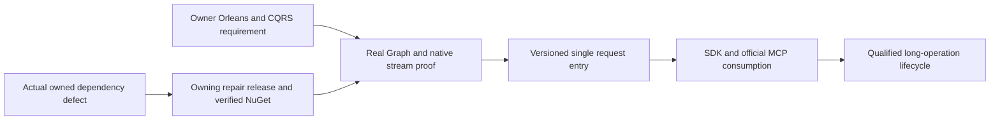

# ADR-082 — Native Orleans CQRS streams

Status: Accepted C0 runtime-compatibility and C1 request-RPCv2 implementation contracts,2026-10-04. C1 implementation depends on the published Graph repair and passing unchanged C0 oracles; C2/C3 contracts and all required product qualification remain pending.

Related: owner2026-10-04 rule in AGENTS.md, REQ/AC-NCQRS-001–005 in [NativeCqrs](../Features/ClusterRouting/NativeCqrs.md), ADR-002/010/020/022/036/057/060/081/116, and REQ/AC-ANN-007/008.

## Decision and source basis

Use our pinned ManagedCode.Communication CQRS native IAsyncEnumerable<CqrsStreamChunk<TProgress,TResult>> for streamed results and long operations through Orleans. Retain the unique request grain, canonical persisted command/retry authority, current principal/read-cut checks and node-local PartitionHost/ZoneTree ownership. Native streams must not become a second execution dispatcher, trusted client identity or durable storage authority.

The centrally pinned ManagedCode.Communication packages provide the native
capacity-one cooperative producer, typed chunk conversion, fatal classification
and cancellation-aware producer settlement. KeyLoad owns its well-formed
Started/progress/terminal protocol, exactly one terminal outcome and bounded
transport admission. It does not introduce a parallel query dispatcher.

The centrally pinned ManagedCode.Orleans.Graph and native Orleans enumerator
pipeline own request context, batching, pulls, cancellation and disposal. C0
retains actual runtime oracles for first-chunk/await behavior, native MoveNext
and Dispose settlement, concurrent context isolation and exact failure identity.
Dependency source presence and owning tests do not qualify their combined
KeyLoad runtime behavior.

## Ordered implementation, ownership and joins

1. TASK-NCQRS-C0-CONTRACT, root: this decision, the complete feature/AC contract, source audit, dependency choice and task graph before write delegation.
2. TASK-NCQRS-C0-RUNTIME-ORACLES, cluster_wave Luna/high: only new UnitTests/Features/ClusterRouting/NativeCqrs*.cs. Genuine TestCluster, actual Graph/Communication registration and generated typed observations; allowed/denied calls after first chunk/await, actual cancellation/early disposal, bounded producer settlement, terminal failure and concurrent identity/context isolation. No product/shared/test-oracle replacement, build or Git actions.
3. TASK-NCQRS-C0-JOIN, root: use only the centrally pinned test-only Microsoft.Orleans.TestingHost reference, review all code, strict build/formatter/governance, focused C0 through Aspire, full normal/scalar regressions, original artifacts and honest evidence. Diagnose a concrete dependency defect in its owning repository; no KeyLoad fallback or graph bypass. Commit each completed stage and qualify exact delivered Linux source.
4. C1: follow the accepted [NativeCqrsRequestV2](../Features/ClusterRouting/NativeCqrsRequestV2.md) REQ/AC-CRS-001–006 and exact ordered ownership. Root freezes current request alias `keyload.request.v2` and interface version4, native Started/terminal shape, safe bounded native drain, signed request purpose, peer envelopev3 and separately preserved discovery-MACv2, authenticated version fields, RF3-compatible majority admission, homogeneous current-image startup and receipt authority. The owner's RequestContext/Identity direction adds published Identity.Core native converters/helpers, one persisted-subject claim and a generated two-GUID request state, exact prior-value restoration across full native disposal, and signed-context matching without replacing persisted authorization. Product writes start only after published dependencies make the unchanged six C0 Aspire oracles pass.
5. C2/C3: follow the remaining root-only pre-write freezes in the feature's ordered stages. Workers may not invent public progress/result formats, durable operation handles, ANN formats or maintenance authority. These stages remain required product work.

ANN algorithm work owns disjoint Search files and may proceed in parallel. Root serializes shared package/docs/status/build/test/Git joins; all writes freeze while a source/runtime cohort runs. A failed C0 blocks product-stream dependants until corrected; merely authored tests or a returned enumerable are insufficient.

## Delivery and rollback

The 2026-10-05 TASK-CRS-CANCEL-FAILURE-JOIN prerequisite is frozen in
[NativeCqrsRequestV2](../Features/ClusterRouting/NativeCqrsRequestV2.md),
REQ/AC-CRS-JOIN-001. An owning Communication cancellation-callback failure must
not skip the original native producer join. Source repair and independently
controlled native tests precede canonical patch release, full owning checks,
GitHub publication and verified NuGet availability; root then updates KeyLoad
and qualifies actual Aspire consumer behavior. Source/test workers own disjoint
private Communication scopes; root owns package/docs/delivery/consumer joins.
Original failure identities, fatal priority, stream backpressure and public shape
remain unchanged. No dependency replacement or consumer workaround is allowed.

TASK-CRS-NODE-WORK-JOIN implements REQ/AC-CRS-WORK-001 in the linked feature
spec: finite silo-local producer/capability ownership, original cancellation and
frame joins before native transport/store shutdown, exact failure retention and
no timeout-as-settlement shortcut. Source and independent test workers own
disjoint private files under the linked ordered roles: query owns owner/kernel,
cluster owns independent tests and lifecycle owns verified capability joins.
Root owns review/integration, Server shutdown/DI, native fixture joins, published
Communication repair and actual Aspire/Linux/RF3 evidence. Original storage,
RPC and authority contracts remain unchanged. Private metadata tests alone
cannot mark this decision Implemented or establish shutdown safety.

C0 remains test infrastructure over the current generated contracts and native
Orleans family. C1 uses the current homogeneous request interface and signed
discovery contract. The discovery client validates ApplicationRpcVersion against
interface version4 before routing application work; current capability fencing
and authenticated observation bounds remain mandatory. Two compatible surviving
RF3 voters remain the required failure topology. A reachable incompatible voter
fails public admission/readiness within the bounded cache-detection delay.
Current canonical data, HTTP/SDK/MCP results and RF3 authority remain protected.

The C1 discovery client retains its constructor, ResolveAsync and IDisposable contract, and adds IAsyncDisposable for actual asynchronous silo cleanup. The owned admission/lifetime gate stops new attempts, cancels and joins admitted operations, then releases the HTTP handler, gate and credential bytes. Synchronous disposal starts the same shutdown and defers resource release until admitted work settles; it must not synchronously block Orleans or release a disposed gate. Root reviews this exact lifetime join; dedicated real-HTTP cancellation/concurrent shutdown tests and RF3 restart cleanup remain AC-CRS-003/004 requirements. No policy, storage or consensus authority moves into this disposable discovery state.

AC-CRS-002/003 RF3 restart observation reuses the existing signed discovery endpoint, original native codec and MAC through a scoped IntegrationTests test-friend assembly reference. Root owns that compile-time test boundary and the accepted NativeCqrsRequestV2 helper contract. The restart wave deterministically chooses an actual follower from authoritative runtime statuses, stops it through inspected scoped fault injection and rejoins that same voter through Aspire. The oracle verifies exact bytes, request nonce, fixed identity and actual Orleans runtime generation before comparing pre/post restart records; it adds no product endpoint, protocol field or caller authority.

AC-CRS-003 explicitly owns and disposes PeerSecurity's actual credential copy after admitted borrowers settle. Independent handlers borrow that owner; they cannot clear a live shared signer on their own disposal. The discovery exchange, actual server DI and test/observer fixtures own their respective signer instances. Signing bytes, nonce/replay rules and persisted authorization are unchanged; native disposal and use-after-disposal regressions accompany the full HTTP/RF3 lifecycle gates.

AC-CRS-003 also hardens the existing canonical current-image verifier process owner. On an observation deadline, cancellation or bounded-output failure, it stops its own native process tree and awaits actual process exit and both output readers; no cleanup timeout or continuation can stand in for settlement. Root owns the shared helper change and retains all failures. Separate genuine child-process completion, cancellation and output-limit controls supplement the real image and Aspire RF3 gates.

TASK-CRS-C1-FATAL uses the centrally pinned Communication native CqrsRuntimeFailures.FindFatal for direct and deeply nested AggregateException failures. New test-owned RequestCqrsFatalSettlement controls exercise native creation, pulls, disposal and activation cleanup, preserve exact preconstructed fatal identity with primary/disposal/activation precedence, and join every admitted cleanup before a healthy following stream. Ordinary failure and cancellation controls remain required. Owning publication and local mechanism tests alone do not qualify C1 or mark this ADR Implemented.

TASK-CRS-CANCEL-FAILURE-JOIN depends on the delivered owning Communication
repair, and TASK-CRS-NODE-WORK-JOIN retains node drain before native silo stop
and physical cleanup. Original owning publication and development receipts are
linked by the feature specification. Fresh exact-source normal/scalar, recovery,
SDK/MCP RF3, resource and endurance qualification remains required; a published
dependency or local mechanism pass cannot mark this ADR Implemented.

TASK-CRS-C1-MCP-GUARD-EVIDENCE implements REQ/AC-CRS-DIAG-002 in the linked
feature. Root freezes the follower join to the existing RF3 wave runner, actual
primary-failure artifact persistence after stop/subscription join, and a separate
valid-credential malformed-transport RF3 warning oracle before delegated writes.
Luna lifecycle_wave owns only the private follower join and new prefixed
integration tests; root owns review, image/build/Aspire gates and checkpoint.
Existing deadlines, public guard/errors, authorization and V1 closed-artifact
schema stay unchanged. There is no stored-data or wire-contract change; rollback removes the new
fixture and restores the previous runner join. An empty observed inventory stays
empty, and no original initialize fault is declared fixed without its own actual
passing caller-visible evidence.

Its success artifact uses a memoized Diagnostics.SaveEvidence and thin Wave
forwarder only after original disposal/subscriptions complete. Existing failure
association reuses that writer. The private implementation scope includes those
two helpers; no synthetic failure is introduced to obtain healthy-wave evidence.

Rollback of C0 removes unused test infrastructure; it cannot establish product stream readiness. Later product rollout, rollback, long-work checkpoint authority, terminal cancellation and fault qualification require their concrete accepted contracts. Frontend N/A: no UI. Required real SDK/MCP Docker/Aspire RF3, recovery, resource and exact-source Linux gates remain mandatory.

## C0 native test construction clarification

Use the actual centrally pinned Orleans IConfigureGrainTypeComponents/IGrainActivator pipeline to explicitly construct only the three empty-constructor test grains. Orleans retains instance attachment, scheduling, context, lifecycle and all routing; delegate disposal to DefaultGrainActivator and leave other grain activators intact. Use the pinned TUnit1.72.10 shared data-source factory for one per-session NativeCqrsClusterFixture with native async initialization/disposal. NativeCqrsActivation.cs and NativeCqrsDataSource.cs belong to the existing ClusterRouting test slice. No artificial constructor references, fabricated native observations or analyzer suppressions are permitted; source/compiler and runtime evidence remain separate.

## Owning Graph repair implementation contract

REQ/AC-GSE-001–004 in NativeCqrs.md owns exact native request tracking,
startup-only factory catalog, server-local delegating requests and scoped native
enumeration. Actual owning client/silo policy, lifetime, identity, catalog and
delegation regressions must qualify those APIs. Any defect is repaired in the
owning Graph repository through its canonical checks, patch release, GitHub
publication and verified NuGet delivery before updating KeyLoad. Root then runs
the unchanged six Aspire C0 oracles and every required consumer gate. Preserve
native Orleans execution/cleanup and persisted authorization; no fallback
authority, local unpublished package or duplicate extension is permitted.
Original runtime artifacts remain in the evidence chain. This ADR is Accepted
until all required product stages and qualification are complete.

## C1 transport and outer failure boundary correction, 2026-10-04

Accepted before delegated writes: TASK-CRS-C1-BOUNDARY applies the existing REQ/AC-CRS-002/003/004 at discovery and final SDK/MCP failure joins. Normalize only the already-defined native signed-handler transport-unavailable outcome into no fresh discovery observation; do not suppress authenticated protocol/identity/corruption failures or cancellation. Keep bounded cache invalidation and actual two-survivor RF3 qualification. At both MCP dispatch and outer HTTP middleware, fatal direct/nested-Aggregate failures escape through the published native fatal classifier, without a generic public result, exception replacement or raw logging. Private worker scopes and actual adapter invocation controls are specified in NativeCqrsRequestV2; root integrates and verifies all stages. Public wire and canonical persisted state are unchanged. This correction does not mark this ADR Implemented or waive any RF3, recovery or Linux acceptance gate.

## Deterministic C1 RF3 phase observation, 2026-10-04

Accepted before delegated implementation: TASK-CRS-C1-PHASE/CONTROL/FAULT use the exact native seams, optional silo-only observer, finite private AppHost controls, SDK/official-MCP outcome distinctions, authority/receipt/privacy oracles and worker scopes in NativeCqrsRequestV2. No public fault transport, canonical format, extra dispatcher or storage owner is added. Producer disposal is observed synchronously before deactivation scheduling, with every cleanup failure preserved. Movement of the stable command-partition activation still requires a separately frozen native scheduling/membership join and actual changed activation/silo evidence; a request activation's routine deactivation is not physical activation movement. Root owns control schema, AppHost/Server registration, fixture integration, original artifacts and final gates. Ordinary operation has no probe allocations or retained control state. Rollback disables the explicitly enabled ephemeral test profile; native request protocol/data contracts remain unchanged. This ADR remains Accepted until its full product and Linux qualification criteria pass.

The exact private Version1 Owner/Arm/Release/Marker schema, file/memory bounds, disabled-mode contract, silo-only registration and ordered Server/AppHost/fixture integration are accepted in NativeCqrsRequestV2's "Accepted private phase-control schema and join" section before worker writes. Physical storage ownership remains node-local through Orleans activation movement. Private patches and local unit passes do not establish actual RF3 or delivered-source acceptance.

## C1 native resource-log lifecycle contract, 2026-10-05

TASK-CRS-DIAG-DRAIN implements REQ/AC-CRS-DIAG-003 in NativeCqrsRequestV2:
native subscriber admission precedes actual AppHost startup, the real malformed
guard call awaits its exact sanitized live record, and actual stop is followed
by native stream completion and original-watcher drain before artifact write.
The feature freezes ordered stages, precise IntegrationTests helper ownership,
bounded waiter/storage, cancellation and fatal/cleanup failure preservation,
root-only joins and genuine current-image Linux RF3 verification. No parser,
assertion, public contract, canonical data, topology or dependency is changed.
Rollback removes the test-only lifecycle stage. Original failed artifacts
remain evidence; mechanism tests and source review do not qualify real guard
publication or the complete ADR.

TASK-CRS-DIAG-JOIN-ORACLE implements REQ/AC-CRS-DIAG-005. Aspire 13.6
`WatchAnySubscribersAsync` reports global subscriber changes and cannot certify
that this wave's original resource watchers have settled. Keep it for admission
before `AppHost.StartAsync` and bounded nonblocking diagnostics of completed
transitions at fixed completion/cleanup checkpoints, then join the same memoized capture disposal and
original `Task.WhenAll` watcher set after the actual resource `Complete` calls;
only afterward dispose/join the admission observer or publish evidence. Add a
real `ResourceLoggerService` test consumer on a separate actual model resource
which remains live while the three captured resource streams complete, receives
a fresh line afterward, and is then completed, drained and disposed. Preserve
all current original cleanup assertions, private artifact conditions, bounds,
existing deadlines and native fatal/ordinary failure priority. Root owns doc
integration and gates; the private diagnostics worker owns only
`RequestCqrsRf3DiagnosticsTestScope.cs`, its focused existing TUnit case file
and one cohesive Helpers consumer if needed. No `RequestCqrsRf3Diagnostics`
collector/parser or `RequestCqrsRf3DiagnosticsCleanup` changes are planned; the
latter already completes its exact resources, awaits original capture tasks,
provides memoized disposal and preserves cleanup errors. Rollback removes only
the regression and scope change.

## C1 unit owner-probe phase observation, 2026-10-05

TASK-CRS-C1-OWNER-PHASE implements REQ/AC-CRS-DIAG-004 in the linked
NativeCqrsRequestV2 feature. Root freezes the exact fixed-role/numeric stderr
schema, per-line/per-fixture bounds, native-error allowlist, original-child
flags, helper ownership, real held-lock regression and Aspire/Linux evidence
before lifecycle_wave writes privately. Preserve both native owner probes,
their original lifetimes, cleanup joins, failure precedence and deletion guards.
The 1e8833c Linux EAGAIN is not a proven storage/CLOEXEC defect. This stage
changes only bounded test-parent observation, with no public or persisted
contract, dependency or topology change; rollback removes that observation.
Root integrates and runs all required gates. Neither a phase record nor a
local pass qualifies C1 or marks this ADR Implemented.

## Accepted TASK-CRS-C1-HELD-AUTHORITY cleanup amendment

## REQ/AC linkage

Amends the test-lifecycle implementation of TASK-CRS-C1-HELD-AUTHORITY under REQ/AC-CRS-004/005 in `docs/Features/ClusterRouting/NativeCqrsRequestV2.md` and ADR-082. It changes no public, persisted, authorization, protocol, timeout, or product behavior.

## Frozen cleanup rule

After cleanup has stopped private-control admission, released any still-open holds, joined each original SDK/MCP request and observed its actual `ProducerDisposed` terminal marker, cleanup must retire the owned arm on all three voters if and only if that actual arm is not already retired. The existing scenario path may have completed the same verified retirement before cleanup. Cleanup determines this from `RequestCqrsProbeFixture.ArmFor(armId).Retired`; it does not make retirement idempotent, infer retirement from a missing file, swallow a missing/invalid arm, or skip the original marker/producer join. A missing or invalid owned arm remains a cleanup failure. Preserve original, cleanup, and fatal failure ordering through `ServerFailureObserver`.

## Regression and qualification

The existing actual SDK held-revocation RF3 case is the focused regression: it reaches the authenticated held request, persisted revocation ACK, release, typed `Unauthenticated`, producer settlement, first retirement, no-effect checks and then common cleanup. The test was previously marked failed solely because common cleanup repeated the completed retirement. Do not add a fake-provider fixture test: the relevant state transition requires real signed phase markers and the actual original producer. Keep the MCP case and its independent startup status; the CI55 MCP failure occurred before revocation and remains an unresolved startup diagnostic. Root owns the full strict build and Aspire RF3 rerun.

## Accepted first-failure lifecycle evidence, 2026-10-05

TASK-CRS-DIAG-FIRST-FAILURE implements REQ/AC-CRS-DIAG-006 in the linked
NativeCqrsRequestV2 specification before any cancellation behavior changes.
Original Linux source788/run37349838022 preserves canceled tasks but does not
identify the initiating capture stage; the authority-fault cases fail during
startup before revocation. Freeze the complete fixed 2,048-byte context,
first-failure and post-join native task snapshots, separate cancellation facts
and authority-startup/readiness stages in that feature contract. Nonfatal test
wrappers preserve every exact ordered original exception object and nested
aggregate. Existing native fatal propagation/priority is unchanged and its
fixed context is retained separately. No shared observer, parser, artifact,
public/persisted contract, deadline or topology change is authorized.

The private diagnostics worker owns only IntegrationTests ClusterRouting
feature-local lifecycle helpers and narrow read-only joins in the existing
diagnostics owner/cleanup/scope, subscriber observer, independent consumer and
authority-fault/readiness helpers. Root owns contract integration before code,
guarded source review/join, build/format, actual Aspire positive and negative
lifecycle cases and exact-source Linux RF3 evidence. Native regressions retain
the live independent consumer, normal original captures, exact caller
cancellation, early stream completion and genuine SDK/MCP revocation outcomes.
Rollback removes the test-only context. This addition is diagnostic evidence,
not proof of an unproven initiating cancellation cause or completion of this ADR.

The accepted DIAG-006 implementation also observes failures at the original
cleanup owner: each actual failure append notifies the same read-only lifecycle
owner before later completion/fallback/join/disposal work mutates its states.
This narrow optional feature-local callback covers captures, subscriber and
independent-consumer owners and authority cleanup stages, without changing the
shared failure observer, original ordering, tasks, exceptions or deadlines.
Record observer failures without skipping native cleanup. Root freezes this
ordering correction before private implementation and owns native regression
evidence; dependency_closeout owns the guarded diagnostics packet correction.

TASK-CRS-DIAG-COMPLETION-OBSERVATION is accepted before implementation under REQ/AC-CRS-DIAG-003/005/006. The linked NativeCqrsRequestV2 contract freezes fixed per-node native Complete-start/return, original-task and drain-token observations at the existing calls/awaits, bounded to the unchanged 2,048-byte context. Preserve all original native work, ordering, failure/fatal priority and cleanup even when observation fails. Existing real Aspire whole-flow cases and fresh exact-source Linux RF3 artifacts provide verification; root owns integration and qualification. The exact existing and optional role paths, private agent scope and observation-only rollback are in the feature contract. No production/public/persisted contract or dependency changes; source reasoning does not prove the initiating failure.

TASK-CRS-DIAG-CLEANUP-JOIN-ORDER, accepted before code under REQ/AC-CRS-DIAG-005, corrects only `RequestCqrsRf3DiagnosticsTestScope.DisposeAsync` to join original diagnostic captures before disposing its independent consumer. The linked feature freezes pinned Aspire close/join semantics, the retained AppHost lifetime, all bounded waits and original/fatal cleanup errors. Stages are freeze, root call-order correction, strict build/format, and existing real Aspire whole-flow/fresh Linux verification. No source-only timeout-cause or qualification claim is permitted; rollout/rollback changes only the same scope order.

TASK-C1-BOUNDED-SUBSCRIBER-DIAGNOSIS implements the linked DIAG-005/006
refinement in the existing ClusterRouting diagnostics observer, cleanup and
test scope, with feature-local transition/stream-completion helpers. Freeze the
same-enumerator single-reader contract first; join the guarded diagnostic code;
run the original native Aspire case; interpret fixed masks/counts alongside the
original capture-task states. No added consumer or wait, raw resource names,
payloads, topology, timeout or publication rule is allowed. At most three
successful completed events are consumed at each fixed checkpoint; unsuccessful
or ended moves stay with the original join owner and remain ambiguous here.
Root owns integration and gates. Rollback removes these optional diagnostics
without changing any original native task, assertion or completion contract.

TASK-C1-LOGGER-MODEL-CONTROL follows the linked DIAG-003/005/006 contract and
R177 original native failure evidence. Ordered stages: freeze the exact internal
selector/trust/ownership contract; root joins AppHostControlOptions, its native
registration, KeyLoadAppHostApplication and the existing diagnostics argument
helper; build; run the unchanged native logger-control whole flows; retain the
separate real RF3 gates. The admitted scope composes the actual AddKeyLoad graph
and builds it, returning before RunAsync; the testing wrapper retains disposal.
Reject mixed modes without changing ordinary selection behavior or inherited
immutable image provenance. No shadow graph, fake logger, private resolver,
timeout change, original-task shortcut or evidence-schema change is allowed.
Rollback removes only selector/branch/opt-in. Source and R177 prove unexpected
ordinary startup in the control scope; they do not prove logger-key drift or
the initiating cause of the full Linux RF3 cohort failures.

TASK-C1-DIAGNOSTIC-READ-CANCEL-001 refines the optional subscriber observation
under DIAG-005/006 after R179. Freeze the linked exact diagnostic-task predicate
and admission-reader ownership transfer; root joins the two guarded observer
helpers; build; run all unchanged native logger-control whole flows. A pending
move created only by diagnostic drain is normal cleanup cancellation only when
it was incomplete immediately before owned cancellation, is canceled at join,
and the caller stayed uncanceled through join. An original admission reader
adopting that move removes its diagnostic tag. Keep actual cancellation, join
and disposal, terminal task state, all other failures and their ordering.
Rollback removes only that diagnostic lifetime refinement. No task abandonment,
deadline, original-task assertion, production or persisted contract changes.

TASK-C1-ADMISSION-MOVE-STATUS-002, under DIAG-005/006, preserves the exact
original admission task in lifecycle evidence after optional diagnostics read
later moves. R182's five passes and one cancellation-status assertion failure
remain original failed-cohort evidence. Freeze the linked task-reference
contract, join only the subscriber observer, build and rerun all six unchanged
native flows. This observation neither creates nor owns another task and does
not change cancellation, joins, assertions, deadlines or the context schema.
Rollback removes only that separate reference; all broader gates remain open.

TASK-TEST-LOCAL-CURRENT-WAVE is accepted for existing current homogeneous C1
waves under the linked TestInfrastructure contract and ADR-074. Root freezes
the exact local identity/model/started-container joins, then reviews the guarded
three-helper packet and runs actual due/catalog SDK/MCP flows. Preserve all
original production assertions, signed controls, tasks, deadlines and cleanup.
It grants no GitHub provenance or delivered RF3 qualification to a local image;
default native CI digest/manifest verification remains mandatory. No public,
persisted, authorization, topology or dependency contract changes.

### TASK-CRS-NATIVE-BUILDER-OWNERSHIP-001

REQ/AC-CRS-002/004 and existing joined request/fault lifecycle contracts require the actual native testing builder to remain owned from CreateAsync through every failed setup path and successful wave shutdown. Current RequestCqrsRf3WaveStartup holds it only in a local variable: override/model/build failures and successful ownership transfer omit its DisposeAsync. This is a proven test-infrastructure ownership defect; no causal attribution to historical SCAT cancellation or surviving MCP503 is made.

Freeze before implementation: startup captures the real IDistributedApplicationTestingBuilder immediately after its original CreateAsync completes. Successful transfer moves that exact owner into RequestCqrsRf3Wave; failed setup retains it in startup. Dispose is awaited after original application stop/disposal and diagnostics joins, and before successful node-lock cleanup. Each actual disposal failure remains in the original cleanup evidence; the builder reference is cleared only on successful awaited disposal. There is no detached task, altered startup/read/election deadline, new client, retry, weakened majority or missing-lock suppression. Append the fixture-local lifecycle stage at the end so existing stage numbers retain their meaning. No product or serializer contract changes.

Ordered implementation: freeze this contract; add exact builder ownership transfer/disposal to existing startup/wave; root format/build; execute the existing real SCAT mismatch/corrected waves, C1 two-compatible-voter restart and real guard-cancellation flows. Those whole operations retain their SDK/MCP/read-cut/no-effect/native lock and image oracles. Existing source review proves all setup branches capture the owner, but cannot prove native disposal completion at runtime. Actual original native logs, cleanup failures and exact source/DLL/image receipts are required; all Linux unit/scalar/recovery/RF3 gates remain open. Rollback removes this task and its fixture-only ownership changes together, preserving every original failure artifact. Root owns source join and execution; this private packet claims no passing runtime gate.

RequestCqrsRf3StartupExecution owns startup creation, execution and exactly one awaited disposal in its finally block. It collects the original setup failure and every cleanup failure before throwing their aggregate; the coordinator's RunAsync reports setup failures and transfers successful owners without disposing itself. This preserves explicit disposal on every path and avoids a second disposal replacing the original setup failure. Successful startup transfers every live owner before return; failed startup awaits all original application/diagnostics/builder cleanup in this one execution owner.
