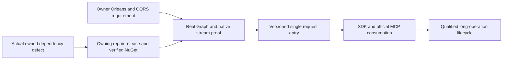

# ADR-082 — Native Orleans CQRS streams

Status: Accepted C0 runtime-compatibility and C1 request-RPCv2 implementation contracts,2026-10-04. C1 implementation depends on the published Graph repair and passing unchanged C0 oracles; C2/C3 contracts and all required product qualification remain pending.

Related: owner2026-10-04 rule in AGENTS.md, REQ/AC-NCQRS-001–005 in [NativeCqrs](../Features/ClusterRouting/NativeCqrs.md), ADR-002/010/020/022/036/057/060/081/116, and REQ/AC-ANN-007/008.

## Decision and source basis

Use our pinned ManagedCode.Communication CQRS native IAsyncEnumerable<CqrsStreamChunk<TProgress,TResult>> for streamed results and long operations through Orleans. Retain the unique request grain, canonical persisted command/retry authority, current principal/read-cut checks and node-local PartitionHost/ZoneTree ownership. Native streams must not become a second execution dispatcher, trusted client identity or durable storage authority.

The centrally pinned ManagedCode.Communication packages provide the native
capacity-one cooperative producer, typed chunk conversion, fatal classification
and cancellation-aware producer settlement. KeyLoad owns its well-formed
Started/progress/terminal protocol, exactly one terminal outcome and bounded
transport admission. It does not introduce a parallel query dispatcher.

The centrally pinned ManagedCode.Orleans.Graph and native Orleans enumerator
pipeline own request context, batching, pulls, cancellation and disposal. C0
retains actual runtime oracles for first-chunk/await behavior, native MoveNext
and Dispose settlement, concurrent context isolation and exact failure identity.
Dependency source presence and owning tests do not qualify their combined
KeyLoad runtime behavior.

## Ordered implementation, ownership and joins

1. TASK-NCQRS-C0-CONTRACT, root: this decision, the complete feature/AC contract, source audit, dependency choice and task graph before write delegation.
2. TASK-NCQRS-C0-RUNTIME-ORACLES, cluster_wave Luna/high: only new UnitTests/Features/ClusterRouting/NativeCqrs*.cs. Genuine TestCluster, actual Graph/Communication registration and generated typed observations; allowed/denied calls after first chunk/await, actual cancellation/early disposal, bounded producer settlement, terminal failure and concurrent identity/context isolation. No product/shared/test-oracle replacement, build or Git actions.
3. TASK-NCQRS-C0-JOIN, root: use only the centrally pinned test-only Microsoft.Orleans.TestingHost reference, review all code, strict build/formatter/governance, focused C0 through Aspire, full normal/scalar regressions, original artifacts and honest evidence. Diagnose a concrete dependency defect in its owning repository; no KeyLoad fallback or graph bypass. Commit each completed stage and qualify exact delivered Linux source.
4. C1: follow the accepted [NativeCqrsRequestV2](../Features/ClusterRouting/NativeCqrsRequestV2.md) REQ/AC-CRS-001–006 and exact ordered ownership. Root freezes current request alias `keyload.request.v2` and interface version4, native Started/terminal shape, safe bounded native drain, signed request purpose, peer envelopev3 and separately preserved discovery-MACv2, authenticated version fields, RF3-compatible majority admission, homogeneous current-image startup and receipt authority. The owner's RequestContext/Identity direction adds published Identity.Core native converters/helpers, one persisted-subject claim and a generated two-GUID request state, exact prior-value restoration across full native disposal, and signed-context matching without replacing persisted authorization. Product writes start only after published dependencies make the unchanged six C0 Aspire oracles pass.
5. C2/C3: follow the remaining root-only pre-write freezes in the feature's ordered stages. Workers may not invent public progress/result formats, durable operation handles, ANN formats or maintenance authority. These stages remain required product work.

ANN algorithm work owns disjoint Search files and may proceed in parallel. Root serializes shared package/docs/status/build/test/Git joins; all writes freeze while a source/runtime cohort runs. A failed C0 blocks product-stream dependants until corrected; merely authored tests or a returned enumerable are insufficient.

## Delivery and rollback

The 2026-10-05 TASK-CRS-CANCEL-FAILURE-JOIN prerequisite is frozen in
[NativeCqrsRequestV2](../Features/ClusterRouting/NativeCqrsRequestV2.md),
REQ/AC-CRS-JOIN-001. An owning Communication cancellation-callback failure must
not skip the original native producer join. Source repair and independently
controlled native tests precede canonical patch release, full owning checks,
GitHub publication and verified NuGet availability; root then updates KeyLoad
and qualifies actual Aspire consumer behavior. Source/test workers own disjoint
private Communication scopes; root owns package/docs/delivery/consumer joins.
Original failure identities, fatal priority, stream backpressure and public shape
remain unchanged. No dependency replacement or consumer workaround is allowed.

TASK-CRS-NODE-WORK-JOIN implements REQ/AC-CRS-WORK-001 in the linked feature
spec: finite silo-local producer/capability ownership, original cancellation and
frame joins before native transport/store shutdown, exact failure retention and
no timeout-as-settlement shortcut. Source and independent test workers own
disjoint private files under the linked ordered roles: query owns owner/kernel,
cluster owns independent tests and lifecycle owns verified capability joins.
Root owns review/integration, Server shutdown/DI, native fixture joins, published
Communication repair and actual Aspire/Linux/RF3 evidence. Original storage,
RPC and authority contracts remain unchanged. Private metadata tests alone
cannot mark this decision Implemented or establish shutdown safety.

C0 remains test infrastructure over the current generated contracts and native
Orleans family. C1 uses the current homogeneous request interface and signed
discovery contract. The discovery client validates ApplicationRpcVersion against
interface version4 before routing application work; current capability fencing
and authenticated observation bounds remain mandatory. Two compatible surviving
RF3 voters remain the required failure topology. A reachable incompatible voter
fails public admission/readiness within the bounded cache-detection delay.
Current canonical data, HTTP/SDK/MCP results and RF3 authority remain protected.

The C1 discovery client retains its constructor, ResolveAsync and IDisposable contract, and adds IAsyncDisposable for actual asynchronous silo cleanup. The owned admission/lifetime gate stops new attempts, cancels and joins admitted operations, then releases the HTTP handler, gate and credential bytes. Synchronous disposal starts the same shutdown and defers resource release until admitted work settles; it must not synchronously block Orleans or release a disposed gate. Root reviews this exact lifetime join; dedicated real-HTTP cancellation/concurrent shutdown tests and RF3 restart cleanup remain AC-CRS-003/004 requirements. No policy, storage or consensus authority moves into this disposable discovery state.

AC-CRS-002/003 RF3 restart observation reuses the existing signed discovery endpoint, original native codec and MAC through a scoped IntegrationTests test-friend assembly reference. Root owns that compile-time test boundary and the accepted NativeCqrsRequestV2 helper contract. The restart wave deterministically chooses an actual follower from authoritative runtime statuses, stops it through inspected scoped fault injection and rejoins that same voter through Aspire. The oracle verifies exact bytes, request nonce, fixed identity and actual Orleans runtime generation before comparing pre/post restart records; it adds no product endpoint, protocol field or caller authority.

AC-CRS-003 explicitly owns and disposes PeerSecurity's actual credential copy after admitted borrowers settle. Independent handlers borrow that owner; they cannot clear a live shared signer on their own disposal. The discovery exchange, actual server DI and test/observer fixtures own their respective signer instances. Signing bytes, nonce/replay rules and persisted authorization are unchanged; native disposal and use-after-disposal regressions accompany the full HTTP/RF3 lifecycle gates.

AC-CRS-003 also hardens the existing canonical current-image verifier process owner. On an observation deadline, cancellation or bounded-output failure, it stops its own native process tree and awaits actual process exit and both output readers; no cleanup timeout or continuation can stand in for settlement. Root owns the shared helper change and retains all failures. Separate genuine child-process completion, cancellation and output-limit controls supplement the real image and Aspire RF3 gates.

TASK-CRS-C1-FATAL uses the centrally pinned Communication native CqrsRuntimeFailures.FindFatal for direct and deeply nested AggregateException failures. New test-owned RequestCqrsFatalSettlement controls exercise native creation, pulls, disposal and activation cleanup, preserve exact preconstructed fatal identity with primary/disposal/activation precedence, and join every admitted cleanup before a healthy following stream. Ordinary failure and cancellation controls remain required. Owning publication and local mechanism tests alone do not qualify C1 or mark this ADR Implemented.

TASK-CRS-CANCEL-FAILURE-JOIN depends on the delivered owning Communication
repair, and TASK-CRS-NODE-WORK-JOIN retains node drain before native silo stop
and physical cleanup. Original owning publication and development receipts are
linked by the feature specification. Fresh exact-source normal/scalar, recovery,
SDK/MCP RF3, resource and endurance qualification remains required; a published
dependency or local mechanism pass cannot mark this ADR Implemented.

TASK-CRS-C1-MCP-GUARD-EVIDENCE implements REQ/AC-CRS-DIAG-002 in the linked
feature. Root freezes the follower join to the existing RF3 wave runner, actual
primary-failure artifact persistence after stop/subscription join, and a separate
valid-credential malformed-transport RF3 warning oracle before delegated writes.
Luna lifecycle_wave owns only the private follower join and new prefixed
integration tests; root owns review, image/build/Aspire gates and checkpoint.
Existing deadlines, public guard/errors, authorization and V1 closed-artifact
schema stay unchanged. There is no stored-data or wire-contract change; rollback removes the new
fixture and restores the previous runner join. An empty observed inventory stays
empty, and no original initialize fault is declared fixed without its own actual
passing caller-visible evidence.

Its success artifact uses a memoized Diagnostics.SaveEvidence and thin Wave
forwarder only after original disposal/subscriptions complete. Existing failure
association reuses that writer. The private implementation scope includes those
two helpers; no synthetic failure is introduced to obtain healthy-wave evidence.

Rollback of C0 removes unused test infrastructure; it cannot establish product stream readiness. Later product rollout, rollback, long-work checkpoint authority, terminal cancellation and fault qualification require their concrete accepted contracts. Frontend N/A: no UI. Required real SDK/MCP Docker/Aspire RF3, recovery, resource and exact-source Linux gates remain mandatory.

## C0 native test construction clarification

Use the actual centrally pinned Orleans IConfigureGrainTypeComponents/IGrainActivator pipeline to explicitly construct only the three empty-constructor test grains. Orleans retains instance attachment, scheduling, context, lifecycle and all routing; delegate disposal to DefaultGrainActivator and leave other grain activators intact. Use the pinned TUnit1.72.10 shared data-source factory for one per-session NativeCqrsClusterFixture with native async initialization/disposal. NativeCqrsActivation.cs and NativeCqrsDataSource.cs belong to the existing ClusterRouting test slice. No artificial constructor references, fabricated native observations or analyzer suppressions are permitted; source/compiler and runtime evidence remain separate.

## Owning Graph repair implementation contract

REQ/AC-GSE-001–004 in NativeCqrs.md owns exact native request tracking,
startup-only factory catalog, server-local delegating requests and scoped native
enumeration. Actual owning client/silo policy, lifetime, identity, catalog and
delegation regressions must qualify those APIs. Any defect is repaired in the
owning Graph repository through its canonical checks, patch release, GitHub
publication and verified NuGet delivery before updating KeyLoad. Root then runs
the unchanged six Aspire C0 oracles and every required consumer gate. Preserve
native Orleans execution/cleanup and persisted authorization; no fallback
authority, local unpublished package or duplicate extension is permitted.
Original runtime artifacts remain in the evidence chain. This ADR is Accepted
until all required product stages and qualification are complete.

## C1 transport and outer failure boundary correction, 2026-10-04

Accepted before delegated writes: TASK-CRS-C1-BOUNDARY applies the existing REQ/AC-CRS-002/003/004 at discovery and final SDK/MCP failure joins. Normalize only the already-defined native signed-handler transport-unavailable outcome into no fresh discovery observation; do not suppress authenticated protocol/identity/corruption failures or cancellation. Keep bounded cache invalidation and actual two-survivor RF3 qualification. At both MCP dispatch and outer HTTP middleware, fatal direct/nested-Aggregate failures escape through the published native fatal classifier, without a generic public result, exception replacement or raw logging. Private worker scopes and actual adapter invocation controls are specified in NativeCqrsRequestV2; root integrates and verifies all stages. Public wire and canonical persisted state are unchanged. This correction does not mark this ADR Implemented or waive any RF3, recovery or Linux acceptance gate.

## Deterministic C1 RF3 phase observation, 2026-10-04

Accepted before delegated implementation: TASK-CRS-C1-PHASE/CONTROL/FAULT use the exact native seams, optional silo-only observer, finite private AppHost controls, SDK/official-MCP outcome distinctions, authority/receipt/privacy oracles and worker scopes in NativeCqrsRequestV2. No public fault transport, canonical format, extra dispatcher or storage owner is added. Producer disposal is observed synchronously before deactivation scheduling, with every cleanup failure preserved. Movement of the stable command-partition activation still requires a separately frozen native scheduling/membership join and actual changed activation/silo evidence; a request activation's routine deactivation is not physical activation movement. Root owns control schema, AppHost/Server registration, fixture integration, original artifacts and final gates. Ordinary operation has no probe allocations or retained control state. Rollback disables the explicitly enabled ephemeral test profile; native request protocol/data contracts remain unchanged. This ADR remains Accepted until its full product and Linux qualification criteria pass.

The exact private Version1 Owner/Arm/Release/Marker schema, file/memory bounds, disabled-mode contract, silo-only registration and ordered Server/AppHost/fixture integration are accepted in NativeCqrsRequestV2's "Accepted private phase-control schema and join" section before worker writes. Physical storage ownership remains node-local through Orleans activation movement. Private patches and local unit passes do not establish actual RF3 or delivered-source acceptance.

## C1 native resource-log lifecycle contract, 2026-10-05

TASK-CRS-DIAG-DRAIN implements REQ/AC-CRS-DIAG-003 in NativeCqrsRequestV2:
native subscriber admission precedes actual AppHost startup, the real malformed
guard call awaits its exact sanitized live record, and actual stop is followed
by native stream completion and original-watcher drain before artifact write.
The feature freezes ordered stages, precise IntegrationTests helper ownership,
bounded waiter/storage, cancellation and fatal/cleanup failure preservation,
root-only joins and genuine current-image Linux RF3 verification. No parser,
assertion, public contract, canonical data, topology or dependency is changed.
Rollback removes the test-only lifecycle stage. Original failed artifacts
remain evidence; mechanism tests and source review do not qualify real guard
publication or the complete ADR.

TASK-CRS-DIAG-JOIN-ORACLE implements REQ/AC-CRS-DIAG-005. Aspire 13.6
`WatchAnySubscribersAsync` reports global subscriber changes and cannot certify
that this wave's original resource watchers have settled. Keep it for admission
before `AppHost.StartAsync` and bounded nonblocking diagnostics of completed
transitions at fixed completion/cleanup checkpoints, then join the same memoized capture disposal and
original `Task.WhenAll` watcher set after the actual resource `Complete` calls;
only afterward dispose/join the admission observer or publish evidence. Add a
real `ResourceLoggerService` test consumer on a separate actual model resource
which remains live while the three captured resource streams complete, receives
a fresh line afterward, and is then completed, drained and disposed. Preserve
all current original cleanup assertions, private artifact conditions, bounds,
existing deadlines and native fatal/ordinary failure priority. Root owns doc
integration and gates; the private diagnostics worker owns only
`RequestCqrsRf3DiagnosticsTestScope.cs`, its focused existing TUnit case file
and one cohesive Helpers consumer if needed. No `RequestCqrsRf3Diagnostics`
collector/parser or `RequestCqrsRf3DiagnosticsCleanup` changes are planned; the
latter already completes its exact resources, awaits original capture tasks,
provides memoized disposal and preserves cleanup errors. Rollback removes only
the regression and scope change.

## C1 unit owner-probe phase observation, 2026-10-05

TASK-CRS-C1-OWNER-PHASE implements REQ/AC-CRS-DIAG-004 in the linked
NativeCqrsRequestV2 feature. Root freezes the exact fixed-role/numeric stderr
schema, per-line/per-fixture bounds, native-error allowlist, original-child
flags, helper ownership, real held-lock regression and Aspire/Linux evidence
before lifecycle_wave writes privately. Preserve both native owner probes,
their original lifetimes, cleanup joins, failure precedence and deletion guards.
The 1e8833c Linux EAGAIN is not a proven storage/CLOEXEC defect. This stage
changes only bounded test-parent observation, with no public or persisted
contract, dependency or topology change; rollback removes that observation.
Root integrates and runs all required gates. Neither a phase record nor a
local pass qualifies C1 or marks this ADR Implemented.

## Accepted TASK-CRS-C1-HELD-AUTHORITY cleanup amendment

## REQ/AC linkage

Amends the test-lifecycle implementation of TASK-CRS-C1-HELD-AUTHORITY under REQ/AC-CRS-004/005 in `docs/Features/ClusterRouting/NativeCqrsRequestV2.md` and ADR-082. It changes no public, persisted, authorization, protocol, timeout, or product behavior.

## Frozen cleanup rule

After cleanup has stopped private-control admission, released any still-open holds, joined each original SDK/MCP request and observed its actual `ProducerDisposed` terminal marker, cleanup must retire the owned arm on all three voters if and only if that actual arm is not already retired. The existing scenario path may have completed the same verified retirement before cleanup. Cleanup determines this from `RequestCqrsProbeFixture.ArmFor(armId).Retired`; it does not make retirement idempotent, infer retirement from a missing file, swallow a missing/invalid arm, or skip the original marker/producer join. A missing or invalid owned arm remains a cleanup failure. Preserve original, cleanup, and fatal failure ordering through `ServerFailureObserver`.

## Regression and qualification

The existing actual SDK held-revocation RF3 case is the focused regression: it reaches the authenticated held request, persisted revocation ACK, release, typed `Unauthenticated`, producer settlement, first retirement, no-effect checks and then common cleanup. The test was previously marked failed solely because common cleanup repeated the completed retirement. Do not add a fake-provider fixture test: the relevant state transition requires real signed phase markers and the actual original producer. Keep the MCP case and its independent startup status; the CI55 MCP failure occurred before revocation and remains an unresolved startup diagnostic. Root owns the full strict build and Aspire RF3 rerun.

## Accepted first-failure lifecycle evidence, 2026-10-05

TASK-CRS-DIAG-FIRST-FAILURE implements REQ/AC-CRS-DIAG-006 in the linked
NativeCqrsRequestV2 specification before any cancellation behavior changes.
Original Linux source788/run37349838022 preserves canceled tasks but does not
identify the initiating capture stage; the authority-fault cases fail during
startup before revocation. Freeze the complete fixed 2,048-byte context,
first-failure and post-join native task snapshots, separate cancellation facts
and authority-startup/readiness stages in that feature contract. Nonfatal test
wrappers preserve every exact ordered original exception object and nested
aggregate. Existing native fatal propagation/priority is unchanged and its
fixed context is retained separately. No shared observer, parser, artifact,
public/persisted contract, deadline or topology change is authorized.

The private diagnostics worker owns only IntegrationTests ClusterRouting
feature-local lifecycle helpers and narrow read-only joins in the existing
diagnostics owner/cleanup/scope, subscriber observer, independent consumer and
authority-fault/readiness helpers. Root owns contract integration before code,
guarded source review/join, build/format, actual Aspire positive and negative
lifecycle cases and exact-source Linux RF3 evidence. Native regressions retain
the live independent consumer, normal original captures, exact caller
cancellation, early stream completion and genuine SDK/MCP revocation outcomes.
Rollback removes the test-only context. This addition is diagnostic evidence,
not proof of an unproven initiating cancellation cause or completion of this ADR.

The accepted DIAG-006 implementation also observes failures at the original
cleanup owner: each actual failure append notifies the same read-only lifecycle
owner before later completion/fallback/join/disposal work mutates its states.
This narrow optional feature-local callback covers captures, subscriber and
independent-consumer owners and authority cleanup stages, without changing the
shared failure observer, original ordering, tasks, exceptions or deadlines.
Record observer failures without skipping native cleanup. Root freezes this
ordering correction before private implementation and owns native regression
evidence; dependency_closeout owns the guarded diagnostics packet correction.

TASK-CRS-DIAG-COMPLETION-OBSERVATION is accepted before implementation under REQ/AC-CRS-DIAG-003/005/006. The linked NativeCqrsRequestV2 contract freezes fixed per-node native Complete-start/return, original-task and drain-token observations at the existing calls/awaits, bounded to the unchanged 2,048-byte context. Preserve all original native work, ordering, failure/fatal priority and cleanup even when observation fails. Existing real Aspire whole-flow cases and fresh exact-source Linux RF3 artifacts provide verification; root owns integration and qualification. The exact existing and optional role paths, private agent scope and observation-only rollback are in the feature contract. No production/public/persisted contract or dependency changes; source reasoning does not prove the initiating failure.

TASK-CRS-DIAG-CLEANUP-JOIN-ORDER, accepted before code under REQ/AC-CRS-DIAG-005, corrects only `RequestCqrsRf3DiagnosticsTestScope.DisposeAsync` to join original diagnostic captures before disposing its independent consumer. The linked feature freezes pinned Aspire close/join semantics, the retained AppHost lifetime, all bounded waits and original/fatal cleanup errors. Stages are freeze, root call-order correction, strict build/format, and existing real Aspire whole-flow/fresh Linux verification. No source-only timeout-cause or qualification claim is permitted; rollout/rollback changes only the same scope order.

TASK-C1-BOUNDED-SUBSCRIBER-DIAGNOSIS implements the linked DIAG-005/006
refinement in the existing ClusterRouting diagnostics observer, cleanup and
test scope, with feature-local transition/stream-completion helpers. Freeze the
same-enumerator single-reader contract first; join the guarded diagnostic code;
run the original native Aspire case; interpret fixed masks/counts alongside the
original capture-task states. No added consumer or wait, raw resource names,
payloads, topology, timeout or publication rule is allowed. At most three
successful completed events are consumed at each fixed checkpoint; unsuccessful
or ended moves stay with the original join owner and remain ambiguous here.
Root owns integration and gates. Rollback removes these optional diagnostics
without changing any original native task, assertion or completion contract.

TASK-C1-LOGGER-MODEL-CONTROL follows the linked DIAG-003/005/006 contract and
R177 original native failure evidence. Ordered stages: freeze the exact internal
selector/trust/ownership contract; root joins AppHostControlOptions, its native
registration, KeyLoadAppHostApplication and the existing diagnostics argument
helper; build; run the unchanged native logger-control whole flows; retain the
separate real RF3 gates. The admitted scope composes the actual AddKeyLoad graph
and builds it, returning before RunAsync; the testing wrapper retains disposal.
Reject mixed modes without changing ordinary selection behavior or inherited
immutable image provenance. No shadow graph, fake logger, private resolver,
timeout change, original-task shortcut or evidence-schema change is allowed.
Rollback removes only selector/branch/opt-in. Source and R177 prove unexpected
ordinary startup in the control scope; they do not prove logger-key drift or
the initiating cause of the full Linux RF3 cohort failures.

TASK-C1-DIAGNOSTIC-READ-CANCEL-001 refines the optional subscriber observation
under DIAG-005/006 after R179. Freeze the linked exact diagnostic-task predicate
and admission-reader ownership transfer; root joins the two guarded observer
helpers; build; run all unchanged native logger-control whole flows. A pending
move created only by diagnostic drain is normal cleanup cancellation only when
it was incomplete immediately before owned cancellation, is canceled at join,
and the caller stayed uncanceled through join. An original admission reader
adopting that move removes its diagnostic tag. Keep actual cancellation, join
and disposal, terminal task state, all other failures and their ordering.
Rollback removes only that diagnostic lifetime refinement. No task abandonment,
deadline, original-task assertion, production or persisted contract changes.

TASK-C1-ADMISSION-MOVE-STATUS-002, under DIAG-005/006, preserves the exact
original admission task in lifecycle evidence after optional diagnostics read
later moves. R182's five passes and one cancellation-status assertion failure
remain original failed-cohort evidence. Freeze the linked task-reference
contract, join only the subscriber observer, build and rerun all six unchanged
native flows. This observation neither creates nor owns another task and does
not change cancellation, joins, assertions, deadlines or the context schema.
Rollback removes only that separate reference; all broader gates remain open.

TASK-TEST-LOCAL-CURRENT-WAVE is accepted for existing current homogeneous C1
waves under the linked TestInfrastructure contract and ADR-074. Root freezes
the exact local identity/model/started-container joins, then reviews the guarded
three-helper packet and runs actual due/catalog SDK/MCP flows. Preserve all
original production assertions, signed controls, tasks, deadlines and cleanup.
It grants no GitHub provenance or delivered RF3 qualification to a local image;
default native CI digest/manifest verification remains mandatory. No public,
persisted, authorization, topology or dependency contract changes.

### TASK-CRS-NATIVE-BUILDER-OWNERSHIP-001

REQ/AC-CRS-002/004 and existing joined request/fault lifecycle contracts require the actual native testing builder to remain owned from CreateAsync through every failed setup path and successful wave shutdown. Current RequestCqrsRf3WaveStartup holds it only in a local variable: override/model/build failures and successful ownership transfer omit its DisposeAsync. This is a proven test-infrastructure ownership defect; no causal attribution to historical SCAT cancellation or surviving MCP503 is made.

Freeze before implementation: startup captures the real IDistributedApplicationTestingBuilder immediately after its original CreateAsync completes. Successful transfer moves that exact owner into RequestCqrsRf3Wave; failed setup retains it in startup. Dispose is awaited after original application stop/disposal and diagnostics joins, and before successful node-lock cleanup. Each actual disposal failure remains in the original cleanup evidence; the builder reference is cleared only on successful awaited disposal. There is no detached task, altered startup/read/election deadline, new client, retry, weakened majority or missing-lock suppression. Append the fixture-local lifecycle stage at the end so existing stage numbers retain their meaning. No product or serializer contract changes.

Ordered implementation: freeze this contract; add exact builder ownership transfer/disposal to existing startup/wave; root format/build; execute the existing real SCAT mismatch/corrected waves, C1 two-compatible-voter restart and real guard-cancellation flows. Those whole operations retain their SDK/MCP/read-cut/no-effect/native lock and image oracles. Existing source review proves all setup branches capture the owner, but cannot prove native disposal completion at runtime. Actual original native logs, cleanup failures and exact source/DLL/image receipts are required; all Linux unit/scalar/recovery/RF3 gates remain open. Rollback removes this task and its fixture-only ownership changes together, preserving every original failure artifact. Root owns source join and execution; this private packet claims no passing runtime gate.

RequestCqrsRf3StartupExecution owns startup creation, execution and exactly one awaited disposal in its finally block. It collects the original setup failure and every cleanup failure before throwing their aggregate; the coordinator's RunAsync reports setup failures and transfers successful owners without disposing itself. This preserves explicit disposal on every path and avoids a second disposal replacing the original setup failure. Successful startup transfers every live owner before return; failed startup awaits all original application/diagnostics/builder cleanup in this one execution owner.

### TASK-CRS-C1-CURRENT-WRITE-RECONCILIATION-001

Freeze before code under NativeCqrsRequestV2 REQ/AC-CRS-002/005 and ADR-082. Authenticated original Linux run37643564885, attempt1, source517f4b731a9a9894b78cfc3fe05bade018ab7389 executed the follower-loss case and observed canonical SDK UnknownWriteOutcome at the current document update, before follower restart. This is uncertainty, not a proven rollback or consensus defect. Existing AC-CRS-005 requires the same immutable command ID/content and freshly authenticated native request to recover the canonical receipt without duplicate effects.

Only RequestCqrsRf3Workload.AppendCurrentWriteAsync receives the feature-local helper. After its one original SDK commit, exactly UnknownWriteOutcome permits one immediate same-command SDK call, using the same actual client/principal and original cancellation/deadline token. No new IDs, payload edits, status/health waits, sleep, general error retry or deadline change. Cancellation is checked before that recovery; every non-Unknown response fails the unchanged success assertion. If recovery is still unknown or fails, the case fails honestly.

A genuine returned receipt must name the original ID, contain exactly the literal putDocument mutation at revision2, and have current nonempty incarnation/positive position/exact atomic partition. One same-ID SDK receipt replay must be byte-identical. Existing actual SDK/official-MCP document revision/content checks, canonical receipt comparison on survivor and restored follower, native signed-generation refresh, catch-up/apply watermark and preserved seed/no-duplicate gates remain unchanged. Existing real follower fault case is the whole-operation regression; no provider, product hook or synthetic error is introduced. This bounded helper is client operation recovery, not a server consensus correction.

Ownership: IntegrationTests ClusterRouting Helpers plus original Workload helper; contract in NativeCqrsRequestV2 and ADR082. Stages: freeze, source-only private implementation/review, root guarded join, format/build/native discovery, actual Aspire RF3 case and original Linux gates. Preserve original180/176/4 evidence and native WAL/tree artifacts. The random original failed command ID/final persisted receipt is not exposed in original JSON/logs and remains unobserved; no successful original write or current qualification is inferred. Rollback removes this helper and call-site amendment together.

Retain the original actual SDK result as an immutable local before recovery; publish only its observed closed UnknownWriteOutcome classification and command ID in bounded native test output. Never log problem detail, credentials or payload. Original authenticated failed job/TRX/native records remain immutable and separate from the repaired source.

### TASK-CRS-DIAG-GUARD-SCAT-PHASE-001

Freeze before code under REQ/AC-CRS-DIAG-002/003/005/006 and REQ/AC-SCAT-003. Original517f run37643564885 guard trace has successful native SDK/official MCP seed and intentional malformed MCP400, but no observable body-validation return, warning-wait return or subsequent healthy call before733s cancellation. Product logger is exactly category McpTransportGuard, Warning EventId4, stage BodyMethodMismatch and method ToolsCall. Existing text oracle expects the exact emitted literal; no logger/category mismatch or consensus fault is source-proven. Original SCAT trace has no seed-operation calls before133s cancellation and must not be labelled a completed conflicting-identity wave.

Reuse the existing RequestCqrsLifecycleEvidence owner and actual native startup/wave/diagnostic bindings. Freeze fixed phase/stage enum values only; append enum members without renumbering. Optional internal test-only observed-wave/runner entry calls the same original startup and transfers the same application/diagnostics/builder. Record actual original caller/parent/wave token states, per-node readiness, original capture task statuses, first failure before cleanup and terminal after all original cleanup stages. A separate fixed scenario phase identifies guard or SCAT original/mismatch/corrected wave while actual owner stage remains startup/readiness/body/warning/cleanup. Existing2048byte context cap is unchanged. No payload, credential, exception detail or native log content retained in context.

Guard owns exact stages: seed, malformed response headers, bounded native body read, problem validation, response owner disposal, warning wait, healthy SDK/MCP continuation. Instrument only actual awaits/calls with the existing synchronous SetStage; do not detach a reader or fabricate a completed phase. On failure first snapshot is taken before owned wave stop and terminal after original joins; actual original exceptions remain in existing failure order with cleanup errors. The original guard400, exact closed warning and real healthy follow-up assertions remain mandatory. No warning can be synthesized or accepted from another node/wave.

SCAT binds its existing original/mismatch/corrected actual waves to the same scoped evidence and records boundaries before native start/SDK-MCP assertion and scope disposal. Preserve every native membership/catalog fencing, denied-effect, corrected healthy operation, all-lock and cleanup gate. Source instrumentation is not a cause or pass: fresh root-owned actual Aspire runs must supply bounded context and original logs. No new LocalImage selection, product provider/seam, sleep/retry/timer/health gate or deadline increase. Root owns guard join, format/full build and genuine whole-operation/native Linux qualification. Rollback removes this observation-only task with its private test owner plumbing.

### TASK-CRS-C1-NATIVE-PHASE-EVIDENCE-001 (2026-10-08; frozen before code)

REQ/AC-CRS-DIAG-007 extends AC-CRS-DIAG-002/005/006 without changing logger, admission, quotas or timing. Original30fb run37694136259 guard400 succeeded but GuardWarningWait reached original12min cancellation with empty rejection artifact; canonical case canceled after2m13s without retained waiting phase. Neither proves provider/parser/consensus defect. Retain fixed-size per-native-resource actual line/prefix/accepted/malformed/oversize counts and observer first/last timestamps; no raw lines/payloads/credentials. Original closed rejection schema remains exact; separate native sidecar only after subscriptions settle under existing16KiB artifact bound. Existing real malformed HTTP→closed warning→healthy SDK/MCP operation verifies accepted native count matches its original rejection.

Canonical flow records closed phase before actual awaits, original SDK task status, token flags and whether an actual marker/receipt was observed. Save immutable pre-cleanup snapshot and terminal status with native file Flush, preserving primary/capture/cleanup failures. No identities/payloads copied; existing marker/ACK/read/replay assertions, deadlines, ownership and cleanup unchanged. This exposes next initiating boundary, not a consensus fix or pass. Integration owns ClusterRouting Helpers/Assertions; root builds/discovers/executes fresh proof. No product hook, alias, format, provider, selector or retry. ADR082 remains Accepted pending actual evidence.

### TASK-CRS-COHORT-NO-QUORUM-DETAIL-001

REQ/AC-CRS-002/005 and REQ/AC-SESSIONREAD-003 preserve the existing authenticated fixed-voter cohort and explicit majority. Only the final aggregate compatible-count-below-majority branch in ReplicaCohortAdmission.EnsureCompatibleCohortAsync returns the existing OwnershipLost/NoLeader diagnostic. SDK reads and MCP's pre-tool authenticated read therefore retain the same established no-quorum safe problem. Individual invalid/unavailable discovery, local transport-not-ready, substituted signature, wrong identity and incompatible reachable peer retain their existing strict diagnostics and rejection; no new catch, retry, threshold, deadline or cache authority.

Root owns this single Orleans branch and extends the existing StoppedSocketsRemoveFreshObservationsAndRequireACompatibleMajority native whole-flow to distinguish exact individual InvalidDiscovery from exact aggregate NoLeader, preserve actual stopped sockets/cache eviction/two-voter survival, and re-admit a fresh healthy signed cohort. Existing transition/signature/cancellation/shutdown controls and real KL021 SDK/official MCP no-quorum/body/privacy/restoration flow remain required. Stage order: docs, code and focused native normal/scalar, full build/format, current native case-source binding, delivered exact-source Linux RF3. Original46a4 safe-detail mismatch is retained; source diagnosis does not identify every historical initiating branch. ADR-082 owns cohort admission; ADR-017 owns public session-read authority.

### TASK-CRS-CAPTURE-CANCELLATION-EVIDENCE-001: original Linux59 warning-wait uncertainty

Existing REQ/AC-CRS-DIAG-002/007 native warning-capture flow remains mandatory. Original required run37744013727/job113201104531 AcCrsDiag002RealGuardWarningIsCapturedBetweenHealthySdkAndMcpCalls reaches3Ready, complete startup and malformed HTTP response, then cancels in GuardWarningWait; real original native capture artifacts contain0lines across all3 nodes. This does not identify parser, logger, protocol rejection stage or DCP stream failure as the initiating cause. No cause repair or runtime pass is claimed.

After, and only after, the actual original WaitForRecordAsync throws OperationCanceledException with its initiating token canceled, emit one fixed-schema stderr row containing closed node category (node1/2/3/Other), expected stage/method enum values and existing bounded primitive native capture counters for lines/candidates/accepted/malformed/oversized/saturated. Never record raw resource log lines, timestamps, identifiers, credentials, caller metadata or payloads. The original exception is first and rethrown through existing ServerFailureObserver; output failure is secondary, not hidden. No new read, GetAll fallback, provider, task, deadline, polling, threshold, cancellation, admission, parser or assertion changes. Independent fallback records cannot fulfill original WatchAsync. Existing counters/artifact/privacy/consumer/observer/resource joins remain unchanged.

IntegrationTests ClusterRouting Helpers/RequestCqrsRf3McpRejectionNodeCapture.cs owns the authentic failure hook; Diagnostics/RequestCqrsCaptureCancellationDiagnostics.cs owns the fixed closed row and error order. Existing native AcCrsDiag002 SDK→actual malformed guard→original native Watch warning→healthy SDK/MCP→joined cleanup is still the real regression; a future emitted row only identifies observed counter state, never successful warning qualification. Existing ADR-082 and route diagnostics contracts are sufficient for additive private test evidence; no database/transport/public API contract changes. Root owns guarded docs-first join, build/format and exact-source Linux RF3. This diagnostic-only packet remains separate from definite namespace cleanup repair and cannot delay that functional stage. Rollback removes only this failure-evidence hook/row contract; original error and diagnostic oracle remain.

### TASK-CRS-C1-NATIVE-RESOURCE-ADMISSION-001: real instance lifecycle

Freeze before implementation under REQ/AC-CRS-DIAG-002/003/005/006 and REQ/AC-CRS-002/004. Original source3458f6111f94e93d40334bc2cdaae008dac58a01/run37821315110/attempt1 qualification artifact11574684119 has authenticated API/ZIP SHA2567be1bc40820d87ed3114a1b219ed7bbf62e3fcbed789ec2998fd45e97c8770f4; ordinary219/192PASS/27FAIL. Guard fails at WaveStartup subscriber admission with zero native capture lines, while both heldwrite persisted-revocation flows pass. Preserve that original outcome separately. Native pinned Aspire13.6 testing BuildAsync resumes the actual entry point after Build; AppHost RunAsync starts concurrently, BeforeStart allocates DCP instance names, and ResourceLoggerService.WatchAsync(IResource) resolves those names. Canonical node-name observer matching before explicit wrapper StartAsync therefore races native allocation and can subscribe to a stale canonical stream or reject a real native ID. No exact random ID is inferred from original safe diagnostics.

Register BeforeResourceStartedEvent on the actual builder before BuildAsync. Each of the three owned RF3 ContainerResource callbacks reads public ResourceNotificationService.TryGetCurrentState(resource.Name), requires ReferenceEquals(returned ResourceEvent.Resource, exact owned container), nonempty ResourceId and exactly one current resource instance, and admits only that observed actual ID. Never read internal ResourceInstanceId/TryGetInstances/annotations, infer a suffix, mutate names or fabricate a notification. First callback starts the original three native WatchAsync(IResource) captures after native name allocation. Each callback owns one native WatchAnySubscribers enumerator and waits for its own exact actual ResourceId subscriber event; at most three observers exist, no shared-reader concurrency or all-three-before-first-resource deadlock. Close/join each actual enumerator before its callback returns. Native callbacks then wait on one original model-proof release; release only after unchanged VerifyModelAsync succeeds. Original native StartAsync, three-node readiness, started-container proof, signed identity, warning/public healthy calls and persisted effects remain mandatory.

The admission owner holds the real callback tasks and cancellation lifetime, transfers with the actual wave, verifies exact admitted resource IDs on native restart without creating replacement captures, and cancels/joins outstanding callbacks and observers on setup failure and shutdown. Preserve primary, model, native callback, observer, capture, stop, application/builder disposal and lock-check failures. No task detachment, sleeps/retries, deadline increases, sampling/privacy or authorization change. A missing/ambiguous/native substituted snapshot fails closed with static private diagnostic. Actual resource IDs remain internal to that owner's bounded three-entry state; none are logged or added to telemetry.

Existing real guard flow verifies three completed callback admissions and joined observers before SDK seed, then actual malformed MCP rejection, exact native warning, healthy SDK/official MCP state and joined native owner after original wave stop. The existing heldwrite flows, canonical network isolation/startup flows and all seven native Build-only diagnostic controls remain required regressions; control scopes keep their explicit model-only selector and unchanged captures. Native model-only tests do not qualify current Docker execution.

Ownership: IntegrationTests ClusterRouting Helpers native startup admission owner/node reader, existing WaveStartup/Wave lifetime and existing guard Scenario; docs NativeCqrsRequestV2 and ADR082. Root owns live integration, compiler/format/Git and genuine immutable Linux RF3. Ordered stages: contract/public API verification, guarded private source, root join/build/format/native controls, exact current guard/heldwrite/current Linux gates. Rollback removes this owner/callback arrangement and call sites together; no original failure/report is rewritten. ADR082 and KL015 remain unqualified pending actual repaired-source evidence.

Native admission ownership clarification: the existing lifecycle schema stays unchanged. `BindObserver` retains only the last bound original node observer; scalar `a`/observer-cancellation fields describe that observer alone and never certify all three resource admissions. The independent native owner's `AdmittedNodeCount == 3` assertion requires all three original callback tasks to complete successfully and their actual observers to join; `NativeAdmissionOwnersJoined` verifies owner cleanup separately. Preserve this distinction in any original failure interpretation. The quality repair uses one shared original subscriber admission loop for canonical control and exact-resource modes, retaining the same single-reader guard, original pending task, transitions, cancellation and joined disposal. Direct caught lifetime disposal retains every primary/disposal failure and closed lifecycle notification; no analyzer suppression or deadline change is allowed.

### TASK-CRS-C1-OFFLINE-FAILURE-EVIDENCE-001 (frozen before private code)

REQ/AC-CRS-004/005 and REQ/AC-CRS-DIAG-004 retain the actual current-format three-voter offline no-outcome inspection after owned RF3 shutdown. Original fe8e813c50ca93d4ed53e9e4eb32ceda03cc403d/run37855042382/attempt1 KL015 normal has32/32 passed original cases; scalar has30/32, with both held-revocation cases failing only when the genuine offline inspector returns exit2 at AuthorityOutcomeInspect. Original native admissions/captures completed and held/revocation observations are present. Original exit2 suppresses every nonfatal child cause; neither a storage defect, lock holder nor SIMD incompatibility is established. Both task jobs also retain original tooling failures and remain unqualified.

Freeze a private failure-only stderr record at most256 UTF8 bytes, one record per original child, with exact prefix/version, actual phase enum ReadInput/ValidateRequest/OpenStore/ReadOutcome/DisposeStore/WriteReceipt, closed error-kind enum and optional existing KeyLoad ErrorCode or directly nested allowlisted native code1,2,5,9,11,13,16,20,22,24,28,35,40. No exception text/type name, path, identity, credentials, payload or arbitrary field. First initiating failure is frozen before store disposal; later cleanup cannot overwrite it. Original fatal exception priority and initiating plus output/disposal failure retention remain. Native V2 input/success receipt, failure exit2, stdin/receipt/capture bounds, deadlines, original task/lock joins and empty success stderr stay unchanged. Failure output never constitutes a success receipt.

The Integration oracle validates the exact closed record before including that static diagnostic in its failure; it continues to require exit0, exact canonical no-effect/majority outcomes and complete native child settlement. Existing real wrong-node/incarnation, malformed input and corrupt scoped-outcome/locator child flows assert the actual closed failure shape and phase, retain all joins/unchanged bytes, then perform their real healthy child/store continuation. This is mechanism evidence only; current scalar RF3 must rerun to expose its actual cause before any behavioral repair. Root owns review/join/build/native/Linux delivery. Rollback removes only these private observations and their regression amendments; product protocol, persistence, authorization and timebounds are unchanged.

### TASK-CRS-C1-FRESH-READINESS-ORACLE-002

REQ/AC-CRS-005, REQ/AC-CLIENT-004/005 and AC-CRS-FRESH-READINESS-002 retain full interrupted-submit/replay/conflict/healthy effect and original native RF3 receipt contracts. Root freezes the linked NativeCqrsRequestV2 source-backed advisory-cache distinction, joins the existing owned HTTP caller plus128-byte fixture bound and two actual one-shot readiness call sites, builds/formats and delivers for exact Linux SDK/official-MCP flows. The unchanged native readiness endpoint checks authenticated compatible-cohort and catalog admission; no cached status assertion becomes authority. Preserve before/after identity/applied/placement and every literal document/full receipt assertion. No poll, retry, timeout, product/cache/discovery, public data, package or topology change. Original source47 failed artifact remains immutable. Accepted test-oracle implementation contract; runtime qualification pending; rollback removes the coherent three-source amendment only. Root owns compilation/source join/Git; the three parallel feature agents continue independent parent implementation.

### TASK-CRS-C1-NATIVE-WAL-KIND-001: original native store-open failure classification

REQ-CRS-DIAG-005 / AC-CRS-DIAG-005 extends the existing closed C1 failure-kind
classification with exactly `WalCorruption` and `WalFullLogCorruption`, selected
only by the pinned public ZoneTree `WriteAheadLogCorruptionException` and
`WriteAheadLogFullLogCorruptionException` CLR types. These are fixed categories,
not arbitrary exception type names or messages. No path, segment identity, nested
exception text, WAL bytes, caller data or checksum values may enter the record.
The original first failure phase, 256-byte strict canonical parser, native failure
exit2, unchanged input/success receipt, empty success stderr, fatal precedence,
primary/cleanup failures and all process/readers/lock joins remain mandatory.

Original source556c13ab78c839df68b09dce1e9fc92bef576bfe run37891957916 attempt1
KL015 normal32/32 passed; scalar30/32 passed, with the two genuine SDK/official MCP
held-write/revocation flows failing at offline `OpenStore/Other` after owned wave
shutdown. This original observation does not establish a checksum cause. The
fixed categories make a future original native class observable without changing
storage, exception propagation or any operation/assertion/deadline. Existing
`SdkWriteHeldAcrossPersistedRevocationIsUnauthorizedWithoutEffects` and
`OfficialMcpWriteHeldAcrossPersistedRevocationIsUnauthorizedWithoutEffects` retain
the complete denied-write, unchanged business state, restored caller, positive
outcome and joined offline no-original-outcome checks. Existing genuine negative
child inspection followed by healthy reopen controls remain unchanged; no
property-only category test replaces those whole flows.

ADR-082 owns this diagnostic-only source contract. Freeze docs first, append the
two enum categories without changing existing values, add the two actual type
patterns in CrashHost ClusterRouting failure evidence, then root builds and
executes existing full C1 controls and fresh exact-source Linux KL015 normal/scalar
lanes. A new category is still a failed original child, never an accepted receipt.
The canonical official ZoneTree repair/publication gate remains independent; no
consumer checksum fallback, format migration, fork package or local reference is
authorized. Rollback removes only these two diagnostic categories and matching
patterns; original failed records remain immutable.

## Accepted KL-019 activation movement implementation contract

TASK-KL019-NATIVE-INVENTORY-003 preserves the same locked owner-bound probe snapshot and every final validation under REQ/AC-KL019-NATIVE-MIGRATION-001. Replace only the nested per-entry Migration/Live/Activation dispatch with ordered guard-and-continue branches, after the original aggregate budget check. Original a73cbc00/run37939456309 KLD0033 remains failed evidence; root owns source repair and native Linux regression, with no policy suppression, schema/API/limit change or acceptance promotion. Rollback is confined to this dispatch source delta.

TASK-KL019-NATIVE-CONTEXT-RESTORE-002 refines only the original native hint restoration under REQ/AC-KL019-NATIVE-MIGRATION-001. Capture the native RequestContext.Entries key/value pair in one snapshot, then restore its actual original value when the key was present or remove the key when absent. Preserve present-null semantics and all signed observer/lease/cancellation/migration gates. Root owns the single CommandPartitionGrain repair and original Linux build/whole migration regression; no warning suppression, persisted format, protocol or dependency change. Source51fbd1c3/run37934301546 CS8604 is retained as a failed build, with rollback limited to this restoration source delta.

TASK-KL019-NATIVE-MIGRATION-001 maps REQ/AC-KL019-NATIVE-MIGRATION-001 and AC-ROUTE-002 to the [exact ClusterRouting ownership/stages/regressions](../Features/ClusterRouting.md#task-kl019-native-migration-001--accepted-source-implementation-contract). Use actual native IGrainContext, IPlacementDirector.PlacementHintKey and Grain.MigrateOnIdle after original successful-command lease settlement; restore the exact prior hint/absence. The signed optional observer uses the existing validated ephemeral profile only. Root owns source/docs/CI/Git joins; the whole-task worker owns implementation and all failure repairs. Follow contract→coherent source and genuine negative/healthy/cold tests→Linux build/format/native discovery→normal/scalar-caller RF3→authentic source/image/report/cleanup proof. No storage-format rollout, new protocol/provider or transferred physical handles. Rollback removes optional observer/hook/registration coherently, retaining original qualification gates. This source stage does not mark the ADR Implemented or establish actual migration acceptance.

## TASK-KL015-HELD-REVOCATION-FAILURE-BOUNDARY-001

REQ/AC-CRS-002/004 and REQ-ROUTE-008/AC-ROUTE-008 preserve the original SDK/official MCP held-write persisted-revocation scenarios and their full literal document/outbox/receipt/current-authorization/healthy native outcome oracles. Authentic df75 normal UIDs99e08e7d-6bd6-6a90-735a-484a96ec5dc8 and578b9641-9376-b5c1-fb45-43e041a740fa failed after a genuine AuthorizationReload hold, within the old coarse PersistedRevocation phase. Caller/parent/wave token flags were false at first observation; original cancellations and UnsettledGates cleanup remain failures. These facts do not identify a canceled sub-operation, scheduling cause or product deadlock.

Freeze before code: append only internal closed lifecycle phase names after all existing enum members; no old numeric value, public/persisted alias or field changes. The SAME original calls are marked separately at persisted revoke, acknowledgement assertions, complete pre-release no-effects reads, real held release, released/producer-disposed observation, original denied call join, arm retirement and final complete no-effects reads. Staging adds no await, retry, deadline or operation. Preserve original marker/request/command/principal IDs, release order, both UIDs and all initiating/fatal/cleanup errors.

After actual successful owned StopWaveAsync, if an initiating scenario failure exists, reuse the SAME bounded already-owned RequestCqrsRf3Wave.SaveFailureEvidence before controls/root cleanup. Save errors append through the existing AuthorityWaveDiagnosticsArtifact cleanup ledger and prevent root deletion; original primary remains first. Successful stop never marks unobserved probe settlement as proven. No new logger/provider/payload/credential output or accepted cancellation. These source corrections preserve observations, not the unknown initiating product cause.

Ownership: Integration ClusterRouting Models/RequestCqrsLifecycleSnapshot and existing AuthorityFaultScenario/AuthorityFaultCleanup only. Ordered stages: this spec/ADR append; guarded private source; root coherent compilation and actual original native SDK/MCP full cases; authenticated source/DLL/PDB/image/UID/cleanup-bound normal/scalar Linux intake. All RF3/privacy/no-effects/healthy gates remain open until actual results. Rollback removes only these appended phases, stage setters and failure save together; original operations/limits/contracts remain unchanged.

### KL029 signed long-maintenance stream admission correction (2026-10-10)

REQ-FTS-002/004/005 and AC-FTS-002/004/005 retain exact source U, current persisted administrator and independent SDK/official MCP/Q1 result, receipt, replay, cold and resource oracles. Actual Build/Restore emits Configure, Capture, repeated NativeIndex/Publish/Checkpoint and Completed progress. The short-only native admission previously rejected its first Progress before yielding it; this source defect does not classify unrelated unknown outcomes.

Ordered integration: a call-local purpose binds the original verified signed request immediately after existing connection validation; the independent consumer verifies that same signed request only on first Started. Only typed MaintainTextIndex Build/Restore enables the long profile. Release, early Failed and ordinary requests retain their existing two-frame contract. No public alias, field ID, option, quota, deadline, policy, read cut or storage format changes. Full progress identity/sequence/event/message/typed phase and terminal validation precedes native serialization admission. Each progress uses MaximumStartedBytes; every frame contributes to existing MaximumTotalFrames and MaximumAggregateBytes. Successful final requires Completed, while failure may terminate an admitted phase. Existing producer/enumerator cancellation and joined cleanup preserve initiating/fatal/cleanup failures.

Owning source: ClusterRouting Streaming purpose/admission/lifetime/consumer, ConnectionGrain and Server OrleansNodeRequestExecutor, Search TextMaintenanceProgress and phase validation. Ordinary malformed two-frame tests remain; real native CQRS producer regressions exercise Configure through Final and malformed/extra/after-final refusal followed by joined healthy work. Original nine Aspire RF3 cases and both profiles remain mandatory. Source and local development proof do not qualify Linux coverage, RF3 durability or performance. Rollback reverts this coherent profile together, without persisted-data migration.

### Original typed-validation boundary correction (2026-10-10)

The pre-Started call-local purpose binds only the same successfully verified signed envelope kind and operation. It does not deserialize an additional typed command. The producer enables the Build/Restore profile only after the existing TextMaintenanceExecution typed payload, current administrator, request identity, node and mode checks, before its original Configure progress. The consumer may resolve Build/Restore lazily on the first Progress from the same original verified payload; no frame field or ambient mode selects the profile. Release and every other operation retain exactly Started/Final. Early Failed performs no additional typed validation. A signed malformed maintenance payload preserves the original Started→Failed shape, safe error, no effects and joined cleanup, followed by a fresh healthy operation. Unexpected Progress refuses without fallback. Wire aliases, IDs, limits and original execution authorization remain unchanged.

## Actual native signed-maintenance fixture composition and qualified local scope

# KL029 actual signed maintenance regression successor

Root-reviewed test-only composition. Existing NativeTextMaintenanceTestRuntime owns actual NativeTextIncrementalMaintenanceService over TestDatabase.ZoneTreeStore; that service already implements INativeTextMaintenance/ISelectedTextProjection. RequestCqrsClusterFixture/SiloConfigurator optionally register that SAME instance; default services/graph/options/deadlines unchanged. No new provider/adapter, role cache or public/persisted ID.

REQ-FTS-002/004/005; existing ADR078/native-CQRS ADR082; exact source owners: RequestCqrsFixture.cs fixture and configurator own optional factory/runtime initialization and disposal; RequestCqrsTextMaintenanceTests retains every existing declared case/Arguments; RequestCqrsTextMaintenanceFlow owns actual signed Build/Restore/full result/literal index/unchanged refusal-cut/healthy sequence; RequestCqrsTextProducer remains bounded malformed-frame validator support, never original maintenance receipt proof. Existing malformed signed-payload helper retains its actual Started→Failed path and receives actual typed healthy maintenance if applicable.

Initialize runtime from the SAME fixture database before original silo deployment; DI registers externally owned native instance under its original interface, no duplicate owner. The actual signed current-admin envelope uses the original codec/ConnectionGrain/independently signed child operations and fresh persisted authorization. Capture genuine emitted frames without manufacturing progress; validate complete typed maintenance result/current source/consumer/generation/index digest and independently literal projected documents/revisions/expected ranks. Build and Restore execute actual native indexing; Restore has genuine authorized update/delete inputs and original receipt replay. Malformed controlled frames remain only shape-failure support, followed by real signed healthy maintenance over the same operation fixture/store/current principal.

Lifetime: actual stream/producer/connection work joined → original cluster stopped → same native runtime disposed successfully → original Store disposed/root deleted. Original initiating/fatal and cleanup failures retained; uncertain native cleanup must retain database root/owner charges rather than delete them. No limits/clocks/timeouts/default graph change. TUnit/AppHost original native50 and exact source/DLL/PDB/UID observations; local proof separate from mandatory Linux/RF3/coverage. Old READY17/56+56 remains immutable validator support, unjoined/unqualified for maintenance.

# Optional actual-maintenance fixture registration closure

R2 normal/scalar each executed nine authentic declared cases and failed during TestCluster deployment with native NodeOptions origins validation, before any maintenance operation. The demonstrated cause is fixture composition: AddRuntimeOptions registers all production node/RF3 projections inside this original in-process CQRS fixture. NativeTextMaintenanceTestRuntime already owns its separate native owner options/validated grants; the actual ConnectionGrain parent needs only TextIndexMaintenanceOptions. Replace the optional silo registration with that exact centrally defined typed section, native IsValid/ValidationMessage and ValidateOnStart; leave every default fixture graph/options/deadline and original service/runtime ownership unchanged. This is test-only narrowing of optional DI, not a product origin/authority fallback. Original startup failures remain immutable. Subsequent genuine maintenance cases must still complete full typed result/literal page and joined cleanup.

# KL029 optional real maintenance fixture native admission

Native get_symbol_body TestDatabase proves SubmitIssuedEmbedded requires its actual fixture-owned TestDatabaseReplicaAdmission; false throws before any operation. NativeTextMaintenanceSeed/Commit uses that existing path. The optional native-enabled RequestCqrs composition therefore passes nativeReplicaAdmission=true to its original TestDatabase constructor. The ordinary shared fixture passes false exactly as before. This creates the existing canonical catalog-configured DatabaseEngine and native ordered admission, not a substitute/forged owner. Original options/default limits/clock/connection/caller/deadlines remain unchanged; the original fixture owns and joins those existing resources before deletion. R4 image is immutable and has the prior false input; this correction requires a distinct image with exact overlay/source/DLL evidence before operation proof.

# KL029 optional signed-maintenance fixture coordinator

Source-linked REQ/AC FTS002/004/005 and ADR078/ADR082: the optional actual native text maintenance fixture must share its existing TestDatabase ordered replica admission with all original signed checkpoint children. Ordinary RequestCqrs fixture composition remains EmbeddedCoordinator. This is test-only; production RF3 coordinator, current public/persisted IDs, original options and deadlines are unchanged.

The observed primary Corruption remains unqualified until the same failed original ResolveOutcome/applied-cut observation proves the actual predicate. No failure is reclassified from phases alone.

Ordered composition: (1) existing optional nativeFactory creates the same TestDatabaseReplicaAdmission; (2) native child submission creates/validates the original native authority through DatabaseEngine then submits through SubmitIssuedEmbedded; (3) the same existing log appends, commits and waits for the actual ReplicaMaterializer under its original CommandTimeout/caller token; (4) read barrier holds the existing admission lock and waits for the actual current committed index, with the same original timeout and caller token; (5) original connection/request work joins before cluster shutdown, native projection disposal and TestDatabase replica/store close. No fabricated applied marker, new coordinator quota or new physical owner.

The optional coordinator supplies only ICommitCoordinator's four existing methods. SubmitVerifiedAsync retains VerifyOperationAuthority before the owning log; SubmitNativeAsync retains CreateNativeOperation; ordinary JSON submission retains the existing ReplicatedOperation/public JSON representation. ReadBarrier must observe genuine materializer completion and retain cancellation/apply faults.

Verification: the SAME original two Build/Restore cases and six malformed-progress controls must terminate in actual signed Configure/Capture/native index/publication/checkpoint full ProjectionBatchResult, independent bilingual literals, exact same-ID original result/no effects, newer parent/current replay/older HistoryUnavailable, fresh nullable no-op replay, genuine Release and joined ownership. Native normal/scalar controls remain mandatory. Actual RF3 SDK1 then full9 profiles and Linux image/UID/coverage remain open.

Rollback: remove only optional coordinator registration and this test-only adapter; original fixture defaults/product persistence remain unchanged. Private source must be guarded against actual live ancestors at final seal; diagnostic-only observation is not acceptance closure.

## Original numeric gate and corrected execution

R10 normal/scalar each ran the two original parameterized case instances through the canonical Aspire-owned Unit entry. All four failed at their initial actual signed Build. The bounded original retained outcome read showed checkpoint=2, canonical acknowledged physical position=7 and captured replication Applied=3, with error null and complete native key/value bytes unchanged before/after observation. This proves the optional fixture violates the existing settlement predicate; it does not prove a Linux/RF3/transport cause.

Correction ownership is restricted to the optional coordinator adapter, TestDatabase native read barrier delegate, existing replica admission's genuine WaitForApply barrier, and optional fixture registration. Main proposals preserve the current TestDatabase engine factory/mixed-restore/recovery/fatal-cleanup bodies; isolated earlier-source overlays are separately recorded and cannot overwrite them. The corrected image must execute the SAME original two full cases normal/scalar first, then all nine signed-maintenance full flows; malformed validator support alone is not acceptance. Physical store position and replication applied index remain distinct; counters, receipts and production settlement predicates are unchanged.

Actual coherent private R11 execution: original two signed Build/Restore instances passed normal2/2 and scalar2/2; every original RequestCqrsTextMaintenanceTests case passed normal9/9 and scalar9/9. This is local development evidence only. The original R10 ACK physical position7 versus replication Applied3 failures remain immutable. Delivered Linux, actual process/cold and public RF3 SDK/MCP/Q1 qualification remain OPEN. The main fixture overlay preserves current mixed restore and ordinary EmbeddedCoordinator defaults; only explicit native maintenance composition selects the same native replica admission coordinator and joined committed-index read barrier.
