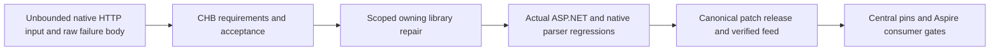

# ADR-083 — Bounded native CQRS HTTP consumption

Status: Accepted; current centrally pinned Communication APIs own the bounded HTTP contract. Fresh Aspire consumer and exact-source Linux qualification remain required. Not Implemented until the complete required gates pass.

Related: REQ/AC-CHB-001–005 in [CqrsTransportBounds](../Features/ClientApi/CqrsTransportBounds.md), AC-NCQRS-004 and [ADR-082](ADR-082-native-cqrs-streams.md), persisted privacy/resource contracts in ADR-010/015/022. Owning source: the ManagedCode.Communication family selected in Directory.Packages.props, maintained in the sibling Communication repository.

## Decision

Repair Communication's actual CQRS HTTP client. Place physical byte admission before excess bytes reach the native BCL SSE parser, cap failure-body UTF8 reads and remove its raw-body Problem.Detail fallback. Retain the native parser/writer, lazy single request, typed chunks, cancellation and disposal. Add validated finite frame/failure options and optional aggregate-byte admission with the exact defaults, limits, physical delimiter semantics, safe codes and boundary tests frozen in the feature contract.

No KeyLoad parser or unpublished local package is authorized. Generic long-operation aggregate admission is optional at the library level; KeyLoad must freeze finite product budgets in C2. Physical byte limits do not promise an exact BCL allocation ceiling or performance improvement. New diagnostics use safe public constants and preserve original exceptions only at the immediate owning telemetry boundary.

## Implementation contract

TASK-NCQRS-HTTP-OWNER-BOUNDS: root owns planning, integration and release; lifecycle_wave Luna/high stages the narrowly scoped patch under /private/tmp after explicit write release. Exact owning paths are ManagedCode.Communication/Cqrs/CqrsStreamClientOptions.cs, CqrsHttpClientExtensions.cs and directly required bounded client helpers/constants; ManagedCode.Communication.Tests/CQRS native transport/API regressions; README.md examples. Existing server writers, normalizer, Graph, reliability and unrelated packages are outside scope. Root alone applies outside-checkout writes, runs commands, changes Directory.Build.props canonical patch values and performs Git/publication.

Ordered stages: freeze contract; implement/review finite physical guard and failure decode; actual positive/negative/edge/cancel/dispose tests; full owning build/TUnit/coverage and bounded hot-path measurement; canonical patch commit/push/release/feed proof; centrally update all three consuming pins; restore/build/focused native CQRS via Aspire and required complete consumer gates. Never skip a failing stage or treat a green release workflow as all-package availability.

Related joins: C0 Graph/native runtime tests use the current centrally pinned packages. C2 public HTTP adoption requires the verified package release and its separate product contract. C1 signed cohort/RPC and C3 long-work durability are unchanged. Workers do not modify shared KeyLoad files, version, Git, source cohorts or run commands during root runtime qualification.

## Rollout, rollback and evidence

This is an additive configuration contract plus intentional safe plain-text failure behavior; valid bounded RFC7807 remains compatible. Document both in the owning README. No stored-data, node-local ownership, public SQL protocol or RF3 membership change. Keep rollback within the verified package release path; never restore an unsafe raw-body fallback as a workaround.

Tests and original source/run/attempt/feed evidence must establish every CHB AC. Source presence alone is not implemented status. Frontend N/A: transport library work. No acceleration, public readiness or durable-operation claim follows from this repair.
