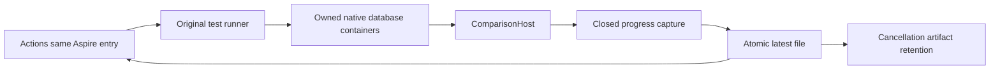

# ADR-085: Visible bounded native benchmark progress

Status: Accepted; verification pending.
Date: 2026-10-04.
Contract: [REQ/AC-BC-LIVE-001..004](../Features/BenchmarkComparisons/LiveProgress.md).

## Decision

Keep the existing canonical Aspire-owned TUnit entry and native ComparisonHost.
Add a closed diagnostic progress line to the native runner, with phase changes
and one periodic latest snapshot. Capture only that validated line into one
cell-owned file before teardown. The Actions entry observes this file while
executing the same AppHost command, preserving its exit status. This avoids
depending on TUnit output capture or Aspire CLI presentation for live visibility.
The ordinary bounded native/container logs and original measurement JSON remain.

Alternatives rejected: smaller datasets or ANN would change the workload;
unfiltered stdout or debug logging risks private data; simply selecting Detailed
TUnit output does not solve the Aspire CLI output boundary. A shorter arbitrary
timeout would hide slow execution and cannot qualify the workload.

## Implementation contract

1. Root freezes the linked requirements and policy before implementation.
2. Runner worker owns only Comparisons phase/attempt observer and matching new
   UnitTests. Keep callback/lifetime bounded; join heartbeat termination on every
   success/failure/cancellation path. Oracle cancellation remains outside timing.
3. Capture worker owns only ComparisonTests log capture, IsolatedNativeCase join,
   and matching native progress/parser/file regressions. Reject malformed lines;
   latest file is written atomically and stays available before teardown.
4. Root owns the process relay scripts, workflow/test integration and docs. Retain
   canonical dotnet/AppHost invocation, original exit and signal handling. No
   independent database startup or global process termination is permitted.
   Benchmarks runs focused native progress capture regressions independently of
   its complete measurement matrix; these do not qualify a database workload.
5. Root reviews every diff, builds, runs real focused Aspire/TUnit checks, format
   and governance; commits only this repair and pushes under standing authority.
   Actual Linux CI/native workload/cancellation artifacts supply delivered proof.

Native marker schema 1 contains only closed phase and bounded nonnegative numeric
values. No database public DTO, persisted format, topology, report schema,
dependency or website evidence authority changes. Progress is diagnostic only.
Shared integration is root-owned. Unrelated CQRS/identity engine work is preserved.

Rollout: source, capture and entry land together. Rollback removes all three
joins together; no stored-data contract changes apply. Existing terminal failures
remain failures, cancellation remains cancellation, and failed cells remain null.

