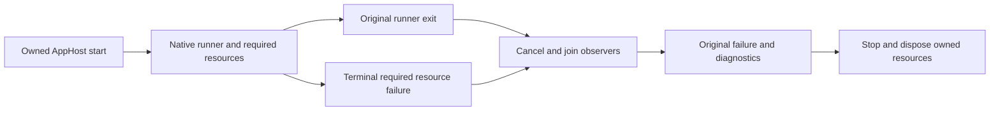

# ADR-086: Stop owned test workloads on terminal Aspire failure

Status: Accepted implementation contract; local development regressions passed;
delivered-source Linux qualification pending.
Date: 2026-10-04. Related: REQ/AC-TEST-012..014, ADR-074, ADR-085.

## Decision

Use actual Aspire resource notifications and host stopping cancellation, rather
than parsing CLI warning text. The disabled dashboard is optional infrastructure
and cannot determine the test outcome. Original CI37202347856 reports show
completed native tests with business failures, not a proven AppHost crash.

Register observation before starting the owned application. Race native runner
completion against the required dependency failure notifications. FailedToStart,
RuntimeUnhealthy, Finished, Exited or an exit code end a runner wait; an absent
original exit status is an error. Required long-lived dependencies cannot exit
successfully during measurement. Derive dependencies from actual WaitAnnotations,
following their graph once per resource, with bounded tasks proportional to the
existing fixed topology. Expected WaitForCompletion exits remain valid, while
wrong or missing exits fail. HealthStatus.Unhealthy by itself is not a terminal
failure. Preserve native exit codes and fail before the full deadline.

Cancel and join every owned observer on success, failure or cancellation. Observe
startup concurrently with failure so a resource failure also cancels pending
startup. Retain the initiating exception rather than replacing it with sibling
cancellation. Existing stop/dispose and bounded diagnostic retention remain the
owner's finally responsibility. No detached task or new timeout increase.

Startup readiness for the shared RF3 fixture explicitly uses native
StopOnResourceUnavailable and cancels/joins other startup waits when one fails.
This startup guard ends at initial readiness. Continuous comparison guards end
at runner completion, before intentional node loss/restart regression scenarios.
Explicit WaitOnResourceUnavailable restart paths stay unchanged. Independent
database jobs continue their own workloads after another database fails.

## Implementation and verification

1. Root owns requirements, this ADR, shared integration and Git delivery.
2. progress_runner owns only new AppHost Features/TestInfrastructure native
   lifecycle helpers and new ComparisonTests Features/TestInfrastructure tests.
   Genuine Aspire notifications cover terminal/missing-exit, live dependency
   failure, successful/failed bootstrap, no dependencies, cancellation and task
   settlement. Native failures settle within five seconds of event publication.
3. Root joins TestSuiteApplication, IsolatedNativeCase and shared ClusterFixture
   startup, with any necessary test friend visibility. vector_runtime reviews
   required resources and planned fault boundaries read-only. Concurrent engine
   CQRS/upgrade code and its dedicated wave fixtures remain with their owner.
4. Build/format/governance and focused TUnit tests through the canonical Aspire
   entry, then retain exact-source Linux CI reports. Full unit/scalar/recovery/RF3
   and native benchmark qualification remain required; unrelated failures are
   reported honestly. Source/native service tests do not prove a Docker crash
   was exercised. A real failure artifact supplies environmental-path evidence.

Graph: CONTRACT -> NATIVE HELPERS/TESTS -> JOINS -> REVIEW -> EVIDENCE.
Acceptance mapping is in TestInfrastructure. No production contract, package,
data-format or topology migration. Rollback reverts only these lifecycle joins
and helpers; the canonical Aspire entry and existing outcomes remain required.
Frontend N/A: developer and CI lifecycle only.

