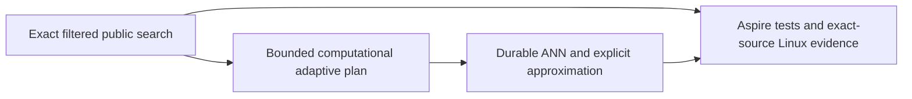

# ADR-087: Filtered retrieval in the authorized search cut

Status: Accepted; implementation and qualification pending.

An allowlist must constrain actual database search rather than require the client
to filter an already truncated top-k. Use an optional bounded SearchRequest field
and filter branch output before ranking/fusion in the same persisted-policy cut.
Lexical corpus statistics retain their authorized scope. Complete exact results
remain the public contract until explicit approximation/freshness metadata and
the durable ANN lifecycle are delivered. Post-top-k filtering, filter-specific
IDF and output-filtered ANN graphs are rejected because they change correctness
or hide recall loss. This stage makes filtered search callable immediately while
preserving the remaining adaptive projection qualification.

Implementation contract: [FilteredRetrieval](../Features/Search/FilteredRetrieval.md),
REQ/AC-FILTER-001–005, KL-032/060; ADR-010/018/019/022/082.
Ordered stages, disjoint worker/root ownership, tests, baseline failures,
dependencies, rollout/rollback and client/RF3 joins are frozen there. Root owns
shared contracts and negotiated epochs; Luna owns Query/Search and its new tests.
No data format or trusted role is introduced. Source is not qualification.

