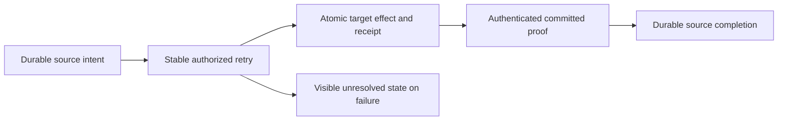

# ADR-088: Durable remote queue intent and receipt

Status: Accepted; implementation and qualification pending.

Partition-local processing cannot atomically enqueue on another partition. Retain
a source-owned immutable intent, commit target enqueue with dedup receipt, and
complete source only with authenticated target proof. Retry the same identity
after unknown outcomes. A coordinator is orchestration, not authority. Retain
unresolved intents and target receipts with finite admission rather than invent
a TTL that could lose work or recreate acknowledged messages. Signed claims use
the existing cluster key and actual persisted principal; initial administrative
access is explicit and still enforces source/target data grants.

Distributed transactions, client-asserted success, shared projection-outbox
semantics and silently dropping failures are rejected. Separate commits expose
OutputPending; external side effects remain outside database guarantees.

Implementation contract: [RemoteTransfers](../Features/Messaging/RemoteTransfers.md),
REQ/AC-XFER-001–005; original KL-094 and dependencies KL-016/020/086/090.
The linked contract contains ordered stages, exact ownership, baseline, tests,
native serialization, retained payload, resource/retention limits and rollout/
rollback. Root owns shared/public/RF3 joins; Luna owns new Messaging source/tests.
ADR-002/003/024/026/028/029/030/036/082 remain mandatory.

## TASK-XFER-THREE-STAGE-COLD-001 — source-authored RF3 stage

REQ/AC-XFER-001/002/003/005, ADR-088 and ADR-125. Dedicated genuine Aspire-owned three-node RF3 scenario with independently generated source and destination atomic partitions in one tenant/database/incarnation. This is not a claim of separate physical groups or distributed atomicity. Reuse current SDK, official MCP, Q1 CALL, persisted administrator with exact QueuePublish/Inspect/Consume/Ack/Query and raw field/header grants, original McpCallerDeadline and existing joined cold lifecycle.

Stages: commit stable source Create with actual immutable intent; cold original volumes and verify OutputPending/no target. Reject tampered intent, conflicting source body and freshly revoked target publisher through all4 existing routes; target metadata/receipt absent, source exact original. Restore actual current persisted publisher. Commit target Accept and retain original full native receipt/signed target proof/full literal message metadata/body; cold with source still OutputPending. Complete only from that original actual target receipt; cold and verify Delivered plus original exact command receipts and full state on every route. ACK genuine target delivery, submit new commandId Accept against original intent and prove retained dedup/no resurrected message; complete a fresh independent healthy transfer and verify literal new body/receipt/state.

No API/schema/alias/fieldId/product/clock/default/limit/ownership/scheduler change. New test roles only under Features/Messaging, append RemoteTransfers/ADR088. Original warm case and all Unit identity/retention/cap/malformed claims cases remain unchanged. Ordinary independent fixture50 slots; no blanket serialization. Real source/source-target commit receipts remain separate; never manufacture unknown response or regard canceled caller as rollback.

OPEN: bounded autonomous native coordinator; original process cut at each stage; genuine lost-response/unknown outcome boundary; physically separate RF3 groups/movement and aligned retention-horizon evidence; all Linux runtime/source-image/UID qualification. This finite three-stage cold case does not close whole KL094. Root-only compile/native discovery/tests.

### TASK-KL094-COLD-ORIGINAL-EPOCH-002 — current policy fence

Source correction only: original Create receipt positively replays across the FIRST cold cut before persisted policy changes. Actual revoke/restore increments the persisted principal epoch; the same historical Create command MUST then return PermissionDenied on SDK, official MCP and both Q1 routes, including the third cold cut, while original source intent and literal receipt evidence remain retained. Fresh target Accept/source Complete use genuine new command IDs under current authority; their original same-epoch receipt replay remains complete and exact. This maps existing AC-XFER-003 and TASK-KL094-THREE-STAGE-COLD-001; current Core ValidateCachedResult owns the frozen epoch fence. No product/alias/schema/deadline/oracle weakening; Linux qualification OPEN. R1 immutable, superseded only by this corrected R2.
