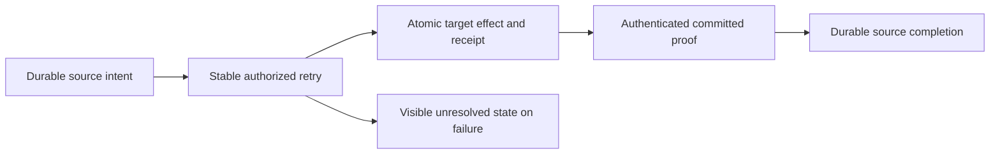

# ADR-088: Durable remote queue intent and receipt

Status: Accepted; implementation and qualification pending.

Partition-local processing cannot atomically enqueue on another partition. Retain
a source-owned immutable intent, commit target enqueue with dedup receipt, and
complete source only with authenticated target proof. Retry the same identity
after unknown outcomes. A coordinator is orchestration, not authority. Retain
unresolved intents and target receipts with finite admission rather than invent
a TTL that could lose work or recreate acknowledged messages. Signed claims use
the existing cluster key and actual persisted principal; initial administrative
access is explicit and still enforces source/target data grants.

Distributed transactions, client-asserted success, shared projection-outbox
semantics and silently dropping failures are rejected. Separate commits expose
OutputPending; external side effects remain outside database guarantees.

Implementation contract: [RemoteTransfers](../Features/Messaging/RemoteTransfers.md),
REQ/AC-XFER-001–005; original KL-094 and dependencies KL-016/020/086/090.
The linked contract contains ordered stages, exact ownership, baseline, tests,
native serialization, retained payload, resource/retention limits and rollout/
rollback. Root owns shared/public/RF3 joins; Luna owns new Messaging source/tests.
ADR-002/003/024/026/028/029/030/036/082 remain mandatory.

