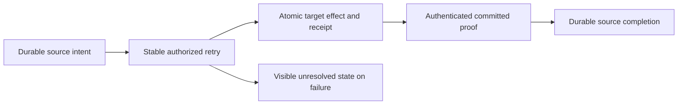
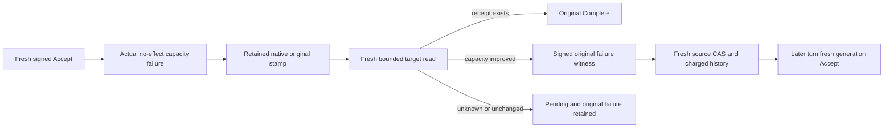

# ADR-088: Durable remote queue intent and receipt

Status: Accepted; implementation and qualification pending.

Partition-local processing cannot atomically enqueue on another partition. Retain
a source-owned immutable intent, commit target enqueue with dedup receipt, and
complete source only with authenticated target proof. Retry the same identity
after unknown outcomes. A coordinator is orchestration, not authority. Retain
unresolved intents and target receipts with finite admission rather than invent
a TTL that could lose work or recreate acknowledged messages. Signed claims use
the existing cluster key and actual persisted principal; initial administrative
access is explicit and still enforces source/target data grants.

Distributed transactions, client-asserted success, shared projection-outbox
semantics and silently dropping failures are rejected. Separate commits expose
OutputPending; external side effects remain outside database guarantees.

Implementation contract: [RemoteTransfers](../Features/Messaging/RemoteTransfers.md),
REQ/AC-XFER-001–005; original KL-094 and dependencies KL-016/020/086/090.
The linked contract contains ordered stages, exact ownership, baseline, tests,
native serialization, retained payload, resource/retention limits and rollout/
rollback. Root owns shared/public/RF3 joins; Luna owns new Messaging source/tests.
ADR-002/003/024/026/028/029/030/036/082 remain mandatory.

## TASK-XFER-THREE-STAGE-COLD-001 — source-authored RF3 stage

REQ/AC-XFER-001/002/003/005, ADR-088 and ADR-125. Dedicated genuine Aspire-owned three-node RF3 scenario with independently generated source and destination atomic partitions in one tenant/database/incarnation. This is not a claim of separate physical groups or distributed atomicity. Reuse current SDK, official MCP, Q1 CALL, persisted administrator with exact QueuePublish/Inspect/Consume/Ack/Query and raw field/header grants, original McpCallerDeadline and existing joined cold lifecycle.

Stages: commit stable source Create with actual immutable intent; cold original volumes and verify OutputPending/no target. Reject tampered intent, conflicting source body and freshly revoked target publisher through all4 existing routes; target metadata/receipt absent, source exact original. Restore actual current persisted publisher. Commit target Accept and retain original full native receipt/signed target proof/full literal message metadata/body; cold with source still OutputPending. Complete only from that original actual target receipt; cold and verify Delivered plus original exact command receipts and full state on every route. ACK genuine target delivery, submit new commandId Accept against original intent and prove retained dedup/no resurrected message; complete a fresh independent healthy transfer and verify literal new body/receipt/state.

No API/schema/alias/fieldId/product/clock/default/limit/ownership/scheduler change. New test roles only under Features/Messaging, append RemoteTransfers/ADR088. Original warm case and all Unit identity/retention/cap/malformed claims cases remain unchanged. Ordinary independent fixture50 slots; no blanket serialization. Real source/source-target commit receipts remain separate; never manufacture unknown response or regard canceled caller as rollback.

OPEN: bounded autonomous native coordinator; original process cut at each stage; genuine lost-response/unknown outcome boundary; physically separate RF3 groups/movement and aligned retention-horizon evidence; all Linux runtime/source-image/UID qualification. This finite three-stage cold case does not close whole KL094. Root-only compile/native discovery/tests.

### TASK-KL094-COLD-ORIGINAL-EPOCH-002 — current policy fence

Source correction only: original Create receipt positively replays across the FIRST cold cut before persisted policy changes. Actual revoke/restore increments the persisted principal epoch; the same historical Create command MUST then return PermissionDenied on SDK, official MCP and both Q1 routes, including the third cold cut, while original source intent and literal receipt evidence remain retained. Fresh target Accept/source Complete use genuine new command IDs under current authority; their original same-epoch receipt replay remains complete and exact. This maps existing AC-XFER-003 and TASK-KL094-THREE-STAGE-COLD-001; current Core ValidateCachedResult owns the frozen epoch fence. No product/alias/schema/deadline/oracle weakening; Linux qualification OPEN. R1 immutable, superseded only by this corrected R2.

## TASK-KL094-NATIVE-COORDINATOR-F1-001 — finite source stage

This implements the approved F1 subset of REQ/AC-XFER-001..005 under ADR-088/094/125. The R3 review document historically used the noncanonical REMOTE-TRANSFER spelling; XFER is the canonical requirement identity. No requirement is renamed. Source-only, native Linux/UID/process/RF3 qualification OPEN.

One real persisted technical principal may be selected by nullable TransferCoordinatorPrincipalId; null skips transfer discovery without changing recurring cadence. The setting selects an existing subject only, never creates credentials, grants roles or impersonates another creator. The subject must equal the actual retained source creator and tenant and is freshly authorized for each signed native source/target inspection and Batch. Existing connection-owned CQRS, original node storage, leader/quorum fences, dispatch cancellation/deadline and joined task lifetimes remain authorities.

Bounded discovery uses one scoped native read grant for reverse-tail capture, forward scan/lookahead and all selected principal/resource/counter reads. The original native count/byte/work/result ceilings and fixed tail are retained. Cursor resets on both store incarnation and ReadGeneration. Store.Position is captured within the same actual Store.Read gate with the native Token placement witness. Failed dispatch retains the actual discovered cursor, so a known failed intent does not starve later hints.

Only one enabled branch executes per original service cycle. Closed rotation has recurring, queue deadline and transfer branches; bounded skipping of disabled selections preserves recurring every cycle when both optional selections are null. No new wait/poll/provider/dispatcher.

The new INTERNAL generated hint alias is keyload.core.queue-transfer-coordination-hint.v1, Id0 Source/1 Destination/2 TransferId/3 PrincipalId/4 Fingerprint/5 IntentDigest/6 SourceCut. The existing coordinator interface appends ProcessQueueTransferAsync; original aliases/versions/methods and KL092 queue branch are preserved. Hint data never authorizes apply. Exact canonical IDs are SHA256 over native KeyCodec(domain keyload.queue-transfer.coordinator-command.v1, closed accept/complete, full source/target identities, original TransferId/PrincipalId/Fingerprint/IntentDigest/source Incarnation), first16 Guid bytes. Read position, policy changes, random cycle identity and DurableJobs DequeueCount are excluded.

Fresh actual source pending inspection precedes target receipt inspection. If no proof exists, one canonical Accept is submitted. The result is followed by target inspection; missing proof remains UnknownWriteOutcome. Before Complete, both source and target receipt are freshly reread; changed proof refuses. Complete carries only the actual native signed target proof. Same immutable ID/body reconciles genuine uncertainty/restart, with no new effect identity.

F1 deliberately retains a known terminal failed canonical outcome and pending source. Restoring policy/quota does not mint a new command ID. A genuinely authorized operator must use existing fresh public Accept/Complete as appropriate. The coordinator may observe that actual receipt and finish the unchanged source. Automatic dependency-bound retry/attempt advancement and full AC-XFER-005 closure are NOT implemented; F2 requires a separately reviewed authoritative durable bounded-attempt contract.

Automated source bindings: RemoteTransferCoordinationColdTests.NativePendingDiscoveryDoesNotMutateAndColdCanonicalAcceptCompleteRetainOriginalReceipts (native ZoneTree whole cold operation); RemoteTransferCoordinatorRf3Tests.NativeCoordinatorUsesActualReceiptAcrossColdAndKnownQuotaFailureRequiresFreshPublicRepair(bool), arguments false/true. The latter uses genuine Aspire RF3, actual persisted selected principal before Create, original SDK/official MCP/both Q1, literal target body/headers/metadata, source proof and complete original receipts across two same-volume cold cuts. Full-target setup passes an optional target QueuePolicy through the existing scenario producer at initial resource creation, preserving the ordinary null/default path. It creates one genuine filler under that one-message native QueuePolicy, rejects the canonical Accept with no transfer effect/receipt, retains it after cold, ACKs the original filler and performs fresh public Accept repair. It does not claim which producer won the first canonical-ID submission race. No fabricated failure, marker, clock or response. Existing Cold12R2 supplies independent original epoch denial/auth/unknown-stage/manual three-cut coverage; it is a required exact predecessor, not duplicated.

Ownership: Core Messaging Contracts/Identity/Models/Queries; Orleans Messaging Configuration/Contracts/Execution/GrainServices/Grains; test-owned typed ClusterFixture selection and shared MessagingRf3Identity producer from KL09265, with new feature-local Configuration/Contracts/Helpers/Assertions/Cases. No public/persisted family or user schema changes. Rollback removes the optional config/branch/hint; original transfer intent/receipt bytes remain readable unchanged. Root joins KL09265 and Cold12R2 first or explicitly composes their preserved bytes once, then this guarded successor.

OPEN gates: fresh native compiler/analyzers/50-slot Unit normal+scalar discovery; Linux exact-source/image/PDB/UID RF3 execution; genuine uncertainty/failure-at-specific-cut coordinator proof; distinct physical source/target group failover; retention horizon/GC; F2 automatic bounded retries. No qualification from authored source.

## TASK-KL094-ACCEPT-CAPACITY-ATTEMPT-002 — finite native capacity repair

REQ-XFER-002/003/004/005 → AC-XFER-F2-001/002/003 → ADR-088/094/125. This source stage is the approved finite target Accept capacity retry boundary, not universal automatic transfer recovery. `DatabaseLimits.MaxQueueTransferAcceptAttempts` is nullable, native Id20, default null, centrally validated positive and <=MaxScanRecords. A newly created source intent reserves its immutable ceiling/generation1 and retained history; original intents with null state remain unchanged. Actual source history count and native serialized bytes stay charged under current MaxScanRecords/MaxBatchBytes. No GC, arbitrary retry, clock, default, role, timeout or capacity changes.

- REQ-XFER-F2-001 / AC-XFER-F2-001: only a genuine single Accept's ordinary no-effect ResourceExhausted from owning queue storage or transfer retention can retain nullable original authority in StoredOutcome Id9. Capture follows fresh original authorization/fences/clock and precedes actual Execute; original Reset remains authoritative. Unknown, early authorization errors, unclassified/transitive failures, success/replay have no eligible stamp. One charged same-native-view target read freshly validates the subject and original signed intent, successful receipt FIRST, original scoped outcome/stamp/native raw-byte digest/current dependency/owner cut. Directional capacity repair is required; no witness or Advance is produced by an unrelated commit/read cut.
- REQ-XFER-F2-002 / AC-XFER-F2-002: source authorized Batch `AdvanceQueueTransferAttempt` uses alias `keyload.queue-transfer.advance-attempt.v1`, discriminator `advanceQueueTransferAttempt`, derived Id0 SourceQueue/1 TransferId/2 ExpectedGeneration/3 FailureWitness. Source verifies the actual target signature and exact immutable intent/accept tuple; one same-transaction CAS appends one history reference, increments generation, charges one record plus exact native bytes. Ceiling/current limits, history/signatures and stale generation refuse without business effects. Original successful target receipt always wins; no ACKed target is recreated. New private read QueueTransferCoordination=72 follows actual live0..68 and separately reserved Streams69..71, with no dummy members or renumbering.
- REQ-XFER-F2-003 / AC-XFER-F2-003: generation1 Accept and every Complete retain exact F1 IDs. New Accept changes only source-committed generation. Advance ID derives from immutable tuple, expected generation and authenticated ORIGINAL outcome digest; refreshed witness/native read position never creates new IDs. A failed source Advance keeps that same ID and requires explicit authorized public operator repair. The existing serialized service dispatches at most one Advance per turn; a later turn rereads source state before a new Accept. No recursive loop, dispatcher, new activation or service-created principal.

Automated source bindings: Unit `RemoteTransferAttemptColdTests.GenuineTargetCapacityFailureRequiresRepairBeforeBoundedAttemptAndTwoColdReceiptReplays` uses actual native queue filling, failed original Apply, unchanged refusal, original raw StoredOutcome bytes, unknown/malformed/stale no-effects, genuine ACK repair, source CAS, new Accept/Complete, ACK with no resurrection and two real same-root reopen cuts. RF3 `RemoteTransferAttemptRf3Tests.GenuineCapacityRepairUsesBoundedCommittedAttemptOrOriginalManualRepairAcrossTwoColdCuts(int ceiling)` has typed arguments1/2: the one-attempt case requires the existing fresh operator Accept; the two-attempt case must reconcile the exact generation2 native receipt. Both use actual Aspire Docker resources, original SDK/official MCP/both Q1, exact persisted subject, full literal message/source/receipt assertions and two same-volume cold process cuts. Existing native cases/Args and ordinary50 slots remain unchanged.

This stage is PRIVATE SOURCE ONLY until root join/build and original Linux discovery/runtime. Mandatory native normal/scalar/full recovery/Docker RF3 gates remain open; UID/count contracts unchanged. Separate precise source-Advance/target-receipt unknown-at-commit crash cuts, independently placed physical groups, full negative boundary matrix, automatic Complete/policy/auth failures and AC-XFER-005 overall remain OPEN. No primitive or full SQL/protocol qualification is inferred from this finite stage.

Ordered ownership: Core Messaging owns stamp/read/history/CAS helpers; shared AtomicCommandCommit and generated native StoredOutcome append only9; Abstractions owns mutation/config append only; existing Orleans service/connection-native CQRS reuses fresh scope and joined lifetimes; test fixture only passes the explicit validated attempts selection to its original resources. Rollback disables optional advancement; retained generation/history/outcomes must remain validated and cannot be silently erased. Root composes actual DeadlineR2/F1 and Streams ordinal ancestors, then runs native discovery and exact-source Linux. See the immutable exact field/alias freeze in the reviewed implementation contract; no copied codec or signing material is exposed.

### TASK-KL094-F2-SOURCE-CAS-PROCESS-001
The genuine existing CrashHost test-only mode `remote-transfer-capacity-attempt` creates a real full-target failure/native witness, performs actual authorized filler ACK and arms the original CanonicalCrashBoundary only for the source Advance transaction. `RemoteTransferAttemptProcessRecoveryTests.ActualSourceAttemptCrashRetainsAtomicHistoryFailureAndCompletesOriginalTransferThenCold(CommitStage)` has HeaderWritten/JournalFlushed/ApplyCompleted arguments, uses existing MessagingCrashTrial original90-second operation/30-second cleanup/8192 stderr bounds, real kill/exit/native file readiness and joined root cleanup. Native source history/reference count/counter/outcome must form one complete atomic image; flushed stages must be present. Unknown early durability is reconciled by the SAME original command, never a fabricated result. Parent performs new actual signed-generation target Accept/source Complete, checks complete literal message/receipt/source state, retains original failed outcome bytes and reopens the same root for exact replay. CrashDatabase only accepts an optional centrally validated test limits object; ordinary paths remain unchanged. No production inspection, signer export, fake clock/provider, new journal contract, power-loss inference or runtime qualification. Full Linux recovery/RF3 remains OPEN.

### TASK-KL094-F2-CEILING-NATIVE-COLD-001
`RemoteTransferAttemptColdTests.GenuineCapacityWitnessCannotExceedRetainedCeilingThenFreshOperatorRepairSurvivesTwoColdCuts` completes the independently configured ceiling1 negative operation. A real full-target Accept first fails, a real ACK repairs capacity and produces the original signed witness, and a genuine source Advance refuses without intent/history/counter/message/receipt effects. Its complete original failed result and raw native outcome survive two same-root cold reopen cuts. Explicit existing authorized fresh operator Accept/Complete then succeeds; full literal message, target proof, original source state and original failed Accept bytes remain checked. It never retries a failed Advance with a new identity. Ceiling2 success additionally checks every historical reference field and independent native raw intent bytes plus original receipt reservation against actual retained counter bytes within one store read. Current/original principal policy epoch and field/header-policy digest must remain identical for capacity-only improvement; policy repairs cannot qualify this stage. Closed internal read results have exactly one source-state, witness or receipt variant, and expanded-frame rejections clear the ineligible failure stamp. All compiler/normal+scalar/real-process/Linux RF3 gates remain OPEN.

# KL094 F3A exact current-authority repair freeze

Root approved F3 R2 (108401a4d4f0369574d0718a1fbf23104d82174394c926ccc70a5d18b59086a9). This private implementation contract precedes source. REQ-XFER-005 / AC-XFER-005 / ADR088,094,125 / TASK-KL094-CURRENT-AUTHORITY-REPAIR-003. Source-only, no runtime acceptance.

## Existing native facts and finite prerequisite
AtomicCommandCommit stores the actual Principal.PolicyEpoch before AuthorizeOperation. Its early PermissionDenied retains that epoch and exact original CommandFingerprint, scope, incarnation, result; it does not retain the original field/header digest. Therefore this finite implementation qualifies a real changed persisted epoch and fresh FULL original authorization. Same-epoch field-only denial cannot qualify without genuine retained prior policy evidence; it remains OPEN. Failed Complete has no F2 capacity stamp. Capacity-only Complete directional repair is OPEN until its original dependency is genuinely retained; a current fit or new read position is insufficient. Accept F2 directional capacity handling is unchanged.

## Exact additive contracts
No OperationKind / GrainReadKind is allocated. Existing QueueTransferCoordination72 remains the sole read. Existing F1/F2 IDs and histories remain unchanged.

* Public QueueTransferRepairStage enum Accept=0, Complete=1. AdvanceQueueTransferRepair alias keyload.queue-transfer.advance-repair.v1; JSON discriminator advanceQueueTransferRepair; generated fields0 SourceQueue,1 TransferId,2 Stage,3 ExpectedCapacityGeneration,4 ExpectedPolicyGeneration,5 ExpectedCompleteGeneration,6 FailureWitness. Existing Batch remains actual authorized operation.
* Intent nullable Repairs field16; old0..15 unchanged. DatabaseLimits nullable MaxQueueTransferRepairAttempts field21, default null/unavailable, positive<=MaxScanRecords through actual central validation. Immutable selected ceiling is captured only on genuine new Create. No default changed.
* RemoteTransferRepairState alias keyload.core.queue-transfer.repair-state.v1: fields0 Ceiling(int),1 AcceptPolicyGeneration(long, initially1),2 CompleteGeneration(long, initially1),3 History(ImmutableArray<RemoteTransferRepairReference>). History length <=min(retained ceiling,current validated ceiling)-1; each real reference charges one source record plus exact encoded bytes. Ceiling counts the initial generation; no zero-cost attempts.
* RemoteTransferRepairReference alias keyload.core.queue-transfer.repair-reference.v1: fields0 Stage,1 CapacityGeneration,2 PolicyGeneration,3 CompleteGeneration,4 FailedCommandId,5 Fingerprint,6 OutcomeDigest,7 WitnessToken. Chronological references bind BOTH prior generations and original capacity generation. No failed CAS manufactures a reference.
* RemoteTransferRepairClaims alias keyload.core.queue-transfer.repair-claims.v1: fields0 Purpose,1 Source,2 Destination,3 TransferId,4 PrincipalId,5 MessageFingerprint,6 IntentDigest,7 Stage,8 CapacityGeneration,9 PolicyGeneration,10 CompleteGeneration,11 FailedCommandId,12 CommandFingerprint,13 OutcomeDigest,14 OriginalPolicyEpoch,15 CurrentPolicyEpoch,16 CurrentFieldHeaderDigest,17 OwnerCut,18 ReadGeneration,19 ReceiptDigest(nullable, required ONLY Complete). Existing Core Sign/Verify owns the opaque witness. Purpose keyload.queue-transfer.current-authority-repair.v1.
* Existing read request appends fields7 RepairStage(nullable),8 PolicyGeneration(default1),9 CompleteGeneration(default1),10 ReceiptToken(nullable). New closed purpose keyload.queue-transfer.repair-failure-read.v1. Old purposes require null RepairStage/ReceiptToken; old failure purpose retains initial policy generation, while source refresh validates the exact retained repair generations; new purpose requires exact positive generations and Complete-only receipt. Existing request.AcceptCommandId is the exact selected failed command ID for this purpose, not a renamed ID in old purposes.
* Existing read result appends nullable RepairWitness field3. Exactly one old/new variant, mixed variants refuse. Hint appends9 AcceptPolicyGeneration(default1),10 CompleteGeneration(default1),11 RepairCeiling(nullable). Old F2 readers/refresh must preserve and validate these fields.

## Ordering and trust
Fresh actual principal/admin/QueueInspect/QueuePublish/tenant/field/header authorization precedes selected outcome. Reconstruct the exact canonical one-mutation original Accept or Complete from genuinely retained intent/proof; compare native scoped outcome, owner incarnation, original deterministic command ID and native CommandFingerprint. Require exact failed PermissionDenied/null Json/null NativeValue, OriginalPolicyEpoch < actual current PolicyEpoch, and full AuthorizeOperation on that reconstructed original. Unknown/missing/success/other error emits no repair. Receipt observation FIRST wins for Accept and must never re-enqueue ACKed output.

Same Store.Read gate captures raw outcome SHA256, current policy/digest and ONE Token(view, selected atomic partition, Store.Position); ReadGeneration stores that exact OwnerCut.Position as committed-view observation only. Existing charged read wrapper accounts every key/value/result. Witness does not say the denied effect was formerly authorized. Source CAS freshly authorizes original creator/source, validates actual own signed witness and exact pending identity/generation tuple, charges history before write, atomically appends exactly one reference/increments selected generation. Successful replay revalidates exact recorded witness; original failed outcome remains byte-identical. History validation accepts historically authentic policy witnesses but never turns their stale policy into current effect authorization.

Identity: policyGeneration1 Accept delegates to original F2 AcceptId (including every capacity generation). CompleteGeneration1 delegates to original F1 CompleteID. Repaired Accept domain keyload.queue-transfer.accept-policy-command.v1 binds immutable F1 identity tuple, capacity generation and policy generation. Repaired Complete domain keyload.queue-transfer.complete-repair-command.v1 binds immutable F1 tuple and complete generation. Repair CAS domain keyload.queue-transfer.advance-repair-command.v1 binds immutable tuple, closed stage, all expected generations, exact ORIGINAL outcome digest. KeyCodec/SHA256/Guid native primitives; no cut/witness bytes/time/random. Capacity advancement under a repaired policy must not reinterpret F2 original authority: unless original F2 history can be independently proven, that combined failure remains explicit operator repair pending.

## Whole source/regression scope
Core Messaging new Contracts/Identity/Queries/Validation/Commands/Execution plus actual shared Batch dispatch/authorization/JSON/config owners; Orleans existing signed read/apply and one serialized coordinator turn. No new dispatcher/provider/activation. Unit actual denied Accept, unchanged denial/refused witness, persisted authority repair, source CAS, original failure raw bytes, one target effect and ACK, genuine denied Complete, second source repair CAS, old result retained/new completion, stale/malformed/ceiling/body conflict/no effects, two same-root cold cuts. Genuine source CAS crash cuts HeaderWritten/JournalFlushed/ApplyCompleted; full pre/post inventories and receipts. Real SDK/official MCP/both Q1 RF3 two-volume cold/public scope; all existing Args/clocks/defaults retained. All required fresh Linux/native UID/compiler/runtime gates OPEN. Full AC-XFER-005 also retains distinct-group F3B and capacity-only Complete/universal retry gates OPEN.

Rollback disables only new nullable selection; existing admitted histories/records are never erased or upcast. F3B is separate and receives no implementation credit from this contract.

### Finite F3A authored whole-operation mapping (source only)
The exact generated/native source proposal maps TASK-KL094-CURRENT-AUTHORITY-REPAIR-003 to:
- `RemoteTransferRepairColdTests.NativeDeniedAcceptAndCompleteRequireFreshPolicyRepairAndBoundedSourceCasAcrossTwoColdCuts` and `NativeRepairCeilingRetainsOriginalDenialsThenExplicitOperatorCompleteSurvivesTwoColdCuts`: real persisted epochs, original failure raw bytes, complete literal state/receipt/accounting, invalid witness/body/stale CAS refusals, source ceiling, ACK and two same-root cold opens.
- `RemoteTransferRepairProcessRecoveryTests.OriginalSourceRepairCasCrashRetainsExactDeniedOutcomeAtomicHistoryAndColdHealthy(CommitStage, QueueTransferRepairStage)`: six source arguments HeaderWritten/JournalFlushed/ApplyCompleted crossed with Accept/Complete. Actual original source CAS, retained failed operation/outcome, atomic recovered history/counters, exact saved-operation replay and two cold opens. Process cuts are not power-loss proof.
- `RemoteTransferRepairRf3Tests.ActualKnownDeniedTransferStageRequiresPolicyRepairAndSourceCasBeforePublicHealthyAndTwoColdCuts(QueueTransferRepairStage)`: two source arguments Accept/Complete, real persisted credential/subject, failed original command, cold under denied policy, policy repair, existing coordinator observation/CAS, SDK/official MCP/both Q1, full Ready then ACKed literal state and second cold. Setup that lacks an actual durable known denial is a failed setup, never qualifying credit.
- Existing independent `McpPolymorphicSchemaTests`/`McpMutationTestData` preserve all original37 and append the actual AdvanceQueueTransferRepair discriminator as source census38.

These are ten new source candidate cases, not native discovered UIDs or runtime results. Root must compile/discover fresh Linux Source/PDB/UID metadata and run normal/scalar Unit, genuine process recovery and Docker/Aspire RF3 gates; existing mandatory suites and strict selection contracts are unchanged. AC-XFER-005 is not closed: same-epoch field-only repair, capacity-only Complete, combined capacity-after-policy repair, generic source-CAS terminal repair/unknown reconciliation qualification, distinct physical-group F3B, automatic universal retry, endurance/performance and all new Linux runtime gates remain explicitly OPEN.

### TASK-KL094-F3A-NATIVE-DIAGNOSTICS-001

Source-only corrective successor preserves the approved F3A policy-repair contract: document existing Accept=0/Complete=1 and optional limit field21, and remove the second identical null-result predicate before the unchanged PermissionDenied/no-payload checks. No aliases, IDs, defaults, authorization order, history, limits or whole-operation assertions change. Fresh native diagnostics recorded CS1591 at enum6:5/7:5 and limit105:17, CA1508 at failure-read32:39; root checkOnly returned NotSupported for XML sites and NotFound for the duplicate predicate. Build, Unit/process/RF3 and original Linux acceptance remain required; no execution claim.

### TASK-KL094-HISTORY-NUMERIC-R78-002 — exact cold/process history equality
R78 original Unit two complete cold flows and Recovery eight process-cut flows reject Int32 actual History.Length versus Int64 expected generation/count through TUnit numeric conversion. Widen only actual Length to Int64 at RemoteTransferRepairColdHealthy.ProveAsync, RemoteTransferAttemptRecoveryCut.AssertAsync and RemoteTransferRepairRecoveryCut.AssertAsync. All original expected count/generation formulas, raw intent/outcome bytes, source/target counter bytes, absence/ACK/receipt/continuation assertions, cut arguments, deadlines and principal fences stay exact. No product or storage contract change. Reproduce both RemoteTransferRepairColdTests complete named cases and all original RemoteTransferAttemptProcessRecoveryTests/RemoteTransferRepairProcessRecoveryTests native cut arguments via canonical native runner, normal/scalar and recovery, retaining fresh source/image/exit/TRX. The independent attempt ApplyCompleted discovery deadline failure remains original unknown cause and is not repaired or hidden by numeric widening. This source-only repair does not qualify AC-XFER005 or remote F3B.

## TASK-KL094-COMPLETE-COORDINATION-READ-001

# KL094 complete coordination-read admission

REQ-XFER-COORDINATION-READ-001: a complete freshly authenticated coordination read must charge every examined native authorization, resource, intent/history, outcome, receipt and token-placement record against its existing centrally validated operation read limits. A due-discovery page-size limit is not a substitute for that complete operation admission.

AC-XFER-COORDINATION-READ-001: the two existing RemoteTransferRepairColdTests must complete both original cold flows after the lossless History.Length assertion repair; exact histories/outcomes/receipts/models/ceiling refusals remain unchanged. A genuine operation MaxScanRecords/MaxQueryReadBytes refusal remains a failed result without partial output/effects. Recovery selectors remain mandatory.

Actual isolated evidence: numeric-unit-r1.original.log and TRX under /private/tmp/keyload-kl094-f3b-isolated-lane-r1-20261010; both failures occur in ReadRemoteTransferRepairFailure -> Token -> ReadPlacementWitness -> ReadDirectory -> ChargeReadGrant. Numeric conversion no longer preempts this read. This is development evidence, not original Linux qualification.

Current owning API: RemoteTransferPendingBudget(DatabaseEngine,CancellationToken) allocates its grant from min(DueExecution.MaximumRangeBytes, budget.MaximumNativeReadBytes) and min(DueExecution.MaximumRecordsPerPage,budget.MaximumNativeScanRecords). ReadRemoteTransferCoordination uses the same owner as range discovery even though it executes a complete authorization/receipt/history/cut read.

Proposed exact split: preserve the existing constructor/discovery path byte-for-byte. Add a private constructor accepting a closed internal budget mode, with an internal Coordination factory that reserves the actual ReadExecutionBudget.MaximumNativeReadBytes and MaximumNativeScanRecords. Keep the same original clock, DueDiscoveryDeadline, query deadline/cancellation, scoped grant lease, all read charges and result admission. Change only ReadRemoteTransferCoordination to use Coordination. No bool on public RPC, new trusted flag, configured limit/default increase, uncharged record, body export, retries, timer, schema or alias change.

Ownership: Core/Features/Messaging/Queries/RemoteTransferPendingBudget.cs and RemoteTransferAttemptReads.cs; append RemoteTransfers.md/ADR088 before source. Existing two Unit full operations plus original attempt/repair process recovery are regression oracles; no new getter/helper test.

Gate: root reviewed and approved this exact boundary before source; integrated/runtime qualification remains pending. Unknown elapsed discovery failure remains separate. Universal remote automatic retries, full F3B and Linux qualification remain OPEN.

## TASK-KL094-DISTINCT-OWNER-TRANSFER-004: native peer/Core finite implementation

REQ-XFER-001..005 / AC-XFER-001..005 → ADR-088/094/125. Root reviewed exact contract0418f8f4, identity clarificationd5cd4cac, composition76ae9a78. Finite distinct-owner routing and independent receipt reconciliation, not remote automatic F2/F3A retry or full AC-XFER-005 closure. All existing default local shapes/IDs/current scopes and whole tests remain.

# TASK-KL094-DISTINCT-OWNER-TRANSFER-004 — composition/lifecycle freeze

Ancestor exact contract0418f8f +identity d5cd4cac, root-approved finite basic tranche. No remote F2/F3A retry qualification. This freeze precedes source.

The actual RemoteDocumentRuntime owns one feature-local verifier registration per local PartitionHost.Database. Only Proxy mode + original RemoteDocumentReads + nonempty selected RemoteTransferPrincipalId enroll. Ordinary null configuration has no owner, callback or authority. Runtime constructs one existing RemoteDocumentMac from actual validated MembershipAuthority.AuthorityPeerSecret; it borrows no caller-selected key. The registration retains immutable configured local/source receiver tuples and a typed verifier delegate, owns no storage and cannot Apply. Core's constructor-private admitted value is created solely after complete encoded variant/MAC/nonce/expiry/body/owner checks, fresh persisted technical principal and current destination resource/placement. Owner tuples in configuration select permitted pair; actual current native directory/placement/read-quorum checks still authorize each operation.

The Core registration is singular under an existing native Lock: a second active owner refuses; registration close atomically closes admission. RemoteDocumentRuntime first closes/drains its ORIGINAL RemoteDocumentWorkOwner and all original connection/CQRS tasks, then detaches the exact registration and disposes its original MAC. No delegate can observe a disposed secret; failed join retains the owner/MAC/root rather than declaring disposal. Endpoint owns original nonce cache/address pins, context RequestAborted+execution expiry+shutdown; no new nonce cache/clock/budget or per-operation registration. Existing joined error ledger retains initial+cleanup errors on constructor/start/stop. Target native apply repeats the stored proof binding under its real owner; the callback verifies only, never constructs technical principal/roles or native authority.

Explicit state propagation uses the existing ReplicatedOperation already passed by ApplyMutations to ApplyNonDocumentMutation. Only an original native signed Batch with the reviewed nonempty transfer proof selects the remote Accept helper; ordinary local Accept follows its unchanged local-token validator. No AsyncLocal/process-global proof or alternate dispatcher. StoredOutcome10 capture occurs only after actual genuine admitted pre-effect validation and successful effect; transaction reset/final frame refusal clears it. Replay validates original native technical subject/epoch/incarnation/scoped fingerprint plus immutable logical stamp; receipt reconciliation independently validates original retained intent creator/owners using fresh current auth and does not update old stamps or require obsolete logical policy epoch.

Source A's actual ingress envelope expiry is the sole delegation deadline. Before-send A denial is unchanged PermissionDenied/no effect. After-send possible or acknowledged B child + A fresh denial becomes original write UnknownWriteOutcome with initiating auth exception retained in ledger; no receipt/payload is released. Same-ID authorized receipt inspection can recover actual B receipt and independently mint A wrapper retaining the original B token/cut; A source Complete creates its own native commit and never validates B cut as local. Both successful B target receipt and ACKed delivery are immutable/no resurrection.

Exact integration paths: Core Messaging admission/validation/remote target atomic helper/receipt inspection; InternalSerialization native proof hash and stored authority; RemoteDocumentRuntime owns registration and disposal; existing RemoteDocumentEndpoint full-MAC/nonce/pins branch; Server Messaging exchange/source router; Orleans existing codec/Batch verified branch/read72. Existing native ConnectionGrain unchanged. No new public route/provider/friend/dependency/enum. Root serializes live join and required native build/process/six-owner SDK/MCP/Q1/cold execution.

# KL094 F3B — exact peer/Core admission proposal

REVIEW ONLY, before source/schema. REQ-XFER-001..005 / AC-XFER-001..005 → ADR-088/094/125 → TASK-KL094-DISTINCT-OWNER-TRANSFER-004. F1/F2/F3A originals and immutable packets remain unchanged. No runtime, UID, full retry or acceptance credit.

## Proven native gap
The current Core verifies intent/receipt with its own store signing key and incarnation; source Complete additionally validates B's destination CommitToken as if it were local. Genuine distinct A/B stores cannot satisfy that contract. Ordinary Batch CQRS calls SubmitNativeAsync and runs the normal Core factory again. Merely sending a pre-issued operation through that ordinary branch loses its special admission. Movement's verified branch has a real movement-specific publication/grant, which a transfer does not possess. Neither branch may be bypassed.

The existing RemoteDocumentEndpoint verifies the complete bounded request MAC before decoding, then owns replay nonce, address pins, original expiry/work/shutdown. Its request/reply MAC domains, native codec, HTTP path, configured secrets, discovery and storage ownership are reused. There is no additional transport/provider/codec/dispatcher, or new public endpoint. Core already exposes internals to Server and Orleans; no new friend is needed.

## Ownership and admitted-call boundary
A is the configured Authority owner of the logical namespace/catalog and source intent. It reloads the real persisted logical principal and authorizes the complete original single Accept (Query/Inspect for observation), destination resource and every payload/header field at a quorum/canonical cut BEFORE delegation. Create and Complete stay A-native. After each real reply A reloads the same principal and rechecks the original epoch/resource policy/current configured physical placement. Revoke during the await can deny the caller after B actually committed; that child outcome/proof is retained and must be reconciled, never rolled back or relabeled no-effect.

B is the configured Proxy/actual registered destination physical owner. Its nullable host-selected RemoteTransferPrincipalId names an EXISTING persisted technical principal, default null/unavailable. It must freshly satisfy the existing transfer administrator + exact destination QueuePublish/Inspect/field/header permissions; no root fallback/bootstrap. B does not clone A's logical user catalog or accept caller roles. A's finite authenticated delegation carries logical subject/epoch/policy digest as identity/provenance, while B's current technical policy and actual local resource/placement remain independent enforcement.

Proposed Core-owned internal admission owner is composed ONCE by the actual PartitionHost/OrleansNode using validated original options and the EXISTING RemoteDocumentMac verifier. It stores a bounded feature-specific peer-verification delegate/configured-owner snapshot; it is not passed by a public operation or serialized. The default owner is absent/closed. The delegate only invokes the actual existing MAC implementation plus configured tuple validation; it cannot issue database authority, choose a principal, apply, or supply roles. This additional internal owner composition is a REQUIRED reviewed boundary; there is no assumption that a caller-supplied blob is admitted.

`AdmitRemoteTransferPeerCall(originalEncodedEnvelope, originalSignature, decodedCall, originalWork)` is internal Core; it repeats complete MAC verification through that composed owner, compares the decoded call to the exact encoded mutually exclusive variant, checks version/nonce/source/target/current owner/incarnation/expiry/native count+bytes and fresh B principal/resource. It returns a private-constructor, nonserialized `AdmittedRemoteTransferCall`. No public flag or caller constructor. Only that Core object enters `CreateVerifiedRemoteTransferOperation(commandId, admitted, originalWork)`, which emits the exact one-mutation Batch through the ORIGINAL private IssueNativeOperation.

## Exact proposed append sites (not reserved until review)
- Existing RemoteDocumentTransportEnvelope 0 Document/1 Controlled/2 ControlledBlob unchanged; append nullable 3 QueueTransfer. Existing reply0..9 unchanged; append nullable10 QueueTransfer. All request/reply verifiers require exactly one matching variant; old calls reject this field and mixed forms. Existing full-envelope MAC domains remain unchanged.
- `RemoteQueueTransferPeerStage`: Accept=0, Receipt=1, Outcome=2. Only Accept can effect. Others are fresh-authorized observation and cannot infer absence from timeout. No new OperationKind/GrainReadKind/Batch mutation discriminator.
- `RemoteQueueTransferPeerCall`, alias `keyload.queue-transfer.peer-call.v1`: fields0 Version(int),1 RequestId(Guid),2 Nonce(string),3 ExpiresAt(DateTimeOffset),4 CallerVoter(string),5 CallerSiloAddress(string),6 SourceOwner(RegisteredPhysicalOwnerV1),7 DestinationOwner(RegisteredPhysicalOwnerV1),8 Stage(enum),9 OriginalCommandId(Guid),10 LogicalPrincipalId(string),11 LogicalPolicyEpoch(long),12 FieldHeaderDigest(string),13 IntentToken(string),14 IntentClaims(RemoteTransferIntentClaims),15 MaximumReplyBytes(int),16 SourceCut(CommitToken). Source Core authenticates its ORIGINAL intent before constructing this owned call; B receives the exact MAC-bound decoded claims, never accepts a free-standing claims object.
- Core native payload optional TransferProof Id6; native authority TransferProofHash Id10. Actual IssueNativeOperation hashes the complete owned proof; VerifyOperationAuthority and borrowed native authority verification compare it. Existing Value/Error/Detail/RetryDecisions and all old IDs/aliases remain byte-behavior unchanged. Ordinary native operations require empty proof. Proof binds original encoded envelope/signature, admitted call/body digest, actual technical principal+epoch, original expiry and configured receiver tuple. All native frame/batch bounds include proof bytes.
- Existing signed grain envelope fields stay unchanged. Add ONE closed private purpose `keyload-grain-queue-transfer-v1`, command Batch or read QueueTransferCoordination72 only. `CreateVerifiedRemoteTransferCommand` accepts an already Core-verified operation with nonempty transfer proof; payload is that exact operation. Route derives the exact native CommandRequest.Partition; executor reloads current principal/context/physical owner and invokes existing SubmitVerifiedAsync. Every other purpose/kind rejects this shape. Ordinary Batch still uses original SubmitNativeAsync; public JSON cannot select the private purpose or construct the proof. Read72 under this private purpose carries the admitted observation call and remains read-only under the existing charged wrapper. No dummy enum members, scheduling attributes, new activation or new dispatcher.
- Nullable StoredOutcome TransferAuthority Id10; alias `keyload.core.queue-transfer.outcome-authority.v1`, fields0 LogicalPrincipalId,1 LogicalPolicyEpoch,2 FieldHeaderDigest,3 SourceOwner,4 DestinationOwner,5 TechnicalPrincipalId,6 TechnicalPolicyEpoch,7 ProofDigest. Retained only from the actual verified pre-effect admission, failed no-effect marker has no stamp. Cached external results require fresh technical auth plus exact newly admitted logical identity/epoch/body; an unchanged technical epoch cannot hide changed A policy. Original native outcome scope/fingerprint/receipt remain complete.
- Intent appends nullable RemoteTarget Id17 AFTER F3A Repairs16; alias `keyload.core.queue-transfer.remote-target.v1`, fields0 original DestinationOwner,1 maximum reserved receipt bytes. TargetReceiptRecord appends nullable RemoteOrigin Id17, alias `keyload.core.queue-transfer.remote-origin.v1`, fields0 SourceOwner,1 original logical subject,2 original intent digest. Existing same-group records/null paths unchanged, no new family/index/map/GC.
- A-issued external receipt alias `keyload.queue-transfer.external-receipt.v1`, purpose `keyload-queue-transfer-external-receipt-v1`: fields0 Purpose,1 SourceOwner,2 DestinationOwner,3 Source,4 Destination,5 TransferId,6 LogicalPrincipalId,7 Fingerprint,8 OriginalTargetReceiptToken,9 TargetCommit,10 SourceCut,11 OriginalTargetReceiptDigest. This is minted ONLY after the same actual MAC-bound B receipt and complete identity/current-owner checks. It preserves B's original proof/cut; it never makes B's cut an A local cut. Complete verifies this A-owned wrapper against the retained original target owner and intent, freshly authorizes A, then atomically marks Delivered and retains its exact token. A preexisting same-group token still goes through its unchanged strict local validation.

## Linearization, identity and capacity
A's delegation expires at the original ingress expiry, never a fresh window. B checks that expiry before native issuance and actual apply; cancellation/shutdown cannot authorize an expired payload. B commits its real Enqueue+target receipt+outcome atomically under current local gates. The logical caller is provenance; the actual effect principal is B's persisted technical principal. TargetReceiptKey uses the original source/transfer/destination tuple; successful receipt always wins, including after ACK. Changed body/intent/owner conflicts; no re-enqueue of ACKed output.

F1 gen1 Accept/Complete, every F2 capacity ID and F3A policy/Complete ID remain EXACT. Unknown reconciles the same original ID by actual B scoped-outcome and target-receipt observation, never a random/cut-derived attempt. No result from missing/unauthenticated/early transport failure may become a successful lookup. F2/F3A remote failure advancement requires separately proven external original-failure authority; it is NOT claimed from this F3B routing tranche.

Create reserves the external receipt bound using the existing native generated receipt/token schema and actual captured owner/ref/subject bytes, maximum legal native scalar/cut widths and fixed native HMAC framing. Sizing is not a B signature/proof or effect. The wrapper bound is derived from that native bound, not MaxBatchBytes-as-an-arbitrary-receipt allowance. Actual wrapper bytes are rechecked and charged; original source count/bytes/MaxBatchBytes, target queue quota, target receipt bytes and native proof/reply/scan/work/frame limits remain independent. No copied codec, payload truncation, option mutation or new limit/default. Target record origin bytes are charged with actual serialized record; source replacement cannot exceed the pre-reserved bound.

## Whole source/test scope and integration
Core Messaging owns admitted-call/claims/validation/identity/source wrapper and actual target atomic helper; InternalSerialization owns the two native proof slots and StoredOutcome stamp. Server Messaging owns exchange/receiver/peer admission adapter, using existing DocumentStorage transport/MAC/work/pins/replay. Orleans Messaging owns existing signed execution routing; narrow ClusterRouting scope/codec/executor checks select the private verified purpose. Existing shared ConnectionGrain and all current owners remain unchanged. Current live preimages plus F3A69 proposed ancestry must be explicitly composed before final guard seal.

Unit real Kestrel+actual peer MAC and native stores: A logical authorize/B technical authorize, native factory/codec/SubmitVerified, receipt/body/lane/counters/full raw original outcome; malformed MAC/nonce/mixed variant/wrong source/target/incarnation/expiry/missing principal/denied field/header/changed body refuse, exact repair then healthy; selected caller cancellation retains actual outcome. No fake peer or free-standing proof.
Process cuts: actual B native header/flushed/apply and A source Complete cuts, same original operation/unknown reconciliation, full pre/post paired histories/counters, original denied result, actual receipt, exact replay and two same-root cold opens. Not power-loss evidence.
Six-owner Aspire RF3: actual registered A/B physical groups, SDK/official MCP/both Q1 Create/Accept/Inspect/Complete, source acknowledged before B send; B real effect ACK before A observation; A completion ACK; one/all B loss and same-volume restart under original lifetime; fresh persisted revoke/restore at A and B, failure ledger, ACK/no resurrection, source Pending→Delivered, complete literal body/headers and original receipt/outcome bytes; two all-six cold cuts and independent current owner/placement authority. A post-result denial MUST retain a genuinely committed B child, not assert no-effect. All current whole flows/Args/native50 and mandatory suites retained. Native Source/PDB/UID and fresh Linux runtime/performance/retention/endurance gates remain OPEN.

Rollback disables only nullable technical selection/new private admission; retained remote proof/outcomes are never rewritten or treated as legacy local tokens. No migration/default fallback or fake full AC-XFER005 closure.

# F3B native identity and receipt clarification — review only

Parent contract: peer-core-exact-contract-r1, SHA0418f8f49d539717439e6bced40e85a5e31ecbcf526f62211afba0d5c3f5da39. No source/schema reservation or implementation.

## Closed subject invariant
A retains the actual intent creator as logical principal. A freshly checks that same persisted subject, policy epoch and complete source/destination publisher/field/header authority before delegation and after result. B independently loads the configured persisted technical subject and authorizes its actual destination effect. The two subjects may differ; MAC authentication neither equates them nor grants caller roles. B native operation/outcome key, fingerprint and PolicyEpoch remain those of the actual technical command. Logical A identity and proof are additional verified bindings, never substitutions for those native fields.

Existing ValidateIntentClaims explicitly requires claims.PrincipalId==executing principal and claims.Incarnation==local Store incarnation. Therefore it cannot be called with A claims under B subject/incarnation unchanged. The admitted remote branch must separately validate the actual A authenticated proof and retain logical claims while B Enqueue receives only its freshly loaded technical subject. Ordinary local validation remains unchanged.

## Original outcome trust
ResolveOutcomeCore freshly authenticates and authorizes the actual operation, selects principal/id/scoped key, checks exact current technical PolicyEpoch, local incarnation, original command fingerprint and selected scope, then validates cached result. F3B must retain every one of these checks. StoredOutcome10 may additionally attest logical A identity/epoch/header digest and actual source/destination/proof only from genuine admitted pre-effect execution. No MAC-only result can construct that stamp. A changed logical policy cannot be hidden by unchanged B technical policy.

A no-effect failed outcome with absent transfer stamp is not public logical replay authority. Actual native failed result may be reconciled internally under exact original technical principal/id/fingerprint/scope and current auth, but cannot authorize effects, disclose old success, fabricate a missing logical stamp or advance F2/F3A attempts. An absent, unknown or contradictory stamp is closed, not an empty-success lookup.

## Receipt hierarchy
Current ValidateReceipt and ValidateReceiptClaims require the local Store incarnation and ValidateCommitToken in the destination partition. Genuine B receipt cannot pass these as A-local native data. B retains and validates its original B-signed receipt and actual B CommitToken. A verifies the complete authenticated response, retained target owner/incarnation, exact source/destination/transfer/logical subject/intent fingerprint and original receipt digest, then issues only its distinct proposed external wrapper. Its embedded B token remains B-owned. Source Complete verifies A wrapper against retained remote-target selection and original intent, preserving B cut separately; actual source Complete has an independent A-native commit/outcome. Local receipt path remains byte-identical and strict. Target successful receipt wins over any failure history and never permits ACKed message resurrection.

## Post-result authorization fence
GrainReplyFactory currently maps KeyLoadException to its original code; it does not infer a committed child from PermissionDenied. A post-result fresh authorization refusal after genuine B effect ACK must not be reported or counted as B no-effect failure. Proposed F3B router explicitly reports closed UnknownWriteOutcome for its original write when a genuine committed/possibly committed child is retained, stores original authorization failure in the shared primary/cleanup ledger, releases no unauthorized receipt/payload, and preserves original B outcome for later independently authorized same-ID reconciliation. Before send, fresh denial remains exact PermissionDenied with no B effect. This is a proposed owning repair, not existing automatic mapper behavior. Unknown cancellation/transport stays same-ID observation; no new identity or rollback claim.

## Required negative and healthy operations
Nontrusted MAC, expiry, wrong owner/incarnation, logical subject mismatch, absent technical subject/no root fallback, current A/B policy refusal, forged/conflicting receipt/stamp and duplicate replay must be complete native endpoint/SDK/MCP/Q1 operations. All preserve original business/counters/receipts/outcomes, retained known child on post-auth denial, joined producers and same-volume cold healthy continuation. No marker alone qualifies. Root review and original Linux Source/PDB/UID execution remain open.

### Exact native proof and result schema freeze

RemoteTransferNativeProof alias keyload.core.queue-transfer.native-proof.v1 has Id0 exact original encoded envelope, Id1 original signature, Id2 typed call, Id3 actual technical principal ID, Id4 actual technical policy epoch. Peer result alias keyload.queue-transfer.peer-result.v1 has Id0 closed Stage, Id1 genuine receipt inspection, Id2 exact original StoredOutcome. Accept/Outcome require only original outcome; Receipt permits only actual retained receipt inspection (null represents native absence, not timeout or authority). All complete encoded envelope/decoded call equality/MAC/recipient/bounds/current persisted auth remain mandatory. No synthesized outcome/stamp, truncated payload or metadata-only grant. StoredOutcome10 retains the original genuinely admitted logical stamp while existing native technical subject/policy/incarnation/scoped fingerprint checks remain. Receipt inspection uses fresh current A/B auth and retained original creator/intent/owners; it never requires obsolete A logical policy epoch or rewrites the original stamp.

Native payload proof6 and authority proof-hash10 must flow through the existing ReplicaNativeCommandInspectionCodec and ReplicaNativeOperationAdmission borrowed verification, not only generated normal serialization. Existing field0..5 and hashes0..9 keep their meanings. Same original replica admission/byte/count/checksum/journal/source identity remains; no copied codec or inspection exemption.

Fresh ingress uses original expiry and current native clock. Ordered apply/recovery validates immutable signed EvaluatedAt within original admitted expiry, never rejects admitted historical WAL because current wall clock advanced. Every actual apply/outcome still has its current persisted technical authority and unchanged native ordering/replay checks. Before-send A denial is PermissionDenied/no B effect; post-send genuine possible/committed B child plus A post-await denial yields original-write UnknownWriteOutcome, retains original auth failure and actual child state, reveals no unauthorized receipt/payload, then permits independent freshly authorized same-ID receipt reconciliation. A wrapper preserves B commit separately from A source completion outcome. No rollback, empty-lookup inference or root principal fallback.

Required complete native/Kestrel/process/six-owner SDK/MCP/Q1 scenarios: malformed/signature/expiry/mixed variant/recipient/incarnation/logical mismatch/technical missing or revoked/field-header denial/conflicting body, exact refusal/no effects then genuine repair/healthy; original failed outcome and all complete state/raw receipts/counters/body/headers; real B/A commit cuts, target ACK then loss and no resurrection, fresh receipt reconciliation after A revoke/restore, two same-root all-owner cold cuts. Source/PDB/UID and original Linux build/normal/scalar/recovery/RF3/endurance/performance remain OPEN. Source-only append is not execution or acceptance evidence.

## Approved issuer clock binding, proof-only Id5
RemoteTransferNativeProof appends OriginalEvaluatedAt=5 after unchanged fields0..4. The Core issuer captures its actual Clock.GetUtcNow once before ingress expiry validation, uses the identical value for Principal admission, the proof and original ReplicatedOperation, and signs the operation once. The existing native proof hash covers this value. Ordered apply and recovery require proof.OriginalEvaluatedAt==operation.EvaluatedAt and operation.EvaluatedAt<call.ExpiresAt; ingress additionally requires fresh current expiry. This does not accept a caller evaluated time or change ordinary native authority. No current-clock rejection is added for an already admitted original WAL operation.

# F3B recovery-time verification ownership refinement

Related: approved F3B composition76ae9a78, REQ/AC-XFER and ADR088/125. Source-only proposal; no runtime qualification.

## Native ordering evidence
PartitionHost constructor currently calls OpenCanonicalDatabase, constructs the native replica log, then ReplicaSnapshotStore.Recover, before RemoteDocumentRuntime is created. A verifier registered only by that later runtime cannot validate retained genuine remote native proofs during ordered snapshot/tail recovery. No missing-verifier bypass is acceptable.

## Exact revised ownership
A feature-owned RemoteTransferPeerVerificationOwner is created by PartitionHost immediately after the existing Database creation and before constructing/recovering the replica log. It owns one actual peer MAC verifier and one exact Core registration, configured from the already centrally validated original node/replica settings and existing PhysicalOwnerConfiguredTuples. Null technical selection remains unavailable/default closed; no root principal is created. Runtime borrows that same host owner and never registers a duplicate. Constructor failure retains its original failure together with registration/MAC cleanup failures.

Ordinary node drain remains unchanged: RemoteDocuments disposal and IsJoined, existing requestWork drain/IsJoined, silo shutdown precede host disposal. Host closes its registration only after actual Materializer disposal task settlement and native remote/CQRS drain proof. Failed join retains registration/MAC/owner and the owned storage rather than dropping verification beneath active work. An exception does not prove an unjoined task completed. Only genuine completed owner shutdown allows detach followed by original MAC disposal. No extra deadline, waiter, provider or dispatcher. Existing constructor and shutdown errors retain original identity/order through ServerFailureObserver.

## Scope and integration
StorageRecovery/Hosting/PartitionHost.cs only receives the feature-owned owner lifecycle calls; feature behavior stays Server/Features/Messaging/Lifecycle. RemoteDocumentRuntime borrows it through the existing PartitionHost. Core registration remains internal and closed. No public API/enum/serialized fields beyond already approved proof Id5. No new friend. Before source integration, inspect constructor failure and no-runtime-start cleanup so closed native owner does not leak secrets or detach from unjoined work.

## Required whole tests
Genuine B accepted effect then killed before A completion, same native B volumes restore via snapshot/ordered tail, exact original technical subject/policy/incarnation/proof/evaluatedAt/outcome authority survives, fresh A/B inspection returns original genuine receipt, source Complete preserves A-local and B-native cuts separately. Invalid MAC/proof/principal/owner/expiry fails closed without effects. Failed remote/CQRS/materializer shutdown retains owner and original failures. Linux native/Kestrel/process and six-owner SDK/MCP/Q1 gates remain unqualified.

## TASK-KL094-DISTINCT-OWNER-STABLE-RECEIPT-005

ROOT-REVIEWED CONTRACT, BEFORE SOURCE. REQ-XFER-001/002/003 → AC-XFER-001/002/003 → ADR-088/125 → TASK-KL094-DISTINCT-OWNER-STABLE-RECEIPT-005. No runtime or complete retry credit.

Actual native ApplyCreateQueueTransfer does not retain its original native apply position. ApplyNonDocumentMutation already receives that original position and passes it to Accept; Create currently discards it. Current private F3B RemoteTarget carries only DestinationOwner Id0 and MaximumReservedReceiptBytes Id1. A newly observed Store.Position cannot be used as stable wrapper identity: repeated pre-Complete Accept/Receipt would otherwise sign different wrapper bytes for the same genuine immutable B receipt. Delivered intents already retain their original ReceiptToken; that does not solve pre-Complete replay.

Proposed single additive internal field: RemoteTransferRemoteTarget.OriginalSourceCommit, generated Id2, type CommitToken, in the still-unpublished F3B alias keyload.core.queue-transfer.remote-target.v1. Existing intent RemoteTarget Id17 and all prior IDs/aliases remain unchanged. No new mutation, enum, route, principal, clock, retry or registry. This is original source provenance, never B authority or a changed source observation cut.

Forward the existing original native `position` parameter into ApplyCreateQueueTransfer. Only for an actual foreign registered destination, capture `Token(tx, request.SourceQueue.Partition, position)` once in the SAME original Create transaction and store it with the genuine RemoteTarget. Replay preserves its byte-exact original value. Real record encoded bytes and existing source retained counter/batch/frame limits charge it. Reservation sizing already includes maximum native source-token framing; actual wrapper bytes remain independently rechecked. Failures leave no partial intent/counter/effects. Ordinary local transfer body/identity and all existing fields stay unchanged.

Fresh A admission still captures its current same-read-gate SourceCut for delegation/read fencing; this field is not used for command IDs or retry eligibility. ExternalReceipt.SourceCut uses ONLY the persisted original source creation CommitToken so deterministic native encoding/signing plus genuine original B receipt/commit produces stable wrapper bytes before and after Complete/cold. Validate the original source token under actual current source owner/incarnation/partition authority, and separately require the current fresh authorization/placement/read fence. Do not fabricate the cut from timestamp, Raft lookup, global read position or caller input; never substitute an absent field in malformed remote records.

Source files: Core Messaging RemoteTransferRemoteTarget/Fields, ApplyCreateQueueTransfer, source dispatch read, external receipt mint/validation/reservation; the existing AtomicMutationApplication merely forwards its actual position. This is an additive unpublished typed-record layout change. No copied codec, public API, defaults, time/expiry, technical principal or proof authority change. F3B has not been joined/published; no legacy/migration/fallback is introduced.

Whole operations: genuine native A Create ACK then actual B Accept ACK, repeated SAME-ID Accept and independent Receipt before Complete with exact complete wrapper/B outcome/record/body/counters; A Complete and exact replay; two same-volume cold cuts preserve bytes. Changed original cut/owner/incarnation/partition or missing field refuses without mutation, exact owned repair then fresh authorized healthy continuation. A post-await auth denial retains the actual B child and returns UnknownWriteOutcome without unauthorized payload; fresh authorized SAME-ID reconciliation uses original creation cut, never old policy restamping. Distinct-owner Kestrel/process/Aspire SDK/official MCP/Q1 remain mandatory; local source/compile is not qualification.

Native source evidence: create-intent-native-original-r80.json SHA4c051ce13f5496fff12b11bfd9069a378d8166bc0f323835aa013b3f00954d83; apply-transfer-mutation-native-original-r80.json SHAa907fc36931c9283de1c59d5b4910557d01363972fa2499feabec667eeb6c09e. Both actual native owners read through Roslynk; root approved the exact boundary before implementation.

### Genuine fresh-envelope replay preserves the original native stamp

The original B stored scoped fingerprint/principal-policy/incarnation checks precede cached-result validation. A repeated genuine operation has a fresh authenticated peer nonce and original issuer evaluated time; their current proof hash cannot equal the retained original effect proof hash. F3B cached validation repeats the actual current full MAC/owner/technical authorization, validates the genuine retained original stamp with its original positive logical epoch and canonical digests, exact logical creator/current technical epoch/registered owners, and independently checks the original native target receipt/origin and unchanged command fingerprint. It never compares the old native proof digest to a newly issued transport proof, rewrites the stamp, adopts an outcome, or pins a fresh authorized logical receipt inspection to obsolete A policy epoch. Missing/changed/corrupt authority or receipt still refuses. Whole replay/cold/post-await revocation cases must assert complete original B StoredOutcome bytes, not a regenerated expected stamp.

### TASK-KL094-PEER-STAGE-IDENTITY-006

REQ-XFER-001/003 → AC-XFER-001/003 → ADR-088/125: Accept and Outcome require the actual nonempty original native command ID. Receipt requires CommandId.Empty and preserves the real foreground RequestId, nonce and original cancellation; the public receipt request has no Accept command ID. No fabricated ID, outcome lookup or effect is permitted in that stage. Core repeats current persisted technical authority, the exact source intent/logical creator, recipient/registered owner/incarnation/partition and complete original MAC/decoded-envelope equality. Both invalid forms (empty Accept/Outcome; nonempty Receipt) refuse before effects, retain exact complete bytes/cuts/counters, then genuine repaired native send plus SDK/official MCP/Q1/receipt/cold healthy continuation. IDs/aliases/ordinals and ordinary reads remain unchanged; fresh Linux full operations required.

### TASK-KL094-SOURCE-PEER-COMPOSITION-007 — source command and Receipt continuation

REQ-XFER001/003 and AC-XFER001/003 use the existing verified ConnectionGrain command/read cut. The source runtime composes its actual controlled-command router with one transfer adapter; non-transfer commands retain the original router and callbacks. The existing document-read router also implements a private transfer-Receipt interface, so its existing registration/work owner/client is reused. No separate dispatcher, activation, registration, provider, public route or authority flag is introduced.

Source command admission uses the real original native Batch payload and source quorum/read barrier, current principal, original intent, destination grants, registered physical tuple and original expiry/work lease. After the actual peer result, fresh source authority is revalidated; initiating authorization denial after a possible child is retained under UnknownWriteOutcome, with no unauthorized result. Receipt uses the genuine public inspect request and Empty command ID, independently obtains the target's authenticated retained native receipt, then repeats fresh source authorization and exact original intent/owner checks before signing the external wrapper. Its source token is the immutable Id2 original Create commit, never the advancing current read cut. TargetCommit remains the genuine distinct B commit. Both source and destination owner tuples, all native encoded result charges and actual reserved receipt bytes remain enforced.

Implementation roles: Server Messaging Execution/RemoteTransferCommandRouter and RemoteTransferSourceCall; Queries/RemoteTransferReceiptRouter; Core Messaging Queries/RemoteTransferExternalReceiptRead; Orleans Messaging Contracts/IRemoteQueueTransferReceiptRouter and existing ConnectionReadCapabilities. Ordinary document and transfer-local reads are preserved. Verification must exercise repeated SAME-ID Accept/Receipt before Complete, exact wrapper stability across Complete/cold, malformed stage IDs, source revocation before/after genuine child, target authority refusal, exact repair and SDK/MCP/Q1 full state/receipt/no-resurrection continuation. Isolated compilation and source review do not qualify those runtime gates.

### TASK-KL094-DISTINCT-OWNER-FIXTURE-007 — genuine technical-subject enrollment

REQ-XFER-DISTINCT-OWNER-001 / AC-XFER-DISTINCT-OWNER-001 use the existing protected two-RF3 Aspire wave. Before the original Build/Start, its fixture-only enrollment selects the already validated optional RemoteTransferPrincipalId setting on exactly node4/node5/node6. A's resources receive no selection. The selected identifier is configuration only: the test creates that distinct subject and its current explicit grants through B's actual public SDK after original readiness. It cannot authenticate as A's creator, mint roles, change clocks, or replace either native authorization cut.

Ownership: TwoRf3MembershipWave retains the nullable selection across SAME-root RestartJoinedAsync; TwoRf3MembershipWaveStartup delegates only the pre-Build model edit to Messaging/Helpers/RemoteTransferRf3Enrollment. The original six-resource names, endpoints, secrets, image, limits, readiness, request tokens and joined eighteen-lock shutdown remain unchanged. Null ordinary waves execute no enrollment. Existing native WithEnvironment attaches the selected setting to the three original container resources; no profile schema, dispatcher, public field, default authority or new activation is introduced.

The whole regression must move the genuine target partition to B while source queue stays A, preserve distinct persisted A creator/B technical identities, retain B's native result and A's separate commit, and prove original SDK/official MCP/Q1 receipt replay and two same-volume cold continuations. An enrolled setting or marker grants no qualification. Unknown, policy denial, wrong owner/stage identity, no-effect and repair gates remain mandatory. Root's fresh Linux Source/PDB/native UID binding and real Aspire execution remain OPEN.

### TASK-KL094-DISTINCT-OWNER-PUBLIC-COLD-008 — original three-stage operation

The additive source regression RemoteTransferDistinctOwnerTests.ActualDistinctOwnersRetainAcceptReceiptAcrossTwoColdRestartsAndBDoesNotResurrectAcknowledgedMessage uses the protected six-owner wave and a genuine public partition move. Source stays on A; destination is installed on B. A's persisted logical creator and B's explicitly configured persisted technical subject are distinct. Original Create, Accept and Complete receipts and full source intent/message models are checked through SDK, official MCP and both Q1 routes. Accept is replayed before Complete, after a joined six-owner cold restart and after a second joined restart; genuine B ACK deletes the body, then original Accept replay on A must preserve exact Acked metadata and absence.

The case reuses the original parent deadline, actual Aspire startup/readiness and RestartJoined ownership. It introduces no exclusive scheduling attribute. Fixed Ack metadata reflects one real receive and one original Ack: attempts1, stateVersion3, leaseVersion1, original sequence1, null lease owner/deadline/body/headers; all remaining native fields retain their defined defaults. Supporting source only: fresh Linux execution/PDB/UID binding, independent native stopped-state/counters, actual malformed-wire matrix, A post-await revoke/unknown reconciliation, and real A/B process cuts remain OPEN. This finite regression does not qualify automatic remote F2/F3A retries.

Fixture composition clarification: the existing TwoRf3MembershipWave constructor and StartOwnedAsync become internal only within the test assembly so the feature-owned enrollment factory can reuse the exact original failure/disposal lifecycle. No constructor body, owner checks, primary/cleanup ledger or ordinary start changes. This keeps new subject validation/selection behavior in Messaging rather than expanding the shared wave aggregate beyond its original role/200-line limit.

### TASK-KL094-DISTINCT-OWNER-POLICY-009 — closed A refusal and fresh reconciliation

The basic distinct-owner case also removes only the existing destination QueuePublish grant from the persisted A creator, leaving Inspect permissions so all original source/receipt/message models remain fully observable. SDK, official MCP and both Q1 mutation routes must refuse original Accept with PermissionDenied before delegation. The exact retained intent, actual B receipt and full Ready message remain unchanged. Restoring the grant advances the actual persisted policy epoch; original A Create remains denied by its historical native outcome scope, whereas independently fresh authorized SAME-ID B Accept/Receipt reconciliation retains the actual B outcome without adopting or restamping its technical/logical authority. Subsequent Complete is issued under current A policy. Both cold cuts preserve these distinctions; a genuinely new full transfer proves healthy continuation. This is before-send revocation coverage; post-await unknown/child retention remains a distinct OPEN required gate.

### TASK-KL094-DISTINCT-OWNER-LOCAL-IMAGE-011

Related REQ/AC-XFER-001..005 retain TASK-KL094-PUBLIC-COLD-008 and the independently guarded TASK-KL094-NATIVE-LOCAL-DISTINCT-OWNER-ADMISSION-010 prerequisite. Before startup, RemoteTransferDistinctTrial uses only the original LocalRf3ImageTestSession.StartIfSelectedAsync under the SAME original parent deadline/linked execution cancellation. Its actual prepared Selection is borrowed by RemoteTransferRf3Enrollment and the existing protected TwoRf3MembershipWave. The ordinary unselected GitHub branch receives null and remains strict. No fabricated selector environment, old image or fallback. Existing wave admission verifies the actual prepared source/image receipt before start and all six actual started image identities.

Cleanup remains original producer/client cleanup then actual six-owner wave disposal, followed by original image-session disposal. Exact image deletion is permitted only when the actual wave was created and its joined cleanup introduced no failure; failed or incomplete startup/shutdown retains the image and all primary/cleanup failures. Image preparation is part of the original bounded operation lifetime, with no added deadline/timer. The same image Selection and original owner roots/ports/secrets/options survive both real joined cold restarts. Private operation evidence remains development-only and does not qualify delivered Linux source/image/UID/runtime gates.

### TASK-KL094-DISTINCT-OWNER-ORDINARY-ENROLLMENT-012

The basic distinct-owner SDK/official MCP/Q1 case is an ordinary protected two-RF3 operation and creates no query probe arms or marker waits. Its fixture enables the original remote document and partition-query operations and protected resource policy, but does not enroll RequestCqrsProbe. This corrects the authored unnecessary probe selection which the unchanged TwoRf3QueryProbe correctly refuses with a local image. The real image preparation, all six immutable image/physical owner validations, original Move/terminal/model/receipt assertions, two same-volume joined cold restarts, authority denial and ACK/no-resurrection continuation remain required. The original rejected prerequisite run is retained; removing an unused test probe gives no operation, RF3, Linux or acceptance credit. No production guard, topology, deadline, token, limit, observer or default changes.

### TASK-KL094-DISTINCT-OWNER-SCOPED-CREATOR-013

The real fixture persists two explicit PrincipalRecord values through the same original SDK administration operations. Only the configured B technical receiver has ClusterAdministrator as required by the native peer boundary; A logical creator is an ordinary principal with the exact source/destination queue grants. The credential helper accepts and preserves that actual record instead of assigning administrator authority to every subject. Native AuthorizationPolicy.Require correctly bypasses scoped grants for administrators, so the earlier authored shared administrator default would invalidate the unchanged A QueuePublish revoke/refusal oracle. All negative SDK/MCP/Q1 PermissionDenied, full unchanged source/target history, original policy-epoch fencing, restoration, two-cold replay and B ACK/no-resurrection assertions remain mandatory. This fixes test enrollment only; production authorization, capabilities, fields, roles, IDs, default policies and resource bounds are unchanged. No runtime cause or acceptance is inferred from this source finding.

### TASK-KL094-DISTINCT-OWNER-STARTUP-EVIDENCE-015

The same distinct-owner whole flow borrows passive Aspire log/state subscriptions for its exact six original resources before Start. Only this fixture owns the subscriptions and bounded immutable per-resource startup artifacts, using existing BoundedDiagnosticLog and ClusterFailureReceipts. Original readiness/health/data gates, deadlines, cancellation, membership, image and policy remain unchanged. Ordinary waves retain null callback data with no collector allocation. Successful windows close before public operations; failures retain the first original category/code separately from terminal resource/stream boundaries after genuine original application cleanup. All stream tasks and CTS ownership join through the original failure ledger; missing/clipped records stay unobserved. Original R22 TaskCanceled failure and UNKNOWN cause remain retained, with no B-subject causal claim. Diagnostic artifacts grant no RF3/operation/UID qualification; current-image and exact delivered Linux whole-flow gates remain required.

### TASK-KL094-STARTUP-FAILURE-PHASE-016 — immutable pre-cleanup evidence

REQ-XFER-STARTUP-EVIDENCE-001 / AC-XFER-STARTUP-EVIDENCE-001, ADR-088/125. The selected fixture preserves the first actual startup/caller failure BEFORE any original application Stop/Dispose: copy only the already-buffered native resource notification/log facts into a distinct immutable OriginalStartupFailureObserved artifact phase, and retain the actual initiating exception type/closed code/original stack/inner exception chain in its own bounded file. Messages, Data, credentials and payloads are excluded. The unmodified initiating and cleanup exception identities remain in the original failure ledger/TRX. The same capture later joins every original collector and saves distinct OriginalApplicationStopReturned terminal artifacts; these cannot overwrite or stand in for the first phase.

Resource snapshots are each node's last already-observed notification, not a synchronized readiness or authoritative cohort cut. Legitimate membership-authority admission closure makes health unavailable during shutdown, so terminal health cannot establish an initiating A/B startup defect. Missing/clipped initializer evidence leaves cause UNKNOWN. All original readers, readiness, waits, deadlines, startup ordering, native authorization, operations and cleanup remain unchanged. Save failures join the original primary+cleanup ledger; they cannot mask the initiating error or skip shutdown. At most three original windows plus one first-failure phase retain at most 25 files, each under the same existing 80-line/8192-byte diagnostic bound; no database/resource capacity is changed.

Automated flow remains the same complete zero-argument RemoteTransferDistinctOwnerTests.ActualDistinctOwnersRetainAcceptReceiptAcrossTwoColdRestartsAndBDoesNotResurrectAcknowledgedMessage. The original R22/R28 failed startup evidence is retained. This observation repair is not KL094 operation qualification or a product startup-cause fix; fresh actual six-owner/public/negative/cold execution and exact-source Linux gates remain OPEN.

# TASK-KL094-POST-AWAIT-RECONCILIATION-017

REQ-XFER-F3B-POST-AUTH-001 / AC-XFER-F3B-POST-AUTH-001, ADR-088/125. Fixture-only supporting native six-owner scope; the original Aspire Docker distinct-owner case and Linux source/image/UID gates remain mandatory and unchanged.

Reuse the existing six real Kestrel/Orleans PartitionMovementLateNativeOwners lifecycle, original parent12-minute token, original shutdown timeout, original 18 locks, same volumes/listeners/settings/physical identities. Optional test application/argument configuration is null for every old case. B selection is its real configured technical subject; create that persisted technical identity through B's original root-authenticated SDK and create the separate scoped logical subject through A's existing persisted c1 administrator. Never use the technical subject as the logical creator.

Before transfer, configure the same real queue resources and complete the existing real parent document/blob move A→B. Keep original parent receipts and literal full model oracles throughout. Original Create and its exact four-route receipt replay happen BEFORE logical policy changes. The armed real SDK Accept keeps its original command ID and caller token. Only the original B endpoint's successful signed response is held. Independently require B's actual scoped StoredOutcome, original logical admission stamp, real native target receipt, ready message, target capacity and absence of an A-local Accept outcome. Then revoke A's logical QueuePublish through a separate genuine administrator request; independently re-read B's identical outcome/receipt/model before release.

Release unchanged endpoint bytes. The unchanged A post-await check must return failed UnknownWriteOutcome with null public receipt; no synthesized error, response, signature or authority. A's original Create intent remains OutputPending; B's genuine successful result is retained separately. Restore A policy via actual epoch increment, obtain fresh authentication and reconcile SAME Accept ID to the byte-exact original B receipt and the separately validated external receipt wrapper. Old Create replay is now PermissionDenied, not restamped.

Two actual joined same-volume stop/start cuts preserve both owners. After the first, recheck SAME Accept replay and full original source/receipt/message/parent records. Complete under the current logical epoch, then after the second replay exact Accept and Complete, assert source Delivered and original target ready model. Execute a genuinely new transfer with literal changed message/body under current auth; independently require original/new records and parent blob/document receipts. Every SDK, official MCP, SDK Q1 and official MCP Q1 operation uses the actual native clients with freshly authenticated requests. This does not claim remote auto retry, F2 authority, or Docker qualification.

Error ownership: actual public SDK producer and selected Kestrel HoldAsync task must be recorded in the existing producer inventory. Task.WhenAny preserves early original caller refusal rather than waiting blindly for Held. Cancel the SAME original lifetime before cleanup; release a real held response without replacing its bytes, observe actual task completion, use the one existing native shutdown bound to join and retain roots/clients if any task is unsettled. No additional timer, retry, forged settlement or per-operation activation.

Capture R2, main100R3 and token4 remain immutable. The supporting class has the existing fixed-listener exclusive scheduling requirement described below; ordinary independent cases remain unchanged. Native/local compile and operation evidence remain distinct from delivered Linux integrated gates.

The supporting native fixture has a concrete global listener invariant: original Linux 127.0.0.1..6 each use native silo port11111. Therefore this ONE native supporting class uses the same existing NotInParallel attribute as PartitionMovementBlobWireNativeTests/PartitionMovementLateNativeOwnerTests. This is not applied to the random-identity Aspire Docker case, ordinary50 independent tests or the suite. Original addresses/ports remain unchanged. The earlier R31 image and R32 fast macOS SocketException are retained; current metadata receives a separate compile proof.

# TASK-KL094-ACKED-RECEIPT-RETENTION-COLD-018

REQ/AC-XFER-002/003/004, ADR-088. Existing target receipt duplicate admission precedes new retention capacity charging, but still performs current authority, original claims and target counter validation. ACK removes the queue body and must not evict the transfer receipt or its capacity charge. This supporting native owner flow joins the separately existing ACK/replay and cold/retention tests: an exactly full one-record target ceiling rejects a new other-source transfer while retaining the original ACKed target receipt; original same-ID operation/outcome replay and source Complete survive two genuine same-root native reopen cuts. No product API/schema/ID/default/limit change, new timing or implied distributed transaction.

The selected positive cohort explicitly configures existing MaxScanRecords=1, as the original PerLaneRecordCaps test already does. Source intents are in two genuine separate lanes; target capacity remains one. Full original successful receipt, failed outcome, native stored outcome bytes, source intent, target receipt, capacity records/bytes and ACKed message are retained. New refused transfer creates neither target message nor receipt. Original Complete is legal and changes only the original source intent to Delivered; it never reenqueues the acknowledged target. Current persisted root authority is the existing actual fixture authority, not a forged remote principal. No token/proof copying across stores. Existing Aspire Docker/public SDK/MCP/Q1 and Linux integrated qualification remain mandatory and OPEN; this scenario is real native single-store support only.

# TASK-KL094-TARGET-LATE-BATCH-ROLLBACK-COLD-019

REQ/AC-XFER-002/003/004, ADR-088. Existing source late-batch rollback and target within-Accept quota/auth denial do not cover a successfully staged target Accept (message+dedup receipt+capacity) followed by a later real conflicting Enqueue in the SAME target atomic partition. Use the existing real native fixture and default limits/current persisted authority, no fault API or fabricated exception.

Create an independent occupied target message and genuine original source intent. A target Batch stages Accept first, then a real Enqueue with that occupied identity. Exact Conflict must retain original failed StoredOutcome while the new transfer message, receipt, target capacity and full original target counters stay unchanged. Source remains OutputPending. Capture the actual counter bytes under the native read gate, preserve original occupied full literal message and original failure bytes, then genuinely reopen the same root and repeat the original failed request unchanged.

An independently authorized fresh corrected Batch has a fresh public command ID and a corrected later-message identity, but keeps the original transfer intent token. This is existing explicit operator repair, never automatic same-ID/new-ID-on-error coordination. Original failed ID remains Conflict and byte-identical. The corrected batch commits both new messages and the transfer receipt. Assert all three complete independent literal ready messages, actual target receipt, native counter StoredMessages/NextReadySequence=3 and exact stored-body byte accounting. Complete the original source with the genuine target receipt, perform a second same-root cold reopen and replay the exact corrected Accept and source Complete receipts while preserving the original failure, source Delivered state and all full models/counters.

No product/schema/alias/ID/default/deadline/quota change, new dispatcher or six-loopback requirement. Ordinary native50 preserved. This is supporting single-store native operation proof; distinct-owner/public SDK/MCP/Q1/process/Docker/Linux whole qualification remains OPEN. Specs are frozen before C#; source remains private guarded.

## TASK-KL094-DISTINCT-NATIVE-WIRE-REFUSAL-020

REQ/AC-XFER002/003/004; ADR088. Test-only predecessor: whole120R2 + independent immutable token4. No new product callback, field, alias, trusted flag, deadline, clock, port or quota.

The actual RemoteDocumentEndpoint first reads bounded wire framing, verifies the complete original envelope MAC, and only then decodes/exclusively admits QueueTransfer and invokes native peer validation. Therefore retaining the original signature while mutating native envelope fields proves exact full-wire integrity refusal, not causal downstream typed stage/body/nonce/owner admission. Such earlier refusal never credits exclusive typed guard coverage. No re-signing fabricated caller or using a diagnostic marker as authorization.

Use an optional fixture-owned Kestrel request gate in the existing distinct-owner fixture, before the real endpoint handles the genuine first foreground Accept/Receipt requests. Capture only original bounded native request bytes and signature transiently inside the fixture, no payload/credential persistence or diagnostic export. Native producer identity comes from the original signed typed call; no new RequestId/nonce. Track and join the original caller and held producer using existing original token and shutdown/root-retention ledger. Ordinary null gate remains unchanged.

Under the original request hold, a bounded test-owned HTTP client submits native changed stage/body/token/nonce/owner variants with the unchanged original signature to the original B endpoint. Each returned refusal must be real, with actual no source/target native business/history/message/receipt/counter/outcome effects, and unchanged complete original cuts. Source/target state comparison must account for genuine native consensus progress separately; no raw-log frozen assumption. Release the single unchanged original request exactly once, retaining actual reply/signature/outcome/receipt. Do not resend or change the signed original operation after a possible child.

Token4 separately performs original public SDK/official MCP/both Q1 invalid intent before Accept and invalid receipt before Complete, exact TokenInvalidated/no effects then same original healthy transfer and two same-volume cold continuations. These are authenticated token refusal operations, not full peer MAC or typed stage proof.

Current local six-address macOS bind refusal remains preserved; no rerun on unchanged topology. Implementation/compiled native preview/real Linux RF3 UID/census/runtime gates are pending. Causal exclusive typed shape guard remains OPEN until an existing genuine producer boundary is shown to exercise it without fabricated authority. This contract freezes that limitation rather than inventing a qualified outcome.

Implementation scope: new supporting NativeWireTests/Trial/RequestGate/FaultSend/FaultShapes/NativeCut/Continuation/HeldWire only plus append docs. Same current six owner lifecycle is borrowed unchanged. Gate records exact KeyLoadException.Code from original real endpoint and rethrows it; HTTP response and native exception are independently required. All own read records/bytes are bounded by actual Database.Limits; unexpected continuation/setup excess fails. Valid original and invalid token operations retain independent full receipt/message/source oracles. Ordinary profile has no new product hook.

Before-copy refinement: original IKeyValueView.VisitRange observer charges every examined key/value/lookahead against actual owner Database.Limits.MaxScanRecords/MaxQueryReadBytes before callback copies; original caller token is passed through every traversal. Snapshot retains each key and value separately, with no concatenation ambiguity. Held publication occurs only after actual original producer Task registration, under the fixture lock. All original send and client-disposal errors enter the shared original failure ledger.

# TASK-KL094-ORIGINAL-PACKET-NONCE-REFUSAL-COLD-021

REQ/AC-XFER002/003/004, ADR088. Root authorizes this separate flow after malformed-wire seal. No new product/API/persisted field/alias/ID/default/quota/deadline/port or signer hook. Ordinary production remains unchanged.

Borrow the complete unchanged original genuine native signed Accept packet under the existing protected original Kestrel request hold. No field, nonce, source/destination identity, MAC, original command ID, intent token, expiry or payload changes. The foreground original caller and actual gate producer stay tracked under the same original caller token/lifetime; root retention remains conditional on genuine settlement.

Submit those exact original bytes and signature once through real fixture-owned HTTP to the actual B endpoint. Require actual success, original native reply shape/signature and independently the exact scoped real B StoredOutcome, genuine dedup receipt, capacity/message state and original logical/technical owner authority. No fake reply or receipt. Capture complete original A/B state after this actual first effect.

Resubmit the identical original signed bytes/nonce. Valid original MAC allows the existing downstream replay-cache to causally reject duplicate nonce. Retain the actual endpoint closed error and HTTP refusal, and require complete no further native A/B partition/history/message/receipt/counter effects, comparing key/value boundaries separately under original read bounds. No failed-signer mutation may count for this criterion.

Release the original held A request exactly once. Preserve its actual initiating terminal and every original/cleanup failure; a possible/known B effect remains committed and distinct from any A source result. No invented successful caller status, no manufactured exception or second Accept. Fresh persisted authentication and SAME original command ID must reconcile the genuine original durable B outcome/receipt through unchanged real public SDK, official MCP and both Q1 routes. Independent exact native B result bytes, original receipt token and source pending state remain unchanged by observation.

Complete the genuine source with that actual receipt, replay original receipts, perform two joined same-volume cold cuts and verify complete literal full source/target model and original B outcome/receipt. New independent healthy public transfer proves continuation. Source/target policy/owner trust and original expiry stay unchanged; if expiry, earlier refusal or physical bind fails, preserve actual failure and no qualification.

Scope is supporting native Kestrel original-packet replay, not complete typed Stage/body/owner validation or Docker qualification. Modified-field original-MAC cases retain their distinct authentication-only credit. New case/native UID/source/PDB and exact delivered Linux suite/RF3 gates remain OPEN until authentic execution. Known macOS six-listener bind failure is not repeated.

Native source audit: RemoteDocumentEndpoint.ExecuteAsync verifies full original MAC before native envelope selection; RemoteTransferPeerEndpointExecution.ExecuteAsync invokes actual Shape.Require then replay.TryUse(original nonce) before address/expiry/native receiver execution. The first real successful endpoint submission causally admits both MAC and shape; duplicate unchanged bytes therefore exercise nonce refusal. ReadReplyAsync charges the original MaximumReplyBytes; actual native reply MAC is verified with the real live receiver's validated NodeOptions.PeerSecret, verification only, never signing a fabricated request. The decoded reply must bind original RequestId/nonce, exclusive Accept/original outcome shape and exact bytes of the independently stored B outcome.

Expected original endpoint refusal is observed through a task that awaits the actual held producer and retains its actual KeyLoadException object; only exact Unauthenticated is an expected negative witness, every other failure is rethrown into the original cleanup ledger. No catch changes the HTTP response: the original middleware task still throws to the unchanged endpoint owner. The observed settlement task is tracked/joined under the same shutdown owner; raw original task completion is independently required before any root disposal. Public original SDK terminal must be UnknownWriteOutcome with null value, and fresh SAME-ID replay observes B without effects. A missing/mismatching endpoint refusal, successful unexpected original reply, extra native rows or unjoined task fails the test, with original lifetime unchanged.

### TASK-KL094-REGISTRATION-FIRST-CAUSE-025 — bounded original registration discriminator

REQ-XFER-REGISTRATION-DIAGNOSTIC-001 / AC-XFER-REGISTRATION-DIAGNOSTIC-001 add only closed current stage/category and the original linked deadline/stopping cancellation flags to existing registration Event1004. Native controller retains MembershipPrerequisite, TargetProbes, Authentication, MembershipRevalidation, Registration or DirectoryVerification immediately before its existing work, under its existing lock. The same lock captures failure stage and actual monotonic cancellation flags. Domain/Cancellation/Protocol/Unexpected classification exposes no exception text, payload, credentials, request/owner/nonce IDs or new public/configuration/schema surface. Existing error code semantics remain exact.

Worker preserves the original exception identity and combines a genuine logging failure through ServerFailureObserver; original disposal and all native task/collector/root joins remain unchanged. No new IO/read/event/poll/retry/auth attempt, altered readiness predicate, token, ExecutionLifetime, clock, default, quota, signal wait or successful-operation behavior is introduced. Six-resource capture retains immutable original pre-cleanup evidence separately from later cleanup terminals.

Original R59 failed before operations with six pre-cleanup Running/Healthy resources and database health503. Existing1004 UnknownWriteOutcome alone cannot distinguish actual denied Register from a prerequisite deadline; later DurableJobs errors do not establish cause. The signal-only membership prerequisite may wait after a null observation without a later signal, but whether R59 took that path is UNKNOWN. The actual original failure remains retained.

Whole-operation gate is the unchanged zero-argument RemoteTransferDistinctOwnerTests.ActualDistinctOwnersRetainAcceptReceiptAcrossTwoColdRestartsAndBDoesNotResurrectAcknowledgedMessage with original cap1, twelve-minute cancellation, same physical owners and complete SDK/official MCP/Q1 receipts/models/two-cold/ACK/healthy continuation. A discriminator is diagnosis evidence only; it is not transfer acceptance, UID or PASS. Fresh exact-source Linux qualification and all original KL094 gates remain OPEN. ADR088/106/125 govern original transfer, prerequisite ownership and bounded connection execution.

The original passive first-failure classifier also recognizes the exact existing PhysicalOwnerRegistrationWorker[1004] owner/event at its unchanged Warning level. It charges the same original observed lines and retains the same six first-context, twelve tail and1024-byte per-line bounds. No generic warning, fabricated failure, additional subscription/read/task, resource state change or product telemetry is introduced. Later noise cannot displace that original first record.

## TASK-KL094-PHYSICAL-PROBE-DI-OWNER-026

REQ-XFER-PROBE-DI-001: The actual receiver host owns one PhysicalOwnerProbeEndpoint singleton through an explicit composition factory calling its existing internal constructor. Resolve the same centrally validated node/routing/membership IOptions, actual receiver/work owner and TimeProvider from that host. Preserve existing native signed probe validation, admission, current persisted administrator reads, response, original token/deadline and joined singleton disposal. No public constructor, alternate endpoint/dispatcher, trust flag or readiness change is introduced.

AC-XFER-PROBE-DI-001: Actual original R65 Server assembly and Microsoft DI activation reject the previous implementation-type registration with InvalidOperationException because it has zero public constructors. The scoped factory must permit the original protected six-owner public transfer operation to reach its genuine signed receiver and pass full source/target state, SDK/official MCP/Q1, original receipt replay, two same-volume cold and ACK/no-resurrection oracles. The existing ActualDistinctOwnersRetainAcceptReceiptAcrossTwoColdRestartsAndBDoesNotResurrectAcknowledgedMessage case and all its original capacity/deadline/assertions remain unchanged. Native activation evidence alone does not qualify the RF3 operation or establish the full original R65 exception chain.

Implementation: Server/ClusterRouting/Hosting/PhysicalOwnerRegistrationServices.cs only; keep Transport/PhysicalOwnerProbeEndpoint.cs and all receiver security/work/cleanup bodies unchanged. Diagnostics predecessor is TASK-KL094-REGISTRATION-FIRST-CAUSE-025. Rollback restores only the registration factory, preserving diagnostics and original evidence. Exact-source Linux RF3 qualification remains OPEN.
