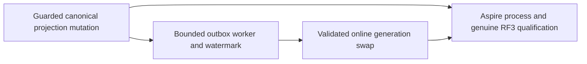

# ADR-089: Canonical guarded vector projection lineage

Status: Accepted; implementation and qualification pending.

An embedding job can finish after its input changes or its permissions are
revoked. Bind its output to the actual source event and document revision and
persist lineage with the vector in one canonical transaction. Validate current
source visibility/field policy at apply and again when deriving search eligibility.
Reducer generation and dedup identity are explicit. Replay computes by default;
job/network side effects require separately authorized dispatch.

Unconditional vector overwrite, payload-only lineage and treating job ACK as
search-index freshness are rejected. Current principal-scoped native full-text
generations remain unchanged until their online outbox lifecycle is frozen.

Implementation contract: [EventProjectionLineage](../Features/Search/EventProjectionLineage.md),
REQ/AC-LINEAGE-001–005, original KL-097 and later KL-039; ADR-015/019/022/025/029/
030/078/081/082. Ordered stages, exact worker/root scope, tests, baseline,
migration/rollback, native data and public/RF3 integration are frozen there.
This ADR becomes Implemented only after all required artifacts and evidence.
The new private effect identity uses the stable integer `DistanceMetric` value
as a key-codec-v1 scalar. Apply, eligibility and deletion use the identical key;
the existing key codec and prior persisted records do not change.

