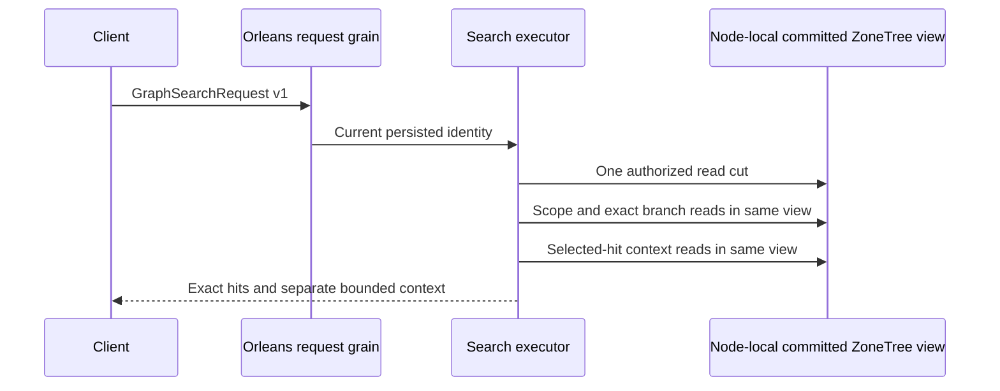

# ADR-090: Same-cut graph scope, retrieval and expansion

Status: Accepted for staged implementation, not Implemented.
Date: 2026-10-04. Owner: root integration; coding: Luna lifecycle_wave.

Architecture sections26.2–26.4 require three distinct graph roles rather than
using an independent traversal result as an unqualified search filter. Public
Traverse opens its own storage cut, so composing it with Search would mix policy
and data revisions. The existing atomic partition and node-local ZoneTree owner
remain authoritative while Orleans isolates and routes each request.

Decision: implement the explicit v1 records, narrow internal borrowed-view Core
reachability bridge and exact Query fusion/output contract in
[GraphRetrieval](../Features/Search/GraphRetrieval.md). It maps
REQ-GSEARCH-001..006 to AC-GSEARCH-001..006 and KL-055/056. Do not retain decoded
intermediate JSON or edge payloads, use an independent read gate, cross partitions,
silently truncate a graph, or substitute ANN for an exact branch. A shared budget
charges all roots/operators; shortest-hop identity deduplication prevents cycles
and multiple paths from multiplying contributions.
Label filtering requires the persisted graph field policy at canonical `/label`,
including empty label filters; a plain `label` name cannot bypass that policy.

Implementation contract:

1. Root approves REQ/AC, stable native v1 aliases/IDs, endpoint and admission.
   Abstractions/Features/Search/Contracts owns the new graph AST/reply records.
2. Core/Features/GraphTraversal/Queries and Execution own same-cut BFS and
   persisted visibility. Root adds Core's Query friend assembly declaration.
   lifecycle_wave adds only the graph bridge/helpers, avoiding vector write and
   projection lineage ownership of query_wave.
3. Query/Features/Search owns shared exact rank/projection helpers and the graph
   executor. lifecycle_wave preserves current Search and F1 behavior during
   private-method extraction. Server/Search, Client/Search and Orleans/Search
   transport adapters are root's exclusive integration scope; shared MCP/read
   kinds and composition are root-owned.
4. UnitTests/Features/Search owns the six mapped operator/oracle/authorization/
   expansion/budget test families. Root performs combined source review and
   serialized Release build, formatter and actual Aspire-owned test entry.
5. G2 implements SQL equivalence and actual .NET/official MCP RF3 fault cases
   before complete task closure. Keep Linux source/run/job/artifact evidence;
   build or development subset success is not whole-task qualification.
   Its frozen Q1.Search.v1 statement grammar, dedicated SqlGraphSearchRequest,
   exact lowering, rejection/parameter rules and same-executor ownership are in
   GraphRetrieval's G2 contract. Root owns wire admission and public adapters;
   lifecycle_wave owns the bounded QueryExecution parser, manifest profile and
   mapped real-store lowering/parity tests. Scalar QueryPage stays unchanged.

6. G3 strengthens the existing same-partition KL-056 path using deliberately
   conflicting text/vector/graph branch ranks, a separately computed weighted
   RRF oracle, current authorization, and actual direct/SQL .NET/MCP RF3 parity.
   The exact frozen corpus/test ownership and private patch join are in
   GraphRetrieval's G3 section. This adds qualification for existing contracts,
   not a second executor or global distributed rank claim.

No persisted data conversion, dependency change or physical placement change
is involved. Nodes lacking the application capability
cannot accept this request. Rollback removes endpoint admission and fails
unsupported operators explicitly while retaining committed stores. Integration
requires all coding artifacts, root review and successful mapped tests; final
task closure additionally requires G2 and original acceptance evidence. Graph
expansion declares SelectedHits completeness, while graph scope/branches are
complete only within their explicit same-partition traversal contract.

## TASK-GSEARCH-RF3-LEADER-READINESS-001 — authoritative survivor read before one immutable write

REQ/AC-GSEARCH-006 under ADR090 preserves actual leader-loss committed-graph durability. Original Linux run37655841124 0c2f RF3 failed177/180: this case21.2319229s fails at AddReachableDocumentAsync CommitAsync, after status-only quorum wait and before read/restart. Original TRX reports OwnershipLost but not its safe detail/native server origin; retain that limitation. Source confirms NodeStatus.RoutingReady means HasCompatibleCohort and Leader means consensus LeaderId, not ready-leader read/commit authority. Therefore status agreement alone is insufficient write oracle. Do not assert unobserved original server cause.

Before scoped kill, freeze exactly one immutable addition CommandRequest (delta document plus second-seed→delta edge). Under original caller deadline, wait survivor status agreement and select that actual surviving elected leader, not an arbitrary survivor. Require genuine public administrative GetDocument read of original second-seed, exercising native authoritative read barrier/current persisted policy/catalog. A readiness probe may remain pending only for exact OwnershipLost with ReplicaProtocol.NoLeader safe detail; other errors, authorization/catalog denials and cancellation fail immediately. Assert original literal document/entity/revision/redaction, then original literal three-hit authorized graph. No write is retried to establish readiness.

Submit frozen addition once. Definitive OwnershipLost and every other non-Unknown error fail; only actual UnknownWriteOutcome permits one bounded same-byte/same-ID receipt reconciliation, no loop/new GUID/client retry policy. Verify exact two mutation receipts, nonempty partition/incarnation/position and QuorumProcessDurable. Explicit later SDK/official-MCP administrative replay uses identical original command and requires byte-identical complete receipt. Genuine graph-search readers/MCP preserve full literal four document references/revisions/JSON/redaction/weighted ranks, and a bounded native canonical Traverse from original second seed returns exact four vertices/three full literal edge records. After original stopped node restart, all three nodes replay original receipt and return those complete graph literals without duplicate edge revision or derived document effect.

Ownership IntegrationTests/Search existing fixture/kill/restart/discovered clients and original error-preserving cleanup. No product/dependency/public contract/timeouts/whitelists/LocalImage catalog changes. Ordered docs→private tests→root guarded join/build/focused native original case/full180cohort; preserve original TRX/error and source/image receipts. Actual Linux rerun remains required; source repair is not qualification. Rollback removes only this readiness/oracle amendment and test helpers.

## Adapter implementation contract — TASK-KL051-VECTOR-LINQ-ATTACHMENT-001

REQ-KL051-VECTOR-001 / AC-KL051-VECTOR-001 and REQ-QUERY-007 under ADR-090:
`KeyLoadQuery<T>.Take(limit).AttachVector(field, vector, space, scope)` translates
only the existing non-evaluating member path and constructs the same canonical
GraphSearchRequest v1 consumed by GraphSearchAsync. The vector is an immutable
attachment bounded by existing MaximumConstantArrayItems; scope is explicit
bounded native GraphScope. No new planner, result materialization, wire model,
trusted caller role or query dispatcher. Scalar Where/order/project/Explain
state is rejected UnsupportedCapability rather than silently omitted. Take is
preserved as the canonical search limit. Server validation remains responsible
for finite values, dimension/profile, current persisted policy, scoped read cut,
shared budget and cancellation. Named SQL, builder request, typed/JSON requests
must return complete independent literal ranks and errors; SQL's existing
parser detail remains distinct from native typed validation detail. Real
ZoneTree wrong dimension/unsupported/overattachment/denied-principal operations
must preserve complete store and position then produce the complete healthy
literal result. Root must execute native normal/scalar and official RF3 public
paths before original KL051 closure; authored source is not qualification.

Ordered join: freeze owning spec/ADR; Client QueryExecution builder/helper; native UnitTests wholeflows; root guarded integration/build/format/discovery/full suites/Linux RF3. Dependencies unchanged; rollback removes adapter API and tests without modifying stored data.

## TASK-KL051-VECTOR-SCALAR-STATE-002

REQ-KL051-VECTOR-001 / AC-KL051-VECTOR-001, REQ-QUERY-007 and ADR-090: supplement
the existing Order whole flow with three actual builder Where, custom projection
and Explain states. Construct each supported scalar state successfully before
AttachVector; require exact UnsupportedCapability and no lowered request, unchanged
native read diagnostics, complete canonical storage bytes and position. Then execute
the valid C# attachment through the real ZoneTree SearchEngine and retain the existing
independent full literal two-document ranks, revision, JSON, redaction, empty expansion
and equivalent SQL/typed/JSON results. Preserve the same complete storage and cut after
healthy continuation. No planner/public scope change. Authored cases require native
normal/scalar execution and existing public RF3 gates; source is not qualification.

R467 typed seed repair: VectorAttachmentDocument is instantiated as each actual committed document. Default absent vector attachment is omitted by WhenWritingDefault; member remains supported by the existing field translator. Independent literal full JSON equality is checked before native commit. Native vector records, document bytes/revisions, SQL/typed/JSON rank oracles remain unchanged. No dummy/public type/suppression.
