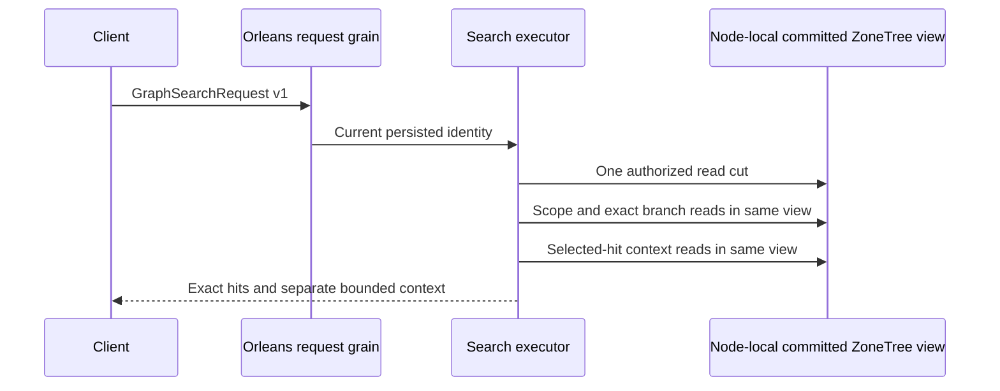

# ADR-090: Same-cut graph scope, retrieval and expansion

Status: Accepted for staged implementation, not Implemented.
Date: 2026-10-04. Owner: root integration; coding: Luna lifecycle_wave.

Architecture sections26.2–26.4 require three distinct graph roles rather than
using an independent traversal result as an unqualified search filter. Public
Traverse opens its own storage cut, so composing it with Search would mix policy
and data revisions. The existing atomic partition and node-local ZoneTree owner
remain authoritative while Orleans isolates and routes each request.

Decision: implement the explicit v1 records, narrow internal borrowed-view Core
reachability bridge and exact Query fusion/output contract in
[GraphRetrieval](../Features/Search/GraphRetrieval.md). It maps
REQ-GSEARCH-001..006 to AC-GSEARCH-001..006 and KL-055/056. Do not retain decoded
intermediate JSON or edge payloads, use an independent read gate, cross partitions,
silently truncate a graph, or substitute ANN for an exact branch. A shared budget
charges all roots/operators; shortest-hop identity deduplication prevents cycles
and multiple paths from multiplying contributions.

Implementation contract:

1. Root approves REQ/AC, stable native v1 aliases/IDs, endpoint and admission.
   Abstractions/Features/Search/Contracts owns the new graph AST/reply records.
2. Core/Features/GraphTraversal/Queries and Execution own same-cut BFS and
   persisted visibility. Root adds Core's Query friend assembly declaration.
   lifecycle_wave adds only the graph bridge/helpers, avoiding vector write and
   projection lineage ownership of query_wave.
3. Query/Features/Search owns shared exact rank/projection helpers and the graph
   executor. lifecycle_wave preserves current Search and F1 behavior during
   private-method extraction. Server/Search, Client/Search and Orleans/Search
   transport adapters are root's exclusive integration scope; shared MCP/read
   kinds and composition are root-owned.
4. UnitTests/Features/Search owns the six mapped operator/oracle/authorization/
   expansion/budget test families. Root performs combined source review and
   serialized Release build, formatter and actual Aspire-owned test entry.
5. G2 implements SQL equivalence and actual .NET/official MCP RF3 fault cases
   before complete task closure. Keep Linux source/run/job/artifact evidence;
   build or development subset success is not whole-task qualification.

No persisted data converter, automatic store migration, dependency change or
physical placement change is involved. Nodes lacking the application capability
cannot accept this request. Rollback removes endpoint admission and fails
unsupported operators explicitly while retaining committed stores. Integration
requires all coding artifacts, root review and successful mapped tests; final
task closure additionally requires G2 and original acceptance evidence. Graph
expansion declares SelectedHits completeness, while graph scope/branches are
complete only within their explicit same-partition traversal contract.

