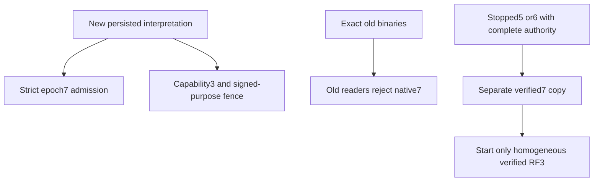

# ADR-091: epoch7 interpretation fence

Status: Accepted, 2026-10-04. Owner: root integration; implementation worker:
Luna query_wave. Related tasks KL-043/019/094/097/100 and
[REQ/AC-EPOCH7-001 through006](../Features/StorageRecovery/Epoch7.md).

New canonical transfer, saga and projection-lineage records must never be read
by an engine that can ignore their interpretation. RPC fencing alone cannot
prevent offline rollback from exposing protected derived vectors. Increment the
strict data epoch to7 and native checkpoint to5; admit exactly the new serving
format. Preserve stable native contract aliases/IDs and WAL4 framing.

Choose one explicit stopped-copy converter with exact migration-only native5
and native6 profiles and a native7 writer. This preserves the existing source5
acceptance obligations without retaining an obsolete serving path or writer.
Reject automatic migration and in-place header changes because they cannot
prove full-node/current-image authority or preserve an independent rollback copy.

The feature specification is the canonical implementation contract: ordered
stages, exact role-folder ownership, root protocol/AppHost join points, source
inventory/receipt revision, immutable prior5/prior6 tests, bounded crash/retry
verification and all-stopped RF3 rollout/rollback. No live conversion is executed
without explicit scope for the particular user stores. Implementation remains
Accepted until mapped real process, SDK/MCP RF3 and exact-source Linux evidence
exists. Missing probe artifacts fail the gate and must not skip tests.

