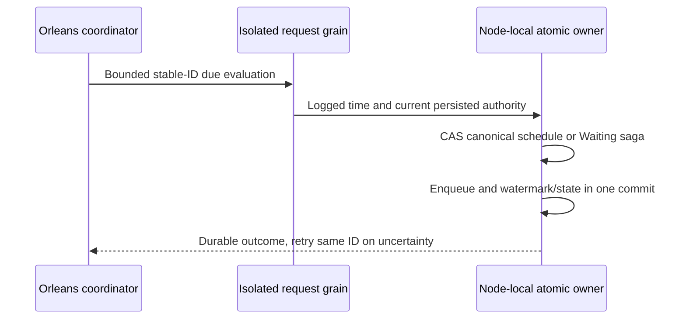

# ADR-092: Logged-time recurring occurrences and saga timeout CAS

Status: Accepted for S1; implementation and qualification pending.
Date: 2026-10-04. Integration owner: root. Coding owner: Luna cluster_wave.

Existing NotBefore and per-delivery inboxes implement delayed messages and handler
deduplication; they do not establish recurring schedules or multi-step saga state.
Architecture KL-100 requires versioned timing, stable OccurrenceId and explicit
cancel/timeout races. Use the existing Orleans-routed, node-local ordered atomic
gate and logged ReplicatedOperation.EvaluatedAt as the sole durable decision time.

Decision: the precise UTC fixed-interval CatchUp profile, generated contracts,
identity formulas, finite retention, persisted creator/caller authority and saga
transition graph in [RecurringSaga](../Features/Messaging/RecurringSaga.md),
REQ-JOBS-001..005/AC-JOBS-001..005. A timer is a repeated request to evaluate
canonical due state, never durability authority. Bound catch-up32 and preserve
backlog. Compare-exchange resolves timeout/completion/cancel before an atomic
timeout enqueue; no general workflow-engine behavior is inferred.

Implementation contract and join points:

1. Root freezes v1 DTOs/aliases/Ids, next unused SchedulerManage capability,
   discriminator/structure/apply/replay and HTTP/SDK/official MCP joins.
2. cluster_wave owns NEW Abstractions/Features/Messaging/Contracts and Core
   Features/Messaging Commands/Storage/Execution/Queries role files plus mapped
   UnitTests/Features/Messaging. Existing transfer F1 remains frozen; helpers may
   call the established private Enqueue through a narrow DatabaseEngine partial.
3. S1 writes canonical native state and enqueue in one transaction and authors
   independent recurrence/CAS/restart/auth/quota tests. Root reviews the combined
   source, serialized Release build and formatter, then actual Aspire test entry.
4. S2 separately freezes a bounded Orleans native-CQRS coordinator and due-index
   fairness/recovery contract, builds real process and genuine RF3 SDK/MCP fault
   fixtures, and completes original acceptance before task closure.

Dependencies: existing queue readiness/inbox and KL-090/092/094. The feature
uses the current persisted record contract and explicit capability admission.
Rollback pauses scheduling and retains watermarks/saga/queue data; it never
decrements/reuses a generation or replays external actions. Unsupported
timezone/calendar profiles fail explicitly. A scoped development pass or commit
does not establish Linux/RF3/endurance/performance qualification.

