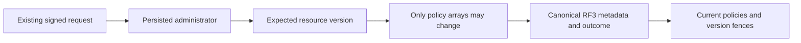

# ADR-093: Compare-and-set resource field policies

Status: Accepted for implementation; qualification pending.

Vector projection lineage and graph label authorization require current resource
classifications, but ConfigureResource previously rejected every changed
definition. A raw-store rewrite in a test would conceal this missing public flow.

Decision: extend the existing authorized canonical ConfigureResource request with
an optional expected schema version and admit only field/header policy changes,
with an exact version increment. Physical shape, indexes, authority, quotas,
paused state and typed schema remain immutable through this request. Full
resource migrations remain explicit separate work. Blind replacement and a
second policy store are rejected.

Implementation contract: [ResourcePolicyUpdates](../Features/Authorization/ResourcePolicyUpdates.md),
REQ/AC-RPOL-001–004 and AC-LINEAGE-004. Its ordered stages, exact root/Luna file
ownership, native ID3 compatibility, current-version fences, tests, rollback,
baseline and join conditions are mandatory. Persist through the existing RF3
metadata apply gate and deduplicated outcome; no new dependency or data epoch.
This ADR becomes Implemented only with all mapped implementation and evidence.

