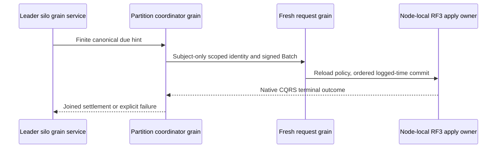

# ADR-094: Orleans coordination of canonical recurring and saga due work

Status: Accepted for S2 implementation; qualification pending.
Date:2026-10-04. Integration owner:root. Coding owner:Luna cluster_wave.

KL-100's S1 commands persist schedules and Waiting sagas but have no autonomous
runtime. Adopt the exact bounded discovery, native service/coordinator/request
chain, retry and lifecycle contract in
[DueCoordination](../Features/Messaging/DueCoordination.md), REQ/AC-DUE-001..004
and REQ/AC-JOBS-005. Existing canonical records and RF3 atomic transitions remain
the authority; a disposable fixed-tail sweep avoids a new durable due-index
format and prevents continuously arriving keys from extending a sweep forever.

Implementation contract:

1. Root freezes this specification and narrowly rehomes the existing native
   identity scope/admission to Orleans ClusterRouting/Identity, preserving exact
   claims, limits, RequestContext restoration and stable serializer identities.
2. cluster_wave owns NEW Core Features/Messaging Queries/Models/Validation and
   Orleans Features/Messaging GrainServices/Grains/Contracts/Execution, plus new
   Messaging UnitTests Cases/Helpers/Assertions/Models. Native records retain
   unchanged aliases/IDs. New transferred hint DTOs have explicit v1 aliases and
   stable generated IDs; no persisted or public S1 discriminator changes.
3. Root alone adds Core internal visibility, Server silo DI, AddGrainService and
   native Graph transitions. All writes use a separate signed IRequestGrain and
   the existing bounded ManagedCode Communication CQRS consumer. No direct Apply,
   synthetic privileged scheduler principal, copied dispatcher or hosted timer
   outside Orleans is allowed.
   The actual service-source DSL gap in the owning Graph package is repaired and
   published under [GrainServiceGraph](../Features/ClusterRouting/GrainServiceGraph.md),
   REQ/AC-SGRAPH-001..003, before the consumer package/runtime join. Coordinator
   client entry, AllowAll and fabricated native Graph context are prohibited.
4. Tests cover finite sweep/cursor/byte/deadline/corruption/cancellation bounds,
   current creator authority and stable unknown-response retry. Actual Aspire
   RF3 SDK/official MCP tests must observe autonomous emission/expiry, duplicates,
   leader loss/restart, revocation, cancellation and healthy following calls.
   Existing S1 process cut tests remain mandatory and prove only process durability.
5. Root integrates, reviews, builds/formats/governance-checks, runs Aspire suites,
   commits each completed stage and retains exact-source Linux original artifacts
   before full KL-100 closure. Scoped tests and code presence do not close S2.

Dependencies:ADR-092, existing queue admission, native request/identity boundaries,
epoch7 reader admission, original quorum/leader/read-cut contracts. Rollout uses
homogeneous capable readers; rollback stops due coordination while retaining all
watermarks, outcomes, queues and saga state. No automatic data migration occurs.
Failed pages/jobs remain observable with safe structured errors; no raw retained
templates, credentials or subject/entity identities are logged.

Accepted TASK-DUE-FRESH-ATTEMPT repair,2026-10-05: a coordinator dispatch chooses
one fresh command GUID after canonical barrier/creator reload, retaining it
across its one unknown-result retry. Later sweeps get fresh IDs; the old internal
v1 hint-to-command hash and obsolete hash-only test are removed. This fixes the
original durable-denial replay trap without changing command outcome caching,
canonical occurrence IDs, monotonic schedule state, saga revision CAS, serializer
aliases/Ids, reader epochs or stored data. Exact scope, regression oracles, agent
roles, ordered integration, rollout and remaining RF3 gates are in the accepted
DueCoordination implementation contract. A caller retry of an actual existing
command ID still replays that original terminal receipt. No automatic migration
or reconstruction of historical command IDs is performed.
