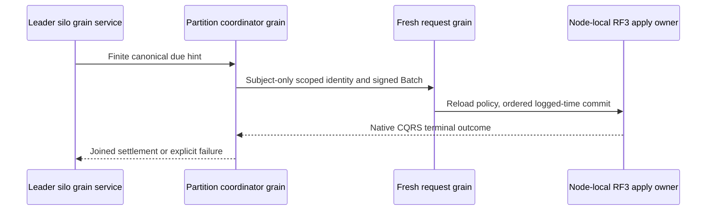
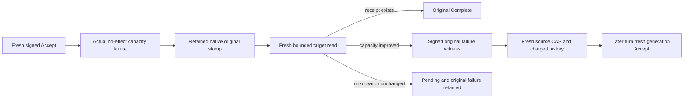

# ADR-094: Orleans coordination of canonical recurring and saga due work

Status: Accepted for S2 implementation; qualification pending.
Date:2026-10-04. Integration owner:root. Coding owner:Luna cluster_wave.

KL-100's S1 commands persist schedules and Waiting sagas but have no autonomous
runtime. Adopt the exact bounded discovery, native service/coordinator/request
chain, retry and lifecycle contract in
[DueCoordination](../Features/Messaging/DueCoordination.md), REQ/AC-DUE-001..004
and REQ/AC-JOBS-005. Existing canonical records and RF3 atomic transitions remain
the authority; a disposable fixed-tail sweep avoids a new durable due-index
format and prevents continuously arriving keys from extending a sweep forever.

Implementation contract:

1. Root freezes this specification and narrowly rehomes the existing native
   identity scope/admission to Orleans ClusterRouting/Identity, preserving exact
   claims, limits, RequestContext restoration and stable serializer identities.
2. cluster_wave owns NEW Core Features/Messaging Queries/Models/Validation and
   Orleans Features/Messaging GrainServices/Grains/Contracts/Execution, plus new
   Messaging UnitTests Cases/Helpers/Assertions/Models. Native records retain
   unchanged aliases/IDs. New transferred hint DTOs have explicit v1 aliases and
   stable generated IDs; no persisted or public S1 discriminator changes.
3. Root alone adds Core internal visibility, Server silo DI, AddGrainService and
   native Graph transitions. All writes use a separate signed IRequestGrain and
   the existing bounded ManagedCode Communication CQRS consumer. No direct Apply,
   synthetic privileged scheduler principal, copied dispatcher or hosted timer
   outside Orleans is allowed.
   The actual service-source DSL gap in the owning Graph package is repaired and
   published under [GrainServiceGraph](../Features/ClusterRouting/GrainServiceGraph.md),
   REQ/AC-SGRAPH-001..003, before the consumer package/runtime join. Coordinator
   client entry, AllowAll and fabricated native Graph context are prohibited.
4. Tests cover finite sweep/cursor/byte/deadline/corruption/cancellation bounds,
   current creator authority and stable unknown-response retry. Actual Aspire
   RF3 SDK/official MCP tests must observe autonomous emission/expiry, duplicates,
   leader loss/restart, revocation, cancellation and healthy following calls.
   Existing S1 process cut tests remain mandatory and prove only process durability.
5. Root integrates, reviews, builds/formats/governance-checks, runs Aspire suites,
   commits each completed stage and retains exact-source Linux original artifacts
   before full KL-100 closure. Scoped tests and code presence do not close S2.

Dependencies:ADR-092, existing queue admission, native request/identity boundaries,
and the original quorum/leader/read-cut contracts. Rollback stops due
coordination while retaining all watermarks, outcomes, queues and saga state.
Failed pages/jobs remain observable with safe structured errors; no raw retained
templates, credentials or subject/entity identities are logged.

## Command identity and retry

Each dispatch chooses one fresh command GUID after the canonical barrier and
creator-authority reload, and retains it across its single unknown-result retry.
Later sweeps use fresh IDs. A caller retry of an existing command ID replays its
original terminal receipt. Canonical occurrence IDs, monotonic schedule state,
saga revision CAS and serializer aliases/IDs remain stable. Actual Aspire RF3 and
exact-source Linux gates remain required for S2 qualification.

TASK-DUE-RF3-CREATOR-CALLERS is accepted before fixture implementation under
REQ/AC-DUE-003 and the linked DueCoordination contract. Actual R196 fails its
first post-replacement schedule inspection with PermissionDenied because the
fixture dropped its scoped creator and used the cluster administrator for data.
The production no-administrator-bypass rule remains unchanged. The feature
freezes exact credential ownership, redacted object text, persisted lane-level
QueueConsume needed by existing ACK assertions, separate admin control callers
and the seven permitted Messaging fixture paths. Order: freeze, Luna guarded
private correction, root review/join, build/format and genuine Aspire RF3
leader-loss/rejoin/cold-restart/ACK plus no-quorum regression, original Linux
source-bound delivery. Preserve all assertions/deadlines/signed controls and
joined cleanup. Rollback changes only fixture credentials/ownership; broad DUE
acceptance and no production qualification claim remain unchanged.

TASK-DUE-RF3-CREATOR-CALLERS includes the distinct current QueueAck capability
for the already-required SDK receive/official-MCP ACK flow on the same three
scoped queues. R204 reached final ACK after its cold-restart/outcome assertions
and correctly received PermissionDenied without that grant. Root changes only
the existing fixture Scope expression, retains full token/receipt/exhaustion
assertions and reruns the actual owned native RF3 case; no authorization bypass
or product capability change is permitted.

R206's actual native TUnit/Aspire Docker RF3 leader/rejoin/cold-restart case
passed with real SDK/MCP consumption and final ACK; the source/assembly-bound
TRX identity and local qualification limits are recorded in DueCoordination.
Current full Linux RF3 and no-quorum evidence remain required separately.

## TASK-KL092-QUEUE-DEADLINE-NATIVE-001 — scoped canonical due advancement

REQ-MSG-004 / AC-MSG-004 and ADR-028/094: the approved additive `AdvanceQueueDeadline` Batch mutation uses QueueConsume, fresh persisted worker input permissions, the existing original native signed EvaluatedAt and exact state/version/lease/deadline/index CAS. Fields Id0..6 and alias `keyload.mutation.advance-queue-deadline.v1` are frozen; JSON discriminator `kind` is `advanceQueueDeadline`; the `Kind` value uses the distinct JSON property `deadlineKind`, preserving Orleans Id6 and the enum contract; kinds PromoteScheduled0/ExpireLease1/ExpireMessage2. This mutation is direct Batch only. Nested processing/inbox/projection effects cannot use it. It never creates a lease, trusts a business timestamp as current time, or creates a scheduler principal.

The nullable host-selected QueueDeadlinePrincipalId names an EXISTING persisted principal; null is unavailable, malformed/empty selection is invalid, revoked/expired/missing permission is refused. Native Principal reads actual persisted identity; Authorization.Require ties its grants to the full actual partition and queue, including tenant/database scope. Every dispatch and cached-result replay uses current permissions. Resource/dispatch pause prevents transitions. Existing Phase2 signed retry decisions and StrictPerKey order authority are preserved; a lease expiry uses the same actual operation, not a generated retry time.

Discovery remains read-only over canonical scheduled/lease/message-meta records with central original record/byte/deadline budgets, fixed upper tails and incarnation/read-generation resets. It retains only bounded metadata hints and charges all native visited bytes, point reads and lookahead; no queue bodies, credentials or second registry. The existing per-silo service alternates its ordinary recurring/saga branch with the queue branch, preserves leader/quorum checks and joins the original task/token/deadline. Stable partition coordinator dispatch uses the existing ConnectionGrain/CQRS identity path. Null selection gives no autonomous success.

Implementation is private source-only pending full Unit/process/public SDK/official MCP/Q1/RF3 cold/paused/revoke/restore/leader-loss gates. Physical lateness/drift qualification remains OPEN, distinct from peer transport ClockSkew. Existing KL092 finite19 original operation tests remain immutable; Phase2 lineage/counter composition requires exact explicit successor oracles, never silent source-based PASS.

### KL092 bounded metadata predecessor at the original minimum

When the original admitted MaximumRecordsPerPage is two, an indexed hint plus its genuine metadata point read and lookahead cannot fit. The read-only scanner skips those indexed prefixes and selects due schedule/lease/lifetime hints from the same existing canonical metadata prefix, charging each record/value/lookahead and fixed upper-tail acquisition. This is selection only: the actual signed Batch effect independently requires its original scheduled/lease index and exact state/version/deadline CAS. Ordinary larger pages retain all three prefixes. No new registry, count exemption, copied body, limit change, or source-based qualification.

## REQ-MSG-092-DEADLINE / AC-MSG-092-DEADLINE — actual canonical pending advancement

The existing per-silo owner may select canonical pending scheduled/lease/lifetime metadata under the original leader/quorum/fixed-tail/count/byte/cancellation budgets. Every effect is the additive direct Batch AdvanceQueueDeadline with actual fresh scoped QueueConsume and worker-input permissions, exact retained state/version/lease/deadline/index CAS, actual native signed EvaluatedAt, and original transactional counter/body/order semantics. Null host subject is explicit unavailable; configuration never grants roles. No effect is credited merely from a discovery hint or marker.

AC-MSG-092-DEADLINE requires the actual not-due Conflict, stale RevisionConflict, paused DispatchPaused and revoked/current-policy refusal to retain complete message bodies/metadata/index/counters; exact original successful receipt replay must survive two owned cold opens and fresh healthy work. Native full-jitter lease expiry additionally retains actual signed native retry choice, cold receipt, stale original token refusal, inclusive scheduled promotion and healthy work. Process cuts use the existing MessagingCrashTrial ninety-second original lifetime/thirty-second cleanup, actual thirty-second BUSINESS ExpiresAt, native System remaining absolute wait, same sealed operation and original commit boundaries; no trusted client clock, retry or new process deadline.

The public autonomous case owns the original three-resource Aspire RF3 fixture. It configures only the approved existing-principal selection, creates that persisted scoped principal through actual administrator SDK, pauses before cold/due, refuses the original condition through SDK/MCP/both Q1 routes, revokes the selected subject before unpause, restores its actual epoch, and requires canonical Ready BEFORE any Receive that could otherwise advance due state. Complete independently literal inspection/claim/ACK receipts and future sibling survive the second original-volume restart; fresh healthy producer/official claim continues. Caller SDK/MCP sessions close before each original cold resource stop; every actual primary and cleanup failure remains in the shared ledger.

Automated source identities: QueueDeadlineNativeWholeFlowTests.ActualDeadlineCasRefusesNotDueStaleAndRevokedThenAdvancesReplaysAcrossTwoColdOwnersAndHealthyWork (typed PromoteScheduled/ExpireLease/ExpireMessage); QueueDeadlineNativeWholeFlowTests.ActualSignedLeaseRetryDeadlineRetainsChosenTimeAcrossColdFencesOldTokenThenPromotesAndHealthyWork; QueueDeadlineProcessRecoveryTests.ExpiredReadyDeadlineProcessCutRecoversWholeBodyCountersReceiptThenSameRootHealthy (five original CommitStage args); QueueDeadlineAutonomousRf3Tests.ExistingScopedPrincipalRevokeColdRefusesDueThenRestoresAutonomousReadyAndOfficialClaimReceiptColdHealthy. Lower-budget and canceled discovery run WITH the genuine native operation predecessor, not a getter-only test.

Qualification remains OPEN until root's current-source native build/discovery, normal/scalar Unit, real process and actual Linux Docker RF3 execute. Null-selected service operation qualification, queue-specific leadership/migration and physical drift/lateness remain explicit OPEN; old recurring/saga cases do not substitute these queue gates. No strict UID/count/status changes belong to this source packet.

### Current deadline JSON field binding

TASK-KL092-DEADLINE-JSON-DISCRIMINATOR-003 in DueCoordination records the actual R76 metadata collision and the current writer's explicit `deadlineKind` JSON payload property. Mutation's `kind=advanceQueueDeadline` discriminator, the C# transition member and native alias/Id0..6 are unchanged. The original complete schema/decode/native operation/process/RF3 oracles must execute after current-source build; no ignored input, compatibility reader or successful-test claim follows this source correction.

## TASK-KL092-QUEUE-DEADLINE-NATIVE-R2 — current Phase2 composition and complete catalog input

Preserve every original deadline65 owner and finite19 operation flow. Rebase the two retry owners from actual joined Phase2 identity import/formatter bytes, keeping native leader-selected signed retry decisions and deterministic apply unchanged. The original Batch must reach ApplyMutations through its actual ReplicatedOperation; current Receive/Delivery already carry their Phase2 operation and remain byte-preserved. Preserve all current CrashHost modes, including current-format checksum profile, and add the deadline mode once. Current Messaging and ADR028 appendages remain intact.

AC-MCP-001 also executes the actual canonical schema/typed native decode/public JSON full-value roundtrip with one independently authored AdvanceQueueDeadline input (Scheduled, positive state version, zero lease version, UTC deadline, PromoteScheduled). Append its discriminator alongside that real sample and update only the exact declared mutation union expectation35→36. This is schema source inventory, never a compiled/native discovery or PASS count. Alias and Id0..6, all old sample values, schemas and rejection/roundtrip assertions remain exact.

Original source bounds, authority, RF3, suite deadlines, ordinary50 and exclusive heavy ownership remain unchanged. No new product quota/policy/clock/family or transport. Native read-only preview is not compilation; original full normal/scalar/recovery/RF3/native source-image-census and final cleanup qualification remain OPEN. Root owns joined writes/checks.

## TASK-KL094-ACCEPT-CAPACITY-ATTEMPT-002 — finite native capacity repair

REQ-XFER-002/003/004/005 → AC-XFER-F2-001/002/003 → ADR-088/094/125. This source stage is the approved finite target Accept capacity retry boundary, not universal automatic transfer recovery. `DatabaseLimits.MaxQueueTransferAcceptAttempts` is nullable, native Id20, default null, centrally validated positive and <=MaxScanRecords. A newly created source intent reserves its immutable ceiling/generation1 and retained history; original intents with null state remain unchanged. Actual source history count and native serialized bytes stay charged under current MaxScanRecords/MaxBatchBytes. No GC, arbitrary retry, clock, default, role, timeout or capacity changes.

- REQ-XFER-F2-001 / AC-XFER-F2-001: only a genuine single Accept's ordinary no-effect ResourceExhausted from owning queue storage or transfer retention can retain nullable original authority in StoredOutcome Id9. Capture follows fresh original authorization/fences/clock and precedes actual Execute; original Reset remains authoritative. Unknown, early authorization errors, unclassified/transitive failures, success/replay have no eligible stamp. One charged same-native-view target read freshly validates the subject and original signed intent, successful receipt FIRST, original scoped outcome/stamp/native raw-byte digest/current dependency/owner cut. Directional capacity repair is required; no witness or Advance is produced by an unrelated commit/read cut.
- REQ-XFER-F2-002 / AC-XFER-F2-002: source authorized Batch `AdvanceQueueTransferAttempt` uses alias `keyload.queue-transfer.advance-attempt.v1`, discriminator `advanceQueueTransferAttempt`, derived Id0 SourceQueue/1 TransferId/2 ExpectedGeneration/3 FailureWitness. Source verifies the actual target signature and exact immutable intent/accept tuple; one same-transaction CAS appends one history reference, increments generation, charges one record plus exact native bytes. Ceiling/current limits, history/signatures and stale generation refuse without business effects. Original successful target receipt always wins; no ACKed target is recreated. New private read QueueTransferCoordination=72 follows actual live0..68 and separately reserved Streams69..71, with no dummy members or renumbering.
- REQ-XFER-F2-003 / AC-XFER-F2-003: generation1 Accept and every Complete retain exact F1 IDs. New Accept changes only source-committed generation. Advance ID derives from immutable tuple, expected generation and authenticated ORIGINAL outcome digest; refreshed witness/native read position never creates new IDs. A failed source Advance keeps that same ID and requires explicit authorized public operator repair. The existing serialized service dispatches at most one Advance per turn; a later turn rereads source state before a new Accept. No recursive loop, dispatcher, new activation or service-created principal.

Automated source bindings: Unit `RemoteTransferAttemptColdTests.GenuineTargetCapacityFailureRequiresRepairBeforeBoundedAttemptAndTwoColdReceiptReplays` uses actual native queue filling, failed original Apply, unchanged refusal, original raw StoredOutcome bytes, unknown/malformed/stale no-effects, genuine ACK repair, source CAS, new Accept/Complete, ACK with no resurrection and two real same-root reopen cuts. RF3 `RemoteTransferAttemptRf3Tests.GenuineCapacityRepairUsesBoundedCommittedAttemptOrOriginalManualRepairAcrossTwoColdCuts(int ceiling)` has typed arguments1/2: the one-attempt case requires the existing fresh operator Accept; the two-attempt case must reconcile the exact generation2 native receipt. Both use actual Aspire Docker resources, original SDK/official MCP/both Q1, exact persisted subject, full literal message/source/receipt assertions and two same-volume cold process cuts. Existing native cases/Args and ordinary50 slots remain unchanged.

This stage is PRIVATE SOURCE ONLY until root join/build and original Linux discovery/runtime. Mandatory native normal/scalar/full recovery/Docker RF3 gates remain open; UID/count contracts unchanged. Separate precise source-Advance/target-receipt unknown-at-commit crash cuts, independently placed physical groups, full negative boundary matrix, automatic Complete/policy/auth failures and AC-XFER-005 overall remain OPEN. No primitive or full SQL/protocol qualification is inferred from this finite stage.

Ordered ownership: Core Messaging owns stamp/read/history/CAS helpers; shared AtomicCommandCommit and generated native StoredOutcome append only9; Abstractions owns mutation/config append only; existing Orleans service/connection-native CQRS reuses fresh scope and joined lifetimes; test fixture only passes the explicit validated attempts selection to its original resources. Rollback disables optional advancement; retained generation/history/outcomes must remain validated and cannot be silently erased. Root composes actual DeadlineR2/F1 and Streams ordinal ancestors, then runs native discovery and exact-source Linux. See the immutable exact field/alias freeze in the reviewed implementation contract; no copied codec or signing material is exposed.

## TASK-KL092-DEADLINE-R78-COMPLETE-FLOW-004

REQ-MSG-004, AC-MSG-004 and AC-MSG-092-DEADLINE retain the original cancellation, page-count/byte/deadline, authorization, atomic apply and recovery contracts. Check the existing DuePageState before entering the native store read and again before the minimum-page fast return. An already cancelled discovery must reject without touching message state, even when the indexed prefix cannot fit its original two-record page. No configured bound, cursor or clock changes.

The same complete native Unit flows keep their revoked/stale/not-due refusals, canonical message/index/counters and two cold receipt replays. Their healthy Receive explicitly admits the existing maximum of two known ready messages, so the original promoted head and newly enqueued healthy message are both actually claimed and acknowledged. It must retain the exact final ready sequence, attempts, lease/state revisions and empty counters. Compare the complete generated native MutationReceipt bytes, including composition references, rather than ImmutableArray backing identity; all original Kind/Resource/Id/Revision values and all five real process-cut arguments remain exact.

Owned files: Core Messaging Queries/QueueDeadlineDiscovery; Unit Messaging Helpers/QueueDeadlineNativeHealthy and QueueDeadlineNativeContinuation; Recovery Messaging Assertions/QueueDeadlineRecoveryAssertions. Existing original named full-operation tests are the regression oracles; no accessor/helper-only tests or deadline increases. Root integrates this finite repair and verifies native diagnostics, canonical format, coherent Release build, mapped normal/scalar Unit and genuine process recovery, then commits/pushes the complete authorized scope. Current Linux RF3, full-suite, coverage and whole KL092 acceptance stay open until their original delivered-source evidence exists.
