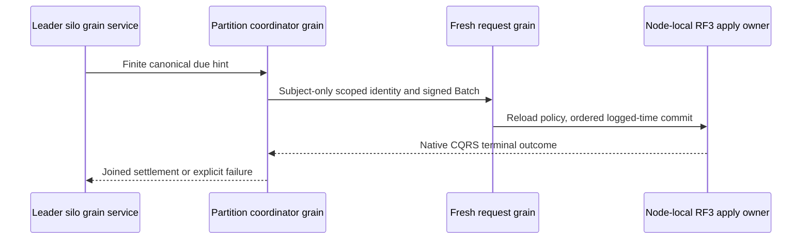

# ADR-094: Orleans coordination of canonical recurring and saga due work

Status: Accepted for S2 implementation; qualification pending.
Date:2026-10-04. Integration owner:root. Coding owner:Luna cluster_wave.

KL-100's S1 commands persist schedules and Waiting sagas but have no autonomous
runtime. Adopt the exact bounded discovery, native service/coordinator/request
chain, retry and lifecycle contract in
[DueCoordination](../Features/Messaging/DueCoordination.md), REQ/AC-DUE-001..004
and REQ/AC-JOBS-005. Existing canonical records and RF3 atomic transitions remain
the authority; a disposable fixed-tail sweep avoids a new durable due-index
format and prevents continuously arriving keys from extending a sweep forever.

Implementation contract:

1. Root freezes this specification and narrowly rehomes the existing native
   identity scope/admission to Orleans ClusterRouting/Identity, preserving exact
   claims, limits, RequestContext restoration and stable serializer identities.
2. cluster_wave owns NEW Core Features/Messaging Queries/Models/Validation and
   Orleans Features/Messaging GrainServices/Grains/Contracts/Execution, plus new
   Messaging UnitTests Cases/Helpers/Assertions/Models. Native records retain
   unchanged aliases/IDs. New transferred hint DTOs have explicit v1 aliases and
   stable generated IDs; no persisted or public S1 discriminator changes.
3. Root alone adds Core internal visibility, Server silo DI, AddGrainService and
   native Graph transitions. All writes use a separate signed IRequestGrain and
   the existing bounded ManagedCode Communication CQRS consumer. No direct Apply,
   synthetic privileged scheduler principal, copied dispatcher or hosted timer
   outside Orleans is allowed.
   The actual service-source DSL gap in the owning Graph package is repaired and
   published under [GrainServiceGraph](../Features/ClusterRouting/GrainServiceGraph.md),
   REQ/AC-SGRAPH-001..003, before the consumer package/runtime join. Coordinator
   client entry, AllowAll and fabricated native Graph context are prohibited.
4. Tests cover finite sweep/cursor/byte/deadline/corruption/cancellation bounds,
   current creator authority and stable unknown-response retry. Actual Aspire
   RF3 SDK/official MCP tests must observe autonomous emission/expiry, duplicates,
   leader loss/restart, revocation, cancellation and healthy following calls.
   Existing S1 process cut tests remain mandatory and prove only process durability.
5. Root integrates, reviews, builds/formats/governance-checks, runs Aspire suites,
   commits each completed stage and retains exact-source Linux original artifacts
   before full KL-100 closure. Scoped tests and code presence do not close S2.

Dependencies:ADR-092, existing queue admission, native request/identity boundaries,
and the original quorum/leader/read-cut contracts. Rollback stops due
coordination while retaining all watermarks, outcomes, queues and saga state.
Failed pages/jobs remain observable with safe structured errors; no raw retained
templates, credentials or subject/entity identities are logged.

## Command identity and retry

Each dispatch chooses one fresh command GUID after the canonical barrier and
creator-authority reload, and retains it across its single unknown-result retry.
Later sweeps use fresh IDs. A caller retry of an existing command ID replays its
original terminal receipt. Canonical occurrence IDs, monotonic schedule state,
saga revision CAS and serializer aliases/IDs remain stable. Actual Aspire RF3 and
exact-source Linux gates remain required for S2 qualification.

TASK-DUE-RF3-CREATOR-CALLERS is accepted before fixture implementation under
REQ/AC-DUE-003 and the linked DueCoordination contract. Actual R196 fails its
first post-replacement schedule inspection with PermissionDenied because the
fixture dropped its scoped creator and used the cluster administrator for data.
The production no-administrator-bypass rule remains unchanged. The feature
freezes exact credential ownership, redacted object text, persisted lane-level
QueueConsume needed by existing ACK assertions, separate admin control callers
and the seven permitted Messaging fixture paths. Order: freeze, Luna guarded
private correction, root review/join, build/format and genuine Aspire RF3
leader-loss/rejoin/cold-restart/ACK plus no-quorum regression, original Linux
source-bound delivery. Preserve all assertions/deadlines/signed controls and
joined cleanup. Rollback changes only fixture credentials/ownership; broad DUE
acceptance and no production qualification claim remain unchanged.

TASK-DUE-RF3-CREATOR-CALLERS includes the distinct current QueueAck capability
for the already-required SDK receive/official-MCP ACK flow on the same three
scoped queues. R204 reached final ACK after its cold-restart/outcome assertions
and correctly received PermissionDenied without that grant. Root changes only
the existing fixture Scope expression, retains full token/receipt/exhaustion
assertions and reruns the actual owned native RF3 case; no authorization bypass
or product capability change is permitted.

R206's actual native TUnit/Aspire Docker RF3 leader/rejoin/cold-restart case
passed with real SDK/MCP consumption and final ACK; the source/assembly-bound
TRX identity and local qualification limits are recorded in DueCoordination.
Current full Linux RF3 and no-quorum evidence remain required separately.
