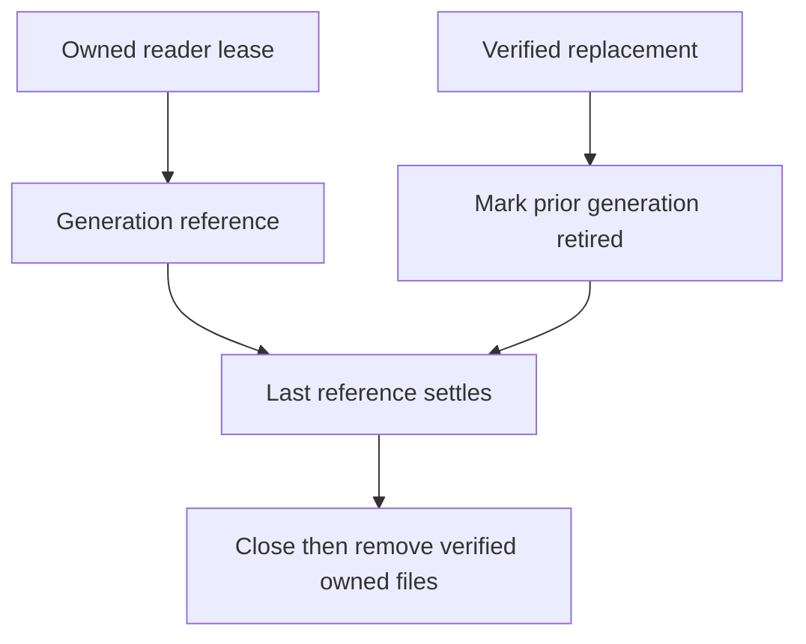

# ADR-095: Bounded native index generation leases and retirement

Status: Accepted for KL-039 L1; implementation and qualification pending.
Date:2026-10-04. Integration owner:root. Coding owner:Luna query_wave.

The current native manager holds one lifetime semaphore and immediately deletes
the previous generation on publication. It cannot preserve overlapping readers.
Adopt [OnlineGenerationLifetime](../Features/Search/OnlineGenerationLifetime.md),
REQ/AC-LEASE-001..004: finite generation/lease/build ownership, fully verified
publication, reference-counted retirement, retained cleanup failures and joined
shutdown. Preserve selected native provider, canonical scope validation and all
original physical budget/settlement gates.

Implementation contract: root freezes the interface-preserving manager contract;
query_wave owns Server Features/Search Storage/Lifecycle manager, lease and
settlement helpers, the existing generation capacity and restart retirement
preflight joins, and new independent real-native UnitTests. Keep1builder,
2leases,1retired/1current generation and3physical generations including staging
as upper bounds; actual provider safety may tighten concurrent readers. Root
reviews the private patch, integrates the actual production caller, runs serialized
Release/format/governance and Aspire unit/recovery/RF3, commits the completed stage
and retains exact-SHA Linux original results before qualification.

L2 still must atomically pin/capture a canonical base cut, build while canonical
writes proceed, replay ordered deltas, validate/cut over and recover catalog/pins.
Do not call L1 a completed online index. No public wire/canonical data epoch or
index manifest transition occurs. Rollback stops the node and reconstructs only
its disposable owned index; original canonical data remains authoritative.

