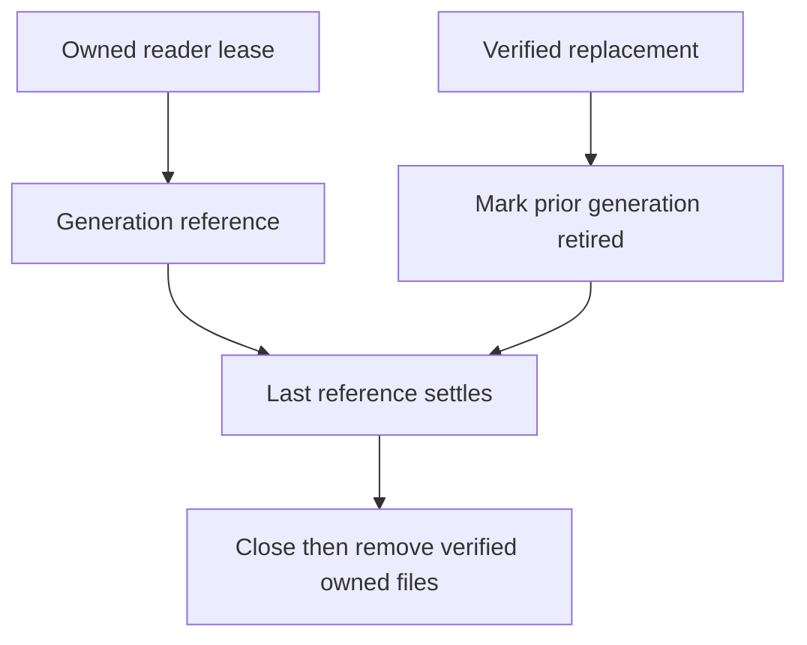

# ADR-095: Bounded native index generation leases and retirement

Status: Accepted for KL-039 L1; implementation and qualification pending.
Date:2026-10-04. Integration owner:root. Coding owner:Luna query_wave.

The current native manager holds one lifetime semaphore and immediately deletes
the previous generation on publication. It cannot preserve overlapping readers.
Adopt [OnlineGenerationLifetime](../Features/Search/OnlineGenerationLifetime.md),
REQ/AC-LEASE-001..004: finite generation/lease/build ownership, fully verified
publication, reference-counted retirement, retained cleanup failures and joined
shutdown. Preserve selected native provider, canonical scope validation and all
original physical budget/settlement gates.

Implementation contract: root freezes the interface-preserving manager contract;
query_wave owns Server Features/Search Storage/Lifecycle manager, lease and
settlement helpers, the existing generation capacity and restart retirement
preflight joins, and new independent real-native UnitTests. Keep1builder,
2leases,1retired/1current generation and3physical generations including staging
as upper bounds; actual provider safety may tighten concurrent readers. Root
reviews the private patch, integrates the actual production caller, runs serialized
Release/format/governance and Aspire unit/recovery/RF3, commits the completed stage
and retains exact-SHA Linux original results before qualification.

L2 still must atomically pin/capture a canonical base cut, build while canonical
writes proceed, replay ordered deltas, validate/cut over and recover catalog/pins.
Do not call L1 a completed online index. No public wire, canonical storage or index manifest transition occurs. Rollback stops the node and reconstructs only
its disposable owned index; original canonical data remains authoritative.

KL-039 L2-B proposed owner-review contract, 2026-10-09: adopt only after review
of REQ/AC-ONLINE-001..005 in OnlineGenerationLifetime. This appendix does not
mark implementation or authorize persisted catalog serialization. Ordered stages,
file/slice ownership, complete operation tests, rollback and root join points are
specified there. Exact internal provider composition, generated catalog
alias/fields/path/publication order and consumer/generation selection resolution
must be frozen before production seams. All original L1/L2-A bounds, deadlines,
provider, read pins, identity, persisted policy and retained failures remain.
Authentic Linux source/image/native discovery and complete Unit/Recovery/RF3
SDK/MCP/Q1 outcomes remain open.

Owner-selected KL-039 online operation contract, 2026-10-09: the appended
OnlineGenerationLifetime section reserves distinct OperationKind34, typed online
request/result aliases and IDs, native progress Id4, administrator + existing
consumer trust boundary and original CQRS ownership. Implicit Search and explicit
immutable Build/Restore semantics remain unchanged. Core internal copied-byte pin
and Server friend adapter are selected without public IAtomicStore change.
The exact proposed generated catalog/path/publication/restart contract and
original stable outcome retention must receive final root review before source
seams. No serializer fallback or migration is allowed. Root owns shared codec,
registration, movement/session reconciliation, guarded joins and actual Linux
Unit/Recovery/RF3 complete evidence. New online code must preserve existing
REQ/AC-LEASE/CUT and complete REQ/AC-ONLINE-001..005 together.

## KL-039 canonical online publication and restart contract (v5 owner review)

This complete contract supersedes v4's unresolved original-outcome/storage join and publication ordering. It is proposed source, not implemented, compiled, discovered or runtime qualified. Original REQ/AC-ONLINE-001–005 and every original KL039 acceptance predicate remain mandatory. Preserve explicit TextIndexSelectionV1, its single enrollment and immutable Build/Restore U; implicit Search performs no canonical maintenance effect or enrollment. Public MaintainOnlineTextIndex34 and private OnlineTextPublicationPhase35 are distinct from Batch0–MovePartition33. Ordinary50/heavy RF3 exclusive1, all original cancellation/deadlines/options/auth/RF3 and required full suites remain unchanged.

### Frozen native contracts and source ownership

Public SDK extension is MaintainOnlineTextIndexAsync returning Task<Result<OnlineTextIndexMaintenanceResult>>, using the original KeyLoadClient.Send write/commandId/cancellation path. Distinct route /v1/search/text/online/maintain and on-demand tool keyload_search_text_online_maintain bind public34's typed request/result. Q1 SDK and official MCP use CALL keyload_search_text_online_maintain(@arguments) through the existing SqlOperationRequest/catalog executor. No additional SQL grammar or full-SQL conformance claim. Register exact schemas/effect hints through the existing official server and persisted-authority gateway; do not enlarge initial discovery catalog. Preserve the v4 public request alias/IDs0–6, result alias/IDs0–7, phases0–5 and GrainRequestProgress nullable OnlineTextPhase Id4.

Append private GrainReadKind.OnlineTextMaintenance only after the exact joined ControlledBlob then SampleChunkWindow ancestry; preserve all existing ordinals and take the exact native predecessor, never infer a compiled UID. Private capability purpose is keyload-online-text-capability-v1; private35 command purpose is keyload-online-text-publication-verified-v1. Both are signed through the existing GrainRequestCodec/identity restoration path. Generic public command/read purposes reject these private identities. Public generic CreateNativeOperation must continue excluding35. The distinct internal Core factory alone invokes existing IssueNativeOperation after native prepared-candidate validation; VerifyOperationAuthority and coordinator.SubmitVerifiedAsync preserve exact native HMAC/incarnation/command/kind/principal/fingerprint/payload authority. Never reinterpret movement's purpose, grants, phases or owner context.

Core/Search internal generated OnlineTextPublicationPhaseCommand uses alias keyload.core.search.online-text-publication-phase.v1 and IDs0 Request(OnlineTextIndexMaintenanceRequest),1 Result(OnlineTextIndexMaintenanceResult),2 DataEpoch(int),3 Leaf(string),4 ManifestSha256(string),5 GenerationId(Guid),6 ExpectedCurrentCommandId(Guid?),7 SessionId(Guid). Its commandId is the original public request.CommandId. Fresh signed admission binds actual parent input/principal, original request expiry, native session, prepared generation and exact payload; caller supplied results, leaf names or metadata cannot create a native candidate. Session and prepared bytes are node-local, bounded and owned; the replicated payload is copied immutable native data. Core has no provider, Server or Query type dependency.

Append nullable StoredOutcome.OnlineTextAuthority at native Id8, preserving existing0–7. Internal generated OnlineTextOutcomeAuthority alias keyload.core.search.online-text-outcome-authority.v1 has IDs0 ParentFingerprint(string),1 Collection(string),2 Field(string),3 DataEpoch(int),4 Placement(PhysicalShardRecord),5 Leaf(string),6 ManifestSha256(string),7 GenerationId(Guid). The full immutable public original result remains StoredOutcome.Result, not the derived catalog. Parent fingerprint uses the exact existing normalized Id/Kind/PrincipalId/PayloadJson identity with public kind34. Phase35 retains its independent full native fingerprint. Capture authority for a validated private phase before execution; retain it with genuine persisted terminal outcomes, while changing the current pointer only on success. No projection-batch field, RuntimeJournal identity or existing outcome format is reinterpreted.

Core/Search generated OnlineTextCurrentPublication alias keyload.core.search.online-text-current-publication.v1 uses IDs0 FormatVersion(int,1),1 PrincipalId(string),2 CommandId(Guid),3 ParentFingerprint(string),4 Consumer(ProjectionConsumerRef),5 ConsumerGeneration(long),6 Authority(OnlineTextOutcomeAuthority),7 PublishedCut(TextIndexSourceCut). The new canonical online-text-current key family is explicitly registered as partition-owned metadata for the exact consumer partition/collection/field/generation, including native roster/snapshot/key validation. No caller document or user collection stores private control data. Existing canonical outcome retention owns historical original results; there is no unbounded per-command file history.

Orleans/Search generated OnlineTextCapabilityRequest alias keyload.orleans.search.online-text-capability-request.v1 has IDs0 SessionId(Guid),1 Request(OnlineTextIndexMaintenanceRequest),2 Kind(OnlineTextCapabilityKind),3 Page(ProjectionBatch?),4 CheckpointIntent(CommitProjectionBatchRequest?),5 Acknowledged(ProjectionBatchResult?). OnlineTextCapabilityKind is closed:0 ResolveOriginal,1 Capture,2 Seed,3 PreparePage,4 ApplyIntent,5 SettleCheckpoint,6 Validate,7 IssuePublication,8 ReconcileCommitted,9 Abort. Generated OnlineTextCapabilityResult alias keyload.orleans.search.online-text-capability-result.v1 has IDs0 SessionId(Guid),1 BaseCut(TextIndexSourceCut?),2 CurrentCut(TextIndexSourceCut?),3 ThroughSequence(long),4 TrackedRecords(int),5 IndexSha256(string?),6 OriginalResult(OnlineTextIndexMaintenanceResult?),7 IssuedPublication(ReplicatedOperation?),8 CheckpointIntent(CommitProjectionBatchRequest?),9 CurrentCommandId(Guid?). These are actual phase results, never caller authority or progress counters. No raw handle/iterator crosses a grain.

The derived Server catalog keeps its accepted alias keyload.server.native-text.online-catalog.v1 and IDs0–10/root native-text-online/catalog.bin/catalog.pending. BuildCommandId10 is the actual canonical35 command identity, not an inferred newest leaf. Existing Core and Query friendship already permits Server; only the approved Storage.ZoneTree internal capture friendship is added. Internal Query ICurrentTextProjection acquires with the actual current IKeyValueView/principal/resource/request/budget inside the existing callback. Explicit selection stays first and unchanged; the current-only adapter may reuse the canonical online generation only after complete cut/manifest/corpus validation, otherwise the existing authorized bootstrap path handles implicit reads. It performs no canonical write. No borrowed view escapes, public IAtomicStore addition or Core-to-provider dependency.

### Ordered execution, original result and CAS

1. The distinct parent runs in the separate request grain and existing ManagedCode CQRS stream. Reload fresh persisted administrator, field/resource policy, active already-configured consumer/generation/checkpoint and placement; validate original expiry/cancellation/buffers. Resolve original outcome through a separately signed private capability and actual quorum barrier before new native work. Current principal policy/incarnation and exact parent fingerprint guard both original success and failure. Changed same-ID content conflicts; current revocation/policy/ownership fences remain native refusals. Later generation retirement does not erase an original completed result.
2. Capture metadata plus the actual internal native snapshot pin in the canonical gate. Core supplies a callback-based disposable copied-byte pin contract; Server composes the node-local ZoneTree adapter. Traverse the charged native bytes off gate while actual canonical update/delete operations can complete. Keep exact identity/read generation/policy within each capture. Admit only existing bounded sessions, generations/files/bytes/leases; reject exhausted admission, never create an unbounded queue or independent directory allowance.
3. Seed a distinct actual native generation; read ordered retained projection pages to observed finite upper; prepare/apply actual native intents and commit original stable-ID projection ACKs through independent child request grains. Preserve existing CommitProjectionBatchRequest/ProjectionBatchResult semantics exactly. If a genuine final empty batch has no prior ACK, execute the native empty-effects ACK to obtain an actual receipt; never manufacture a checkpoint or receipt. All extra real child calls and progress frames consume existing total frame/page/byte/time allowances.
4. Capture a fresh final validation cut, validate complete records/revisions/token digest/native inventory and current policy/consumer/placement/retention. Close/flush the prepared native generation and its original bounded native intent. The Core factory rechecks the actual prepared witness and fresh principal/cut before sealing35. Expected applied/outbox/data epoch/read generation/policy/schema/resource/consumer/placement/current-pointer identity are verified again in the actual ordered AtomicCommandCommit transaction; an intervening canonical commit is a refusal, not an invented stable count or timeout retry.
5. Existing AtomicCommandCommit.ExecuteAndBuildOutcome/BuildStoredOutcome/PersistCommandOutcome commit the full original OperationResult, typed authority, canonical current pointer and apply watermark together through the unchanged native RF3 ordered gate. PublishedCut identifies the genuinely validated document cut before this metadata publication; do not relabel a later head. No native file becomes canonical storage. Failed CAS/cancellation preserves the prior active selector and original failures. Uncertain submission remains UnknownWriteOutcome until actual original canonical resolution, never inferred no-effect.
6. Only the exact committed pointer/outcome authorizes local catalog publication. Encode the existing native SHA256 envelope, CreateNew pending/WriteThrough/Flush(true), validate exact committed identity/manifest/owner/files, rename in the same directory, then replace the runtime pointer. Preserve leased old files, mark retirement only after publication, and delete only after the final old lease joins. Await actual progress writes and one terminal result only after reconciliation/settlement. Join producer/reader/children/pin/native worker/CTS and primary+cleanup+fatal failures on every path. No one-way, detached work, request renewal, new scheduler/config knob or retry.

### Committed-authority restart and rollback

Startup/retry first obtains actual owner readiness/current committed authority; timeout, unreachable quorum or a lagging local absence cannot prove no publication. A complete local current catalog must match the exact canonical current pointer/outcome plus native manifest/owner/file inventory. No scan for newest leaf, legacy reader or blind pending promotion is allowed. A committed35 with catalog missing/pending authorizes reconstruction only from that exact recorded generation/manifest after full validation; missing/corrupt committed native bytes remain a genuine refusal, preserving the original outcome and prior verified ownership. Restore only the exact fixture-owned image in a repair regression. If no committed35 is authoritatively present, retain the original current generation and reject/reclaim only proven uncommitted owned staging. Uncertain state remains retained/unsettled.

Same-owner cold identity requires exact NodeId/incarnation/data epoch/placement/policy/schema/resource/consumer generation. ReadGeneration and applied position may legitimately advance under native committed snapshot replacement. Each new continuation acquires a real fresh current cut; it never reuses an old snapshot/cursor or rewrites an immutable Build U. Catalog/native scope and original result remain historical immutable observations. Reuse on a fresh query requires complete current canonical corpus equality, full policy/cut/manifest validation and the actual nondecreasing generation/applied fence; changed corpus is not eligible. A superseded completed command returns its exact retained original result without reactivating retired files or replacing the current pointer. Explicit selection's existing exact-generation check remains unchanged.

Rollout enables34/35 only on the coherent capable RF3 source/codec cohort; old serializers cannot consume new typed outcomes. Preserve stable aliases/IDs and existing binary/raw-byte/public JSON/digest/journal contracts. After any canonical35 is written, rollback retains capable decoding/outcome/authority support, disables new online admission and drains joined ownership before removing only verified disposable derived files. Do not downgrade to an old reader, drop committed results, remove canonical pointers or fabricate migration compatibility. No deployment action is executed by this source proposal.

### Whole operation evidence and exact implementation joins

Core/Search owns Contracts/OnlineTextPublicationPhaseCommand.cs, OnlineTextOutcomeAuthority.cs, OnlineTextCurrentPublication.cs; Commands/OnlineTextPublicationCommands.cs; Queries/OnlineTextOriginalOutcome.cs; Identity/OnlineTextOperationAuthority.cs; Validation/OnlineTextPublicationValidation.cs and Serialization/OnlineTextPublicationProtocol.cs. Shared Core joins are AtomicCommandCommit, CommandOutcomes, OperationDispatcher, native payload/authority type map, scoped command outcome resolver, native serializer alias/field IDs and partition-roster key registration. Server/Search owns native snapshot adapter, capability owner/admission, actual staged seed/delta/validation, catalog reconciliation, reader leases and retirement; StorageRecovery/PartitionHost owns registration/readiness/joined shutdown. Query/Search owns the internal current-view acquisition interface and existing SelectedTextProjectionAdmission branch only. Orleans/Search owns typed capabilities, special-purpose scopes/envelopes, sealed35 submission/partition routing, bounded CQRS parent/child calls and terminal cleanup. Abstractions/ClientApi/Client/SQL own public34 DTO/descriptor/SDK/Q1/MCP/schema/hints; private35 and capability never enter public discovery. Root joins all shared paths after peer ancestry guards, compiles/formats and commits/pushes; no worker live write.

Unit operation tests must execute real native capture/build/query while public update/delete complete off gate, then verify full independent original/new/deleted/unchanged payload/ref/revision/score/order/page oracles; actual old reader/files remain pinned through replacement; real cancellation/bounds/stale CAS/spoofed public35/authority refusal each leads to a distinct fresh healthy operation. Verify full original result after later swap/retirement and same-owner cold continuation. No getter/property/logger-only cases. Process Recovery executes actual same-root cuts before canonical commit, after canonical commit, pending flush, catalog rename, runtime activation and retirement, retaining the exact old/new outcome and native file identity; missing/corrupt exact committed artifacts refuse before genuine exact-image repair/healthy continuation. Process kill does not prove power loss.

RF3 executes the same complete concurrent mutation/ordered delta/catalog/original-result/old-reader/cold/policy/cancellation/repaired-failure flow through all four actual SDK, official MCP, Q1 SDK and Q1 MCP routes. Coordinate with genuine native phase/CQRS observations, not fake public probes, sleeps or manufactured counters. Native discovery authenticates real constructor instances/UIDs/source/PDB/image after implementation; source declarations are not compiled cases/PASS. Linux normal/scalar-caller operation outcomes, all mandatory full suites, resource/performance/coverage/endurance/power-loss gates remain OPEN.

### Native replica and captured-read settlement appendix, 2026-10-09

This source-backed corrective contract supersedes only v5's replicated35 comparison of capture-local NodeId, Store.Position and ReadGeneration. NativeTextSeedCollector captures these from its actual node-local owner under Store.Read; ZoneTreeStore.CaptureNativeReadCut requires that same raw view and held native read gate. The prepared factory and local catalog acquisition must preserve their exact node/incarnation/read-generation/local-position fence within each captured request. No old cursor or snapshot crosses a fresh cold request. Native lease traversal owns actual immutable iterator work off the store gate; seed decoding receives only charged copied bytes, and existing shared native text memory/generation/file/session admission must charge retained data and leases before allocation. This does not authorize an independent directory allowance.

AtomicCommandCommit applies the same signed35 payload through each node-local Store.Commit. A healthy follower can legitimately have another local NodeId/local journal position/read generation, especially after snapshot installation. Therefore replicated publication validates deterministic canonical Applied/outbox/policy/schema/resource/consumer-generation/placement/incarnation/current-pointer expectations and the sealed native prepared witness; it must not compare those follower-local values against the leader's captured values. The native factory validates the complete prepared candidate against a fresh exact local cut before signing through IssueNativeOperation; generic public CreateNativeOperation still excludes35. No manufactured quorum fence or caller result/witness is admitted.

DataEpoch has been verified in actual native source rather than assumed: NativeTextSeedCapture.DataEpoch is StoreIdentity.FormatVersion. ZoneTreeIdentityFile.Open/Validate/Read require CurrentDataEpoch for every supported owner; ZoneTreeCheckpointGeneration.Prepare writes that format constant and increments only local ReadGeneration for tree replacement. This format gate is common for the coherent supported RF3 reader cohort and may remain in deterministic35 validation. It is not a physical generation counter. Local catalog/source authority also binds the exact captured format. A different/unsupported format fails closed; no upgrade reader or fallback is introduced.

Actual native partial-work settlement precedes source implementation. ZoneTreeReadCutLease already charges accepted records/raw bytes before copying and retains its real partial work on traversal failure; its existing successful result exposes that work only on normal return. Add an internal ObserveSettledWork method guarded by capture completion and no active traversal, available solely to the joined Server adapter. It exports only the existing exact cumulative records/bytes/advances within that owned operation, never user data, sampled diagnostics or authority. Preserve original VisitPrefix behavior and failure identities. Server records/imports only the actual delta after synchronous traversal returned or threw.

Existing ReadExecutionBudget.ImportReadGrant and CompleteReadGrant check active cancellation/deadline before accounting, which cannot settle already performed native work after original cancellation. Add internal settled-work import/completion using the exact existing owner/completed/reservation/aggregate byte and record checks, without admitting new work or checking/renewing a future lifetime. Existing active methods retain their checks and semantics. Import actual accepted native work after traversal joined; complete/release only unused reservation after actual pin disposal successfully joined. If pin cleanup remains failed/unsettled, retain its reservation and every actual failure. Preserve primary stack identity, full ordered aggregate and fatal semantics through existing ServerFailureObserver; no retry, timing relaxation or negative-control getter tests. The pin uses only the original budget's remaining bytes/records/lifetime and cancellation.

Ordered source ownership: this feature and ADR095 contract first; internal Core metadata-only borrowed-view callback and budget-settlement append next; ZoneTree internal settled-work/state guard and Server friend adapter; exact signed35 canonical outcome/current-pointer publication; local checksummed catalog and reader-pin reconciliation; original separate-grain CQRS/public SDK/MCP/Q1 composition; meaningful real operation failure/cancellation → fresh healthy continuation, process cuts and RF3 whole flows. Shared predecessors must be refreshed against the current root-joined source before sealing. Root alone joins/builds/formats/commits/pushes; native compiled identities and complete normal/scalar Linux operations remain required. Neither this contract nor private source preparation is compilation, UID discovery or a PASS.
