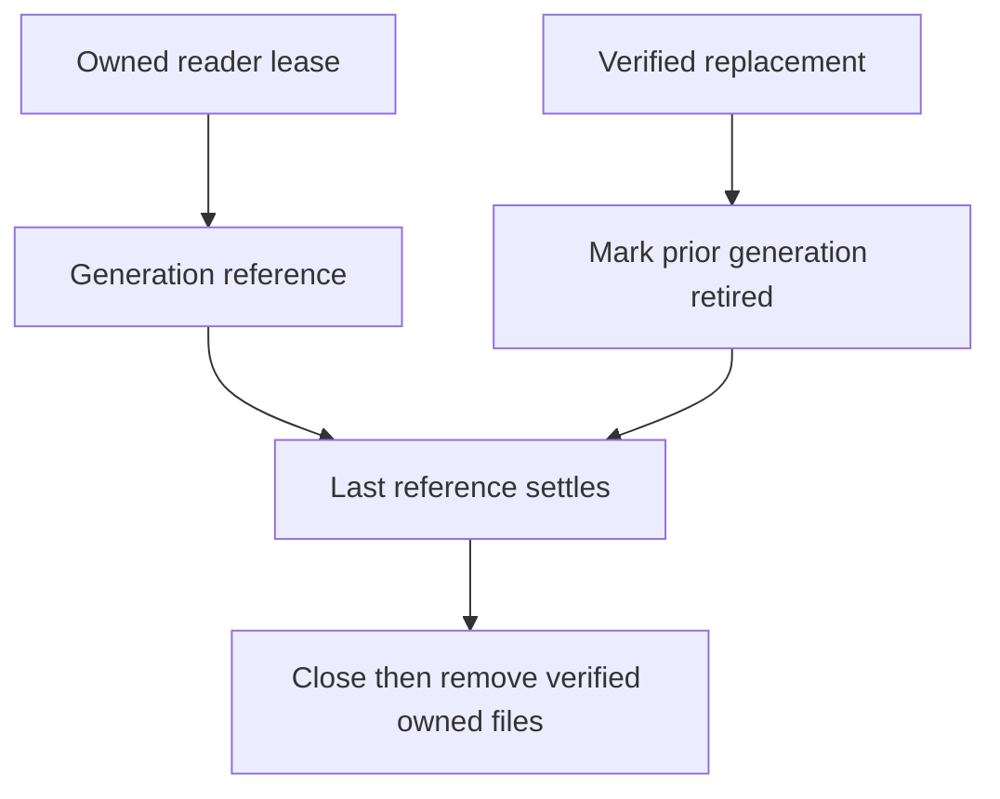

# ADR-095: Bounded native index generation leases and retirement

Status: Accepted for KL-039 L1; implementation and qualification pending.
Date:2026-10-04. Integration owner:root. Coding owner:Luna query_wave.

The current native manager holds one lifetime semaphore and immediately deletes
the previous generation on publication. It cannot preserve overlapping readers.
Adopt [OnlineGenerationLifetime](../Features/Search/OnlineGenerationLifetime.md),
REQ/AC-LEASE-001..004: finite generation/lease/build ownership, fully verified
publication, reference-counted retirement, retained cleanup failures and joined
shutdown. Preserve selected native provider, canonical scope validation and all
original physical budget/settlement gates.

Implementation contract: root freezes the interface-preserving manager contract;
query_wave owns Server Features/Search Storage/Lifecycle manager, lease and
settlement helpers, the existing generation capacity and restart retirement
preflight joins, and new independent real-native UnitTests. Keep1builder,
2leases,1retired/1current generation and3physical generations including staging
as upper bounds; actual provider safety may tighten concurrent readers. Root
reviews the private patch, integrates the actual production caller, runs serialized
Release/format/governance and Aspire unit/recovery/RF3, commits the completed stage
and retains exact-SHA Linux original results before qualification.

L2 still must atomically pin/capture a canonical base cut, build while canonical
writes proceed, replay ordered deltas, validate/cut over and recover catalog/pins.
Do not call L1 a completed online index. No public wire, canonical storage or index manifest transition occurs. Rollback stops the node and reconstructs only
its disposable owned index; original canonical data remains authoritative.

KL-039 L2-B proposed owner-review contract, 2026-10-09: adopt only after review
of REQ/AC-ONLINE-001..005 in OnlineGenerationLifetime. This appendix does not
mark implementation or authorize persisted catalog serialization. Ordered stages,
file/slice ownership, complete operation tests, rollback and root join points are
specified there. Exact internal provider composition, generated catalog
alias/fields/path/publication order and consumer/generation selection resolution
must be frozen before production seams. All original L1/L2-A bounds, deadlines,
provider, read pins, identity, persisted policy and retained failures remain.
Authentic Linux source/image/native discovery and complete Unit/Recovery/RF3
SDK/MCP/Q1 outcomes remain open.

Owner-selected KL-039 online operation contract, 2026-10-09: the appended
OnlineGenerationLifetime section reserves distinct OperationKind34, typed online
request/result aliases and IDs, native progress Id4, administrator + existing
consumer trust boundary and original CQRS ownership. Implicit Search and explicit
immutable Build/Restore semantics remain unchanged. Core internal copied-byte pin
and Server friend adapter are selected without public IAtomicStore change.
The exact proposed generated catalog/path/publication/restart contract and
original stable outcome retention must receive final root review before source
seams. No serializer fallback or migration is allowed. Root owns shared codec,
registration, movement/session reconciliation, guarded joins and actual Linux
Unit/Recovery/RF3 complete evidence. New online code must preserve existing
REQ/AC-LEASE/CUT and complete REQ/AC-ONLINE-001..005 together.

## KL-039 canonical online publication and restart contract (v5 owner review)

This complete contract supersedes v4's unresolved original-outcome/storage join and publication ordering. It is proposed source, not implemented, compiled, discovered or runtime qualified. Original REQ/AC-ONLINE-001–005 and every original KL039 acceptance predicate remain mandatory. Preserve explicit TextIndexSelectionV1, its single enrollment and immutable Build/Restore U; implicit Search performs no canonical maintenance effect or enrollment. Public MaintainOnlineTextIndex34 and private OnlineTextPublicationPhase35 are distinct from Batch0–MovePartition33. Ordinary50/heavy RF3 exclusive1, all original cancellation/deadlines/options/auth/RF3 and required full suites remain unchanged.

### Frozen native contracts and source ownership

Public SDK extension is MaintainOnlineTextIndexAsync returning Task<Result<OnlineTextIndexMaintenanceResult>>, using the original KeyLoadClient.Send write/commandId/cancellation path. Distinct route /v1/search/text/online/maintain and on-demand tool keyload_search_text_online_maintain bind public34's typed request/result. Q1 SDK and official MCP use CALL keyload_search_text_online_maintain(@arguments) through the existing SqlOperationRequest/catalog executor. No additional SQL grammar or full-SQL conformance claim. Register exact schemas/effect hints through the existing official server and persisted-authority gateway; do not enlarge initial discovery catalog. Preserve the v4 public request alias/IDs0–6, result alias/IDs0–7, phases0–5 and GrainRequestProgress nullable OnlineTextPhase Id4.

Append private GrainReadKind.OnlineTextMaintenance only after the exact joined ControlledBlob then SampleChunkWindow ancestry; preserve all existing ordinals and take the exact native predecessor, never infer a compiled UID. Private capability purpose is keyload-online-text-capability-v1; private35 command purpose is keyload-online-text-publication-verified-v1. Both are signed through the existing GrainRequestCodec/identity restoration path. Generic public command/read purposes reject these private identities. Public generic CreateNativeOperation must continue excluding35. The distinct internal Core factory alone invokes existing IssueNativeOperation after native prepared-candidate validation; VerifyOperationAuthority and coordinator.SubmitVerifiedAsync preserve exact native HMAC/incarnation/command/kind/principal/fingerprint/payload authority. Never reinterpret movement's purpose, grants, phases or owner context.

Core/Search internal generated OnlineTextPublicationPhaseCommand uses alias keyload.core.search.online-text-publication-phase.v1 and IDs0 Request(OnlineTextIndexMaintenanceRequest),1 Result(OnlineTextIndexMaintenanceResult),2 DataEpoch(int),3 Leaf(string),4 ManifestSha256(string),5 GenerationId(Guid),6 ExpectedCurrentCommandId(Guid?),7 SessionId(Guid). Its commandId is the original public request.CommandId. Fresh signed admission binds actual parent input/principal, original request expiry, native session, prepared generation and exact payload; caller supplied results, leaf names or metadata cannot create a native candidate. Session and prepared bytes are node-local, bounded and owned; the replicated payload is copied immutable native data. Core has no provider, Server or Query type dependency.

Append nullable StoredOutcome.OnlineTextAuthority at native Id8, preserving existing0–7. Internal generated OnlineTextOutcomeAuthority alias keyload.core.search.online-text-outcome-authority.v1 has IDs0 ParentFingerprint(string),1 Collection(string),2 Field(string),3 DataEpoch(int),4 Placement(PhysicalShardRecord),5 Leaf(string),6 ManifestSha256(string),7 GenerationId(Guid). The full immutable public original result remains StoredOutcome.Result, not the derived catalog. Parent fingerprint uses the exact existing normalized Id/Kind/PrincipalId/PayloadJson identity with public kind34. Phase35 retains its independent full native fingerprint. Capture authority for a validated private phase before execution; retain it with genuine persisted terminal outcomes, while changing the current pointer only on success. No projection-batch field, RuntimeJournal identity or existing outcome format is reinterpreted.

Core/Search generated OnlineTextCurrentPublication alias keyload.core.search.online-text-current-publication.v1 uses IDs0 FormatVersion(int,1),1 PrincipalId(string),2 CommandId(Guid),3 ParentFingerprint(string),4 Consumer(ProjectionConsumerRef),5 ConsumerGeneration(long),6 Authority(OnlineTextOutcomeAuthority),7 PublishedCut(TextIndexSourceCut). The new canonical online-text-current key family is explicitly registered as partition-owned metadata for the exact consumer partition/collection/field/generation, including native roster/snapshot/key validation. No caller document or user collection stores private control data. Existing canonical outcome retention owns historical original results; there is no unbounded per-command file history.

Orleans/Search generated OnlineTextCapabilityRequest alias keyload.orleans.search.online-text-capability-request.v1 has IDs0 SessionId(Guid),1 Request(OnlineTextIndexMaintenanceRequest),2 Kind(OnlineTextCapabilityKind),3 Page(ProjectionBatch?),4 CheckpointIntent(CommitProjectionBatchRequest?),5 Acknowledged(ProjectionBatchResult?). OnlineTextCapabilityKind is closed:0 ResolveOriginal,1 Capture,2 Seed,3 PreparePage,4 ApplyIntent,5 SettleCheckpoint,6 Validate,7 IssuePublication,8 ReconcileCommitted,9 Abort. Generated OnlineTextCapabilityResult alias keyload.orleans.search.online-text-capability-result.v1 has IDs0 SessionId(Guid),1 BaseCut(TextIndexSourceCut?),2 CurrentCut(TextIndexSourceCut?),3 ThroughSequence(long),4 TrackedRecords(int),5 IndexSha256(string?),6 OriginalResult(OnlineTextIndexMaintenanceResult?),7 IssuedPublication(ReplicatedOperation?),8 CheckpointIntent(CommitProjectionBatchRequest?),9 CurrentCommandId(Guid?). These are actual phase results, never caller authority or progress counters. No raw handle/iterator crosses a grain.

The derived Server catalog keeps its accepted alias keyload.server.native-text.online-catalog.v1 and IDs0–10/root native-text-online/catalog.bin/catalog.pending. BuildCommandId10 is the actual canonical35 command identity, not an inferred newest leaf. Existing Core and Query friendship already permits Server; only the approved Storage.ZoneTree internal capture friendship is added. Internal Query ICurrentTextProjection acquires with the actual current IKeyValueView/principal/resource/request/budget inside the existing callback. Explicit selection stays first and unchanged; the current-only adapter may reuse the canonical online generation only after complete cut/manifest/corpus validation, otherwise the existing authorized bootstrap path handles implicit reads. It performs no canonical write. No borrowed view escapes, public IAtomicStore addition or Core-to-provider dependency.

### Ordered execution, original result and CAS

1. The distinct parent runs in the separate request grain and existing ManagedCode CQRS stream. Reload fresh persisted administrator, field/resource policy, active already-configured consumer/generation/checkpoint and placement; validate original expiry/cancellation/buffers. Resolve original outcome through a separately signed private capability and actual quorum barrier before new native work. Current principal policy/incarnation and exact parent fingerprint guard both original success and failure. Changed same-ID content conflicts; current revocation/policy/ownership fences remain native refusals. Later generation retirement does not erase an original completed result.
2. Capture metadata plus the actual internal native snapshot pin in the canonical gate. Core supplies a callback-based disposable copied-byte pin contract; Server composes the node-local ZoneTree adapter. Traverse the charged native bytes off gate while actual canonical update/delete operations can complete. Keep exact identity/read generation/policy within each capture. Admit only existing bounded sessions, generations/files/bytes/leases; reject exhausted admission, never create an unbounded queue or independent directory allowance.
3. Seed a distinct actual native generation; read ordered retained projection pages to observed finite upper; prepare/apply actual native intents and commit original stable-ID projection ACKs through independent child request grains. Preserve existing CommitProjectionBatchRequest/ProjectionBatchResult semantics exactly. If a genuine final empty batch has no prior ACK, execute the native empty-effects ACK to obtain an actual receipt; never manufacture a checkpoint or receipt. All extra real child calls and progress frames consume existing total frame/page/byte/time allowances.
4. Capture a fresh final validation cut, validate complete records/revisions/token digest/native inventory and current policy/consumer/placement/retention. Close/flush the prepared native generation and its original bounded native intent. The Core factory rechecks the actual prepared witness and fresh principal/cut before sealing35. Expected applied/outbox/data epoch/read generation/policy/schema/resource/consumer/placement/current-pointer identity are verified again in the actual ordered AtomicCommandCommit transaction; an intervening canonical commit is a refusal, not an invented stable count or timeout retry.
5. Existing AtomicCommandCommit.ExecuteAndBuildOutcome/BuildStoredOutcome/PersistCommandOutcome commit the full original OperationResult, typed authority, canonical current pointer and apply watermark together through the unchanged native RF3 ordered gate. PublishedCut identifies the genuinely validated document cut before this metadata publication; do not relabel a later head. No native file becomes canonical storage. Failed CAS/cancellation preserves the prior active selector and original failures. Uncertain submission remains UnknownWriteOutcome until actual original canonical resolution, never inferred no-effect.
6. Only the exact committed pointer/outcome authorizes local catalog publication. Encode the existing native SHA256 envelope, CreateNew pending/WriteThrough/Flush(true), validate exact committed identity/manifest/owner/files, rename in the same directory, then replace the runtime pointer. Preserve leased old files, mark retirement only after publication, and delete only after the final old lease joins. Await actual progress writes and one terminal result only after reconciliation/settlement. Join producer/reader/children/pin/native worker/CTS and primary+cleanup+fatal failures on every path. No one-way, detached work, request renewal, new scheduler/config knob or retry.

### Committed-authority restart and rollback

Startup/retry first obtains actual owner readiness/current committed authority; timeout, unreachable quorum or a lagging local absence cannot prove no publication. A complete local current catalog must match the exact canonical current pointer/outcome plus native manifest/owner/file inventory. No scan for newest leaf, legacy reader or blind pending promotion is allowed. A committed35 with catalog missing/pending authorizes reconstruction only from that exact recorded generation/manifest after full validation; missing/corrupt committed native bytes remain a genuine refusal, preserving the original outcome and prior verified ownership. Restore only the exact fixture-owned image in a repair regression. If no committed35 is authoritatively present, retain the original current generation and reject/reclaim only proven uncommitted owned staging. Uncertain state remains retained/unsettled.

Same-owner cold identity requires exact NodeId/incarnation/data epoch/placement/policy/schema/resource/consumer generation. ReadGeneration and applied position may legitimately advance under native committed snapshot replacement. Each new continuation acquires a real fresh current cut; it never reuses an old snapshot/cursor or rewrites an immutable Build U. Catalog/native scope and original result remain historical immutable observations. Reuse on a fresh query requires complete current canonical corpus equality, full policy/cut/manifest validation and the actual nondecreasing generation/applied fence; changed corpus is not eligible. A superseded completed command returns its exact retained original result without reactivating retired files or replacing the current pointer. Explicit selection's existing exact-generation check remains unchanged.

Rollout enables34/35 only on the coherent capable RF3 source/codec cohort; old serializers cannot consume new typed outcomes. Preserve stable aliases/IDs and existing binary/raw-byte/public JSON/digest/journal contracts. After any canonical35 is written, rollback retains capable decoding/outcome/authority support, disables new online admission and drains joined ownership before removing only verified disposable derived files. Do not downgrade to an old reader, drop committed results, remove canonical pointers or fabricate migration compatibility. No deployment action is executed by this source proposal.

### Whole operation evidence and exact implementation joins

Core/Search owns Contracts/OnlineTextPublicationPhaseCommand.cs, OnlineTextOutcomeAuthority.cs, OnlineTextCurrentPublication.cs; Commands/OnlineTextPublicationCommands.cs; Queries/OnlineTextOriginalOutcome.cs; Identity/OnlineTextOperationAuthority.cs; Validation/OnlineTextPublicationValidation.cs and Serialization/OnlineTextPublicationProtocol.cs. Shared Core joins are AtomicCommandCommit, CommandOutcomes, OperationDispatcher, native payload/authority type map, scoped command outcome resolver, native serializer alias/field IDs and partition-roster key registration. Server/Search owns native snapshot adapter, capability owner/admission, actual staged seed/delta/validation, catalog reconciliation, reader leases and retirement; StorageRecovery/PartitionHost owns registration/readiness/joined shutdown. Query/Search owns the internal current-view acquisition interface and existing SelectedTextProjectionAdmission branch only. Orleans/Search owns typed capabilities, special-purpose scopes/envelopes, sealed35 submission/partition routing, bounded CQRS parent/child calls and terminal cleanup. Abstractions/ClientApi/Client/SQL own public34 DTO/descriptor/SDK/Q1/MCP/schema/hints; private35 and capability never enter public discovery. Root joins all shared paths after peer ancestry guards, compiles/formats and commits/pushes; no worker live write.

Unit operation tests must execute real native capture/build/query while public update/delete complete off gate, then verify full independent original/new/deleted/unchanged payload/ref/revision/score/order/page oracles; actual old reader/files remain pinned through replacement; real cancellation/bounds/stale CAS/spoofed public35/authority refusal each leads to a distinct fresh healthy operation. Verify full original result after later swap/retirement and same-owner cold continuation. No getter/property/logger-only cases. Process Recovery executes actual same-root cuts before canonical commit, after canonical commit, pending flush, catalog rename, runtime activation and retirement, retaining the exact old/new outcome and native file identity; missing/corrupt exact committed artifacts refuse before genuine exact-image repair/healthy continuation. Process kill does not prove power loss.

RF3 executes the same complete concurrent mutation/ordered delta/catalog/original-result/old-reader/cold/policy/cancellation/repaired-failure flow through all four actual SDK, official MCP, Q1 SDK and Q1 MCP routes. Coordinate with genuine native phase/CQRS observations, not fake public probes, sleeps or manufactured counters. Native discovery authenticates real constructor instances/UIDs/source/PDB/image after implementation; source declarations are not compiled cases/PASS. Linux normal/scalar-caller operation outcomes, all mandatory full suites, resource/performance/coverage/endurance/power-loss gates remain OPEN.

### Native replica and captured-read settlement appendix, 2026-10-09

This source-backed corrective contract supersedes only v5's replicated35 comparison of capture-local NodeId, Store.Position and ReadGeneration. NativeTextSeedCollector captures these from its actual node-local owner under Store.Read; ZoneTreeStore.CaptureNativeReadCut requires that same raw view and held native read gate. The prepared factory and local catalog acquisition must preserve their exact node/incarnation/read-generation/local-position fence within each captured request. No old cursor or snapshot crosses a fresh cold request. Native lease traversal owns actual immutable iterator work off the store gate; seed decoding receives only charged copied bytes, and existing shared native text memory/generation/file/session admission must charge retained data and leases before allocation. This does not authorize an independent directory allowance.

AtomicCommandCommit applies the same signed35 payload through each node-local Store.Commit. A healthy follower can legitimately have another local NodeId/local journal position/read generation, especially after snapshot installation. Therefore replicated publication validates deterministic canonical Applied/outbox/policy/schema/resource/consumer-generation/placement/incarnation/current-pointer expectations and the sealed native prepared witness; it must not compare those follower-local values against the leader's captured values. The native factory validates the complete prepared candidate against a fresh exact local cut before signing through IssueNativeOperation; generic public CreateNativeOperation still excludes35. No manufactured quorum fence or caller result/witness is admitted.

DataEpoch has been verified in actual native source rather than assumed: NativeTextSeedCapture.DataEpoch is StoreIdentity.FormatVersion. ZoneTreeIdentityFile.Open/Validate/Read require CurrentDataEpoch for every supported owner; ZoneTreeCheckpointGeneration.Prepare writes that format constant and increments only local ReadGeneration for tree replacement. This format gate is common for the coherent supported RF3 reader cohort and may remain in deterministic35 validation. It is not a physical generation counter. Local catalog/source authority also binds the exact captured format. A different/unsupported format fails closed; no upgrade reader or fallback is introduced.

Actual native partial-work settlement precedes source implementation. ZoneTreeReadCutLease already charges accepted records/raw bytes before copying and retains its real partial work on traversal failure; its existing successful result exposes that work only on normal return. Add an internal ObserveSettledWork method guarded by capture completion and no active traversal, available solely to the joined Server adapter. It exports only the existing exact cumulative records/bytes/advances within that owned operation, never user data, sampled diagnostics or authority. Preserve original VisitPrefix behavior and failure identities. Server records/imports only the actual delta after synchronous traversal returned or threw.

Existing ReadExecutionBudget.ImportReadGrant and CompleteReadGrant check active cancellation/deadline before accounting, which cannot settle already performed native work after original cancellation. Add internal settled-work import/completion using the exact existing owner/completed/reservation/aggregate byte and record checks, without admitting new work or checking/renewing a future lifetime. Existing active methods retain their checks and semantics. Import actual accepted native work after traversal joined; complete/release only unused reservation after actual pin disposal successfully joined. If pin cleanup remains failed/unsettled, retain its reservation and every actual failure. Preserve primary stack identity, full ordered aggregate and fatal semantics through existing ServerFailureObserver; no retry, timing relaxation or negative-control getter tests. The pin uses only the original budget's remaining bytes/records/lifetime and cancellation.

Ordered source ownership: this feature and ADR095 contract first; internal Core metadata-only borrowed-view callback and budget-settlement append next; ZoneTree internal settled-work/state guard and Server friend adapter; exact signed35 canonical outcome/current-pointer publication; local checksummed catalog and reader-pin reconciliation; original separate-grain CQRS/public SDK/MCP/Q1 composition; meaningful real operation failure/cancellation → fresh healthy continuation, process cuts and RF3 whole flows. Shared predecessors must be refreshed against the current root-joined source before sealing. Root alone joins/builds/formats/commits/pushes; native compiled identities and complete normal/scalar Linux operations remain required. Neither this contract nor private source preparation is compilation, UID discovery or a PASS.

### KL-039 shared native ownership correction (2026-10-09)

The catalog uses the actual existing `KeyLoad.Query.Features.Search.TextProjectionScope` serializer contract; the earlier spelling `QueryTextProjectionScope` was a source-map error. Its existing aliases and field IDs remain unchanged. The catalog retains the exact frozen local owner/pin fence, while canonical operation 35 compares only the separately documented replica-common authority.

A single internal Server `NativeTextResourceOwnership` is created at the native text composition boundary and passed to the bootstrap, explicit incremental and online owners. It uses only the centrally validated existing `NativeTextExecutionOptions` ceilings. Root registration identifies canonical full paths; shared physical entries are counted once, and each native owner root remains verified against its existing node-owned receipt. Physical file, byte and actual generation accounting includes all three roots rather than giving each root another allowance. Reservation is admitted before work and remains owned until actual joined native disposal/retirement. Reader/session reservations account for actual admitted work, not inferred file counts or diagnostics.

Ordered integration: (1) introduce the internal ownership object and exact root registration/accounting; (2) pass the same object to bootstrap, explicit and online composition owners, with rollback on failed admission and retained ownership on failed cleanup; (3) serialize only physical mutation/accounting, separately from storage commit/apply and original read leases; (4) stage the online candidate while original readers retain their files; (5) commit full canonical outcome/current pointer, verify and publish the checksummed local catalog; (6) retire replaced physical media only after the actual last lease joins. Existing explicit Build/Restore upper-cut and enrollment rules remain exact.

Owned source paths are Server Search `Lifecycle/NativeTextResourceOwnership.cs`, feature-local reservation/lifetime helpers, existing bootstrap `NativeTextProjection`/lifecycle composition, explicit `NativeTextIncrementalMaintenanceService`/root composition, and online owner/catalog lifecycle. Core remains provider-independent and public `IAtomicStore` is unchanged. No new resource constants, configuration knobs, global storage lock or reader-blocking exclusive mutation rule is introduced.

REQ/AC and original KL-039 gates remain unchanged. Meaningful regression flows must execute real competing maintenance/reservation refusal followed by fresh healthy continuation, include actual native roots and original retained readers, verify no lost concurrent update/delete, and retain all cleanup failures. Unit/process recovery/RF3 SDK, official MCP and both Q1 routes still require authentic final-source qualification; this appendix is a source contract, not runtime evidence.

The later root `Grain per connection, owner decision 2026-10-09` (AGENTS.md lines 598–602 at this observation) supersedes the earlier per-request activation map. Public operation 34 and its bounded internal capability work compose the actual connection-owned execution API; each operation retains its original signed identity, fresh persisted authorization, native context, cancellation/deadline, result/progress and joined cleanup. No per-operation activation or rejected request-grain fallback is introduced. Exact connection-owner API integration and authentic matched-cohort resource/activation qualification remain required gates. Core ordered operation 35 and node-local derived-index ownership remain unchanged.

Prospective disk admission covers the existing owned native file provider and metadata envelope writer. Each admitted file mutation reserves its actual canonical path and target file length before the original native write/create/set-length begins. Shared accounting projects only the positive difference between that target and the actual observed native file length; already materialized growth is counted once. Original async/Begin-End writes must join before reservation completion. `ToStream` remains inside the same bounded forwarding adapter. Metadata envelope publication admits its exact encoded length before CreateNew/WriteThrough; checksums, flush, readback and rename ordering remain unchanged. Native source is bound to the ZoneTree 1.9.9 restored package repository revision `111908be43b42d231db0926d4503e7f864b3a6cb`, rather than an unpinned main branch. This is KeyLoad-owned resource admission, not a change to or replacement of the selected native engine.

The freshly authorized administrator's publication-head read exposes only the exact current canonical command ID needed for compare-and-swap; it does not replay another principal's original result or reuse that principal's catalog. Full original-result resolution remains bound to the original request fingerprint, principal, current persisted authorization and outcome authority. A fresh maintenance operation may therefore replace an older policy/principal-scoped derived generation using its own current pin and authority, while an old result/catalog remains subject to its unchanged refusal rules. Corrupt head format/scope/incarnation is refused; no newest-leaf lookup or authorization promotion is introduced.

ONLINE-only cold reconciliation preserves the original canonical35 outcome, pointer, manifest and source-cut bytes. It first verifies exact current committed authority, original manifest checksum and full native inventory, then captures a fresh same-owner current pin with matching incarnation/dataEpoch/persisted policy/schema/resource/placement. A complete independently bounded corpus comparison against the original manifest must succeed at the exact current outbox horizon. Only legitimate local read-generation advancement and nondecreasing applied/cut positions may rebind the disposable local catalog/acquisition fence; that fence records the real fresh generation and horizon. Canonical35 itself advances applied position without changing the indexed document corpus; its original result cut is never rewritten to the later acquisition cut. Changed corpus/authentication authority, unknown/corrupt authority or missing original media refuses reuse and requires genuine new authorized maintenance or exact-image repair as applicable. No old pin/cursor, newest/pending promotion, history effect or explicit Build/Restore/RequireUpper change is permitted. Required whole tests include native snapshot-replacement cold rejection, exact original image repair and fresh healthy full operations with unchanged original full result.

The internal prepared publication witness also retains the actual owned checkpoint intent that produced the acknowledged `ProjectionBatchResult`. Before signing private35, Core verifies that intent's exact stable command fingerprint against its scoped canonical stored outcome, matching original principal/incarnation/current policy, configured consumer and empty effects. Deterministic ordered apply verifies the acknowledged complete checkpoint result against the same scoped stored outcome bytes and current consumer checkpoint. No new serialized field, public fake-result argument, receipt fabrication or second enrollment is introduced. The ephemeral witness is not persisted or transported to followers; their comparison uses the real replicated checkpoint outcome.

The public34 MCP descriptor uses actual generated typed request/result schemas and the existing canonical command decoder/Q1 catalog. Its advisory hints are readOnly=false, idempotent=true and destructive=true: publication/checkpoint metadata changes are real, a stable command/payload replay returns its complete original outcome, and replaced disposable derived media is physically retired after leases join. Guidance requires an already administrator-configured consumer and fresh persisted administrator/data/field authority; timeout/disconnect remains an unknown write outcome. Existing31 hints and implicit query behavior are unchanged. Private35 is excluded from public descriptors and generic input factory.

### Corrective same-grant pre-copy admission (whole KL-039)

The original grant is shared by actual native key/stored-value examination and the retained decoded seed representation plus collection arrays. Settled observation alone cannot admit allocations already performed. Add an ONLINE-only internal `VisitPrefix` overload accepting an opaque `Action<long,int>` admission callback, without a Core/provider dependency. The existing overload remains unchanged. Actual native work counters retain each examined matching record or boundary key; invoke the original active grant admission immediately afterwards and BEFORE owned key/value copies. A callback refusal retains the actual attempted native observation and original exception but does not manufacture an accepted allocation. Native limits, cancellation and elapsed deadline remain exact.

Before decoding a retained DocumentRecord, charge its complete serialized representation length against that SAME grant, consistently with the existing seed materialization policy. Before allocating/replacing the List backing array and before the final array, charge the actual reference-slot capacity times `IntPtr.Size` against that grant. No independent byte allowance, renewed deadline, count-derived authority or measured-heap claim is introduced. Existing configured read-byte/record ceilings are unchanged; known simultaneous native copies, retained representations and array allocation charges consume them together.

Keep exact successful native-admission byte/record counters separately from materialization charges. After traversal joins, the actual native observer must cover those counters; a traversal that completes normally requires equality. Do not import those native bytes twice. Refused attempted work remains a real native observation and terminal refusal, without relabelling it as admitted copying. Complete unused grant reservation only after native pin disposal actually joins; retain every original traversal/admission/observation/cleanup failure and its original stack/fatal semantics. Genuine complete-operation regressions must exhaust the combined grant during actual seed traversal, settle the true pin, then execute a fresh healthy operation, and cover cancellation with the same original deadlines.

Native capture failure settlement is source-bound to `ZoneTreeReadCutLifecycle.Capture`: it always joins `lease.Dispose`, and emits an AggregateException when that cleanup fails. The online adapter completes the untouched grant on an ordinary capture failure whose native cleanup settled. An aggregate capture failure retains the reservation because cleanup ownership is uncertain, preserving the actual primary and cleanup exceptions without guessing an ownership classification. A successfully returned pin retains its grant until its actual Dispose joins.

Same-grant automated source mapping: Search/Cases/NativeTextOnlineSeedBudgetTests exercises actual configured canonical documents and native snapshot seed traversal. An independently literal full DocumentRecord corpus, exact original write time/row access/ref/revision/deleted state, and genuine native key/value sizes determine the bounded trial. The combined grant admits the first native row plus its retained representation/backing slot but refuses the next raw row before copying. Joined pin disposal is followed by a fresh full native seed and exact complete corpus equality. A separate actual captured-pin cancellation trial joins the native pin and follows with the same full healthy seed. These source declarations supplement, rather than substitute for, whole maintenance/cold/recovery/four-route RF3 flows or authenticated compiled UID qualification.

### Native connection and exact child expiry join

Re-query actual connection source before sealing: ServerConnectionOperation owns real connection Id and caller+transport Token; ServerConnectionFeature.Acquire(HttpContext, token) refuses absent actual Kestrel feature. The existing IConnectionGrain ExecuteStreamAsync and signed AlwaysInterleave CloseAsync remain the owner boundary. Online parent and its sequential child operations use the SAME actual connection identity, each with fresh scoped signed operation identity/current persisted administrator authority. They consume existing MaximumConnectionOperations admission (current default8); no hidden slot expansion, per-operation fallback grain, session role cache or synthetic connection is introduced. Existing bounded non-client owner identity is used only by its genuine existing non-client context.

Add owning Search partial GrainRequestCodec methods for exact original-expiry children; old public codec methods/callers remain unchanged. An internal capability read uses the frozen keyload-online-text-capability-v1 purpose and only OnlineTextMaintenance read kind. A factory-issued35 command uses that same closed envelope purpose and exact original expiry, with VerifyOperationAuthority proving the existing distinct native35 HMAC before signed envelope construction. Payload is the actual verified ReplicatedOperation, not a caller supplied full result or reconstructed phase command. Closed scope validation accepts this purpose only for that capability read or35 command, and rejects those private kinds under another purpose. Core/native publication independently verifies original operation authority before existing SubmitVerifiedAsync. ProjectionBatch reads and CommitProjectionBatch child writes retain their existing standard purpose, fresh identity and native semantics, but exact capped parent expiry. Original parent cancellation/frame/page/byte bounds and joined producer/session/child cleanup remain mandatory; all prior per-request grain prose is historical and superseded by the actual owner connection rule.

Online frame accounting is operation scoped under the SAME original MaximumTotalFrames. The parent has already awaited its actual StartedAsync before entering the maintenance body; keep that observed frame and reserve its single framework terminal frame. Wrap each actual native child enumerable and admit each yielded CQRS chunk before the existing native drain consumes it; join the original child enumerator on rejection/cancellation/disposal. Parent progress frames consume that same allowance before the real ProgressAsync. Do not infer child frame totals from source declarations/page counts or grant an independent allowance. The existing native serializer/drain and original frame-byte/result/page limits remain unchanged. A terminal refusal and its joined producer/session cleanup retain the original failure; no retry or renewed lifetime is added.

Shared accounting registration binds each actual root receipt to its exact node owner and retains original secure regular-file/directory traversal. Its callback is resource inventory admission, not a replacement for explicit enrollment/read validation or canonical online publication proof. Do not call the explicit CheckRoot enrollment validator recursively from a prospective metadata-file reservation: it would reject the legitimately incomplete, already reserved generation between directory creation and its owner/enrollment publication. Original explicit CheckRoot/RequireUpper/layout checks remain at their existing admission/read/settlement boundaries; online current reads additionally require exact committed outcome/pointer/manifest and complete fresh corpus proof. Whole-index EvictToDisk/WaitForBackgroundThreads and joined index disposal must remain outside the shared reservation lock, because native writers use that same lock for their actual pre-write reservations. Serialize short actual file/create/replace/metadata mutations and accounting without awaiting or synchronously joining a native worker while holding that lock.

### KL-039 original coordinator settlement admission

The internal online publication owner retains the exact `AdmittedCommand.Completion` returned by the existing coordinator inbox admission. The public `ICommitCoordinator` remains unchanged. Only verified `OnlineTextPublicationPhase` operations may use the internal retained-completion entry; the existing worker, principal lookup, command-size limits, evaluated timestamp and admission governor remain authoritative. The Orleans operation boundary admits this native task, while the feature-local session retains it through caller cancellation and joined cleanup. `WaitAsync(callerToken)` cancellation may report `UnknownWriteOutcome`; it neither settles that original task nor permits catalog/staging release. Even an original task terminal `UnknownWriteOutcome` requires authenticated canonical current-publication reconciliation before generation retirement or promotion; no absence is inferred.

This change is an internal ownership seam, not another dispatcher or public store API. The normal coordinator submission continues to use the same inbox entry and original cancellation mapping. Unknown or failed reconciliation retains ownership until explicit joined shutdown or an authenticated recovery decision. Qualification requires the genuine queued publication, cancelled caller, original task settlement, canonical reconciliation and fresh healthy maintenance flow; source construction is not runtime evidence.

### KL-039 owned native file groups and detached streams

The shared native resource owner assigns a disposable file group only after actual successful native open/create, under its short physical gate. All linked handles for that same canonical path share one group, counted once; the group is not database authority or a fabricated persistent identity. Every native stream and `ToStream` write is charged through that owner. Successful native delete detaches its group. Successful native replace moves the source group, transfers the original destination to its actual backup when present, and detaches overwritten groups. Detached native handles retain actual length and prospective write reservations until real stream disposal joins. Native mutation failure preserves the original exception and retains affected groups conservatively as ambiguous; no exact-byte qualification is claimed for that state and no directory scan releases handles or infers identities. Existing MaximumFiles/MaximumDiskBytes remain the only ceilings. Actual registered open streams, not pathname absence, govern release. This applies to bootstrap, explicit and online native providers under the same owner; corruption/enrollment/manifest validation remains independent.

### KL-039 catalog proof construction and publication recheck

A disposable online catalog proof is constructible only by authenticating the actual canonical current-publication pointer and its original retained outcome, validating the immutable original manifest envelope checksum and complete native inventory, then capturing a fresh owned native seed and comparing every reference/revision/deletion/full canonical digest with the original manifest. The manifest's original scope binds the original result BaseCut; its final horizon and complete files bind PublishedCut and IndexSha256. The fresh local catalog records the genuinely captured current position, applied cut and read generation. Scope identity, incarnation, data epoch, persisted administrator, policy, schema, resource digest, configured consumer and physical placement remain exact; only position/applied/read generation may advance. ThroughSequence and complete corpus must still match. This does not modify explicit enrollment or RequireUpper.

The proof owner must already retain that real generation against retirement, and must re-read the authenticated canonical pointer before catalog rename under its exclusive publication ownership. A changed pointer refuses publication. Pending bytes are read back and compared with the exact prepared catalog; no raw DTO or integer-only comparator creates a cold rebind proof. Original canonical bytes and original caller result remain immutable. Fresh acquisition must match this fresh scope under the existing read-cut admission; proof construction alone does not authorize later stale query acquisition.

### KL-039 stable online checkpoint child identity

Online checkpoint IDs use the distinct native serializer alias `keyload.orleans.search.online-text-checkpoint-identity.v1`: Id0 original public maintenance CommandId, Id1 actual projection page ThroughSequence. The child Guid is the first 16 bytes of SHA256 over that native typed serialization. This preserves stable replay while separating the distinct online operation from existing explicit-maintenance checkpoint identities; existing aliases/IDs/digests remain unchanged. No caller can supply a trusted checkpoint result: every page is read through the actual authorized projection API, its original token is committed with empty Effects, and the native stored outcome and current configured consumer checkpoint are verified before publication.

### KL-039 native session deadline and active capability cancellation

A retained online seed pin belongs to its bounded feature session, not to a completed child operation. The session CTS uses the earlier of the original signed absolute expiry and the centrally configured original QueryDeadlineSeconds, linked to feature shutdown. Its single cumulative ReadExecutionBudget is constrained to that same original expiry and never renewed. Every active capability uses the already-native `ReadExecutionBudget.EnterStageCancellation(actualCallerToken)` scoped lease; budget checks and the pre-copy native grant admission observe that caller cancellation during real traversal. Successful child completion disposes only this scoped stage lease, without cancelling the retained seed pin. Parent failure/early stream disposal joins actual Abort; abort and shutdown preserve original35 completion/reconciliation ownership before disposal. No caller role or completed request-context cache is retained.

### KL-039 canonical native generation locator validation

The internal35 payload retains the actual native `generation-` plus lowercase Guid `N` leaf format. The separately retained GenerationId is exactly that native leaf Guid, not another generated identity. Core validates this frozen locator and canonical lowercase SHA256 shape without a provider-type dependency, validates same-node/incarnation base/published lineage and nondecreasing original captured positions/generation/horizon, and enforces the existing MaxScanRecords bound. Server obtains the locator from actual native generation creation and computes hashes from the real closed native inventory/manifest. This shape validation does not substitute for full candidate validation or imply a published result.

Closing native file handles first join every real write, then capture their actual final length under the short resource gate. That observed length remains charged while actual close runs outside the gate; concurrent accounting never accesses a partly disposed stream and never releases it from a directory scan. Concurrent sync/async disposal joins one shared native close task and retains all original write/close/accounting failures. Only actual joined closure removes the handle.

The native open-file ownership regression performs real provider create/write/flush/open/unlink, attempts a genuine bounded second write while the first native handle remains open, requires that rejected write to leave the complete second file empty, joins the actual first handle close, then repeats the genuine write/read with complete independent bilingual bytes. Its typed disk bound derives from the fixture's actual existing owned files plus both original payload lengths minus one; no guessed authority counter or changed global default is used. This is a component operation regression supporting the shared owner, not the full public maintenance/RF3 acceptance proof.

### KL-039 genuine checkpoint original completion ownership

Before the real checkpoint15 child is submitted, PreparePage registers one session-owned expected native CommitProjectionBatchRequest with exact command bytes, stable ID, principal and original signed expiry. Existing bounded sessions hold at most that current checkpoint work and their publication work; existing connection operation/grant ceilings remain unchanged. Physical command execution matches every original value before using an internal coordinator entry returning the actual AdmittedCommand.Completion. Ordinary unmatched checkpoint callers retain their existing path. The feature work lock retains this actual task atomically with native enqueue and subsequent matching submissions join the same original task.

An unknown checkpoint RPC does not permit intent retirement, generation deletion or ownership release. Cleanup joins the exact original native completion and verifies its original native receipt before retiring that intent; unknown/missing authority remains retained. Publication35 follows the same original-task rule. No new operation discriminator, public store API, consumer grant, fabricated checkpoint result, automatic retry or deadline is introduced.

Session cleanup closes new checkpoint/publication admission and captures the original native task under the same feature work lock used for enqueue. A child that already obtained the work cannot enqueue after this closure; an already admitted original remains joinable. Each session retains at most one current exact checkpoint registration. Its original native request bytes, command ID, authenticated principal, original expiry and actual page horizon are captured before submission. Matching another request with the same registered command ID but different bytes/identity/expiry refuses; ordinary commands with an unrelated ID use their original path. Native completion success is verified as the original typed ProjectionBatchResult with its exact command receipt and actual intended horizon, and the caller acknowledgement is compared in full under the original active budget before intent retirement. Unknown completion or failure cannot manufacture this proof. Cleanup closes both work admissions before joining their actual original tasks; retained uncertain work keeps its generation/resource ownership.

While the real seed pin reserves the original remaining read grant, exact subsequent request revalidation representation/hash bytes are admitted before allocation through that same owning grant, separately from actual native examined-byte/record observations. They do not borrow a second budget or fabricate native work. After actual pin disposal joins and the remaining reservation is settled, later stages charge the original cumulative budget directly. Original deadlines and total byte ceilings remain unchanged.

### KL-039 same-view readonly implicit acquisition adapter

Query owns internal ICurrentTextProjection, receiving the actual existing WithQueryView view, fresh persisted principal/resource, original SearchRequest and original budget. Server implements it alongside unchanged ISelectedTextProjection. SelectedTextProjectionAdmission and WaitForIndex use that same-view adapter only for implicit selection; no nested Store.Read, new read cut, checkpoint/publication, catalog-file write or await occurs under the canonical read lock. Existing Query→Core project reference and Server friendship remain unchanged; Core lookup uses only Core/Abstractions types.

The bounded canonical online-current family lookup validates exact keys and full retained native authority. Only the actual matching local node, persisted principal, collection/field and active administrator-configured consumer is eligible. A genuinely released or positively superseded consumer generation is ineligible; unknown/corrupt matching authority refuses. Two eligible configured consumers are ambiguous and refuse, without newest/lexical selection. No eligible online authority retains the existing readonly bootstrap path for that distinct scope; corrupt/mismatched eligible online authority never falls back. Acquisition validates immutable original manifest/checksum/native inventory and full canonical corpus in the same actual query view, compares the resulting fresh scope exactly with the original admitted query scope, and transfers ownership from the inspection pin to the actual native reader lease before the inspection pin is released. The query neither promotes a caller nor configures a consumer.

Canonical `online-text-current` participates in the actual ordinal PartitionRecordFamilies.All after message-meta and before outbox, and in native movement control-owned metadata beside canonical outcomes. Existing AtomicPartitionRosterKeyValidation consumes that same roster, retaining original current authority through snapshot/backup/movement without transferring open derived handles. The new-maintenance capture uses the separately frozen fresh-authorized ReadOnlineTextPublicationHead CAS identity, not original-result replay admission: legitimate changed placement/policy may require a genuine new prepared35 publication. Original outcome replay/current query validation remain strict and never reinterpret old authority.

The host's shared-resource composition pre-registers the three actual owned root paths (`search-indexes`, existing `text-projections`, and `native-text-online`) before any new root receipt or native generation work. Re-registering the same exact canonical root validates both existing and new owning verifiers and keeps one accounting entry; overlapping distinct roots still refuse. No root registration releases handles or infers their identity. The original native bootstrap/explicit constructors remain available for existing standalone fixtures, while the real host supplies one identical shared owner to all three paths, provider streams, metadata writes, generation reservations and real read leases. Their existing local semantic checks remain unchanged.

### Finite shared-owner composition completion (2026-10-10)

The existing PartitionHost composes one NativeTextResourceOwnership for bootstrap, explicit text-projections and online native-text-online roots before opening any of those services. Each original root receipt and its existing full ownership validation remains authoritative; the shared accounting verifier validates the root receipt during short staged file publication, while the original complete generation/enrollment validators still run at their original admission and completion boundaries. It does not interpret a partially written enrollment as a completed generation.

Bootstrap generation, explicit maintenance session, online maintenance session and actual selected-reader reservations use the same existing limits. The existing explicit maintenance service retains prospective generation reservations in its bounded live-generation registry until the actual owning delete succeeds after all native owners/readers close; aborting a session does not release files that intentionally survive for Restore. No extra service owner, request dispatcher, ceiling, public operation, deadline or history registry is introduced. A failed create/delete keeps unresolved ownership and the original failure; only actual joined closure and an owning successful deletion release its reservation. The original explicit enrollment, immutable Build/Restore U, RequireUpper and checkpoint receipt contracts are unchanged.

The executable integration endpoints are the existing PartitionHost open/shutdown boundary, OrleansSiloConfiguration.RegisterBorrowedServices and canonical ClientApi long-operation endpoint registration. All resource adapters remain feature-local and internal. Their source does not establish compiler, native discovery, runtime acceptance or resource measurements.

### Exact catalog recovery and read admission completion

An implicit online read must validate the actual checksummed catalog.bin against the already proven canonical current publication, original manifest and complete corpus. Missing or mismatched current catalog refuses the online read; the read never writes or promotes catalog.pending. An online-only generation rebind may use a catalog with an older read generation/position/applied/horizon only after the same-view full proof shows identical node, incarnation, data epoch, partition, collection, field, principal, policy, schema, placement, consumer, generation, leaf, manifest and original command. Every fresh fence/horizon is nondecreasing and acquired within that actual query view.

Fresh authorized ResolveOriginal uses a separate fresh request budget, never extends the original operation expiry, joins any retained exact original coordinator work, validates the full positive canonical receipt/current/manifest/corpus authority, and repairs the disposable local catalog before returning the exact immutable original result. A retained pending file can be removed only after checksum/shape/identity validation against this fully proven current publication; it is never blindly renamed. Unknown, corrupt or changed pending authority refuses. Only successful original join and actual catalog commitment permit the retained session/staging ownership to retire.

Stable-result replay after supersession reads the original verified StoredOutcome Id8 authority and immutable full result through the existing Core outcome resolver. This internal read-only resolver reconstructs the original publication identity solely from those authenticated persisted fields; it never writes a current pointer or accepts caller publication fields. A retained original session may transfer its reservation to that exact original generation only after its actual coordinator completion and full original receipt join. Once the fully validated newer current catalog is acquired, the superseded original generation retires through the same actual reader-pin join; replay still returns its immutable original result.

### Whole executable operation regression ownership

REQ/AC-ONLINE-001/002/003/005 map to NativeTextOnlineWholeOperationTests using the actual fixture-owned native ordered apply/materializer, native capture/seed/delta/publication and original receipt APIs; this is Unit evidence, not Docker RF3. The real pinned snapshot is acquired before actual native update/delete commits, and the published complete bilingual literal corpus, deleted exclusion, original result replay and held reader/file retirement are independently asserted.

NativeTextOnlineRf3Tests.OnlinePublicationRefusalUpdateDeleteFullReplayAndColdContinuation has the four original NativeTextMaintenancePath arguments, uses the canonical fixture-owned Aspire RF3 entry and official SDK clients, and maps ONLINE-001/002/003/004 to persisted administrator consumer configuration, all-four-route owner refusal followed by complete healthy publication/search, native update/delete, exact full original result replay and same-owner cold continuation. Only authentic Linux discovery can bind compiled cases; source arguments are not UIDs or passing qualification. Original deadlines/options/heavy scheduling remain unchanged. The full native original failures and every owned client/container shutdown are joined. Genuine publication-boundary process interruption remains its separate mandatory recovery suite.

### KL-039 online staging identity and cold recovery completion contract (2026-10-10)

REQ-SEARCH online generation lifetime / AC online recovery: `native-text-online/<generation>/staging.bin` is ONLINE-only generated `keyload.server.native-text.online-staging.v1`, checksummed and written CreateNew/WriteThrough/Flush(true)/readback after the native owner receipt and before native seed writes. Stable fields are Id0 format, Id1 actual owner NodeId, Id2 canonical leaf, Id3 complete immutable public maintenance request, Id4 persisted principal identity, Id5 existing canonical principal/operation/request fingerprint, Id6 captured expected current command (nullable), Id7 actual original captured source cut, Id8 actual observed DataEpoch. No expiry or absent outcome authorizes deletion.

Ordered owners: NativeTextOnlineSeed creates and verifies this receipt under the original resource grant; NativeTextOnlinePublication verifies complete generated identity equality against its retained original session before issuing signed canonical35. NativeTextOnlineRoot verifies the complete ONLINE-only generation metadata roster and regular-file/type boundaries before native inventory validation or actual joined deletion. Existing explicit Build/Restore and bootstrap layouts remain unchanged. An owner-only partial directory or a staged receipt without positive committed authority is retained and charged; cold lookup never promotes it, rewrites its parent, or calls it absent. Only a full positive canonical original outcome plus exact committed current publication, full native manifest/inventory/corpus proof and joined original work/native ownership may reconcile its disposable catalog. If ownership settlement cannot be proven, refusal retains original staging and failure.

Recovery tests must kill real CrashHost at actual canonical35 completion and pending-catalog Flush/readback, then reopen the same native root, verify full original receipt/current authority and complete bilingual results, reject exact checksum corruption, restore the original fixture bytes and perform fresh healthy maintenance. Process kill is not power-loss durability. RF3 retains all four caller routes and same-owner cold continuation. Compiler/discovery/runtime and resource qualification remain open until authentic runs; no source declaration is a native UID or PASS.

Canonical parent correction: staging Id5 is the EXISTING `OnlineTextParentIdentity.Fingerprint(persistedPrincipalId, originalRequest)` canonical principal/operation/payload identity, not a second request-only digest. The complete generated request bytes are independently compared. Existing authority Id0..7 remain exact (Id7 GenerationId); append nullable Id8 ExpectedCurrentCommandId, populated only from signed35. Cold staging proof compares this original expected head and original BaseCut with the positive native StoredOutcome result and current authority; no mutation of the receipt. Native fault-stage values0..9 remain exact; append actual original35 joined callback10 and pending-catalog Flush/readback callback11.

### KL-039 finite executable wave source and authentic qualification gates

The proposed owning wave implements the native snapshot capture → bounded seed → exact ordered replay intent → joined original15 checkpoint → complete inventory/corpus validation → signed35 full canonical original outcome → checked disposable current catalog → old-reader retirement flow. The concrete production entry owners are Core OnlineTextPublicationFactory/Commands/OriginalOutcome, Orleans OnlineTextExecution/OnlineTextParentFlow/OnlineTextChildCalls, Server NativeTextOnlineMaintenanceService and NativeTextHostSearch, existing PartitionHost/OrleansSiloConfiguration/SearchApi, actual connection-bound CanonicalOperationGateway, SDK OnlineTextIndexMaintenanceClient, official MCP OnlineTextMcpCatalog and canonical Q1 operation catalog. Existing request and connection settlement owners remain authoritative.

Automated source map (source declarations, not compiled discovery): six NativeTextOnlineWholeOperationTests bodies cover full ordered publication/bilingual literals/original replay, already-cancelled admission→healthy, real competing captured owners at the actual centrally configured shared lease ceiling→joined abort→healthy, delete/swap→original replay, true pinned snapshot with later update/delete and ordered tail, and an actual retained native reader across swap/cold healthy. The existing supporting new NativeTextOnlineSeedReader tests cover genuine byte refusal/cancellation→joined pin→healthy and the native file ownership case covers unlink with a live handle→bounded refusal→actual close→healthy. NativeTextOnlineProcessRecoveryTests has two native argument declarations for actual completed35 and pending-catalog flush kill/reopen boundaries, with full original mutation/publication receipts, complete bilingual deleted-exclusion literals, staging checksum corruption→exact fixture bytes repair→fresh authorized healthy publication and second reopen. NativeTextOnlineRf3Tests has four original caller argument declarations (SDK/MCP/Q1 SDK/Q1 MCP) for ownership refusal→healthy seed/update/delete, full independently literal results and exact original receipts across all four routes, then same-root/node cold continuation. Full official MCP schema/effect-hint expectation inventories add exactly the new public tool to the current actual 79-entry source inventory; 80 is a source catalog expectation, never a discovered native-case count or PASS.

Remaining gates are explicit: guarded owner review/join, canonical native compiler/analyzer/formatter checks, actual generated serializer contracts and native discovered source/PDB/image/UID binding, normal and scalar Linux Unit/process/RF3 execution through the canonical Aspire/TUnit composition, actual resource/latency/backlog/old-reader concurrency qualification and endurance/fault qualification. The authored RF3 flow proves four-route publication/read/replay/cold operations; actual overlap of a public RF3 reader retained while publication completes still requires a genuine caller execution observation and is not inferred from the Unit native held-reader case. Process kill proves process recovery only. No status/task acceptance or production-readiness promotion accompanies this packet.

### Public retained-reader executable successor
Adopt TASK-KL039-PUBLIC-RETAINED-READER in [OnlineGenerationLifetime](../Features/Search/OnlineGenerationLifetime.md), mapping the original LEASE/ONLINE criteria and existing ADR-097/125. Its exact ordered same-view capture, one-slot snapshot settlement, same original FTS posting reader, off-gate closure/ranking, fresh terminal persisted privacy, joined original failure/disposal and full Unit/RF3 caller flows are the implementation contract. Preserve SAME publisher online scope, immutable original35 authority, explicit Build/Restore U and all public/generated IDs. File owners are StorageRecovery internal capture/lookup, Core Search dependency/privacy, Query SearchCapturedExecution/reader contracts, Server captured owner/native original posting observation, existing connection Query branch and owning Search test helpers/cases. The source-only successor has no native qualification claim; root performs guarded docs-first join, compile/format/analyzers, exact-source discovery and all required Linux normal/scalar/recovery/RF3/resource gates. Rollback joins all original operations and removes only the runtime read adapter.

### KL039 R23 lifecycle implementation join

The [owning lifecycle contract](../Features/Search/OnlineGenerationLifetime.md#kl039-r23-native-maintenance-lifecyclecompiler-correction) freezes the exact same-owner composition, direct disposal/transfer, preserved original-plus-cleanup failures and unchanged canonical publication/retirement authority for REQ/AC-ONLINE-001..005 and REQ/AC-LEASE-001..004. Docs join before the finite Search and PartitionHost sources; original Unit/process/RF3 hardware/scalar gates and complete public retained-reader regressions remain mandatory. This is source-only and does not mark this ADR implemented or infer native PASS. No persisted/public ID, format, topology, quota or deadline changes occur.

### TASK-FTS-NATIVE-PHYSICAL-FILE-JOIN-001: original write and physical cleanup ownership

REQ/AC-LEASE-001/002/003 and REQ/AC-ONLINE-003/004, retaining REQ/AC-FTS-003/004/005 retain native physical files, exact disk reservations and genuine joined shutdown. Before implementation, freeze this owning correction: one short native Lock protects active write/position work, closing and retained settlement failure. Concurrent mutation returns existing Busy immediately; close marks admission closed and joins the actual existing completion Task without a new timeout, semaphore, configuration or background writer. Completion occurs only after original native work and reservation settlement; closing cannot release an unjoined file.

NativeTextBoundedStreamWrites, NativeTextBoundedFileStream, NativeTextFileStreamProvider.Open, NativeTextOnlineManifestDigest and NativeTextResourceOwnership.Files retain initiating, fatal and cleanup exception identities through the existing ServerFailureObserver ledger. Original physical mutation failures mark ambiguity before later layout checks; bookkeeping failures cannot replace the original mutation failure. Failed open joins the exact created stream before its initial reservation settles, and unsuccessful native close retains ownership. Stream.DisposeAsync invokes the native base implementation even after joined close failure; duplicate observation of the same cached close exception is not a second physical failure. Digest uses the original native FileStream and SHA256 with direct visible cleanup, no fallback/copy.

Automated operation mapping: NativeTextOnlineFileOwnershipTests.OriginalCancelledWriteAndAsyncJoinedClosePreserveBytesThenFreshHandleReadsCompleteHealthyFile and the original genuine unlinked-handle disk denial, full byte write/read and joined close; NativeTextFileStreamProviderTests real replacement/no-effects/healthy operations remain intact. Add meaningful native cancelled-write/DisposeAsync/complete healthy file continuation and actual failed physical mutation/full cleanup aggregation controls using existing real file ownership. No mock provider, suppressions, payload/format/limit/time changes. Root owns coherent build, normal/scalar native execution and exact-source Linux recovery/RF3 qualification; source alone grants no PASS. Rollback restores these five owners and removes only additive tests/contract before release.

### R26 original reader identity and settlement correction (2026-10-10)

REQ-SEARCH-ONLINE-001..005 and REQ-SEARCH-LEASE-001..004 retain their original public/signed/persisted contracts, cancellation, snapshot, native resource and deadline ceilings. Internal selected native Enter/Exit bind the same existing NativeTextSelectedProjectionLease instance by reference identity; this identity is local lifecycle ownership only and supplies no authority. The native slot and online generation retain reference-keyed original reader registrations rather than a LIFO association. Concurrent A-enter/B-enter/A-exit must settle A alone while B continues the complete original public read.

Ordered implementation: (1) original read budget admits retained ledger capacity/entry native field sizes and conservative existing map-frame overhead before allocation; no new quota or claim of exact measured CLR heap; (2) record the exact selected reader before opening its native index, retaining registration/failure on uncertain open; (3) transfer original pin/grant only after successful ledger insertion; (4) actual per-reader exit closes its native registration, with final-reader removal only after successful actual index close; (5) dispose that exact original pin; (6) complete its grant only after successful pin closure; (7) remove the owned generation entry only after all actual settlement succeeds. Every failure retains original entries/charges and joins original plus cleanup exceptions. Failed Enter may clean its own pin/grant only after the actual slot proves this exact reader has no registration; another active reader is not a global settlement predicate. No AsyncLocal, copied authority, retry, fallback or new owner layer is introduced.

Owning implementation is INativeTextSelectedIndexLeaseOwner, NativeTextSelectedProjectionLease, NativeTextSelectedIndexSlot and NativeTextOnlineGeneration; existing NativeTextProjection and NativeTextHostSearch keep unconditional nullable-local finally disposal and explicit successful transfer. Public operation regression extends the existing NativeTextCapturedPublicFlow without new test declarations: genuine public A posting hold, genuine same-generation public B hold, A full literal completion first, retained B original files, real update/delete and ordered online publication using freed original two-lease headroom, B complete original literal or actual cancellation/join, full healthy original receipt replay and same-owner cold continuation. Existing two parameterized cases remain unchanged.

Root joins exact guarded source; actual coherent SDK analyzers/format, original hardware/scalar Unit flows, fixture-owned process recovery and original eight RF3 caller variants with authenticated compiled UID/source/image/cleanup binding remain mandatory. Source receipts do not prove these gates. Rollback remains whole coherent checkpoint; no storage format migration or explicit Build/Restore contract changes.

Native allocation detail: the initial reference ledger capacity is three native hash slots, sufficient for the unchanged centrally validated MaximumActiveLeases ceiling of two. This is fixed retained allocation shape, not a new admission quota. Before either container allocation, the same original operation budget admits the existing conservative MapSlotBytes structural frame plus the actual native bucket/entry field widths through sizeof(int) and Unsafe.SizeOf of the reader/reference/value fields. The pre-admitted capacity avoids further retained array growth within the unchanged real lease ceiling; no exact measured CLR heap or performance claim is made. The public test releases A before starting maintenance so A+B do not manufacture a third active-lease allowance.

The actual dictionary/hash-set constructor capacity is supplied by the unchanged centrally validated NativeTextExecutionOptions.MaximumActiveLeases, not a new constant or option. The native minimum hash allocation of three is used only for conservative pre-admission of the framework bucket/entry representation when the accepted original capacity is one or two; it is not passed as an operational capacity policy.

### R27 acquisition/transfer implementation appendix

Before source: implement the R27 native acquisition correction in Search/OnlineGenerationLifetime.md. Owners are NativeTextHostSearch.Open/OpenMaintenance, NativeTextOnlineProjection's original field and NativeTextResourceProjectionLease's original lease field; no new lifetime layer exists. Related REQ/AC-LEASE-001..004 and REQ/AC-ONLINE-001..005 remain exact. Creation order and tuple consumer ownership stay unchanged. Every untransferred maintenance/bootstrap resource is directly closed in finally; initiating and cleanup failures are joined outside finally. Internal acquiring delegates are synchronous, invoked once, assigned directly to the existing readonly field and never retained. Preserve existing value constructors, persisted/public aliases and IDs, resource ceilings and uncertain reader/grant retention.

Join docs before these owning source changes; root alone compiles and runs the original whole public A/B→swap→cancel/healthy/replay/cold flows. Rollback requires the coherent guarded source cohort, never removal of an owned unsettled pin/grant. This appendix is source-only and does not close actual native compiler or runtime gates.

### Retained online inventory access contract, 2026-10-10

Adopt TASK-KL039-RETAINED-INVENTORY and REQ/AC-SEARCH-RETAINED-INVENTORY-001 in OnlineGenerationLifetime. Original catalog proof's actual live generation pin must bind the same root/leaf and survive complete inventory verification. Only that pin-bound read may share the original native WAL's existing write handle with FileShare.ReadWrite; all pin-free capture remains FileShare.Read. Preserve every original exact manifest/roster/length/hash/owner/budget check and refusal, and join the same original pin on failure. No additional owner, index, storage write, public contract or persisted format is introduced.

Root owns the six existing Search validation/lifecycle files and the join/build/test boundary. Ordered stages are specification, native semantic edits, coherent full build/format, original two public A/B whole flows in normal and scalar profiles plus corruption/ownership/recovery regressions, then original Linux RF3 evidence. The R40 IOException is an own consumer-access defect and remains original failed evidence. Source or a focused pass does not complete KL039. Rollback follows the existing joined generation shutdown contract; no migration or compatibility path exists.

R42 proves the inventory read also needs compatible original-handle admission. The existing SelectedIndexSlot alone selects the existing file provider's internal read-only-inventory purpose: requested FileShare.None becomes FileShare.Read, which continues excluding writers. Its native index becomes IsReadOnly before posting use. Mutable generation providers preserve original sharing. Add these two existing owning files to the same coherent internal chain; preserve actual owner lock, exact path/roster/digest/budget checks and original failures. Native API behavior is verified against the NuGet repository commits, not inferred from a new provider or hidden fallback.

## TASK-KL039-R32-WHOLE-ORACLES: retained tombstones, complete literals and actual admission

Before source correction, bind REQ/AC-ONLINE-001..005, LEASE-001..004 and CUT-001..004 to the actual R32 original native operation outcomes. Both online process-kill cases initiate failure at NativeTextOnlineProcessAssertions.VerifyAsync: expected TrackedRecords1, observed2; the cleanup chain preserves/rethrows that assertion and is not evidence of a cleanup defect. SeedPlanner creates one tracked record for every canonical source row including Deleted; Tokens.Capture excludes tombstones from postings, and OnlinePublication reports manifest.Records.Length. The independent bilingual expected retained inventory is exactly2 before/after deleting one row; independent public search remains one complete live row or the original exact empty/deleted exclusions. Correct Unit/recovery/RF3 inventory oracles together without changing production accounting, canonical state, original process stages, options or deadlines.

Independent constructed literal DocumentRecord/MutationReceipt graphs compare every complete value in original order using the existing JSON value contract. DocumentRecord exposes all six native fields; MutationReceipt exposes all four public fields and its generated internal CompositionReferences is separately required empty for these original non-derived put/delete commands, as proven by ApplyMutations/CompositionMutationReferences. Preserve strict original stored result/replay native byte equality, canonical publication bytes and original receipt/cold oracles. Orleans session-encoded bytes are not declared canonical value equality across independently constructed reference graphs. The R32 boolean mismatch alone does not prove its reference-sharing cause; complete value assertions must still expose any real content difference. No public JSON/runtime persistence/serializer changes or private-field omission.

The genuine competing flow reserves the original configured session union while holding only the one permitted native snapshot: first actual session Capture succeeds; the second actual admitted session's Capture must refuse ResourceExhausted at the unchanged native snapshot gate, while another ResolveOriginal must refuse BudgetExceeded at the original session ceiling. Join every original session Abort before complete fresh publication, independent bilingual literals and exact original receipt replay. Do not increase either ceiling, simulate admission, retry or change caller cancellation. All original RF3 Args/routes, real process-kill and full privacy/budget/cleanup tests remain intact.

Ownership: read worker prepares this finite guarded correction; root alone joins/builds and reruns the exact original Unit/recovery/RF3 flows through canonical native TUnit/Aspire. Rollback restores these guarded test oracles only and retains immutable original R32 logs/TRX. Source-derived corrections are not runtime PASS or qualification; whole039 native discovery, Linux profiles, receipts, resource/fault/endurance gates remain open.

## Completed native Capture before Seed: RF3 delta window (2026-10-10)

TASK-KL039-POST-CAPTURE-RF3 maps REQ-ONLINE-001..005 and AC-ONLINE-001..005 to the existing eight NativeTextCapturedRf3Tests SDK/MCP/Q1 completion/cancellation arguments. Source implementation is not compiled discovery or qualification.

The existing authenticated private phase appends OnlineTextCaptured after DistributedSearchStatisticsCaptured without changing prior enum values, aliases, IDs, arm JSON, defaults, quotas or public DTOs. Only actual MaintainOnlineTextIndex34, nonempty original command and Hold with no ReadKind may claim it. The reused ConnectionGrain supplies its actual context. The callback occurs after the original Capture capability stream fully drains and its independently signed child identity restores, before Seed. The parent checks original scope/identity, expiry/cancellation and fresh persisted administrator authorization after the hold. No storage gate spans this await; no additional snapshot or reader is created.

The same original public reader remains retained while the replacement Capture is held. A real public update/delete commits after the observed capture marker, then release allows Seed, bounded delta replay, validation and canonical publication. Require PublishedCut > BaseCut and PublishedCut > the original publication cut, complete original mutation/publication receipts, independent bilingual changed/deleted literals, original full page or actual cancellation, both original producer settlements and same-owner cold continuation. The former BaseCut > old publication assertion described pre-Capture mutation timing and is deliberately replaced by these stronger post-Capture delta predicates.

Cleanup releases every original arm, joins both actual caller tasks, then both producers under the single unchanged cleanup deadline before clients, Aspire resources and controls close. Optional additional-arm cleanup preserves every existing caller default. Rollback is removal before deployment only; no persisted format or runtime migration. Root owns integration/build/qualification, the read worker owns this guarded proposal. Required exact-source Linux normal/scalar RF3 outcomes, actual image/native discovery and resource/fault evidence remain open.

### KL-039 original caller terminal-aware posting observation (2026-10-10)

REQ-SEARCH-ONLINE-003/004 and REQ-SEARCH-LEASE-001..004 retain the same actual public selected reader, reference-keyed registration, original pin/grant settlement, resource ceilings and complete A/B update/delete/publication/cancel/replay/cold flows. The fixture observation awaits either its actual original posting callback or that SAME public caller task's terminal outcome under the original execution token. A caller fault/cancellation before posting must propagate its original exception immediately; a successful caller without an observed still-held original posting is a fixture failure, never overlap proof. No renewed deadline, polling, simulated reader, production admission change or timeout classification is introduced.

Ordered stages: launch the actual public Search caller under the existing posting observation; await callback-or-original-terminal; only an observed callback with the original caller still active permits the existing overlap work; on any initiating failure release both actual A/B gates, cancel only still-active callers and join each original task before runtime/index/resource disposal. The existing PublicFlow finally preserves every original and cleanup exception by reference identity. PolicyFlow and SnapshotFlow use the same terminal-aware wait and their existing release/cancel/join ledgers. The existing genuine budget-refusal whole case additionally launches an already-cancelled public Search under its actual posting observer, requires the original cancellation through this wait, joins that SAME caller, then performs the existing complete healthy search, immutable full receipt replay and same-owner cold continuation. No standalone observer/getter case is added.

Exact owning paths are the four existing Unit Search Helpers NativeTextCapturedPublicFlow, NativeTextCapturedPolicyFlow, NativeTextCapturedSnapshotFlow and NativeTextCapturedBudgetFlow. Source audit of current OnlineCatalogOwner and IncrementalMaintenanceService shows their NativeTextSelectedReadAdmission is constructed without resource ownership: each online public reader reserves one shared lease in NativeTextOnlineGeneration.Enter, each explicit selected reader reserves one outer AcquireSelected lease. Generation inspection pins only increment the local real pin ledger. There is no proven redundant shared reservation and no quota or product lease correction in this stage. The unfinished R32 original A/B test outcome remains unclassified; the source-proven observer wait defect does not establish the running child's cause or native PASS.

Dependencies and integration: preserve the current r3 reference identity and SDK acquisition fixes; root alone joins these guarded sources and executes coherent build/analyzers plus the original native normal/scalar Unit, real process recovery and RF3 gates. Rollback restores these four helper preimages and removes only this appendix. Original immutable logs, receipts and qualification gates remain unchanged.

### TASK-KL039-FINAL-PUBLIC-READER-RETIREMENT: joined retirement before shutdown

REQ-ONLINE-005 / AC-ONLINE-005 and REQ/AC-LEASE-001/003 retain the SAME two existing OriginalPublicNativeReaderOverlapsCompletedUpdateDeleteSwapThenJoinsAndCompletesHealthyReplayAndCold Boolean cases, complete A/B original results, both original caller cleanup ledgers and all existing persisted authority, budget, deadline and cold gates. The prior old-leaf absence assertion after runtime.DisposeAsync demonstrated host shutdown; it did not independently prove last-reader retirement while the successor remained live.

Native source order is explicit: catalog PublishCurrentCatalog registers its actual RetireAfterReadersAsync task; that task awaits the original generation's MarkRetirement pin drain, then CompleteAfterJoinedRetirement, original root DeleteAfterJoinedOwnership and reservation release. NativeTextOnlineGeneration.Exit releases the SAME reader index, pin and grant, but its returned Search task need not await the separately owned retirement continuation. Therefore do not assume synchronous directory deletion after B completion or use polling, delay, a new timeout or a manufactured completion task.

Before source, freeze one internal read-only NativeTextOnlineMaintenanceService.CaptureOriginalRetirements forwarding method to the EXISTING catalog.CaptureOriginalRetirements. It exposes only the same existing owned Task references, changes no admission/lifetime/ownership, and creates no new public/signed/persisted contract, alias, field, enum, option or cancellation source. The service remains final cleanup authority on every failure path. Same-case fixtures capture the single original retirement task while B is still held after replacement; no new native reader, snapshot or publication is created.

Ordered test flow: retain A/B real posting holds and original manifest/file proof; complete A; native update/delete and successor34/35 publication; independently capture successor canonical original authority leaf/full manifest/native inventory while B remains held. Release or actually cancel and join B as originally selected. Await THAT same captured retirement task under the original whole-flow token; the actual service retains final join ownership if that wait fails or is cancelled. Before shutdown require exact old leaf absent, exact successor leaf distinct and present, and fresh persisted current-publication validation through the existing DatabaseEngine.ReadOnlineTextCurrentPublication same native read gate. Revalidate the independently captured complete successor manifest and every native file's original length/checksum/ownership. Full live literals plus both old and successor native original receipt replay must succeed and leave the successor authority/inventory exact. Preserve the original later runtime shutdown, root absence, same-owner cold full literals and original immutable receipt replay.

Owning files are existing NativeTextOnlineMaintenanceService.cs (read-only forwarding), NativeTextCapturedFileRoster (actual task join, exact old/new leaves, fresh authorized current head and full native inventory), NativeTextCapturedPublicFlow (same original task/CTS/release orchestration) and NativeTextCapturedPublicContinuation (both full original receipt replays). No new cases or UIDs are invented, no production retirement outcome is inferred from this source proposal, and no original failure/cleanup is suppressed. Existing wrapper ServerFailureObserver retains initiating/native retirement errors; final service disposal remains required. Rollback removes only these additions together after all actual owners settle; canonical data and authority bytes are unchanged. Root alone joins/builds/tests; complete exact-source normal/scalar, process/RF3 and Linux/source-image gates remain open.
