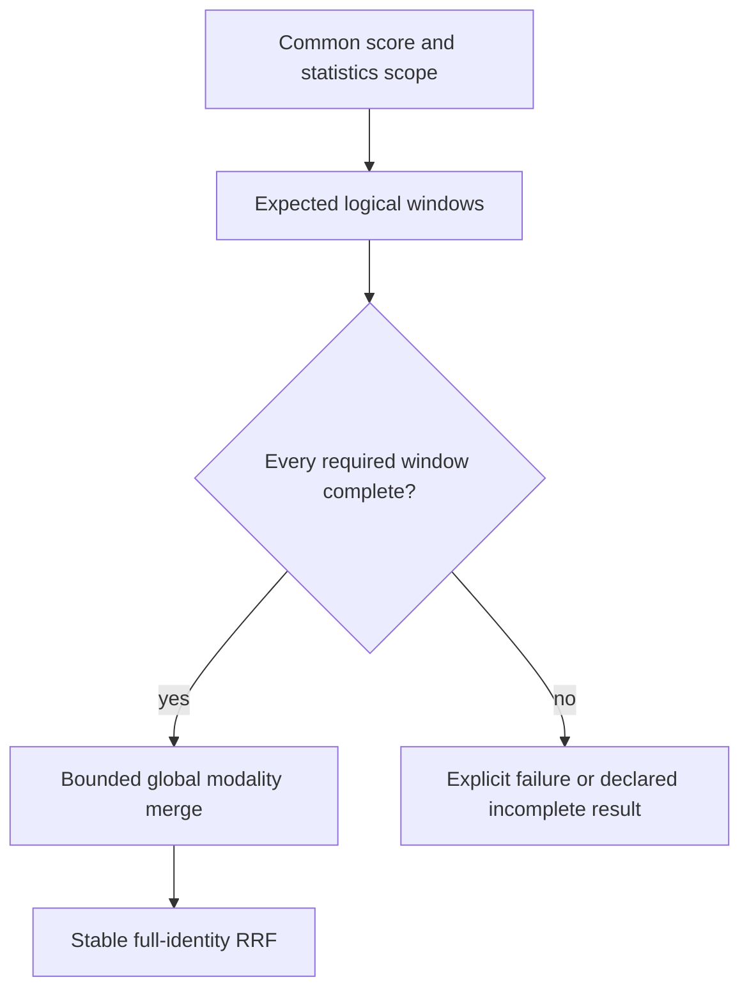

# ADR-096: Bounded comparable global modality windows before fusion

Status: Accepted for KL-057 R1 kernel; implementation and qualification pending.
Date:2026-10-04. Integration owner:root. Coding owner:Luna lifecycle_wave.

Current fusion tie-breaks only the entity Id and only sees one partition. Adopt
the internal kernel and actual local-adapter contract in
[GlobalBranchWindows](../Features/Search/GlobalBranchWindows.md), REQ/AC-RANK-001..004.
Global modality windows precede ranks/RRF, complete identities define tie order,
duplicates must agree, scores share exact profile/corpus/statistics witnesses,
and missing/approximate/truncated sources cannot masquerade as exhaustive output.

Implementation stages: root freezes internal contracts; lifecycle_wave owns new
Query Search Contracts/Models/Queries/Validation, the narrow SearchRankFusion join
and new independent UnitTests centralized/layout/bounds/completeness oracles in
a private patch. Root reviews the actual production caller, integrates, executes
Release/format/governance and Aspire unit/RF3, commits and records original exact
source Linux evidence. Later KL-037 stages must supply a real shard catalog,
native bounded fan-out, per-partition read-cut vector, current persisted policy
and strict text statistics generation before multi-shard claims.

No public client/persisted/replica format changes are accepted by R1; generated
internal aliases/IDs are frozen before any future inter-grain publication. Existing
native RF3 replicas remain replicas. Single-partition strict text remains valid
only within its current local scope. Rollback changes no canonical data; global
qualification and KL-057 closure require actual independent physical-shard results.

