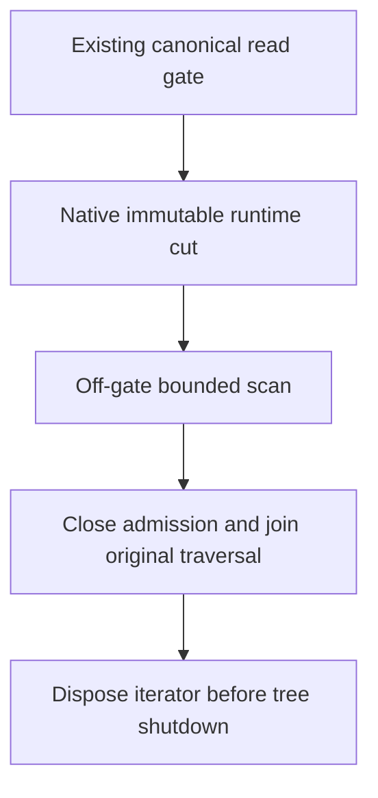

# ADR-097: Provider-owned native read-cut leases

Status: Accepted for KL-039 L2-A; implementation and qualification pending.
Date:2026-10-04. Integration owner:root. Coding owner:Luna query_wave.

Adopt [NativeReadCuts](../Features/StorageRecovery/NativeReadCuts.md),
REQ/AC-CUT-001..004, as the canonical contract. A native runtime snapshot pin is
preferable to unbounded copying or holding the canonical gate throughout an
index build. Keep one provider-owned finite lease, copied callback bytes, exact
scalar identity and joined shutdown. The existing gated-view interface remains
unchanged and cannot escape; the new capture entry is internal to the provider.

Implementation contract: root owns this ADR/spec and all shared joins; query_wave
owns disjoint StorageRecovery Models/Validation/Queries/Lifecycle native helpers,
the provider facade/runtime joins, the minimal pre-mutation InstallSnapshot
admission check in ZoneTreeCheckpointManager, and real-provider UnitTests. Implement capture,
bounded visitation, disposal, then mapped consistency/budget/lifetime tests.
Review exact file hashes, full Release build, format/governance, serialized Aspire
normal/scalar/recovery/RF3 and exact-SHA Linux results before qualification.

Pinned ZoneTree1.9.8 snapshot creation and iterator advance are synchronous and
non-cancellable. Check and charge before/after; do not claim an interruptible
deadline or abandon original work. No canonical format, native WAL, public wire,
RF3 topology or acknowledged-write authority changes. Leases are disposable on restart or activation movement and retain no signing
material. Rollback drains the actual
leases after stopping admission and removes only runtime helpers.

Whole-tree replacement must reject ResourceExhausted while a native cut is leased.
InstallSnapshot checks under its existing write gate after health/stale validation
and before staging, fault callbacks or publication. No waiting or poison-on-failure
replacement path is entered for this rejection. The gate also excludes a new
capture until replacement completes. Ordinary Compact does not replace the native
tree and remains allowed. Prove unchanged current health/identity after rejection,
successful installation after disposal, and exact old-cut reads after compaction.

Native disposal failure retains the actual unsettled iterator and active slot;
later attempts retry that same handle and concurrent callers join the actual
attempt. Clear ownership and release admission only after native disposal succeeds.
Keep primary plus cleanup failures. Budget reporting after successful cleanup
does not retain a closed handle. Construct scalar cut before opening the iterator.

Shutdown joins native leases before cache closing/tree disposal. Failed native
cleanup leaves tree/cache/owner handles owned for a subsequent joined retry and
closes new lease admission. Reentrant disposal while this thread holds the runtime
read/write gate rejects before state changes or waiting. Sequential prefix visits
share one snapshot, one active traversal and cumulative record/byte/advance/time
budgets; returned counters describe cumulative work across every visit.

L2-B remains responsible for same-cut outbox/policy/applied metadata and retention,
ordered delta catch-up, validated catalog switch and interrupted-build recovery.
Neither this primitive nor L1 leased generations alone closes the original
concurrent-write/online-index/restart acceptance criteria.

