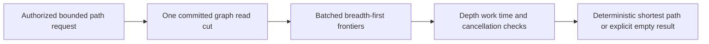

# ADR-098: Bounded authorized shortest paths

Status: Accepted; implementation and qualification pending, 2026-10-05.

KL-023 requires unweighted shortest paths and batched frontiers beyond existing
reachability. Select one versioned directed same-partition path operator over
native node-local ZoneTree adjacency in one current authorized committed cut.
Explicit depth frontiers batch local work without per-edge RPC. Orleans retains
one request grain and native ManagedCode CQRS; storage handles remain node-local.
A nonempty `Labels` predicate is authorized as field use of graph `/label`: the
persisted field policy's `RawUseGrant` is required even when the principal has a
separate `RawReadGrant`. Missing use authority returns `PermissionDenied` before
adjacency traversal; null/empty labels do not invoke that use check. An RF3
restart scenario asserting a filtered path must persist this grant before its
initial path read.

The implementation contract is [ShortestPath](../Features/GraphTraversal/ShortestPath.md),
REQ-GRAPH-007..010, AC-GRAPH-006..009, TASK-KL023-PATH. It freezes new version1
aliases/IDs, deterministic BFS ties, empty/zero-hop results, conservative metadata
retention, real read/time/cancellation caps, Q1.GraphPath.v1 literal/parameter
grammar and shared deadline. Existing ADR-004/005/010/014/034/082 continue to own
committed reads, keys, persisted authority and native routing/lifecycle.

Ordered stages and exact files/roles are in that contract: root freezes; private
Luna Core/contracts packet; independently authored real-store tests; root SQL
compile/parity; root Orleans/HTTP/SDK/official MCP and Aspire RF3 joins; full strict
checks and original delivered-source Linux evidence. The official MCP join also
updates ADR-039 and the independent ClientApi name/schema/hint oracle for both
shortest-path tools. The current independent canonical inventory has 68 names;
that inventory count is distinct from the three public gateway tools and must be
checked independently before real RF3 discovery qualification. Root owns all
shared/Git/acceptance joins. Workers cannot alter packages, shared configuration or formats.
Neither source presence nor focused passes complete KL-023; normal/scalar,
recovery and full RF3/client gates, including failover/revocation, remain required.

No canonical data, existing alias/ID, journal, placement or acknowledgement
changes occur. The request does not alter canonical stored data. Rollout adds explicit v1 capabilities;
unknown versions fail closed. Rollback removes new read registration without
rewriting acknowledged data. Weighted/cross-partition paths, full SQL/protocol
and measured performance leadership remain separate mandatory workstreams.
