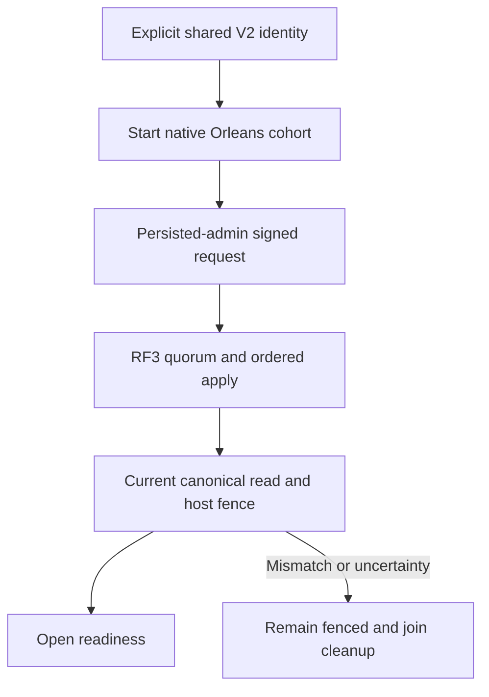

# ADR-099: RF3 physical shard catalog foundation

Status: Accepted, 2026-10-05; implementation and qualification pending.

## Decision and implementation contract

Implement [PhysicalShardCatalog](../Features/ClusterRouting/PhysicalShardCatalog.md)
REQ/AC-SCAT-001–004 before physical movement and distributed placement work.
The current three-voter RF3 cluster is one physical shard. Its independently
configured stable identity and revision1/placement epoch1 catalog live in
canonical ZoneTree, committed only through the ordinary signed separate request
grain/native ManagedCode CQRS/command grain/coordinator/quorum/atomic apply path.
No per-node bootstrap, sidecar, activation ID or replica count replaces that
authority. The linked feature freezes exact generated aliases/field IDs,
key bytes, command-ID digest/golden contract, idempotency, validation/bounds,
administrative trust boundary, read barrier, per-request host fence and tokens.

Ordered stages and joins: root freezes shared contract; partition_pages owns
private Abstractions/Core native bootstrap/read/validation and independent real
ZoneTree unit cases; dependency_closeout owns private AppHost V2 profile and
shared ID propagation; lifecycle_wave owns private Server startup/fence joins.
Every file is within the linked canonical slice/role map. Root alone integrates
shared enum/dispatcher/authorization/native codec/routing/interface-version
joins, checks full diff/hashes, builds and runs all gates, then joins independently
authored real Aspire RF3 client/cohort cases. Workers do not mutate checkout,
builds, tests, Git or user data during stable test cohorts.

Startup starts native Orleans membership, authenticates the persisted admin,
uses one real request grain for bootstrap, waits for its terminal result and
quorum read barrier, then validates exact committed host identity before public
readiness. Cancellation and shutdown join original tasks before closing physical
stores. Uncertain retry uses identical command ID/body, never an unbounded loop.
Later placement changes require their own fenced monotonic CAS/movement contract;
this foundation exposes no placement mutation and does not move handles/data.

The application request-interface version advances3 to4 in a homogeneous cold
rollout; peer-envelope and existing data-frame encodings stay unchanged. Strict
private profile V2 stores one ID for all voters. Existing profiles require a
separate explicit offline upgrade preserving credentials/incarnation/permissions
and verified backup. No automatic rewrite, legacy runtime fallback or migration
of user data is performed by source integration. Catalog/profile restoration
must agree; rollback uses verified pre-stage data/profile and homogeneous older
code. Do not infer old-reader compatibility with new native catalog records.

Verification: native serialization/golden/corrupt-record cases; actual canonical
ZoneTree bootstrap, retry/conflict/admin/bounds/reopen controls; profile stability
and explicit upgrade; genuine Aspire RF3 SDK/official MCP readiness, fence,
restart/unknown outcome, mixed-version and backup/rollback evidence; strict whole
Release, formatter/governance, unit/scalar/recovery and exact-source Linux
artifacts. Keep all original movement/endurance/fault/performance gates.
Source or local mechanism proof does not mark this ADR Implemented or close
KL-036/037/038/071/072/075. Frontend N/A: internal ownership metadata.

