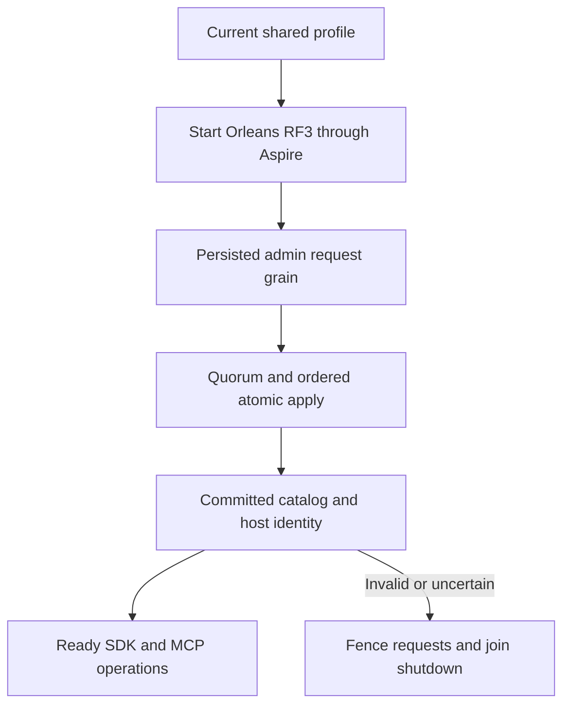

# ADR-099: RF3 physical shard catalog foundation

Status: Accepted, 2026-10-05; implementation and qualification pending.

Current-format recovery setup follows REQ/AC-SCAT-006 in the linked feature:
root adds a test-only native bootstrap/read-and-validate helper, then joins it
after persisted administrator setup in current positive CrashDatabase,
ReplicaCrashNode and ReadRoundStoredNode fixtures. It uses the actual configured
voters/store incarnation and UnixEpoch, preserves reopen identity, original
replica positions and all crash/replay assertions. The ordinary Core apply path
remains strict when the catalog is absent. Deliberately missing or corrupt
negative fixtures receive no bootstrap. Verify
through the sequential Aspire-owned recovery runner; this setup is not a
production quorum or movement qualification.

## Decision and implementation contract

Implement [PhysicalShardCatalog](../Features/ClusterRouting/PhysicalShardCatalog.md)
REQ/AC-SCAT-001–004 before physical movement and distributed placement work.
The current three-voter RF3 cluster is one physical shard. Its independently
configured stable identity and revision1/placement epoch1 catalog live in
canonical ZoneTree, committed only through the ordinary signed separate request
grain/native ManagedCode CQRS/command grain/coordinator/quorum/atomic apply path.
No per-node bootstrap, sidecar, activation ID or replica count replaces that
authority. The linked feature freezes exact generated aliases/field IDs,
key bytes, command-ID digest/golden contract, idempotency, validation/bounds,
administrative trust boundary, read barrier, per-request host fence and tokens.

Ordered stages and joins: root freezes shared contract; partition_pages owns
private Abstractions/Core native bootstrap/read/validation and independent real
ZoneTree unit cases; dependency_closeout owns private AppHost V2 profile and
shared ID propagation; lifecycle_wave owns private Server startup/fence joins.
Every file is within the linked canonical slice/role map. Root alone integrates
shared enum/dispatcher/authorization/native codec/routing/interface-version
joins, checks full diff/hashes, builds and runs all gates, then joins independently
authored real Aspire RF3 client/cohort cases. Workers do not mutate checkout,
builds, tests, Git or user data during stable test cohorts.

Startup starts native Orleans membership, authenticates the persisted admin,
uses one real request grain for bootstrap, waits for its terminal result and
quorum read barrier, then validates exact committed host identity before public
readiness. Cancellation and shutdown join original tasks before closing physical
stores. Uncertain retry uses identical command ID/body, never an unbounded loop.
Later placement changes require their own fenced monotonic CAS/movement contract;
this foundation exposes no placement mutation and does not move handles/data.

The current application request interface is version4. Its peer-envelope and
data-frame identities remain exact. The strict private profile V2 stores one
physical-shard ID for all voters and is created in that form. Startup accepts
only the current profile and validates it against the committed catalog without
rewriting either. All three Aspire resources use the verified current image.
Current-format backup/restore preserves complete catalog/profile authority;
rollback restores a coherent source checkpoint with the current reader.

### Native configured voter identity

Catalog Record and Bootstrap VoterIds use `ImmutableArray<string>` and preserve exact ordered native `ReplicaConfiguration.VoterIds`, with ordinal comparison. No replica-config type change or Guid projection is permitted. Reject null/whitespace values, more than3 voters, duplicates and identities over512 UTF-8 bytes before encoding; retain the8192-byte encoded envelope limit. Malformed persisted values fail Corruption. Native tests cover non-ASCII, exact512 and513 bytes, null/whitespace and ordinal-distinct values. Physical shard/incarnation Guid semantics and stable aliases/field IDs remain exact.

## Verification and integration

Required flows are native codec/corrupt-record rejection, real ZoneTree catalog
bootstrap/retry/conflict/admin/bounds/reopen, strict current-profile loading,
current-image Aspire RF3 SDK/official MCP readiness and physical-identity
mismatch with denied-write state preservation and healthy recovery. Retain
current capability and signed-purpose rejection, real process recovery,
unknown-result retry and joined shutdown. Full enabled Release, formatter,
governance, analyzers, normal/scalar/recovery and exact-source Linux RF3 remain
mandatory. Root owns shared joins and final proof; local source review or image
build alone closes no task. Physical movement, endurance and performance gates
remain distinct. Frontend is N/A: this is internal ownership metadata.

# TASK-SCAT-RF3-MISMATCH-SURVIVOR-READINESS

The accepted AC-SCAT-003 mismatch flow must join native Aspire health for the
two correctly configured survivors before their existing HTTP200 assertions.
Use the unchanged parent cancellation/deadline and native notification API;
the deliberately conflicting voter is still checked by its original HTTP503
or observed terminal-process denial. Root owns the feature-local mismatch
assertion helper, then runs the actual test-owned Docker RF3 case with the
verified current image. All denied-write, corrected-wave, SDK/MCP, disposal
and state-preservation checks remain mandatory. This fixture admission join
does not change product readiness, quorum or fencing behavior.

The mismatch flow's corrected-wave oracle uses its own exact seeded
RequestCqrsRf3Workload.InitialDocuments[0] for document-00. R204 exposed an
unrelated McpDocumentProtocol.InitialJson expectation at that final assertion.
Root changes only the existing mismatch case argument/import, retaining native
survivor health, conflicting-voter denial, revision/receipt/all-voter byte
equality, denied-write absence and joined cleanup. Rerun the actual RF3 case;
this changes no product behavior or standalone Unicode/restart oracle.

R206's actual native TUnit/Aspire Docker RF3 mismatch case passed every retained
denial, corrected-wave and exact SDK/MCP state assertion. PhysicalShardCatalog
records its original source/assembly-bound TRX identity. This local fixture
proof does not close complete current-source Linux RF3 or other shard criteria.

### First native replica prerequisite before catalog authentication

TASK-KL036-CATALOG-STARTUP-READY-001 implements REQ-SCAT-003 / AC-SCAT-003 and the same native startup boundary required by KL036's complete public-parent RF3 flows. Inside the existing catalog InitializeAsync ExecutionLifetime, owning TimeProvider and linked original cancellation, await local attached transport, an actual configured observed leader, positive durable term/committed prefix, locally applied committed prefix, and fresh authenticated compatible RF3 cohort. A local leader must additionally pass the existing native IsLeaderAsync committed-current-term readiness check. A follower's observed prefix is only a prerequisite, never a claimed current-term quorum proof. The immediately following original unique-grain authentication and fresh real quorum barrier remain unchanged and decisive; any subsequent leadership loss fails through that original boundary. No authentication/read request is retried, no deadline is reset, no capacity/window/limit/default is added, and startup remains closed on cancellation, poison, incompatible/missing cohort or catalog mismatch.

Native replica transport attaches and starts election/heartbeat maintenance during GrainService.Init before built.StartAsync returns. Early configured-peer discovery is independent of catalog and runtime-journal admission; native election/critical heartbeat commits the first readiness entry through the existing node-local materializer. Consequently this wait does not depend on the catalog admission it precedes. It observes only native owner state and uses its existing centrally validated heartbeat cadence. It does not infer readiness from a Running container, Orleans membership, directory registration or fixture metadata.

Automated operation regressions are the existing genuine two-RF3 public-parent linked-model SDK/official MCP/Q1 A→B→A/cold flow, all four expired-retire cancellation whole flows and the parent capacity whole flow. They each must actually reach the database operation after all six owned servers start; existing catalog mismatch/denied/corrected-wave cases remain mandatory. No getter-only fixture or separate dispatcher is introduced. Source55f normal/scalar all six RF3 cases failed before DB flow: node4/5 original logs show QuorumRead NoLeader during catalog authentication, node6 fails compatible-cohort admission. Missing initial native prerequisite is a source-backed ordering defect; successful execution of this correction remains unobserved and must not be inferred from those failed originals. Full normal/scalar/Linux RF3 qualification remains open, as does the separate same-sealed late-retire MissingAuthority proof.
