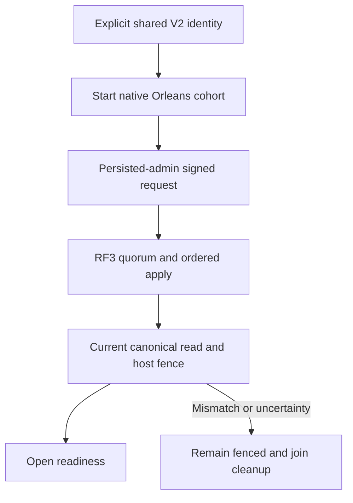

# ADR-099: RF3 physical shard catalog foundation

Status: Accepted, 2026-10-05; implementation and qualification pending.

Current-format recovery setup follows REQ/AC-SCAT-006 in the linked feature:
root adds a test-only native bootstrap/read-and-validate helper, then joins it
after persisted administrator setup in current positive CrashDatabase,
ReplicaCrashNode and ReadRoundStoredNode fixtures. It uses the actual configured
voters/store incarnation and UnixEpoch, preserves reopen identity, original
replica positions and all crash/replay assertions. The ordinary Core apply path
remains strict when the catalog is absent. Genuine prior source/image drivers
and deliberately missing/corrupt negative fixtures receive no bootstrap. Verify
through the sequential Aspire-owned recovery runner; this setup is not a
production quorum or movement qualification.

## Decision and implementation contract

Implement [PhysicalShardCatalog](../Features/ClusterRouting/PhysicalShardCatalog.md)
REQ/AC-SCAT-001–004 before physical movement and distributed placement work.
The current three-voter RF3 cluster is one physical shard. Its independently
configured stable identity and revision1/placement epoch1 catalog live in
canonical ZoneTree, committed only through the ordinary signed separate request
grain/native ManagedCode CQRS/command grain/coordinator/quorum/atomic apply path.
No per-node bootstrap, sidecar, activation ID or replica count replaces that
authority. The linked feature freezes exact generated aliases/field IDs,
key bytes, command-ID digest/golden contract, idempotency, validation/bounds,
administrative trust boundary, read barrier, per-request host fence and tokens.

Ordered stages and joins: root freezes shared contract; partition_pages owns
private Abstractions/Core native bootstrap/read/validation and independent real
ZoneTree unit cases; dependency_closeout owns private AppHost V2 profile and
shared ID propagation; lifecycle_wave owns private Server startup/fence joins.
Every file is within the linked canonical slice/role map. Root alone integrates
shared enum/dispatcher/authorization/native codec/routing/interface-version
joins, checks full diff/hashes, builds and runs all gates, then joins independently
authored real Aspire RF3 client/cohort cases. Workers do not mutate checkout,
builds, tests, Git or user data during stable test cohorts.

Startup starts native Orleans membership, authenticates the persisted admin,
uses one real request grain for bootstrap, waits for its terminal result and
quorum read barrier, then validates exact committed host identity before public
readiness. Cancellation and shutdown join original tasks before closing physical
stores. Uncertain retry uses identical command ID/body, never an unbounded loop.
Later placement changes require their own fenced monotonic CAS/movement contract;
this foundation exposes no placement mutation and does not move handles/data.

The application request-interface version advances3 to4 in a homogeneous cold
rollout; peer-envelope and existing data-frame encodings stay unchanged. Strict
private profile V2 stores one ID for all voters. Existing profiles require a
separate explicit offline upgrade preserving credentials/incarnation/permissions
and verified backup. No automatic rewrite, legacy runtime fallback or migration
of user data is performed by source integration. Catalog/profile restoration
must agree; rollback uses verified pre-stage data/profile and homogeneous older
code. Do not infer old-reader compatibility with new native catalog records.

### Native configured voter identity

Catalog Record and Bootstrap VoterIds use `ImmutableArray<string>` and preserve exact ordered native `ReplicaConfiguration.VoterIds`, with ordinal comparison. No replica-config type change or Guid projection is permitted. Reject null/whitespace values, more than3 voters, duplicates and identities over512 UTF-8 bytes before encoding; retain the8192-byte encoded envelope limit. Malformed persisted values fail Corruption. Native tests cover non-ASCII, exact512 and513 bytes, null/whitespace and ordinal-distinct values. Physical shard/incarnation Guid semantics and frozen new alias/field IDs remain unchanged. This corrects the unpublished catalog draft to the actual native configuration API.

### Frozen interface3→4 image and RF3 cohort stage

The genuine prior application image source is commit `1e8833c027cf232e35fe012cd3eed41c61a17f89` (request alias `keyload.request.v2`, interface3, data epoch7, peer envelope3). Preserve original run `37292025093` attempt1 and artifact ID `11340156317` without mutation; its manifest and image digest establish source/image build provenance, not RF3 runtime qualification or registry retention. Every delivered Linux `docker-rf3` run re-exports that exact commit and builds an independently inspected run-bound prior3 image in its owned registry. Current v4 images retain the current-source receipt path. Each actual Aspire resource must match the corresponding prior3/current4 receipt before start. Native5 and RPC1 proofs remain separate.

The cold homogeneous3 wave uses a current-AppHost-created test-only V2 profile and a fresh test-owned data root. The v2 profile is copied byte-for-byte across waves. Server3 does not read the AppHost profile file; this configuration is not evidence that Server3 created/reopened V2 and makes no assertion about original V1 profile compatibility. Explicit V1→V2 conversion remains disposable test-owned offline work with a verified original-byte backup, separate from the Server3→4 data/image cohort.

The sole operator CLI is `dotnet run --project src/KeyLoad.AppHost --configuration Release -- --keyload-profile-upgrade-v1-to-v2 --data-root <absolute-data-root>`. It requires that exact ordered argument set and an absolute path to an existing profile directory; malformed, partial, mixed or extra arguments fail closed. Dispatch precedes Aspire builder creation and returns after the existing bounded offline converter, so this command never starts cluster/test resources. The operator must first stop all KeyLoad/AppHost processes that could access the root and prevent concurrent mutation; profile inspection cannot establish exclusive ownership. Success and failure output are fixed and contain neither credentials nor generated identity. The command is never part of startup or automatic qualification conversion, and it must be exercised only against disposable operator-controlled data.

After SDK/official MCP baseline operations, stop and join homogeneous3, then make independently verified pre-upgrade data/profile copies for cold-upgrade, mixed, and rollback paths. Run all3 interface4 nodes homogeneously on the upgrade copy; require actual readiness, preserved caller-visible state and a native stopped-store oracle that proves exactly the committed catalog tuple matches V2 profile ID, incarnation, ordered voters, revision1 and placement epoch1. On a separate pre-upgrade copy run one4/two3 with equal explicit identity; prove signed interface3 discovery and closed readiness/SDK admission on the interface4 voter only. Do not claim the older interface3 majority is fenced and never open catalog-bearing data with interface3. Rollback restores the verified untouched pre-upgrade copy and starts all3 interface3 nodes homogeneously; it does not claim in-place compatibility or rollback of writes accepted after the catalog commit. Verify the backup and original artifact inventory remain unchanged.

File ownership: root owns the exact source pin approval, shared v4 protocol/NodeOptions, AppHost protocol-cohort image mode and ClusterResources joins, CI image receipt/environment workflow, existing shared RequestCqrs image/wave startup changes, and scripts/Features/ClusterRouting/AGENTS.md. dependency_closeout owns the AppHost `ClusterProfileUpgradeCommand` and its early `KeyLoadAppHostApplication` dispatch, focused real temporary-profile unit cases, new scripts/Features/ClusterRouting/interface3-server-source.mjs, interface3-server-proof.mjs, prepare-interface3-server-image.mjs and verify-interface3-server-image.mjs; new tests/KeyLoad.IntegrationTests/Features/ClusterRouting/Helpers/RequestCqrsRf3Interface3ImageProof.cs; `tests/KeyLoad.UnitTests/Features/ClusterRouting/Cases/Interface3ServerSourceTests.cs`, its Helpers Node probe and Models result; and the already assigned AppHost profile files. partition_pages owns only new RF3 acceptance Cases/Assertions/Helpers. lifecycle_wave owns Server startup/catalog gates. Root reviews and joins all hashes, then runs every strict gate and actual Linux RF3 suite. Image/source evidence or a green image build is not RF3 cohort qualification.

### AC-SCAT-004 immutable interface3 source/export regression

The Aspire-owned Unit TUnit child adds `tests/KeyLoad.UnitTests/Features/ClusterRouting/Cases/Interface3ServerSourceTests.cs` and its populated Helpers raw-Node probe. It imports the actual `interface3-server-proof.mjs` module closure and calls the actual `interface3-server-source.mjs` exports against the test runner's real repository workspace and frozen commit `1e8833c027cf232e35fe012cd3eed41c61a17f89`; the probe does not synthesize GitHub identity or substitute a fake Git provider. It requires `repositoryWorkspace` to remain the real Git checkout while `workspace` is the extracted archive directory without `.git`, then revalidates the same pinned Git tree and extracted-file inventory. Snapshot the retained archive and inventory sidecar's bytes/hash and file identity before and after both export revalidation and actual retained-archive verification; cleanup must remove all test-owned source/evidence roots. This mechanism test catches broken module imports and the checkout-versus-extracted-workspace regression. It is not image receipt or RF3 cohort evidence.

Verification: native serialization/golden/corrupt-record cases; actual canonical
ZoneTree bootstrap, retry/conflict/admin/bounds/reopen controls; profile stability,
strict offline CLI dispatch and explicit upgrade; genuine Aspire RF3 SDK/official MCP readiness, fence,
restart/unknown outcome, mixed-version and backup/rollback evidence; strict whole
Release, formatter/governance, unit/scalar/recovery and exact-source Linux
artifacts. Keep all original movement/endurance/fault/performance gates.
Source or local mechanism proof does not mark this ADR Implemented or close
KL-036/037/038/071/072/075. Frontend N/A: internal ownership metadata.

### Mixed-version server-observation test seam (REQ/AC-SCAT-005)

The mixed3/4 test must prove what the interface4 server actually authenticated
and identity-validated. Direct authenticated native replies to the test client
are insufficient because they do not observe the newer server’s peer-check path.
Add an internal, test-only sink at the existing `ReplicaCohortDiscovery` point
that receives a successful result only after the existing signed-byte
verification and `ReplicaDiscoveryIdentity` exact voter/cluster/incarnation/address
validation. The same production result then continues through existing cache and
compatibility logic. No new discovery transport/client, public API/endpoint, peer
wire field, authorization input or compatibility branch is introduced. Absence
of a sink preserves production behavior exactly.

The existing private `RequestCqrsProbeObserver` is the only intended sink for
the RF3 test. Add one strict private `DiscoveryCaptureMode` setting: absent or
`disabled` by default; `mixed-interface3-v1` is accepted only for the SCAT mixed
fixture with the existing private probe/session and actual fixed RF3 config.
Unknown/malformed/inconsistent modes fail validation. Existing request-probe and
readiness tests retain capture disabled. Sink registration is limited to this
explicit mode and its already validated private probe configuration. The observer captures only local and remote configured voter
IDs, app RPC/envelope versions and transport/compatibility booleans in a stable
version1 typed record with exact property/JSON names `Version:int`, `Kind:string`,
`SessionId:string`, `ObserverVoterId:string`, `PeerVoterId:string`,
`ApplicationRpcVersion:int`, `PeerEnvelopeVersion:int`, `TransportReady:bool`
and `ProtocolCompatible:bool`. It excludes silo addresses, raw bytes, signatures, nonces,
secrets, exception details and user payload. Both IDs are validated against the
actual ordered `ReplicaConfiguration.VoterIds` using ordinal equality. The fixed filenames are `discovery-00.json` and `discovery-01.json`; production
RF3 is capped at the two fixed remote voters and each gets one immutable
slot/record for the first protocol-incompatible observation. An exact duplicate is idempotent. A later
record with identical peer identity and protocol versions but a different actual
`TransportReady` flag is accepted without replacing the first record or failing;
readiness is time-varying and the recorded value must not be synthesized. Any peer identity, RPC/envelope-version or incompatible-status conflict remains
an observed bounded probe failure.
Existing strict private probe owner/session, no-symlink/private-mode,
atomic-file, 8,192-byte record, 400-file and 1,048,576-byte aggregate checks
remain in force, with the new records included in both inventory and limits.

Await the callback inline with the exact token used by the original native
discovery attempt, which already carries its startup/request cancellation and
existing attempt timeout. Do not create a separate deadline/token, detached
writer or unbounded queue. Place the callback outside the native transport
try/catch that maps its own timeout/cancellation to unavailable; callback
write/cancellation/validation failures are visible failures when this explicit
test mode is active, never swallowed or relabeled as transport outcomes. Keep the
existing discovery-gate release in `finally`. They cannot
change authorization, compatibility, recovery or readiness policy, and no sink
is registered in normal product operation. Keep evidence alive after a failed
server process; test-owned cleanup occurs only after all Aspire resources are
stopped and joined. Read and validate evidence after join, retaining the root on
any failed assertion or cleanup.

Implementation ownership is narrow: AppHost changes are limited to its
`src/KeyLoad.AppHost/Features/ClusterRouting/Helpers/RequestCqrsProbeProfileSettingsReader.cs`,
`Helpers/RequestCqrsProbeProfile.cs`, `Models/RequestCqrsProbeProfileSettings.cs`
and focused UnitTests profile-admission cases proving default-mode rejection and
the exact one-v4/two-identical-v3 exception. They preserve same-image and
protocol-cohort rejection by default and admit only the exact mixed shape described
above. Root owns shared wave/helper argument joins. The Orleans worker adds only
the internal post-validation callback and sink seam at
`src/KeyLoad.Orleans/Features/ClusterReplication/Discovery/ReplicaCohortDiscovery.cs`
plus its role-local internal sink contract/registration. The Server worker extends
only `src/KeyLoad.Server/Features/ClusterRouting/Execution/RequestCqrsProbeObserver.cs`,
`Execution/RequestCqrsProbeObserverFactory.cs`, the strict probe options reader,
`Contracts/RequestCqrsProbeProtocol.cs` and role-local observation record, plus
`Serialization/RequestCqrsProbeFiles.cs`, `Serialization/RequestCqrsProbeJson.cs`
and `Serialization/RequestCqrsProbeRecords.cs`. The integration worker extends only the already-owned private
`PhysicalShardCatalogInterface34` scenario/assertion files and adds any role-local
private probe record reader/assertion under
`tests/KeyLoad.IntegrationTests/Features/ClusterRouting/`; root owns all shared
wave/startup joins. Root joins the internal
DI/registration boundary. Do not edit the shared native
wire contracts or existing cohort compatibility semantics. AC-SCAT-005 requires
actual v4 observer records for both v3 peers with exact IDs, versions3/3 and
incompatible status; it reports each real transport-ready flag without asserting
its value, plus the existing readiness and SDK admission fence and full wave
cleanup. A terminal resource is evaluated from its real Aspire state and
retained private records, not an invented response from a dead endpoint.

# SCAT-005 mixed-node1 observable amendment

For mixed node1 interface4 startup, keep the observation sink validation and post-wave evidence read unchanged. Before the same wave is stopped, make one unique, admin-authorized new-document write attempt through the real .NET SDK and official MCP client and evaluate node1's actual observed state:

- If readiness returns HTTP 503, require SDK `OwnershipLost` and official MCP `OwnershipLost` with `dispatched: false` (or its actual HTTP 503 admission rejection).
- If readiness fails with an `HttpRequestException` with no HTTP status, require Aspire to report node1 as `Exited`, `FailedToStart`, or `Finished`; require the SDK to report `UnknownWriteOutcome` and official MCP connection failure with no HTTP status. Do not call a dead endpoint a 503 response.
- Any other readiness status, client response, missing terminal state, or cleanup error fails the case.

After the wave runner has stopped and joined all Aspire resources, open each actual mixed-copy node store sequentially with the existing `NodeEpochRf3OfflineOptions`, `PartitionHost`, persisted `AuthorizationPolicy`, `CommandAdmissionGovernor`, native ZoneTree storage, system clock, and native logger. Query the attempted unique `EntityRef` as the persisted administrator and require it to be absent on every voter. Dispose each host before opening the next store. This proves the denied/uncertain attempted write did not commit, without assuming the result based only on a client error.

The case still independently verifies digest-pinned current4/prior3 image receipts before wave start, reads exactly the two node1 private native-authenticated records only after runner stop/join, and requires observer node1, exact configured node2/node3 IDs, versions3/3 and `ProtocolCompatible=false`, retaining each truthful `TransportReady` value. The existing `RequestCqrsRf3Epoch7WaveRunner` and wave cleanup remain the resource owners. Evidence stays intact on any failure; delete its private owner tree only after successful typed-record, readiness/admission, no-write, and wave-cleanup assertions.

Ownership is only new `PhysicalShardCatalogInterface34` assertion/oracle helpers and its existing mixed runner wiring, plus the explicitly approved two-name private probe file allowlist/quota/cleanup extension. This is a test-owned assertion seam only: no Server startup or compatibility changes, no public endpoint, no fake provider, no shared runner changes, no timeout enlargement, and no claim that older interface3 nodes are fenced.

### Exact mixed-mode native startup observation

Only when the explicit private fixture has CaptureDiscovery=true and the verified node1=current4/node2=node3=prior3 image model is selected, the shared wave may transfer ownership after node1 reaches actual Running, Exited, FailedToStart or Finished; nodes2/3 still require actual Running. All other existing waves keep their existing healthy/Running rules. This transfer permits the frozen live503 or statusless terminal denial assertions to observe the original process; it does not establish readiness or success. Preserve the original single wave deadline, original cancellation and full stop/join ownership. Root owns the role-local RequestCqrsRf3WaveArguments argument helper and startup readiness seam.

Root integration keeps probe record emission in Execution/RequestCqrsProbeDiscoveryObservation.cs, native path/permission checks in Validation/RequestCqrsProbePaths.cs, and serialized inventory reads in RequestCqrsProbeFiles. These role-local extractions preserve callback order, the original native attempt token, exact file bounds and strict failure behavior.
