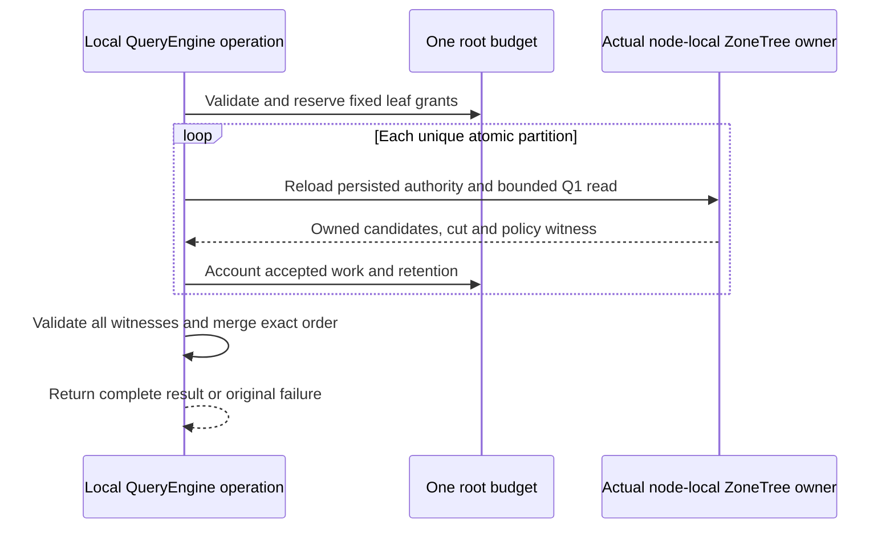

# ADR-100: Internal bounded Q1 merge across local atomic partitions

Status: Accepted; implementation and qualification pending.
Date: 2026-10-05. Related work: KL-037 prerequisite only.

The accepted TASK-DQUERY-CANCEL-OBSERVATION amendment implements
AC-DQUERY-PREREQ-005 with an already-armed, owned native observation thread and
the unchanged synchronous real ZoneTree query. Exact case/helper ownership,
15-second observation/join bounds, original token/budget, no-result and healthy
follow-up requirements are frozen in DistributedQueryExecution before code.
Root owns review, joins and Aspire normal/scalar/full-gate evidence;
dependency_closeout owns the private test packet. Preserve the earlier failed
original report. No product boundary, data/wire format or migration changes;
rollback may revert this test synchronization but cannot weaken its assertions.

## Context

KL-037's original target requires query fan-out across logical shards. The
current deployed architecture and catalog work do not establish multiple
independent physical owners: one RF3 physical shard can contain many atomic
partitions, and its replicas are copies. `QueryRequest` addresses one
`PartitionRef`; `QueryEngine.Execute` performs one local authorized query.
Calling several partitions on the same local `DatabaseEngine` a distributed
query, or counting RF3 voters as query shards, would be false evidence.

The safe first code stage is therefore an internal prerequisite: exercise the
real Q1 leaf operator on multiple atomic partitions in one `TestDatabase`, then
merge only its bounded owned results. It prepares generated native structures
and verifies correct order/cut/policy bookkeeping without publishing a route or
calling another grain. The existing signed request identity, persisted
authorization, `QueryEngine` admission/compiler and `DatabaseEngine.WithQueryView`
remain authoritative.

## Decision

Add five internal Orleans-generated value types under the QueryExecution
feature: `PartitionQueryPlanV1`, `PartitionQueryLeafPlanV1`,
`PartitionQueryCandidateV1`, `PartitionQueryLeafResultV1`, and
`PartitionQueryResultV1`, with aliases and IDs frozen in
`DistributedQueryExecution.md`. The plan is valid only for 1–8 unique atomic
partitions all executed by the same actual store owner identity. It carries no
trusted principal or caller-selected physical placement. A leaf plan carries
one identical normalized Q1 AST with only `PartitionRef` varied and a fixed
resource grant. The executor uses the authenticated principal already passed
to QueryEngine; each leaf reloads persisted principal/resource policy through
the existing read path.

Capture canonical encoded Q1 order keys while each document is still an
authorized pre-projection candidate. Retain only the requested local top-L,
including full `EntityRef` and projected/redacted `QueryRow`; never export
borrowed database views or raw unprojected documents. Merge with order-key
direction followed by ordinal full-identity components. Preserve a vector of
per-leaf owner, read-generation, cut, policy and schema witnesses; there is no
single cross-partition snapshot position. Require the same owner and policy
epoch for every leaf, fail the whole result on a missing/denied/inconsistent
leaf, and expose no partial rows.

Allocate deterministic fixed per-leaf record, raw-byte and retained-byte
shares before starting any leaf. Sum of grants stays within current configured
limits after one parse/admission charge. Every leaf enforces its share while
scanning and before retaining candidates. The merger reserves bounded
retention before accepting native results and returns no more than current
`MaxResults`. There is no work stealing. A root token and the existing single
operation deadline cover parse, all leaves and merge. Current local leaf calls
are synchronous, so this ADR does not claim remote capacity/backpressure or
slow-owner settlement.

## Ordered implementation and evidence

1. Root accepts the exact requirements, aliases/IDs, comparator, fixed-grant
   arithmetic, error map and truthful limitations in
   `docs/Features/QueryExecution/DistributedQueryExecution.md`.
2. Query adds only feature-local internal contracts, models, validation,
   coordinator and leaf execution helpers. It reuses `QueryValidation`,
   `QueryEngine` admission, SQL compiler, `PreparedQuery` sort encoding,
   `QueryCandidateReader`, and `DatabaseEngine.WithQueryView`. The internal native read-grant seam frozen in the linked feature
   enforces every raw scan/lookup before decoding or copying.
3. UnitTests seed real ZoneTree records in at least two distinct
   `PartitionRef`s using `TestDatabase`. Expected order and result projection
   come from a separate seeded scalar model, not from production leaf order or
   merger code. Include ties, hidden sort fields, duplicate textual IDs,
   persisted permission denial/revocation, all global exact/one-over budgets,
   invalid plan shape, cancellation after observed actual read bytes and a
   healthy follow-up. Assert positions and policy witnesses per leaf; never
   assert a synthetic scalar global cut.
4. Root owns complete solution build/format/governance and Aspire suites after
   joining the private stage. Passing local unit tests only qualify this
   prerequisite implementation. KL-037 remains pending all actual independent
   owner, native Orleans, SDK/official MCP, fault, bounded fan-out and Linux
   delivered-source acceptance.

## Rollback and exclusions

Remove only the new internal plan/leaf/merge code and its tests after stopping
any future internal caller. This stage writes no data and changes no persisted
format, public DTO, query grammar, server route, SDK/MCP tool, Orleans grain
dispatcher, catalog, physical placement, token/cursor, index, or authorization
policy. No migration is required. Do not add test-only delays, fake leaf
providers, synthetic shard identities, or a private RF3 topology. The future
KL-037 contract must separately define independent physical placement, catalog
epoch fencing, per-owner authenticated execution, fan-out/backpressure,
slow-owner timeout/cancel/join, all-owner failure, SDK/MCP results and actual
Aspire RF3 evidence.

## Ownership and join points

The canonical file and role map is in the linked feature specification.
`lifecycle_wave` owns the five generated values and Query validation, leaf,
merge and native multi-partition test helpers. `partition_pages` owns only the
separately frozen Core raw-byte grant seam and its native regressions. The Query worker supplies the narrow private QueryEngine integration; Root
owns its join, policy/docs review, whole solution
build and format, Aspire execution, evidence and all-source stage commit.
There is one existing local query read capability and no second dispatcher.

The explicit ResourceExecution dependency is now frozen in the linked
feature: internal CreateReadGrant(maximumBytes, maximumRecords) returns
ReadExecutionBudgetReadGrant;
accepted native bytes convert fixed reserved capacity before decode/copy.
Core adds only KeyLoad.Query friend visibility and actual native regressions.
The native grant cases are split by responsibility into
ReadExecutionBudgetGrantPointTests, ReadExecutionBudgetGrantRangeTests,
ReadExecutionBudgetGrantReservationTests and
ReadExecutionBudgetGrantCancellationTests, sharing only the actual ZoneTree
seed helper ReadExecutionBudgetGrantSeed. The original assertions and native
read callbacks remain intact; the split satisfies the mandatory type-size limit.
This ADR does not authorize fresh per-leaf deadlines, post-hoc accounting,
changing public Q1 tie ordering or enlarging any configured limit.

Both raw-byte and examined-attempt reservations convert before native read
callbacks; point misses and charged range lookahead count one each. The
feature freezes the exact conservative retention constants/formula and the
leaf-array transfer peak, with alias-aware candidate payload ownership. These
model logical retained state and do not establish peak process RSS.

The accepted local top-L implementation uses a custom L+1-reference binary
heap for the internal partition leaf, with full EntityRef ties before selection.
The public Q1 PriorityQueue path keeps its existing UTF-8 EntityId comparator.
Reserve each exact candidate payload before heap insertion; rejection must
leave prior heap/output unchanged. Reserve the final leaf array while scratch
is still held, clear and relinquish the scratch container, then release its
reservation. At most one callback-local temporary projection/order encoding
is bounded by admitted raw bytes and document limits. Execution helpers,
including retained-byte arithmetic, belong in QueryExecution/Execution.

The narrow integration is an internal PartitionQueryExecution extension in
QueryExecution/Execution plus one internal QueryEngine owner accessor. It
reuses existing Bind/Project and the actual DatabaseEngine, keeping the shared
QueryEngine within the mandatory type-size limit without a second dispatcher.
Generated aliases use named constants with their exact frozen strings.

## TASK-PQUERY-PUBLIC accepted implementation contract

The linked DistributedQueryExecution feature freezes REQ/AC-PQUERY-001 through 006, public generated aliases/IDs, the exact bounded same-view metadata grant and conservative public mapping retention before code. Stage remains accepted, with implementation and qualification pending.

1. Root joins the accepted PMAP public foundation and native command/read dispatch, then its complete SDK/MCP and independent oracle corpus. Existing aliases, numeric enum values and administrator gates remain unchanged.
2. The Core agent owns only the authorized-query same-view resolver and actual ZoneTree grant/corruption regressions in ClusterRouting/Queries and the corresponding unit slice. It accepts the actual existing leaf grant and cannot open a second read view or bypass budget accounting.
3. The Query agent owns feature-local generated public DTOs/aliases, strict request validation, same-owner execution overload, fresh leaf metadata checks, conservative public mapper and focused contract/budget/order/authorization cases. Existing internal local merge semantics and public Q1 ordering stay unchanged.
4. Root owns the immutable server PhysicalShardRecord registration from configured PartitionHost/NodeOptions, DatabaseReadGrain/GrainQueryReadCapabilities join, append-only read kind, public route and SDK/MCP inventories, generated-native corpus and actual RF3 client regressions. The first public request can execute only after the existing successful catalog fence, and every leaf compares fresh SCAT/PMAP evidence with the immutable host tuple.
5. Root runs required Release build, formatter/analyzers and Aspire-owned focused/full unit, scalar, recovery and RF3 suites. Remote fan-out, independent physical owners, SQL grammar, cursors, global cuts, movement and split/merge remain separate unqualified requirements.

The wire addition is append-only and versioned; no committed storage-format change occurs. Rollout requires clients and servers with the typed new capability, and older servers reject it through the existing unsupported-capability path. Rollback removes exposure of the new route/kind from the deployment without changing retained committed SCAT/PMAP records or their corruption checks. Root serializes source integration and owns the complete-stage commit/push; agents prepare scoped immutable packets. The feature names exact automated acceptance cases and final evidence. This amendment does not mark the ADR implemented or KL-037 complete.

Per-leaf PMAP directory/row revisions and fallback state are validated against that leaf's own same-view records. Bound and fallback partitions with the same physical owner remain valid together; their row revisions/fallback states can differ, and directory revisions can differ across the retained per-leaf cuts. Cross-leaf equality covers the full owner tuple plus existing node/incarnation/read-generation/policy witnesses, without a global snapshot.

The same-view Core helper is static because it uses only the already authorized borrowed view, complete partition and actual leaf grant. This implementation modifier adds no API, authority, storage view or state.
