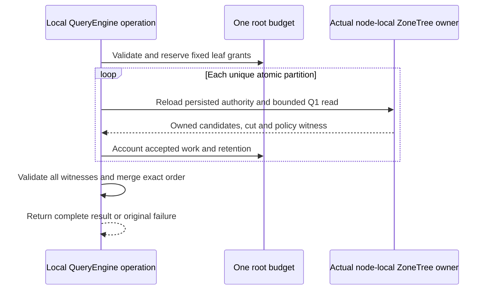

# ADR-100: Internal bounded Q1 merge across local atomic partitions

Status: Accepted; implementation and qualification pending.
Date: 2026-10-05. Related work: KL-037 prerequisite only.

The accepted TASK-DQUERY-CANCEL-OBSERVATION amendment implements
AC-DQUERY-PREREQ-005 with an already-armed, owned native observation thread and
the unchanged synchronous real ZoneTree query. Exact case/helper ownership,
15-second observation/join bounds, original token/budget, no-result and healthy
follow-up requirements are frozen in DistributedQueryExecution before code.
Root owns review, joins and Aspire normal/scalar/full-gate evidence;
dependency_closeout owns the private test packet. Preserve the earlier failed
original report. No product boundary or stored-data/wire-format change;
rollback may revert this test synchronization but cannot weaken its assertions.

## Context

KL-037's original target requires query fan-out across logical shards. The
current deployed architecture and catalog work do not establish multiple
independent physical owners: one RF3 physical shard can contain many atomic
partitions, and its replicas are copies. `QueryRequest` addresses one
`PartitionRef`; `QueryEngine.Execute` performs one local authorized query.
Calling several partitions on the same local `DatabaseEngine` a distributed
query, or counting RF3 voters as query shards, would be false evidence.

The safe first code stage is therefore an internal prerequisite: exercise the
real Q1 leaf operator on multiple atomic partitions in one `TestDatabase`, then
merge only its bounded owned results. It prepares generated native structures
and verifies correct order/cut/policy bookkeeping without publishing a route or
calling another grain. The existing signed request identity, persisted
authorization, `QueryEngine` admission/compiler and `DatabaseEngine.WithQueryView`
remain authoritative.

## Decision

Add five internal Orleans-generated value types under the QueryExecution
feature: `PartitionQueryPlanV1`, `PartitionQueryLeafPlanV1`,
`PartitionQueryCandidateV1`, `PartitionQueryLeafResultV1`, and
`PartitionQueryResultV1`, with aliases and IDs frozen in
`DistributedQueryExecution.md`. The plan is valid only for 1–8 unique atomic
partitions all executed by the same actual store owner identity. It carries no
trusted principal or caller-selected physical placement. A leaf plan carries
one identical normalized Q1 AST with only `PartitionRef` varied and a fixed
resource grant. The executor uses the authenticated principal already passed
to QueryEngine; each leaf reloads persisted principal/resource policy through
the existing read path.

Capture canonical encoded Q1 order keys while each document is still an
authorized pre-projection candidate. Retain only the requested local top-L,
including full `EntityRef` and projected/redacted `QueryRow`; never export
borrowed database views or raw unprojected documents. For every unredacted row
emitted by this partition-query path, `RedactedFields` is a present initialized
empty immutable array;
redacted rows carry the exact omitted field paths. Null and empty remain
distinct serialized values, so callers and parity checks must not normalize
one into the other. Merge with order-key
direction followed by ordinal full-identity components. Preserve a vector of
per-leaf owner, read-generation, cut, policy and schema witnesses; there is no
single cross-partition snapshot position. Require the same owner and policy
epoch for every leaf, fail the whole result on a missing/denied/inconsistent
leaf, and expose no partial rows.

Allocate deterministic fixed per-leaf record, raw-byte and retained-byte
shares before starting any leaf. Sum of grants stays within current configured
limits after one parse/admission charge. Every leaf enforces its share while
scanning and before retaining candidates. The merger reserves bounded
retention before accepting native results and returns no more than current
`MaxResults`. There is no work stealing. A root token and the existing single
operation deadline cover parse, all leaves and merge. Current local leaf calls
are synchronous, so this ADR does not claim remote capacity/backpressure or
slow-owner settlement.

## Ordered implementation and evidence

1. Root accepts the exact requirements, aliases/IDs, comparator, fixed-grant
   arithmetic, error map and truthful limitations in
   `docs/Features/QueryExecution/DistributedQueryExecution.md`.
2. Query adds only feature-local internal contracts, models, validation,
   coordinator and leaf execution helpers. It reuses `QueryValidation`,
   `QueryEngine` admission, SQL compiler, `PreparedQuery` sort encoding,
   `QueryCandidateReader`, and `DatabaseEngine.WithQueryView`. The internal native read-grant seam frozen in the linked feature
   enforces every raw scan/lookup before decoding or copying.
3. UnitTests seed real ZoneTree records in at least two distinct
   `PartitionRef`s using `TestDatabase`. Expected order and result projection
   come from a separate seeded scalar model, not from production leaf order or
   merger code. Include ties, hidden sort fields, duplicate textual IDs,
   persisted permission denial/revocation, all global exact/one-over budgets,
   invalid plan shape, cancellation after observed actual read bytes and a
   healthy follow-up. Assert positions and policy witnesses per leaf; never
   assert a synthetic scalar global cut.
4. Root owns complete solution build/format/governance and Aspire suites after
   joining the private stage. Passing local unit tests only qualify this
   prerequisite implementation. KL-037 remains pending all actual independent
   owner, native Orleans, SDK/official MCP, fault, bounded fan-out and Linux
   delivered-source acceptance.

## Rollback and exclusions

Remove only the new internal plan/leaf/merge code and its tests after stopping
any future internal caller. This stage writes no data and changes no persisted
format, public DTO, query grammar, server route, SDK/MCP tool, Orleans grain
dispatcher, catalog, physical placement, token/cursor, index, or authorization
policy. The implementation does not rewrite persisted data. Do not add test-only delays, fake leaf
providers, synthetic shard identities, or a private RF3 topology. The future
KL-037 contract must separately define independent physical placement, catalog
epoch fencing, per-owner authenticated execution, fan-out/backpressure,
slow-owner timeout/cancel/join, all-owner failure, SDK/MCP results and actual
Aspire RF3 evidence.

## Ownership and join points

The canonical file and role map is in the linked feature specification.
`lifecycle_wave` owns the five generated values and Query validation, leaf,
merge and native multi-partition test helpers. `partition_pages` owns only the
separately frozen Core raw-byte grant seam and its native regressions. The Query worker supplies the narrow private QueryEngine integration; Root
owns its join, policy/docs review, whole solution
build and format, Aspire execution, evidence and all-source stage commit.
There is one existing local query read capability and no second dispatcher.

The explicit ResourceExecution dependency is now frozen in the linked
feature: internal CreateReadGrant(maximumBytes, maximumRecords) returns
ReadExecutionBudgetReadGrant;
accepted native bytes convert fixed reserved capacity before decode/copy.
Core adds only KeyLoad.Query friend visibility and actual native regressions.
The native grant cases are split by responsibility into
ReadExecutionBudgetGrantPointTests, ReadExecutionBudgetGrantRangeTests,
ReadExecutionBudgetGrantReservationTests and
ReadExecutionBudgetGrantCancellationTests, sharing only the actual ZoneTree
seed helper ReadExecutionBudgetGrantSeed. The original assertions and native
read callbacks remain intact; the split satisfies the mandatory type-size limit.
This ADR does not authorize fresh per-leaf deadlines, post-hoc accounting,
changing public Q1 tie ordering or enlarging any configured limit.

Both raw-byte and examined-attempt reservations convert before native read
callbacks; point misses and charged range lookahead count one each. The
feature freezes the exact conservative retention constants/formula and the
leaf-array transfer peak, with alias-aware candidate payload ownership. These
model logical retained state and do not establish peak process RSS.

The accepted local top-L implementation uses a custom L+1-reference binary
heap for the internal partition leaf, with full EntityRef ties before selection.
The public Q1 PriorityQueue path keeps its existing UTF-8 EntityId comparator.
Reserve each exact candidate payload before heap insertion; rejection must
leave prior heap/output unchanged. Reserve the final leaf array while scratch
is still held, clear and relinquish the scratch container, then release its
reservation. At most one callback-local temporary projection/order encoding
is bounded by admitted raw bytes and document limits. Execution helpers,
including retained-byte arithmetic, belong in QueryExecution/Execution.

The narrow integration is an internal PartitionQueryExecution extension in
QueryExecution/Execution plus one internal QueryEngine owner accessor. It
reuses existing Bind/Project and the actual DatabaseEngine, keeping the shared
QueryEngine within the mandatory type-size limit without a second dispatcher.
Generated aliases use named constants with their exact frozen strings.

## TASK-PQUERY-PUBLIC accepted implementation contract

The linked DistributedQueryExecution feature freezes REQ/AC-PQUERY-001 through 006, public generated aliases/IDs, the exact bounded same-view metadata grant and conservative public mapping retention before code. Stage remains accepted, with implementation and qualification pending.

1. Root joins the accepted PMAP public foundation and native command/read dispatch, then its complete SDK/MCP and independent oracle corpus. Existing aliases, numeric enum values and administrator gates remain unchanged.
2. The Core agent owns only the authorized-query same-view resolver and actual ZoneTree grant/corruption regressions in ClusterRouting/Queries and the corresponding unit slice. It accepts the actual existing leaf grant and cannot open a second read view or bypass budget accounting.
3. The Query agent owns feature-local generated public DTOs/aliases, strict request validation, same-owner execution overload, fresh leaf metadata checks, conservative public mapper and focused contract/budget/order/authorization cases. Existing internal local merge semantics and public Q1 ordering stay unchanged.
4. Root owns the immutable server PhysicalShardRecord registration from configured PartitionHost/NodeOptions, DatabaseReadGrain/GrainQueryReadCapabilities join, append-only read kind, public route and SDK/MCP inventories, generated-native corpus and actual RF3 client regressions. The first public request can execute only after the existing successful catalog fence, and every leaf compares fresh SCAT/PMAP evidence with the immutable host tuple.
5. Root runs required Release build, formatter/analyzers and Aspire-owned focused/full unit, scalar, recovery and RF3 suites. Remote fan-out, independent physical owners, SQL grammar, cursors, global cuts, movement and split/merge remain separate unqualified requirements.

The wire addition is append-only and versioned; no committed storage-format change occurs. The route is admitted only when the typed capability is present and otherwise fails through the existing unsupported-capability path. Rollback removes exposure of the new route/kind without changing committed SCAT/PMAP records or their corruption checks. Root serializes source integration and owns the complete-stage commit/push; agents prepare scoped immutable packets. The feature names exact automated acceptance cases and final evidence. This amendment does not mark the ADR implemented or KL-037 complete.

Per-leaf PMAP directory/row revisions and fallback state are validated against that leaf's own same-view records. Bound and fallback partitions with the same physical owner remain valid together; their row revisions/fallback states can differ, and directory revisions can differ across the retained per-leaf cuts. Cross-leaf equality covers the full owner tuple plus existing node/incarnation/read-generation/policy witnesses, without a global snapshot.

The same-view Core helper is static because it uses only the already authorized borrowed view, complete partition and actual leaf grant. This implementation modifier adds no API, authority, storage view or state.

## Configured remote document prerequisite

TASK-OWNER-DOCUMENT-1B-002 and REQ/AC-OWNER-DOC-001..006 extend ADR106 only for one explicit registered A-to-B document read. General PartitionQuery fanout is still unimplemented. Source/destination native cuts and policy are independent; no cross-owner position equality or transparent retry. Every receiving read uses its unique native RequestGrain/CQRS under destination-local fresh persisted grants, with signed identity/scope and original deadlines. The complete bounded implementation contract is frozen in PartitionTransfer and ClientApi before implementation; native six-silo qualification is required.

## Fresh policy and native transport ownership join

Source and destination each require their own current persisted DocumentsRead grant before physical placement/token diagnostics; source epoch/tenant/map/directory are rechecked after the remote reply. The destination child again loads fresh persisted identity at its actual quorum-backed read cut. The source transport owns both native HttpClient and SocketsHttpHandler directly; HttpClient borrows its handler, and shutdown joins all original work before observing both disposals and address-pin disposal. Current root physical-owner lifecycle/configuration fixes and ADR106 native integration appendix must survive this stage. SDK and official MCP both exercise existing Q1 CALL, with no new catalog/dialect entry.

# KL037 configured physical-owner partition query

Private docs-first implementation, layered after immutable KL036 RemoteDocument R2 and current root lifecycle/ANN R4. No native qualification or original-task closure.

REQ-PQUERY-REMOTE-001 / AC-PQUERY-REMOTE-001: the existing PartitionQuery request/page, SDK, official MCP and existing CALL identities remain unchanged. Explicit existing opt-in two-owner topology admits configured A local leaves and registered explicit-PMAP B leaves only; default RF3 continues existing local execution. Maximum eight partitions, original configured request/read/examined/result/retained budgets remain unchanged. No generic owner discovery, global policy or migration support.

REQ-PQUERY-REMOTE-002 / AC-PQUERY-REMOTE-002: capture current persisted source principal and ordinary Query|DocumentsRead grants per logical scope before directory diagnostics, under charged source metadata read cuts. Route to exact signed configured destination/incarnation/voters/endpoint via the existing native physical-owner transport/pins/replay/operation owner. Every local or B leaf executes a new signed unique RequestGrain/CQRS read actor; receiving B reloads its own persisted same subject and tenant, ordinary query/field grants, actual local physical owner and fresh quorum/applied read cut. The envelope carries subject/scope only, no caller roles/grants. Native query leaf plan/result remains server-only, using the existing query executor and native sortable candidate keys, never a second planner or public private-field projection.

REQ-PQUERY-REMOTE-003 / AC-PQUERY-REMOTE-003: reserve all existing plan grants before dispatch. Each receiving native leaf enforces the exact downwards grant plus its own limits, original parent expiry and current child cancellation. Original source budget and elapsed clock are never recreated between leaves. Import only signed, verified actual completed leaf work summaries into their pre-reserved aggregate grants before retaining results. Aggregate mutable state and final merge remain serialized; first implementation dispatches sequential leaves. Parallel independence/resource/performance acceptance remains open, max8 is not concurrency evidence. Every failure/cancel/deadline returns no public page; no incomplete-success mode, invisible retry or second admission budget.

REQ-PQUERY-REMOTE-004 / AC-PQUERY-REMOTE-004: validate each leaf against its exact admitted physical destination rather than one common node/incarnation. Cuts and persisted policy epochs may differ across independently owned A/B stores; within one owner changed policy/identity rejects. Sort, full-reference ties, row projection, retention calculations and complete public mapping use the original native merge. Revalidate every original source principal/PMAP/directory fence after all child settlement before public retention. No cross-owner snapshot or equal position claim. Cancellation/disposal restores previous RequestContext and joins all original native transport/read workers before file/owner teardown.

REQ-PQUERY-REMOTE-005 / AC-PQUERY-REMOTE-005: genuine two-store unit flows and six-silo RF3 exercise source grant denial, B grant denial, cancellation with no page/full canonical state unchanged, then independently literal merged ordered rows/full leaf witnesses and healthy continuation. SDK and official MCP public operations retain original immutable B write receipts/replay and same owner restart/routing. Existing single-owner native gates remain mandatory. Source/code is not passing evidence.

Ordered join: Query native leaf plan/result API + original merge expected-owner validation; Core charged scope fence; additive private Orleans leaf read kind/codec and unique actors; existing signed physical-owner transport query branch and source router; existing parent public PartitionQuery interception; actual unit/six-silo flows; independent guarded review; root build/format/genuine census/full normal/scalar/recovery/RF3. No current default catalog count or SQL grammar change. Shared R2 and root lifecycle/config files require exact layered guards; original packets remain immutable.

### Native implementation and authored operation trace

TASK-PQUERY-REMOTE-001..005 follows the ordered join above. REQ/AC-PQUERY-REMOTE-001..004 map to `PartitionQueryRemoteExecution`, `PartitionQueryLeafExecution`, `RemotePartitionQueryLeafRead` and the existing physical-owner transport's typed query branch. The source charged scope reads the actual native principal/resource bytes before decoding; resource byte digest, principal epoch, PMAP and directory fences are rechecked after each actual leaf and after the final source quorum barrier. A changed source resource policy rejects even when the projected field remains readable. This digest is source-local and never part of peer/public/log metadata. Child grants reserve source metadata rechecks without new quotas; validated actual leaf counters are imported before result retention.

REQ/AC-PQUERY-REMOTE-005 maps to `tests/KeyLoad.UnitTests/Features/QueryExecution/Cases/RemotePartitionQueryNativeTests.cs` (five authored real two-store methods) and `tests/KeyLoad.IntegrationTests/Features/QueryExecution/Cases/RemotePartitionQueryRf3Tests.cs` (one authored actual six-silo SDK/MCP/CALL scenario). Native discovery must establish the actual identities: intended filters `/*/*/RemotePartitionQueryNativeTests/*` and `/*/*/RemotePartitionQueryRf3Tests/*`; no native UID/count/PASS is fabricated. Unit cancellation occurs after the first actual native leaf has settled; public SDK cancellation is pre-submit admission only. These do not establish in-flight remote cancellation. Destination work ownership remains retained until actual native settlement and joined shutdown, rather than treating source HTTP abortion as remote settlement proof.

The public flow compares complete independently literal projected rows/redaction/ranks, checks each owner's own observed cut without equating A/B cuts, verifies independently literal A/B write receipt identity/token/mutation contracts and byte-identical original command replay without advancing that owner's applied position, then repeats healthy operations after the owned B restart. Parallel independent leaf dispatch, generic owner fanout, global policy, movement, in-flight remote cancellation and performance qualification remain open. Default RF3 and catalog admission remain unchanged. The unpublished R2 private read-kind additions must be carried forward after current live AnnMaintenance without renumbering a published ordinal. Fresh build/native schema, tool graph, census and module/source/image receipts are required after join; source review is not qualification.

### Current ANN/remote composition boundary (2026-10-08)

This source-only join preserves the current node-local ANN maintenance owner, current typed options factories, original cancellation scopes and native shutdown joins while adding the existing configured RemoteDocument and partition-query contracts. REQ-PQUERY-REMOTE-001..005 / AC-PQUERY-REMOTE-001..005 and REQ-OWNER-DOC-001..006 / AC-OWNER-DOC-001..006 retain their original authorities, quotas and deadlines. No new public operation or binary format is introduced by composition. The independently owned source test partition is literal `source`, distinct from the explicit destination partition; a circular fixture constant is invalid and must not substitute for that real two-store scope.

Ordered join: current-source guards; RemoteDocument remaining prerequisites; superseding KL037 shared proposals; exact four remaining ANN/configuration/host three-way seams; original scalar and default RF3 behavior; native build/format/discovery; complete authored local and real six-silo operations. This appendix records a derived integration seam, not runtime proof or task closure.

### Stage XVII combined integration

The initial combined catalog and unpublished native read-kind order are frozen in docs/Features/ClientApi.md, Stage XVII composed native integration contract. Preserve all existing REQ/AC gates, default-off/opt-in admission, original operation budgets, scoped witnesses and node-owned joined lifetimes. Root-reviewed shared seams, full native compile/format and genuine normal/scalar/process/public RF3 tests remain required before acceptance. This appendix is an implementation contract, not an Implemented or runtime qualification claim.

# KL037 bounded independent native owner leaves — pre-implementation contract

Prerequisite: immutable remote document/partition query composed101 e18d4d75c82c543033b50c0e1c9f96496a0b4b89ab109c7d7826d8a7d6634a2d. This stage preserves explicit configured A/B ownership, canonical PMAP/directory/incarnation pins and destination-local persisted authorization. Default RF3 and logical plan/order/merge semantics remain unchanged.

REQ/AC-DQUERY-PREREQ-005 and REQ/AC-PQUERY-004/005/006, ADR100: centrally validated downward MaximumConcurrentPartitionLeaves defaults2, ceiling8 and never exceeds actual plan leaves/MaximumPartitions/existing admissions. Complete original per-leaf grants and fixed result slots are allocated before dispatch. Source capture/principal/resource/owner fence and grant reservation are serialized using the original parent budget. A prepared typed leaf owns only an immutable bounded signed request and actual unique request-grain child operation; it does not receive/mutate the parent budget, grant or source read view while running. Each actual receiving owner continues its own downward budget and same authorized native cut. No shared read view or mutable unsafe aggregate ledger is passed concurrently.

A bounded batch admits at most the configured concurrency. Native child operations start independently through existing transport/CQRS, never an alternate dispatcher. All original child terminal replies and native producer/HTTP/body cleanup settle before serialized validation/import/retention. Closed per-leaf result slots and original caps bound simultaneous buffering. Caller cancellation or first admitted child failure stops further batches, cancels all admitted work with the original linked operation token, and joins every admitted child; every primary/cleanup failure is retained. No partial public page; all leaves/canonical source fences must succeed before existing deterministic merge and public mapping. Deadline semantics and original caller token remain unchanged; cancellation classification never masks additional cleanup faults.

Actual wholeflows: independent ZoneTree A/B stores, actual concurrent leaf work under owning injected clock/native observable read phase, original caller cancellation with joined workers/full bytes+separate cuts unchanged/null page, then complete literal healthy merge. Real six-silo SDK/official MCP/Q1 flow uses existing signed native PartitionQueryLeaf admission hold, cancels only after actual child observation, joins ProducerDisposed plus original clients, and performs fresh literal healthy merge/immutable receipt reconciliation. No sleeps/retries/quota increase/fake clients/provider/testhook; performance/resource scalability remains unqualified pending comparable Linux GitHub evidence.

Owning roles: QueryExecution Configuration/Contracts/Execution prepared-leaf bounded operation and serial aggregate; Server QueryExecution source preparation/completion and current physical transport; Unit fixture/Cases actual independent stores; Integration existing six-silo helpers/Cases native hold/caller cleanup; DistributedQueryExecution and ADR100 trace. Source-only private stage, no native PASS/whole KL037 closure.

## Exact native RF3 cancellation control composition

REQ/AC-PQUERY-005/006 permits existing explicit signed RequestCqrsProbe control only together with the already configured two-owner RemotePartitionQueries + RemoteDocumentReads + RegisterPhysicalOwners profile. It validates the original three configured A voter image identities and original private node1..3 owner directories/session; controls mount only A. B remains independently owned and receives no control mount/key. Local-image, benchmark, protocol-cohort and missing prerequisite combinations remain rejected. No six-node probe whitelist or covered-case admission change is introduced. The actual held A read kind is PartitionQueryLeaf at existing AuthorizationReload; the independently dispatched B child retains its own receiving authority and cancellation. Original parent cancellation joins both admitted results/HTTP/CQRS owners and the exact A ProducerDisposed marker before retiring the original arm. This establishes in-flight parent/native-child admission cancellation, separately from the two-store observed native read-work proof.

### Simultaneous transport retention

The original plan already reserves the sum of native leaf retained results. Parallel preparation additionally derives each child downward within that original leaf allocation: actual native request byte measurement + two bounded 32KiB metadata/task frames + three times child retained bytes must fit its original allocation. The unchanged native candidate/heap minimum remains mandatory. One result reply wire ceiling is two times actual child retained capacity + one metadata frame, bounded by the existing8MiB protocol ceiling; both receiving native encoding measurement and source ContentLength validate it before allocation. Reply cap is derived from the authenticated canonical child plan, not an untrusted role/header or new public quota/DTO field. Local child results use the same conservative reserve. No ordinary remote document cap changes. Source actual final call measurement must remain within its preallocated frame before dispatch.
