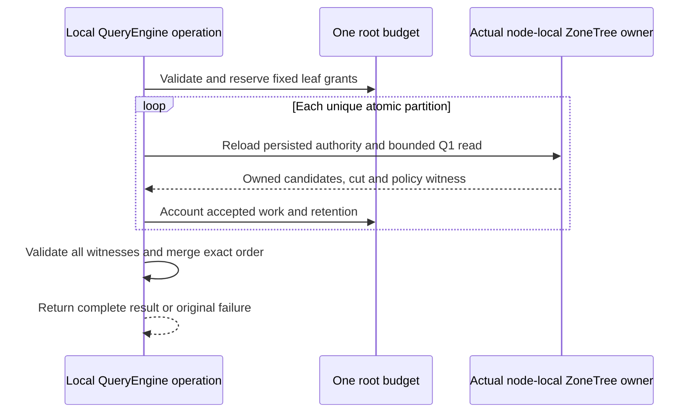

# ADR-100: Internal bounded Q1 merge across local atomic partitions

Status: Accepted; implementation and qualification pending.
Date: 2026-10-05. Related work: KL-037 prerequisite only.

The accepted TASK-DQUERY-CANCEL-OBSERVATION amendment implements
AC-DQUERY-PREREQ-005 with an already-armed, owned native observation thread and
the unchanged synchronous real ZoneTree query. Exact case/helper ownership,
15-second observation/join bounds, original token/budget, no-result and healthy
follow-up requirements are frozen in DistributedQueryExecution before code.
Root owns review, joins and Aspire normal/scalar/full-gate evidence;
dependency_closeout owns the private test packet. Preserve the earlier failed
original report. No product boundary or stored-data/wire-format change;
rollback may revert this test synchronization but cannot weaken its assertions.

## Context

KL-037's original target requires query fan-out across logical shards. The
current deployed architecture and catalog work do not establish multiple
independent physical owners: one RF3 physical shard can contain many atomic
partitions, and its replicas are copies. `QueryRequest` addresses one
`PartitionRef`; `QueryEngine.Execute` performs one local authorized query.
Calling several partitions on the same local `DatabaseEngine` a distributed
query, or counting RF3 voters as query shards, would be false evidence.

The safe first code stage is therefore an internal prerequisite: exercise the
real Q1 leaf operator on multiple atomic partitions in one `TestDatabase`, then
merge only its bounded owned results. It prepares generated native structures
and verifies correct order/cut/policy bookkeeping without publishing a route or
calling another grain. The existing signed request identity, persisted
authorization, `QueryEngine` admission/compiler and `DatabaseEngine.WithQueryView`
remain authoritative.

## Decision

Add five internal Orleans-generated value types under the QueryExecution
feature: `PartitionQueryPlanV1`, `PartitionQueryLeafPlanV1`,
`PartitionQueryCandidateV1`, `PartitionQueryLeafResultV1`, and
`PartitionQueryResultV1`, with aliases and IDs frozen in
`DistributedQueryExecution.md`. The plan is valid only for 1–8 unique atomic
partitions all executed by the same actual store owner identity. It carries no
trusted principal or caller-selected physical placement. A leaf plan carries
one identical normalized Q1 AST with only `PartitionRef` varied and a fixed
resource grant. The executor uses the authenticated principal already passed
to QueryEngine; each leaf reloads persisted principal/resource policy through
the existing read path.

Capture canonical encoded Q1 order keys while each document is still an
authorized pre-projection candidate. Retain only the requested local top-L,
including full `EntityRef` and projected/redacted `QueryRow`; never export
borrowed database views or raw unprojected documents. For every unredacted row
emitted by this partition-query path, `RedactedFields` is a present initialized
empty immutable array;
redacted rows carry the exact omitted field paths. Null and empty remain
distinct serialized values, so callers and parity checks must not normalize
one into the other. Merge with order-key
direction followed by ordinal full-identity components. Preserve a vector of
per-leaf owner, read-generation, cut, policy and schema witnesses; there is no
single cross-partition snapshot position. Require the same owner and policy
epoch for every leaf, fail the whole result on a missing/denied/inconsistent
leaf, and expose no partial rows.

Allocate deterministic fixed per-leaf record, raw-byte and retained-byte
shares before starting any leaf. Sum of grants stays within current configured
limits after one parse/admission charge. Every leaf enforces its share while
scanning and before retaining candidates. The merger reserves bounded
retention before accepting native results and returns no more than current
`MaxResults`. There is no work stealing. A root token and the existing single
operation deadline cover parse, all leaves and merge. Current local leaf calls
are synchronous, so this ADR does not claim remote capacity/backpressure or
slow-owner settlement.

## Ordered implementation and evidence

1. Root accepts the exact requirements, aliases/IDs, comparator, fixed-grant
   arithmetic, error map and truthful limitations in
   `docs/Features/QueryExecution/DistributedQueryExecution.md`.
2. Query adds only feature-local internal contracts, models, validation,
   coordinator and leaf execution helpers. It reuses `QueryValidation`,
   `QueryEngine` admission, SQL compiler, `PreparedQuery` sort encoding,
   `QueryCandidateReader`, and `DatabaseEngine.WithQueryView`. The internal native read-grant seam frozen in the linked feature
   enforces every raw scan/lookup before decoding or copying.
3. UnitTests seed real ZoneTree records in at least two distinct
   `PartitionRef`s using `TestDatabase`. Expected order and result projection
   come from a separate seeded scalar model, not from production leaf order or
   merger code. Include ties, hidden sort fields, duplicate textual IDs,
   persisted permission denial/revocation, all global exact/one-over budgets,
   invalid plan shape, cancellation after observed actual read bytes and a
   healthy follow-up. Assert positions and policy witnesses per leaf; never
   assert a synthetic scalar global cut.
4. Root owns complete solution build/format/governance and Aspire suites after
   joining the private stage. Passing local unit tests only qualify this
   prerequisite implementation. KL-037 remains pending all actual independent
   owner, native Orleans, SDK/official MCP, fault, bounded fan-out and Linux
   delivered-source acceptance.

## Rollback and exclusions

Remove only the new internal plan/leaf/merge code and its tests after stopping
any future internal caller. This stage writes no data and changes no persisted
format, public DTO, query grammar, server route, SDK/MCP tool, Orleans grain
dispatcher, catalog, physical placement, token/cursor, index, or authorization
policy. The implementation does not rewrite persisted data. Do not add test-only delays, fake leaf
providers, synthetic shard identities, or a private RF3 topology. The future
KL-037 contract must separately define independent physical placement, catalog
epoch fencing, per-owner authenticated execution, fan-out/backpressure,
slow-owner timeout/cancel/join, all-owner failure, SDK/MCP results and actual
Aspire RF3 evidence.

## Ownership and join points

The canonical file and role map is in the linked feature specification.
`lifecycle_wave` owns the five generated values and Query validation, leaf,
merge and native multi-partition test helpers. `partition_pages` owns only the
separately frozen Core raw-byte grant seam and its native regressions. The Query worker supplies the narrow private QueryEngine integration; Root
owns its join, policy/docs review, whole solution
build and format, Aspire execution, evidence and all-source stage commit.
There is one existing local query read capability and no second dispatcher.

The explicit ResourceExecution dependency is now frozen in the linked
feature: internal CreateReadGrant(maximumBytes, maximumRecords) returns
ReadExecutionBudgetReadGrant;
accepted native bytes convert fixed reserved capacity before decode/copy.
Core adds only KeyLoad.Query friend visibility and actual native regressions.
The native grant cases are split by responsibility into
ReadExecutionBudgetGrantPointTests, ReadExecutionBudgetGrantRangeTests,
ReadExecutionBudgetGrantReservationTests and
ReadExecutionBudgetGrantCancellationTests, sharing only the actual ZoneTree
seed helper ReadExecutionBudgetGrantSeed. The original assertions and native
read callbacks remain intact; the split satisfies the mandatory type-size limit.
This ADR does not authorize fresh per-leaf deadlines, post-hoc accounting,
changing public Q1 tie ordering or enlarging any configured limit.

Both raw-byte and examined-attempt reservations convert before native read
callbacks; point misses and charged range lookahead count one each. The
feature freezes the exact conservative retention constants/formula and the
leaf-array transfer peak, with alias-aware candidate payload ownership. These
model logical retained state and do not establish peak process RSS.

The accepted local top-L implementation uses a custom L+1-reference binary
heap for the internal partition leaf, with full EntityRef ties before selection.
The public Q1 PriorityQueue path keeps its existing UTF-8 EntityId comparator.
Reserve each exact candidate payload before heap insertion; rejection must
leave prior heap/output unchanged. Reserve the final leaf array while scratch
is still held, clear and relinquish the scratch container, then release its
reservation. At most one callback-local temporary projection/order encoding
is bounded by admitted raw bytes and document limits. Execution helpers,
including retained-byte arithmetic, belong in QueryExecution/Execution.

The narrow integration is an internal PartitionQueryExecution extension in
QueryExecution/Execution plus one internal QueryEngine owner accessor. It
reuses existing Bind/Project and the actual DatabaseEngine, keeping the shared
QueryEngine within the mandatory type-size limit without a second dispatcher.
Generated aliases use named constants with their exact frozen strings.

## TASK-PQUERY-PUBLIC accepted implementation contract

The linked DistributedQueryExecution feature freezes REQ/AC-PQUERY-001 through 006, public generated aliases/IDs, the exact bounded same-view metadata grant and conservative public mapping retention before code. Stage remains accepted, with implementation and qualification pending.

1. Root joins the accepted PMAP public foundation and native command/read dispatch, then its complete SDK/MCP and independent oracle corpus. Existing aliases, numeric enum values and administrator gates remain unchanged.
2. The Core agent owns only the authorized-query same-view resolver and actual ZoneTree grant/corruption regressions in ClusterRouting/Queries and the corresponding unit slice. It accepts the actual existing leaf grant and cannot open a second read view or bypass budget accounting.
3. The Query agent owns feature-local generated public DTOs/aliases, strict request validation, same-owner execution overload, fresh leaf metadata checks, conservative public mapper and focused contract/budget/order/authorization cases. Existing internal local merge semantics and public Q1 ordering stay unchanged.
4. Root owns the immutable server PhysicalShardRecord registration from configured PartitionHost/NodeOptions, DatabaseReadGrain/GrainQueryReadCapabilities join, append-only read kind, public route and SDK/MCP inventories, generated-native corpus and actual RF3 client regressions. The first public request can execute only after the existing successful catalog fence, and every leaf compares fresh SCAT/PMAP evidence with the immutable host tuple.
5. Root runs required Release build, formatter/analyzers and Aspire-owned focused/full unit, scalar, recovery and RF3 suites. Remote fan-out, independent physical owners, SQL grammar, cursors, global cuts, movement and split/merge remain separate unqualified requirements.

The wire addition is append-only and versioned; no committed storage-format change occurs. The route is admitted only when the typed capability is present and otherwise fails through the existing unsupported-capability path. Rollback removes exposure of the new route/kind without changing committed SCAT/PMAP records or their corruption checks. Root serializes source integration and owns the complete-stage commit/push; agents prepare scoped immutable packets. The feature names exact automated acceptance cases and final evidence. This amendment does not mark the ADR implemented or KL-037 complete.

Per-leaf PMAP directory/row revisions and fallback state are validated against that leaf's own same-view records. Bound and fallback partitions with the same physical owner remain valid together; their row revisions/fallback states can differ, and directory revisions can differ across the retained per-leaf cuts. Cross-leaf equality covers the full owner tuple plus existing node/incarnation/read-generation/policy witnesses, without a global snapshot.

The same-view Core helper is static because it uses only the already authorized borrowed view, complete partition and actual leaf grant. This implementation modifier adds no API, authority, storage view or state.

## Configured remote document prerequisite

TASK-OWNER-DOCUMENT-1B-002 and REQ/AC-OWNER-DOC-001..006 extend ADR106 only for one explicit registered A-to-B document read. General PartitionQuery fanout is still unimplemented. Source/destination native cuts and policy are independent; no cross-owner position equality or transparent retry. Every receiving read uses its unique native RequestGrain/CQRS under destination-local fresh persisted grants, with signed identity/scope and original deadlines. The complete bounded implementation contract is frozen in PartitionTransfer and ClientApi before implementation; native six-silo qualification is required.

## Fresh policy and native transport ownership join

Source and destination each require their own current persisted DocumentsRead grant before physical placement/token diagnostics; source epoch/tenant/map/directory are rechecked after the remote reply. The destination child again loads fresh persisted identity at its actual quorum-backed read cut. The source transport owns both native HttpClient and SocketsHttpHandler directly; HttpClient borrows its handler, and shutdown joins all original work before observing both disposals and address-pin disposal. Current root physical-owner lifecycle/configuration fixes and ADR106 native integration appendix must survive this stage. SDK and official MCP both exercise existing Q1 CALL, with no new catalog/dialect entry.

# KL037 configured physical-owner partition query

Private docs-first implementation, layered after immutable KL036 RemoteDocument R2 and current root lifecycle/ANN R4. No native qualification or original-task closure.

REQ-PQUERY-REMOTE-001 / AC-PQUERY-REMOTE-001: the existing PartitionQuery request/page, SDK, official MCP and existing CALL identities remain unchanged. Explicit existing opt-in two-owner topology admits configured A local leaves and registered explicit-PMAP B leaves only; default RF3 continues existing local execution. Maximum eight partitions, original configured request/read/examined/result/retained budgets remain unchanged. No generic owner discovery, global policy or migration support.

REQ-PQUERY-REMOTE-002 / AC-PQUERY-REMOTE-002: capture current persisted source principal and ordinary Query|DocumentsRead grants per logical scope before directory diagnostics, under charged source metadata read cuts. Route to exact signed configured destination/incarnation/voters/endpoint via the existing native physical-owner transport/pins/replay/operation owner. Every local or B leaf executes a new signed unique RequestGrain/CQRS read actor; receiving B reloads its own persisted same subject and tenant, ordinary query/field grants, actual local physical owner and fresh quorum/applied read cut. The envelope carries subject/scope only, no caller roles/grants. Native query leaf plan/result remains server-only, using the existing query executor and native sortable candidate keys, never a second planner or public private-field projection.

REQ-PQUERY-REMOTE-003 / AC-PQUERY-REMOTE-003: reserve all existing plan grants before dispatch. Each receiving native leaf enforces the exact downwards grant plus its own limits, original parent expiry and current child cancellation. Original source budget and elapsed clock are never recreated between leaves. Import only signed, verified actual completed leaf work summaries into their pre-reserved aggregate grants before retaining results. Aggregate mutable state and final merge remain serialized; first implementation dispatches sequential leaves. Parallel independence/resource/performance acceptance remains open, max8 is not concurrency evidence. Every failure/cancel/deadline returns no public page; no incomplete-success mode, invisible retry or second admission budget.

REQ-PQUERY-REMOTE-004 / AC-PQUERY-REMOTE-004: validate each leaf against its exact admitted physical destination rather than one common node/incarnation. Cuts and persisted policy epochs may differ across independently owned A/B stores; within one owner changed policy/identity rejects. Sort, full-reference ties, row projection, retention calculations and complete public mapping use the original native merge. Revalidate every original source principal/PMAP/directory fence after all child settlement before public retention. No cross-owner snapshot or equal position claim. Cancellation/disposal restores previous RequestContext and joins all original native transport/read workers before file/owner teardown.

REQ-PQUERY-REMOTE-005 / AC-PQUERY-REMOTE-005: genuine two-store unit flows and six-silo RF3 exercise source grant denial, B grant denial, cancellation with no page/full canonical state unchanged, then independently literal merged ordered rows/full leaf witnesses and healthy continuation. SDK and official MCP public operations retain original immutable B write receipts/replay and same owner restart/routing. Existing single-owner native gates remain mandatory. Source/code is not passing evidence.

Ordered join: Query native leaf plan/result API + original merge expected-owner validation; Core charged scope fence; additive private Orleans leaf read kind/codec and unique actors; existing signed physical-owner transport query branch and source router; existing parent public PartitionQuery interception; actual unit/six-silo flows; independent guarded review; root build/format/genuine census/full normal/scalar/recovery/RF3. No current default catalog count or SQL grammar change. Shared R2 and root lifecycle/config files require exact layered guards; original packets remain immutable.

### Native implementation and authored operation trace

TASK-PQUERY-REMOTE-001..005 follows the ordered join above. REQ/AC-PQUERY-REMOTE-001..004 map to `PartitionQueryRemoteExecution`, `PartitionQueryLeafExecution`, `RemotePartitionQueryLeafRead` and the existing physical-owner transport's typed query branch. The source charged scope reads the actual native principal/resource bytes before decoding; resource byte digest, principal epoch, PMAP and directory fences are rechecked after each actual leaf and after the final source quorum barrier. A changed source resource policy rejects even when the projected field remains readable. This digest is source-local and never part of peer/public/log metadata. Child grants reserve source metadata rechecks without new quotas; validated actual leaf counters are imported before result retention.

REQ/AC-PQUERY-REMOTE-005 maps to `tests/KeyLoad.UnitTests/Features/QueryExecution/Cases/RemotePartitionQueryNativeTests.cs` (five authored real two-store methods) and `tests/KeyLoad.IntegrationTests/Features/QueryExecution/Cases/RemotePartitionQueryRf3Tests.cs` (one authored actual six-silo SDK/MCP/CALL scenario). Native discovery must establish the actual identities: intended filters `/*/*/RemotePartitionQueryNativeTests/*` and `/*/*/RemotePartitionQueryRf3Tests/*`; no native UID/count/PASS is fabricated. Unit cancellation occurs after the first actual native leaf has settled; public SDK cancellation is pre-submit admission only. These do not establish in-flight remote cancellation. Destination work ownership remains retained until actual native settlement and joined shutdown, rather than treating source HTTP abortion as remote settlement proof.

The public flow compares complete independently literal projected rows/redaction/ranks, checks each owner's own observed cut without equating A/B cuts, verifies independently literal A/B write receipt identity/token/mutation contracts and byte-identical original command replay without advancing that owner's applied position, then repeats healthy operations after the owned B restart. Parallel independent leaf dispatch, generic owner fanout, global policy, movement, in-flight remote cancellation and performance qualification remain open. Default RF3 and catalog admission remain unchanged. The unpublished R2 private read-kind additions must be carried forward after current live AnnMaintenance without renumbering a published ordinal. Fresh build/native schema, tool graph, census and module/source/image receipts are required after join; source review is not qualification.

### Current ANN/remote composition boundary (2026-10-08)

This source-only join preserves the current node-local ANN maintenance owner, current typed options factories, original cancellation scopes and native shutdown joins while adding the existing configured RemoteDocument and partition-query contracts. REQ-PQUERY-REMOTE-001..005 / AC-PQUERY-REMOTE-001..005 and REQ-OWNER-DOC-001..006 / AC-OWNER-DOC-001..006 retain their original authorities, quotas and deadlines. No new public operation or binary format is introduced by composition. The independently owned source test partition is literal `source`, distinct from the explicit destination partition; a circular fixture constant is invalid and must not substitute for that real two-store scope.

Ordered join: current-source guards; RemoteDocument remaining prerequisites; superseding KL037 shared proposals; exact four remaining ANN/configuration/host three-way seams; original scalar and default RF3 behavior; native build/format/discovery; complete authored local and real six-silo operations. This appendix records a derived integration seam, not runtime proof or task closure.

### Stage XVII combined integration

The initial combined catalog and unpublished native read-kind order are frozen in docs/Features/ClientApi.md, Stage XVII composed native integration contract. Preserve all existing REQ/AC gates, default-off/opt-in admission, original operation budgets, scoped witnesses and node-owned joined lifetimes. Root-reviewed shared seams, full native compile/format and genuine normal/scalar/process/public RF3 tests remain required before acceptance. This appendix is an implementation contract, not an Implemented or runtime qualification claim.

# KL037 bounded independent native owner leaves — pre-implementation contract

Prerequisite: immutable remote document/partition query composed101 e18d4d75c82c543033b50c0e1c9f96496a0b4b89ab109c7d7826d8a7d6634a2d. This stage preserves explicit configured A/B ownership, canonical PMAP/directory/incarnation pins and destination-local persisted authorization. Default RF3 and logical plan/order/merge semantics remain unchanged.

REQ/AC-DQUERY-PREREQ-005 and REQ/AC-PQUERY-004/005/006, ADR100: centrally validated downward MaximumConcurrentPartitionLeaves defaults2, ceiling8 and never exceeds actual plan leaves/MaximumPartitions/existing admissions. Complete original per-leaf grants and fixed result slots are allocated before dispatch. Source capture/principal/resource/owner fence and grant reservation are serialized using the original parent budget. A prepared typed leaf owns only an immutable bounded signed request and actual unique request-grain child operation; it does not receive/mutate the parent budget, grant or source read view while running. Each actual receiving owner continues its own downward budget and same authorized native cut. No shared read view or mutable unsafe aggregate ledger is passed concurrently.

A bounded batch admits at most the configured concurrency. Native child operations start independently through existing transport/CQRS, never an alternate dispatcher. All original child terminal replies and native producer/HTTP/body cleanup settle before serialized validation/import/retention. Closed per-leaf result slots and original caps bound simultaneous buffering. Caller cancellation or first admitted child failure stops further batches, cancels all admitted work with the original linked operation token, and joins every admitted child; every primary/cleanup failure is retained. No partial public page; all leaves/canonical source fences must succeed before existing deterministic merge and public mapping. Deadline semantics and original caller token remain unchanged; cancellation classification never masks additional cleanup faults.

Actual wholeflows: independent ZoneTree A/B stores, actual concurrent leaf work under owning injected clock/native observable read phase, original caller cancellation with joined workers/full bytes+separate cuts unchanged/null page, then complete literal healthy merge. Real six-silo SDK/official MCP/Q1 flow uses existing signed native PartitionQueryLeaf admission hold, cancels only after actual child observation, joins ProducerDisposed plus original clients, and performs fresh literal healthy merge/immutable receipt reconciliation. No sleeps/retries/quota increase/fake clients/provider/testhook; performance/resource scalability remains unqualified pending comparable Linux GitHub evidence.

Owning roles: QueryExecution Configuration/Contracts/Execution prepared-leaf bounded operation and serial aggregate; Server QueryExecution source preparation/completion and current physical transport; Unit fixture/Cases actual independent stores; Integration existing six-silo helpers/Cases native hold/caller cleanup; DistributedQueryExecution and ADR100 trace. Source-only private stage, no native PASS/whole KL037 closure.

## Exact native RF3 cancellation control composition

REQ/AC-PQUERY-005/006 permits existing explicit signed RequestCqrsProbe control only together with the already configured two-owner RemotePartitionQueries + RemoteDocumentReads + RegisterPhysicalOwners profile. It validates the original three configured A voter image identities and original private node1..3 owner directories/session; controls mount only A. B remains independently owned and receives no control mount/key. Local-image, benchmark, protocol-cohort and missing prerequisite combinations remain rejected. No six-node probe whitelist or covered-case admission change is introduced. The actual held A read kind is PartitionQueryLeaf at existing AuthorizationReload; the independently dispatched B child retains its own receiving authority and cancellation. Original parent cancellation joins both admitted results/HTTP/CQRS owners and the exact A ProducerDisposed marker before retiring the original arm. This establishes in-flight parent/native-child admission cancellation, separately from the two-store observed native read-work proof.

### Simultaneous transport retention

The original plan already reserves the sum of native leaf retained results. Parallel preparation additionally derives each child downward within that original leaf allocation: actual native request byte measurement + two bounded 32KiB metadata/task frames + three times child retained bytes must fit its original allocation. The unchanged native candidate/heap minimum remains mandatory. One result reply wire ceiling is two times actual child retained capacity + one metadata frame, bounded by the existing8MiB protocol ceiling; both receiving native encoding measurement and source ContentLength validate it before allocation. Reply cap is derived from the authenticated canonical child plan, not an untrusted role/header or new public quota/DTO field. Local child results use the same conservative reserve. No ordinary remote document cap changes. Source actual final call measurement must remain within its preallocated frame before dispatch.

## TASK-KL037-NATIVE-OWNER-DEADLINE-001 — observed receiving work fails before whole merge

REQ/AC-DQUERY-PREREQ-005 and REQ/AC-PQUERY-REMOTE-003/004/005 retain the original configured independent source/destination stores, persisted policies, exact native leaf grants, parent admission/token/deadline, parallel task cancellation/settlement, serialized fence validation and no-partial public page. Before source implementation, freeze one supporting two-owner operation flow: arm the existing QueryObservedWorkClock on actual destination RangeExaminedBytes increasing, then advance only that owning test clock past its actual unchanged DatabaseLimits.QueryDeadlineSeconds. This represents real native receiving work crossing the existing deadline; it does not claim natural remote transport latency or Linux RF3 slow-owner qualification. No artificial producer, provider, delay, new limit, production hook or fallback is introduced.

The actual PartitionQueryRemoteExecution and PartitionQueryParallelBatch must propagate the receiving BudgetExceeded with exact existing safe deadline detail, cancel/join all originally admitted leaf Tasks, return no page and preserve both complete native images and their independent original store positions. Disarm the observation in finally. Under the same actual policies/stores/limits, a fresh operation returns the independently literal complete ordered two-owner result, references, revisions, redaction, per-owner cuts/schema/policy epochs; both stores remain unchanged. This is a new executable missing failure→healthy oracle, not whole KL037 completion.

Ownership: new Unit QueryExecution/Cases/RemotePartitionDeadlineTests.cs only, this feature appendix and ADR100 trace. Existing native fixtures, clocks, Query/Server/Orleans code and public DTOs remain unchanged. Intended native selector /*/*/RemotePartitionDeadlineTests/*; actual discovery/source/image and normal/scalar original outcomes are required before qualification. No native UID or count is claimed. Existing whole query/RF3/recovery/resource/endurance/coverage/performance gates remain mandatory; distributed per-modality branch merge and statistics-epoch authority are still a separate required implementation stage.

## TASK-KL037-GLOBAL-MODALITY-001 — actual distributed statistics and modality execution

Pre-implementation owning contract. REQ-DQUERY-GLOBAL-001 / AC-DQUERY-GLOBAL-001 requires exact lexical and vector candidate windows from independently configured physical owners before weightedRrfV1 fusion. It reuses native TextRanker BM25 arithmetic, VectorRanker metric/scalar/SIMD contract, GlobalBranchWindowMerger full-reference order and SearchRankFusion. Local fused top-k cannot substitute per-modality global windows. Exact profile rejects a candidate window that is truncated, incomplete, approximate, incomparable or exceeds its original grant; there is no silent exact claim. Approximate ANN/provider profiles remain explicitly unsupported by this new exact route and their separate existing APIs remain unchanged. No distributed graph, aggregate SQL or ANN approximation completion is inferred.

REQ-DQUERY-GLOBAL-002 / AC-DQUERY-GLOBAL-002 requires one server-derived statistics epoch over the exact ordered vector of actual owner/partition cuts, principal policy epochs, resource schemas, request term/profile identity and configured owner/directory fences. Each owner captures actual authorized visible document count (including documents without the text field), total canonical token length and per-query-term document frequency. The parent sums these finite native summaries with checked arithmetic, using canonical query-term order and distinct full atomic partitions. Every candidate phase revalidates its original same owner cut and current persisted authority before applying the shared global BM25 values. Changed cuts/policy/placement/generation refuse OwnershipLost with no partial page; no automatic recapture/retry. Epoch is ephemeral operation evidence, not persisted global coordinator authority or a caller-selected freshness token. Independent owner cuts are never equated or replaced by a scalar global cut. ACL-visible corpus statistics cannot be returned publicly.

REQ-DQUERY-GLOBAL-003 / AC-DQUERY-GLOBAL-003 requires all effects/read phases through existing server-owned ConnectionGrain with freshly signed bounded call-local read work and native ManagedCode.Communication streaming. Source authorizes every partition/collection before catalog diagnostics. Destination reloads the same authenticated subject from its own persisted database and enforces Query/DocumentsRead, vector and field policy before reads. The existing configured physical-owner transport MAC/nonce/expiry/registered ordered voters and source fence protect private typed leaves. No roles, grants, raw credentials, caller statistics or borrowed storage views are accepted. Default existing PartitionQuery Q1 request validation and ModelSource rejection remain unchanged.

REQ-DQUERY-GLOBAL-004 / AC-DQUERY-GLOBAL-004 reserves the complete statistics, modality-candidate, selected projection and final revalidation grants before any dispatch using the original centrally validated MaximumPartitions/MaximumConcurrentPartitionLeaves and DatabaseLimits scan/raw/retained/result ceilings. All phase work shares one original token/deadline; no per-phase reset, work stealing, new quota or limit. Native measured typed summaries, candidates, transport copies and selected documents are charged before retaining/encoding/allocating. A bounded batch retains original tasks until all settle; first failure cancels all admitted children, stops later phases and joins all readers/providers/transports before response/store shutdown. No partial success; server-only statistics or raw secret fields never enter public output, hints or logs.

REQ-DQUERY-GLOBAL-005 / AC-DQUERY-GLOBAL-005 requires actual independent two-store and genuine two-RF3 owner full flows: independently centralized lexical/vector/fusion literal oracle; ties/identical text IDs under distinct full references; empty/nonmatching/missing fields/skew; exact and one-over budgets; changed statistics/cut/policy and receiver denial; actual in-flight cancellation/deadline followed by unchanged full canonical images/independent cuts and healthy continuation; same-root cold owner/replay; all SDK/official MCP/Q1 caller/schema/privacy parity. Natural slow-owner RF3 evidence is separate from the approved native receiving-work clock regression. No benchmark, power-loss, resource or performance claim is supplied by source.

### Stable native component contracts before source

`DistributedTextStatisticsV1` alias `keyload.query.distributed-text-statistics.v1`, IDs0 Terms:ImmutableArray<string>,1 DocumentCount:int,2 TotalLength:long,3 DocumentFrequencies:ImmutableArray<int>. Version belongs to the encompassing typed request; this statistics record has no identity/roles/epoch supplied by callers. Its actual Terms are produced by existing canonical SearchTerms under native execution limits, and every value is validated/charged. Existing native/public aliases and IDs are unchanged. TextRanker local Rank continues its original field-based arithmetic without a new default allocation; global Rank consumes exactly this validated summary through the SAME scoring body.

Subsequent source shipment must freeze complete private statistics/candidate/projection request/result aliases and IDs plus additive public DistributedSearch route/schema tuple and signed read-purpose fields before their code. No partial ingress is joined alone. Stages: actual native statistics/scoring component → same-view exact-cut private leaf → authorized signed multi-owner coordinator → public SDK/MCP/Q1 composition → independent Unit/process/RF3 oracles → fresh root-owned census/build/Linux acceptance. Rollback withdraws only the additive operation and removes disposable stats; no persistent current format or migration fallback is introduced.

Owning paths: QueryExecution Contracts/Serialization/Validation/Execution and QueryExecution Unit/Integration roles; actual Search TextRanker/branch extraction are declared dependencies, not copied implementations; Server QueryExecution/physical transport and Orleans read dispatch borrow original owner options/lifecycles; Abstractions/Client/ClientApi additive canonical public operation. Root serializes all shared joins and current catalog integration. Existing connection-grain transport is external ownership and untouched. Source, native discovery and runtime acceptance remain separate; whole KL037 stays open until original full criteria and mandatory gates qualify.

### Native leaf statistics witness before code

`DistributedTextWitnessV1`, alias `keyload.query.distributed-text-witness.v1`, IDs0 Partition:PartitionRef,1 Owner:PhysicalShardRecord,2 NodeId:Guid,3 ReadGeneration:long,4 CutPosition:long,5 PolicyEpoch:long,6 SchemaVersion:long,7 ResourcePolicyDigest:string,8 Statistics:DistributedTextStatisticsV1. Every value is captured by the receiving actual WithPartitionQueryFenceView read and native placement validator, after fresh persisted Query/DocumentsRead/field authorization. The supplied owner is an already-authenticated receiving owner tuple, never a public selector. The complete current native Store.Identity and resource digest/cut must match before candidate read; absence/change refuses, never reopens an old cut. `DistributedSearchEpochInputV1`, alias `keyload.query.distributed-search-epoch-input.v1`, IDs0 Version:int,1 RequestDigest:string,2 Witnesses:ImmutableArray<DistributedTextWitnessV1>; actual canonical SHA256 of the bounded native generated input is the common opaque epoch. No scalar equal-owner cut, common policy epoch or fabricated global durable row is introduced.

Statistics capture and candidate copies reserve actual existing PartitionQueryRetention array/string descriptors and pointer/primitive sizes before clone; native measurement and original budget remain mandatory. No new hard-coded operational cap. Returned terms are canonicalized by actual TextRanker; local Rank() still avoids the new DTO allocation and delegates the same exact arithmetic. No identity, secret canary, statistics count or resource digest is published in the public epoch value.

### Actual per-phase native accounting and candidate contract

The statistics witness appends Id9 ReadBytes:long and Id10 ExaminedRecords:int from the actual entered native read grant. The parent imports these original counters before retention and progression, while charged retention/result frames remain independently admitted under original bounds. Statistics-only TextRanker construction retains no candidate corpus; it preserves the exact native tokenizer/frequency/length path. Each receiver statistics leaf owns the original database.AdmitQuery permit once for the complete synchronous operation.

Vector-only scope records the actual authorized visible canonical document count with no selected text terms/frequencies or text length, rather than fabricating a text query/field. Fresh VectorSearch and vector-field-use policy precedes capture; hybrid scope requires both actual field capabilities. Empty normalized text terms in statistics-only construction still measure the selected text field corpus; old local empty-text ranking remains unchanged.

DistributedSearchCandidateLeafV1 alias keyload.query.distributed-search-candidate-leaf.v1: Id0 original statistics witness, Id1 nullable actual text GlobalBranchWindow, Id2 nullable actual vector GlobalBranchWindow, Id3 actual phase native ReadBytes, Id4 actual phase native ExaminedRecords. Existing GlobalBranchWindow/Candidate/Scope aliases and fields are reused unchanged. Full source windows are captured only after successful complete canonical scans; each score is rebound at that exact cut to its actual full document reference/revision before bounded retention, then sorted with existing full-reference GlobalBranchOrder. No leaf top-k discards candidates before global per-modality merge.

The existing PartitionQueryParallelBatch remains the task owner. Its exact original WhenAll/sibling-cancellation/primary+cleanup join body is factored once into a typed generic overload; Q1 delegates through a static noncapturing runner with one original task array. New typed phases reuse that same bounded owner, not a new dispatcher or scheduling authority. Supporting native tests execute actual two-owner statistics/ranking/projection, an actual committed policy-epoch failure, fresh complete literal results and owning cold reopen. These are supporting operation tests, not public RF3 qualification.

### Additive public operation boundary before source

`DistributedSearchRequestV1` alias `keyload.distributed-search-request.v1`, IDs0 Version:int,1 Partitions:ImmutableArray<PartitionRef>,2 Search:SearchRequest. The EXISTING SearchRequest is the one common caller-visible typed search shape/defaults/weights/vector/allowlist/explain contract; its logical template partition must equal the first declared partition, all partitions are unique and bounded by existing QueryExecutionOptions.MaximumPartitions, and each internal leaf replaces only that logical partition. No copied defaults, owner proofs, identity, roles, statistics, expiry or grants are accepted. Version1 only. TextIndex selection is explicitly UnsupportedCapability in this canonical distributed profile; existing selected Search/ANN APIs remain unchanged.

`DistributedSearchPageV1` alias `keyload.distributed-search-page.v1`, IDs0 Version:int,1 Hits:ImmutableArray<RankedDocument>,2 Leaves:ImmutableArray<PartitionQueryLeafWitnessV1>,3 StatisticsEpoch:string,4 Complete:bool. Hits are actual fully projected same-cut documents with independent full references/revisions/redaction and weightedRrfV1 scores/explanation. Leaves reuse the existing public scoped per-partition cut/policy/schema/access-path witness, without exposing private physical-owner/proof/resource-policy bytes. StatisticsEpoch is opaque descriptive evidence only and cannot authorize another read. Complete means exact requested top-k over complete global per-modality windows; no partial/approximate candidate result is admitted by this profile.

New public read name `DistributedSearch` maps the same typed request/result across native SDK, official MCP and Q1 CALL, under current ADR125 bounded connection-owned call-local/ManagedCode.Communication read execution. Shared GrainReadKind append composes AFTER KL039 OnlineTextMaintenance, and current connection-owned capability/codec/catalog additions compose against KL039 exact immutable ancestors. Root owns independent complete literal catalog integration and current native metadata count; no count is guessed here. No partial public ingress is integrated alone.

### Closed authenticated receiving phases and final projection

Current Server/Orleans policy and ADR125 supersede per-operation activation wording: ingress and all native children retain independent signed call identities/current persisted authorization/context/cancellation and joined work in the existing bounded ConnectionGrain/call-local pipeline. The human-owned connection source is not replaced. No completed call history or new request activation is introduced.

The private native receiving family is frozen before integration: DistributedSearchPhase alias keyload.query.distributed-search-phase.v1 has Statistics0/Candidates1/Projection2/Revalidate3. DistributedSearchOwnedLeafV1 alias keyload.query.distributed-search-owned-leaf.v1 uses Id0 Version,1 Phase,2 SearchRequest,3 configured Owner,4 Tenant,5 MaxReadBytes,6 MaxExaminedRecords,7 MaxResultBytes,8 original Witness?,9 common Statistics?,10 GlobalBranchScope?,11 SourceWindowId?,12 immutable selected GlobalBranchCandidate array. Mutually exclusive slots must match the phase exactly. Original centrally validated bounds and authenticated absolute envelope expiry constrain every phase; no lifetime reset or public phase input exists. DistributedSearchLeafResultV1 alias keyload.query.distributed-search-leaf-result.v1 uses Id0 Phase,1 original Witness,2 CandidateLeaf?,3 ProjectionLeaf?,4 actual read bytes,5 actual examined records. The witness appends Id11 actual native Incarnation; expected configured owner and current store incarnation must match independently.

DistributedSearchProjectionLeafV1 alias keyload.query.distributed-search-projection-leaf.v1 uses Id0 original witness,1 immutable RankedDocument hits,2 actual native read bytes,3 actual examined records. Before any result it freshly requires the same owner/cut/current principal/resource and all original text/vector field capabilities, then checks each selected full reference and actual canonical document revision. No deleted/revised/foreign selected document is projected. Explain is attached from the parent actual globally fused rank contributions, not generated by an unrelated local ranking pass. Final revalidation repeats actual current modality capabilities and original witness before response.

Canonical-only leaves call the original TextRanker scoring kernel directly, so SearchBranchExecution/KL039 selected-reader lifecycle is not replaced. The provisional shared rank overload is excluded. The existing GlobalBranchWindowMerger retains its original MaxResults bound; if a complete globally ranked branch would be truncated there, the exact operation refuses BudgetExceeded before fusion instead of silently using a local/global top-k approximation or adding a larger cap. Existing original Search/ANN profiles and defaults remain unchanged.

### Existing signed physical-owner wire union

RemoteDocumentCallV1 appends native Id10 DistributedSearchOwnedLeafV1? SearchLeaf=null, RemoteDocumentReplyV1 appends Id9 DistributedSearchLeafResultV1? SearchLeaf=null. All original aliases/Ids/nullable defaults remain exact. This is a current additive typed schema, with no migration or compatibility promise. Existing Request/QueryLeaf/SearchLeaf are a closed exclusive union before fresh persisted principal lookup. SearchLeaf's actual partition, tenant and configured ordered physical owner must exactly match the already-authenticated existing read fence. Receiving codec uses the same actual nonce/MAC/absolute expiry/registered endpoint/native context and original call-local work owner. Each reply is accepted only for its exact original request kind; error replies contain no result and retain the original closed native error. No public caller supplies fence, witness, owner, expiry, common statistics, or candidate selection. Existing document/Q1/controlled/blob branches are unchanged when SearchLeaf is null.

### Original transport frame reservation reuse

PartitionQueryParallelRetention retains its existing Q1 math and rejection order. Typed scalar ChildBytes/ReplyBytes overloads expose the SAME three retained frames/two reply frames/two metadata frames and original32768 framing bound for new phase payloads. No dummy Q1 plan, bigger frame limit, operational default or expansion guarantee is introduced. Actual native request measurement and required positive original child result budget occur before serialization/dispatch, complete native reply measurement and original transport body admission remain mandatory. Receiving execution freshly authenticates the original principal and invokes the existing signed node ExecuteAsync path with the same absolute expiry. Successful returned witness must match the actual native node/incarnation/read generation, exact requested owner/phase and original witness. The result's actual counters remain receiver-produced and source-imported.

### Complete caller schema and canonical SQL delegation

The public current bounded profile adds tool literal keyload_query_distributed_search and POST /v1/query/distributed-search, input exactly DistributedSearchRequestV1 {version,partitions,search}, output exactly DistributedSearchPageV1 {version,hits,leaves,statisticsEpoch,complete}. Nested search retains all existing SearchRequest fields/defaults and explicit selected native generation is UnsupportedCapability for this new canonical corpus profile. SDK DistributedSearchAsync, official MCP descriptor and Q1 CALL keyload_query_distributed_search(@payload) all delegate to this same read kind through the existing canonical gateway and bounded discovery; no new SQL parser/dispatcher, extra public privileged field, cursor or global-cut claim. Hints are ReadOnly=true, Idempotent=true, Destructive=false. Initial gateway discovery remains unchanged. All old catalog entries retain exact schemas/routes/hints; independent Unit+officialSDK schema/literal expectations must add this tuple separately before whole join. Two private appended read kinds follow actual current OnlineTextMaintenance and preserve all previous ordinals.

### TASK-KL037-STATISTICS-OBSERVED-001 — real settled parent boundary

REQ-DQUERY-GLOBAL-002/003/005 and AC-DQUERY-GLOBAL-002/003/005 require the actual RF3 stale-statistics refusal rather than timing or a source-only DTO test. Existing GrainRequestPhase and RequestCqrsProbePhase append exactly DistributedSearchStatisticsCaptured AFTER the KL039 NativeTextOriginalPostingRead predecessor where supplied; every old ordinal/alias/field ID remains unchanged. Admission allows only original public DistributedSearch read (empty command ID), original same principal/request/session and Hold. Marker carries only existing closed request/phase/voter facts, no payload/corpus/epoch/owner authority. The callback runs once after all original statistics children settled and their complete witnesses/counters were validated and grants completed, then common statistics/opaque digest succeeded, but BEFORE candidate work is prepared or admitted. It observes the original verified parent DecodedGrainRequest, actual ConnectionGrain IGrainContext and original stage token. The production null path allocates no observation owner/delegate. Existing codec observer owns its actual awaited hold/cancellation and producer disposition; no retry/timer/new deadline or synthetic child settlement. On release the SAME envelope is freshly scope/expiry validated; all following source/receiver preparation reloads persisted authorization and exact original cut/policy witness. A real receiving policy commit during the hold must produce original OwnershipLost/no partial result; restoring a genuine current policy followed by a fresh request and true same-root cold must give complete SDK/officialMCP/Q1 literal results. Original declined operation is never retried into success.

### TASK-KL037-NATURAL-RF3-DEADLINE-001 — original bounded receiving work

REQ/AC-DQUERY-GLOBAL-004/005 and AC-PQUERY-REMOTE-003/004/005, architecture KL037, ADR100.
TASK-KL037-NATURAL-RF3-DEADLINE-001 extends the existing complete DistributedSearchRf3Tests scenario, preserving both original bool caller identities, the original outer ParentDeadline, native options, topology and all prior assertions.
The existing real A receiving DistributedSearchLeaf AuthorizationReload hold observes an independently signed child GUID under the SAME exact parent ExpiresAt. A second configured B RF3 owner participates in the same operation. A-only controls must never be described as a B hold.
No caller cancellation, hold release, clock advance, expiry rewrite or retry induces the expected refusal. The actual existing coordinator QueryDeadlineSeconds timer cancels and joins admitted children; its BudgetExceeded and exact deadline detail distinguish it from the unchanged probe HoldTimeout and stream ExecutionLifetime ceilings. The initial parent arm is released only to identify the actual separately signed parent/child IDs.
Each original direct or Q1 operation via SDK or official MCP must retain a null page and original closed BudgetExceeded; the held child must emit actual Cancelled and ProducerDisposed, the original parent must emit ProducerDisposed. All IDs/membership discovery are verified; retire only genuinely settled arms.
Fixture-only full canonical image/cut proof: every actual six-node status barrier settles; dispose original callers; graceful native AppHost stop/dispose plus existing all18 file-lock admission before opening same exact fixture-owned ZoneTree database directories with existing validated integration storage/cache/DatabaseLimits. Scan the complete bounded rows, reject HasMore or encoded image over MaxBatchBytes before retaining hexadecimal image, retain all key/value bytes and actual position. Restart SAME original roots/profile/images/ports/secret parameter bytes through RestartJoinedAsync, run original refusal and full independent literal healthy operation, then repeat the actual joined stop/read and compare every node's complete image/cut. Reconstitute the same owners for subsequent epoch/replay/cold operations. No raw mutation, fabricated database owner, manual Docker or external root inference.
Success-path cancellation cleanup must not call ReleaseOpenArmsAsync: that native helper atomically stops all later probe admission. Invoke emergency release only on retained initiating failures; keep original task joins, actual parent disposal and every cleanup failure. This repairs the existing deterministic cancellation→epoch admission dead-end.
Error cleanup retains original initiating errors and all original caller/probe/disposal failures. Admission/capacity/deadlines/defaults unchanged. Source-only; exact native metadata/normal/scalar and original Linux RF3 outcomes/cleanup remain root-owned required gates.

### TASK-KL037-ORIGINAL-DEADLINE-CAUSE-001 — owning typed cancellation

# Narrow original-deadline normalization — pre-source contract

REQ/AC-DQUERY-PREREQ-005 and REQ/AC-DQUERY-GLOBAL-004/005 distinguish actual caller cancellation from elapsed query budget. The existing Coordinator owns one unchanged QueryDeadlineSeconds timer and already maps its OperationCanceledException to BudgetExceeded with the exact safe deadline detail. A receiving native stream can instead return a typed Cancelled; all original children settle before the owning batch exposes that exception. A batch can preserve multiple failures as an aggregate.

Proposed owning mapping is admitted only when the same timer has actually fired, the original caller token is not canceled, and every leaf in the original nonempty exception tree is a typed KeyLoadException with Code=Cancelled. The original direct OperationCanceledException catches remain unchanged; arbitrary aggregate cancellation/cleanup exceptions are not newly admitted. It never maps mixed permission/ownership/corruption/fatal/cleanup failures. The entire original caught tree must remain as the mapped exception cause, with no changed public error fields, aliases or IDs. True caller cancellation takes precedence. No fresh timer, retry, observer authority or remote-clock deduction.

The existing exact ErrorCode factory lacks a cause-bearing overload. A shared additive factory/constructor accessibility seam is approved by root before source. The unsealed RF3 proposal retains the original BudgetExceeded assertion and does not substitute Cancelled. Existing actual caller cancellation, destination denial and stale-policy operations remain full negative controls; the new natural original hold covers actual SDK/MCP/direct/Q1 no-caller-cancel refusal, real child/parent producer joins, full six-owner cold images/cuts and fresh literal healthy continuation. Source/metadata/execution gates remain separate and open.

Root-approved shared seam: the existing four-argument KeyLoadException constructor becomes internal; Errors.Fail(ErrorCode code, string detail, Exception cause) checks the cause and calls that same constructor with Errors.Status(code). Every old overload, native alias/Ids, code/status and public safe problem detail remains unchanged. Existing original direct OCE catches are not rewritten. The typed nonempty cancellation tree is mapped only by the owning Coordinator after all tasks have joined.

Supporting controls collect exact actual two-owner query cancellation and persisted destination PermissionDenied failures, preserve the original aggregate including each exception identity, and apply the same classifier under the defined token states. They prove full original images/cuts unchanged then fresh healthy literal merge and true cold continuation. This supports the error decision; it is not claimed as natural RF3 deadline proof. Actual RF3 caller cancellation and destination denial full public operations remain required beside the natural deadline operation.

### TASK-KL037-SHARED-ERROR-OWNER-001 — bounded shared primitive responsibility

Root approves exact extraction of entire existing KeyLoadException and Errors types from Abstractions/Contracts.cs into Abstractions/KeyLoadException.cs and Abstractions/Errors.cs respectively. These are solution-wide shared primitive owners under the existing root building-block exception, not feature layers or partial files. Preserve namespace KeyLoad, all original members/bodies, native Alias/field IDs and ABI except the already approved internal four-argument constructor and additive cause factory. Contracts remains below400; each extracted type below200. No friend assembly, rule exemption or binary format/JSON change. Integration is one guarded atomic source cohort; rollback is the exact original source cohort before compilation/publication, not a persisted-state migration. Native checkOnly preview/new-path NotSupported and whole canonical build plus same original deadline/caller/mixed-operation controls are required; source movement is not runtime proof.

The all-typed-cancellation classifier inspects every aggregate child and every non-null typed cancellation InnerException, not just the outer code. An empty aggregate or any nested permission/ownership/corruption/fatal/cleanup leaf refuses normalization. A failure-path-only explicit stack avoids recursive CLR stack growth; the original tree is never rewritten or flattened for storage. The production default success path allocates no classifier state. The native decision control additionally wraps its actual persisted denial in the approved cause-bearing cancellation factory and verifies that nested denial cannot be hidden by an outer Cancelled code.
