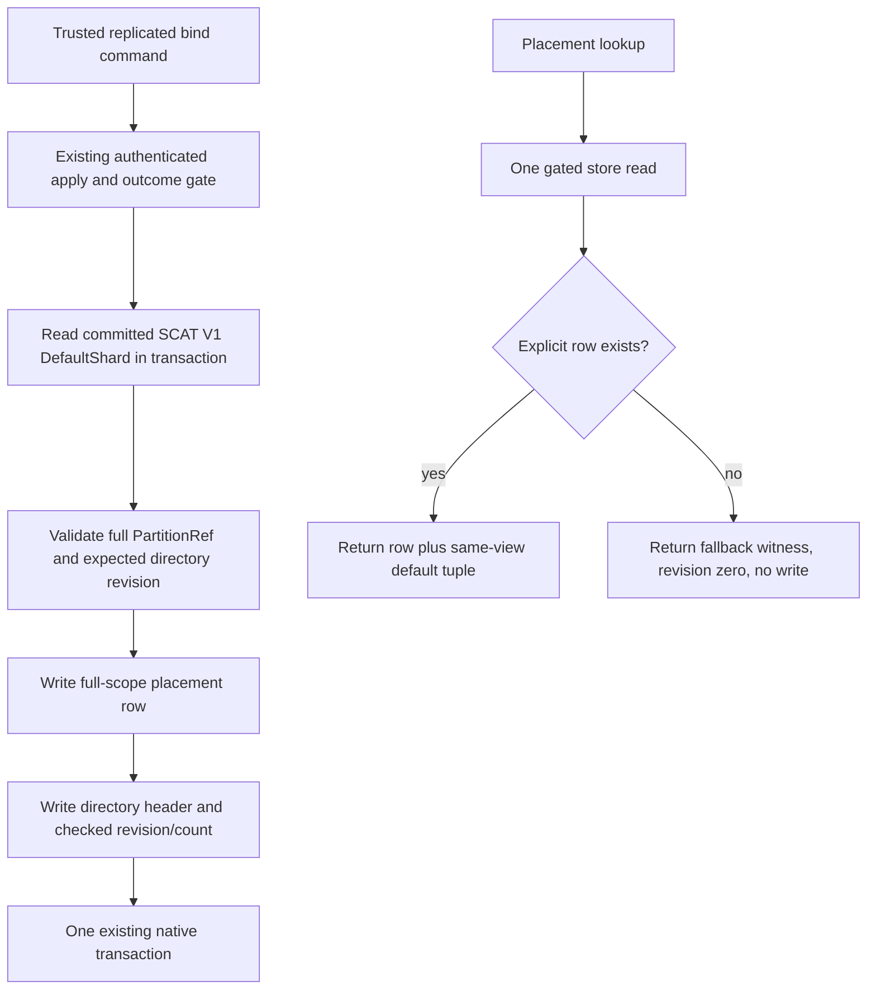

# ADR-101: Explicit atomic-partition placement directory

Status: accepted implementation contract; implementation and qualification pending; no movement authority is enabled. Related requirements: REQ-PMAP-001–004 and AC-PMAP-001–004 in [AtomicPartitionPlacement](../Features/ClusterRouting/AtomicPartitionPlacement.md). Depends on accepted SCAT V1 in [ADR-099](ADR-099-physical-shard-catalog.md), and preserves [ADR-016](ADR-016-atomic-physical-placement.md) and unresolved [ADR-017](ADR-017-migration-tokens.md).

## Decision

Add a bounded native directory mapping complete four-field atomic partition identities to an explicit physical-shard ID. Keep the existing SCAT V1 catalog and its stable contracts unchanged. The first implementation accepts only the committed `DefaultShard` as a target, so explicit metadata cannot create a second owner or change ordinary routing. Unassigned partitions resolve to a clearly marked default-shard fallback without materializing rows.

The directory header is a generated native record with stable alias/IDs for format version, global revision, and explicit-assignment count. Each row is a generated native record with stable alias/IDs for version, all four `PartitionRef` strings, physical-shard ID, positive row revision, incarnation, exact ordered voter identities, and placement epoch. Preserve existing row field IDs 0–3 and append `Incarnation` at ID 4, `VoterIds` at ID 5, and `PlacementEpoch` at ID 6. A dedicated new KeyCodec key uses all four scope components. The header has a distinct key and is updated atomically with the row. Each encoded header and row is at most 8192 bytes; explicit rows are capped at 4096.

The public surface adds two generated Abstractions contracts without changing the accepted directory, row, or bind-request aliases/IDs: `AtomicPartitionPlacementReadRequest` alias `keyload.contract.atomic-partition-placement-read-request.v1` (Id 0 `Version`, Id 1 `Partition`), and `AtomicPartitionPlacementResolution` alias `keyload.contract.atomic-partition-placement-resolution.v1` (Id 0 `Version`, Id 1 `Partition`, Id 2 `PhysicalShardId`, Id 3 `Incarnation`, Id 4 `VoterIds`, Id 5 `PlacementEpoch`, Id 6 `DirectoryRevision`, Id 7 row `Revision`, Id 8 `IsFallback`). This generated resolution replaces the pending Core-only carrier. Core constructs it directly in the single gated `Store.Read` that validates persisted administrator authority, reads the SCAT default, and reads header/row. `DirectoryRevision` is zero when the header is absent and otherwise contains the validated current header revision from that same view, including for a fallback row; row `Revision` remains zero for fallback and is the explicit assignment's row revision otherwise.

A trusted replicated `BindAtomicPartitionPlacementRequest` includes only version, expected global revision, full partition identity, and target physical-shard ID. Its execution reads and validates the current SCAT V1 default identity in the same transaction, checks persisted administrator authority already resolved by the canonical command dispatcher, copies the complete owner tuple into the new row, and writes row plus header in the existing apply/outcome transaction. Existing-row checks compare physical ID, incarnation, exact ordered voters, and placement epoch against that same-transaction default record. It does not issue a direct store write, add a dispatcher, or accept caller-provided incarnation, voter identities, placement epoch, role, or timestamp.

An absent row returns a non-persisting fallback witness with revision zero and the complete current default tuple. A bound row returns an explicit-placement witness and its row revision with the full tuple persisted in its row, after exact same-view validation against the committed default tuple. Any owner-tuple mismatch is `Corruption`; the implementation never refreshes row meaning or falls back. The resolver is descriptive in this stage and is not inserted into normal request routing.

### Public SDK and official MCP stage (REQ-PMAP-003/004)

Expose the bind and read through these accepted typed identities:

| Operation | SDK method | HTTP route | MCP tool | Request and result |
|---|---|---|---|---|
| Bind | `BindAtomicPartitionPlacementAsync(Guid commandId, BindAtomicPartitionPlacementRequest request, CancellationToken)` | `POST /v1/admin/partition-placement/bind` | `keyload_admin_partition_placement_bind` | Existing bind request; existing command result `bool` |
| Read | `ReadAtomicPartitionPlacementAsync(AtomicPartitionPlacementReadRequest request, CancellationToken)` | `POST /v1/admin/partition-placement/read` | `keyload_admin_partition_placement_read` | Generated read request and same-view generated resolution |

The SDK extension belongs in `KeyLoad.Client/Features/ClusterRouting/Transport/AtomicPartitionPlacementClient.cs` and uses the existing internal `KeyLoadClient.Send<T>` path. Server route code belongs in `Features/ClusterRouting/Transport/AtomicPartitionPlacementApi.cs`, mapped from the existing `ApiEndpoints.MapKeyLoadApi` composition. Bind uses `ApiGrainDispatch.SubmitAsync`; read uses `ApiGrainDispatch.ReadAsync`. Both pass through `CanonicalOperationGateway`, retaining the existing persisted middleware principal, request GUID, native request-context scope, signature, request grain, and normal bounded transport.

The two MCP entries are added only to the existing immutable `McpCommandCatalog` and `McpReadCatalog`, with exact entries in `McpToolNames`, `McpToolRoutes`, `McpToolDescriptions`, and `McpToolHints`. Bind uses the strict header-command envelope `{ commandId, request }`; read uses the strict request-only envelope. `McpToolDispatcher` continues through `CanonicalOperationGateway`. MCP schema, canonical catalog and exact-inventory tests are updated; the two PMAP entries are additional to graph-search tools, so the completed inventory contains 66 operations (64 before these PMAP entries are joined). Do not create a second dispatcher or weaken exact counts/unknown-field checks.

Root appends new `OperationKind.BindAtomicPartitionPlacement` and `GrainReadKind.AtomicPartitionPlacement` values without changing earlier numeric assignments and connects the existing native serialization/dispatch inventory. The bind remains in `CommandPartitionGrain`/`GrainCommandExecutor` and invokes the accepted Core command under normal persisted principal reload, command outcome, quorum and ordered apply. The read remains in `DatabaseReadGrain`: after signature verification, request identity validation, read barrier, and persisted principal reload, it invokes Core's single-view resolver. Both Core methods enforce persisted `ClusterAdministrator`; neither HTTP nor MCP accepts a role, caller-provided incarnation, voters, epoch, or alternate physical owner. The read request uses the existing public-input validation path because it includes a `PartitionRef`. Its response is exactly the generated result from that Core view; a second read to assemble fields is prohibited.

Closed failures stay aligned with the native stage: persisted non-admin is `PermissionDenied`; invalid request shape/version is `Validation`; missing catalog is `NotFound`; stale CAS or changed same-command body is `Conflict`; unsupported target is `UnsupportedCapability`; capacity/encoded-size excess is `BudgetExceeded`; malformed persisted state or any tuple mismatch is `Corruption`. The public API returns the existing bounded typed result/error envelopes and no internal diagnostics.

`AC-PMAP-003` requires the actual Aspire-owned RF3 fixture, real .NET SDK and official MCP C# client to verify fallback with absent directory revision zero, SDK bind, MCP explicit read, post-bind fallback with current nonzero directory revision, full ordered owner tuple, persisted-admin denial for both read and bind, stale CAS, same-command exact replay and changed-body conflict, and unsupported owner target without mutation. `AC-PMAP-004` requires sequential actual container restarts of each of the three voters (await healthy readiness after each), followed by SDK and MCP reads from all three discovered endpoints that preserve the same logical placement witness. Separate calls need not have identical cut positions. This is process-reopen evidence, not power-loss durability.

Directory revision and row revision are positive checked `Int64` counters; count is checked and remains 0–4096. Initial row creation requires expected global revision zero and produces row revision one. A later new row requires the exact current directory revision and increments directory revision and count once. Repeating the exact same owner with the current expected revision is a no-op with no revision churn. A stale revision conflicts. The current stage rejects changing an existing row to another physical shard: an explicit move needs a separate fenced transfer contract. Native command identity/fingerprint/outcome semantics provide exact retry and same-ID/different-body conflict behavior.

## Atomicity and failure model

The row, directory header, ordinary command outcome, and applied watermark remain in the existing ZoneTree transaction and ordered node-local apply gate. A failed validation or rejected CAS has no row/header effect. A crash is recovered by the existing native apply journal/outcome path; tests prove normal reopen, but no process-kill or power-loss claim is made.

Persisted header/row decode is bounded before accepting materialized state. Invalid version, impossible count/revision, malformed full identity, key/row mismatch, physical-owner tuple mismatch, orphan row state observed during lookup, or over-limit bytes is `Corruption`. Request version/identity shape is `Validation`; stale expected revision and command replay mismatch are `Conflict`; capacity or encoded-size excess is `BudgetExceeded`; unsupported non-default target is a typed closed failure. No fallback is permitted for malformed or unreadable persisted data.

## Migration and rollback

This is additive native state and retains all SCAT V1 bytes. Since this stage can bind only the already-current default shard, a newly written row does not relocate data. Do not claim arbitrary old-binary compatibility: the new operation kind and generated native aliases require a homogeneous negotiated cohort before the operation is enabled. Restore-before-stage backup remains the rollback method; if a row was committed, do not delete it or downgrade binaries without a separately verified converter/rollback procedure. Later ownership moves require an explicit new ADR covering source/target cuts, no-resurrection, quorum/catch-up, atomic publication, failure recovery and commit-token lineage.

## Ordered implementation, ownership, and evidence

1. **Native contract and Core implementation:** Abstractions and Core role-folder files listed in the feature spec. Root appends operation enum values and connects native normalization/dispatch without renumbering. Core returns the generated public resolution, with no parallel internal resolution carrier.
2. **Native regressions:** actual ZoneTree UnitTests cover full-scope keys, persisted tuple/native serialization, DirectoryRevision and row Revision, fallback non-write, persisted admin enforcement, CAS/no-op/idempotency, limits/corrupt states and reopen.
3. **Caller adapters:** feature-local Server typed routes, SDK extensions, and MCP catalogs/names/routes/descriptions/hints use the current shared transports and signed request-grain path.
4. **RF3 caller qualification:** new ClusterRouting IntegrationTests use keyed `ClusterFixture`, actual discovered endpoints, SDK and official MCP clients, persisted identities and scoped restart controls. No fake client, direct store writer, second topology or manually launched server.

The test evidence maps to AC-PMAP-001–004. Required solution build, formatter, TUnit Unit, recovery, and full Aspire RF3 gates remain root-owned. No source-stage or qualification status is asserted by this amendment.

