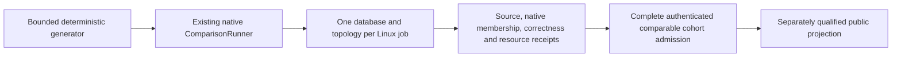

# ADR-103: Bounded scaled database comparison stage

Status: Accepted implementation contract; source, current full cohort and CI originals remain open. Related REQ/AC-SCALE-009..015 and KL-075. See [ScalingQualification](../Features/BenchmarkComparisons/ScalingQualification.md). Preserve [ScaledWorkloads](../Features/BenchmarkComparisons/ScaledWorkloads.md) and its independent ZoneTree raw-storage profile; this ADR concerns the full database comparison matrix.

## Decision

Keep the existing intensive 4,096-document/10,000-operation closed-loop comparison as a separate control. Add a new 100K/1M/5M real-record profile with 100K caller operations per applicable cell using the existing targets, comparison runner ownership, native topology implementations and isolated per-database GitHub workflow. Do not represent profile expansion alone as a valid implementation: the existing corpus and measurer materialize per-record documents/vectors and all operation arrays, so the scaled path must use bounded random-access generation and finite result/statistical retention. This stage measures existing common CRUD plus point lookup; it does not claim open-loop, SQL complex queries, skew stress, recovery, movement, endurance, or power-loss durability.

The profile IDs are `scaled-100k-c16`, `scaled-1m-c16`, and `scaled-5m-c16`, mapping exactly to 100,000/1,000,000/5,000,000 target records; every cell performs exactly100,000 measured calls, payload1,024 bytes, seed1729, warmup256, one repetition and concurrency16. Scenarios are PointRead, DocumentWrite, DocumentUpdate and DocumentDelete. Matrix is 9 target names × actual member counts1/2/3 × three profiles × four applicable scenarios, preserving native unsupported dispositions (324 cell identities). Each cell runs alone on a Linux GitHub runner and seeds/verifies the entire actual dataset before timing.

## Ordered implementation and code ownership

1. Tests-first: `tests/KeyLoad.ComparisonTests/Features/BenchmarkComparisons/Cases/ScaledComparisonProfileTests.cs`, `ScaledComparisonDatasetTests.cs`, `ScaledComparisonRunnerTests.cs`, and `ScaledFairnessManifestTests.cs` plus role-local assertions/helpers. Literal profile/generator/manifest vectors are independent, strict and never generated from runtime catalog output.
2. Library: add the scale profile and random-access dataset contracts under `benchmarks/KeyLoad.Comparisons/Features/BenchmarkComparisons/{Contracts,Corpus,Topology}`. Extend the existing ComparisonRunner/target/session path with a bounded scaled branch. It produces on-demand inputs, performs actual full native seed/readback verification, validates each measured result and discards it, and retains exact counters plus a fixed deterministic latency sample. Preserve old `BenchmarkDataset` and report behavior for the original 270 control cells. Keep every in-flight operation within fixed concurrency and await settlement on cancellation/timeout.
3. Worker-owned target adaptation touches existing database target adapters only when necessary to consume the bounded dataset and preserve the exact semantic read/write oracle. Do not create new provider or in-memory adapters. Unsupported genuine topology remains unsupported.
4. Root owns the canonical profile/workflow matrix, GitHub runner identity/hardware and per-resource effective limits, AppHost/RF topology observation, image/native membership/ACK proof, source/run/artifact authentication, aggregate completeness gate and website publication. New data must flow through these existing pipeline owners; no second workflow or harness.
5. Root integrates, performs source review, then runs exact canonical solution build, formatter/analyzers and required TUnit/normal/scalar/recovery/RF3 suites through Aspire. Actual database scale jobs execute only in the isolated Linux GitHub pipeline. Publish eligibility additionally requires full original native artifacts and same-hardware/resource/durability/correctness envelope.

### Accepted exact-source composite CI accounting

6. The existing `benchmarks/KeyLoad.Comparisons/Features/BenchmarkComparisons/isolated-contract.json` control object and its 270 cell identities stay unchanged. A version-2 composite CI plan wraps the exact existing version-1 control plan and three independently validated 108-cell scale subplans. The nine existing database groups receive their unchanged 3 preflight + 30 control rows plus 36 profile-qualified scale rows each. `scripts/Features/BenchmarkComparisons/{isolated-plan*,isolated-preflight.mjs}` own this plan/matrix; `benchmarks.yml` only routes its nine returned matrices and passes exact per-row `Benchmarks__ScaleProfile` and `Benchmarks__EvidenceProfile`. There is no second workflow/harness.
7. GitHub proof is partitioned into four exact profile cohorts (control plus the three scale IDs). Every cohort retains the same authenticated source SHA/run/attempt/repository/ref/workflow; each worker, job, artifact, report, target, topology and profile is validated against exactly one matching profile-specific subplan. The collector/worker/aggregate modules under `scripts/Features/BenchmarkComparisons/` reject duplicate/missing rows and mixed identities. `aggregate-cli.mjs` performs one all-profile admission only after the composite plan and all four proofs validate; it leaves the existing `aggregate.json` control bytes/shape unchanged and emits `scaled/<profileId>/aggregate.json` for each profile plus `scaled/cohort-receipt.json`.
8. `scaled/cohort-receipt.json` uses closed `schemaVersion: 1` and contains: common `{sourceRevision,runId,attempt,repository,ref,workflow}`; `control` `{profile,cellCount,aggregateSha256,cells}` where the exact 270 rows contain `{id,artifactId,artifactName,artifactDigest,workerSha256}`; `scaledProfiles` contains the three exact canonical IDs/count settings and 108 rows each, with `{id,target,nodeCount,scenario,disposition,artifactId,artifactName,artifactDigest,workerSha256}`; top-level `{qualified,failedIds,missingEvidence}` explicitly records scale qualification, sorted safe IDs of accounted failed/null cells, and sorted closed evidence-category keys. Missing actual hardware/server envelope evidence uses only `hardwareClass`, `effectiveServerResources`, `storageEnvelope`, or `serverCpuRss`; client-process counters and unlike host snapshots cannot substitute. `qualified` additionally requires empty `missingEvidence`. The validator compares all ID sets to the independent canonical plan and requires each `sha256:` archive digest and worker JSON digest to match authenticated proof. The control aggregate hash binds the unchanged validated 270 control rows. Each scaled profile contains exactly 108 scale rows. `qualified` is true only if all required measurable cells succeeded and every unsupported row is the exact frozen disposition; otherwise a complete, authenticated receipt records `qualified=false` and sorted `failedIds`, preserving null reports and fixed safe reasons. Missing, duplicate, corrupt, or mismatched rows reject active scale accounting. Stable hardware-class fingerprint and actual effective CPU/memory/storage limits must match within each comparable `(profile,nodeCount,scenario)` cohort; storage/durability/write-ACK, record count, payload, seed, same-profile corpus/workload identity, actual node count and profile are exact. Dataset digests are compared only within identical record-count/profile cohorts, never across different profile sizes. Target image/version must match that target's own canonical target manifest and are retained as exact per-target evidence, not compared for equality across unlike providers. Runner instance IDs and observed CPU/RSS peaks are provenance/measurements, not equality keys; peaks must be finite and within effective limits. Missing/unknown hardware or limits never match.
9. `tests/KeyLoad.UnitTests/Features/BenchmarkComparisons/Cases/` owns independent scale-plan exact-set, legacy-control-unchanged, matrix job/artifact uniqueness, four-profile proof partition and receipt rejection oracles in role-local helpers. Existing cases to extend are `IsolatedPlanTests`, `IsolatedPlanRejectionTests`, `IsolatedAggregateProofTests`, `IsolatedAggregateEnvelopeTests`, and workflow-layout tests. Root owns any later site projection contract. This stage does not add a site gate or consume the scale receipt in the website: complete authenticated scale failures preserve current ADR-080 control publication semantics, while no scale projection or full-scale success claim is emitted.

Rollback removes the scale selector/matrices/subplans/receipt together, preserving the original control plan/output and ADR-080 authenticated failed/null publication. Specialized scale query/model/recovery/movement/endurance work remains open.

## Manifest fields and no-mismatch rule

### Accepted bounded corpus and report seam

`IComparisonTarget.InitializeAsync` takes the sole `IComparisonCorpus` contract. Its members are `IComparisonSettings Settings`, `IReadOnlyList<BenchmarkDocument> Documents`, `IReadOnlyList<BenchmarkEdge> Edges`, `int GraphVertexCount`, `string Sha256`, `BenchmarkDocument CreateDocument(int number)` and `BenchmarkDocument Input(Scenario scenario, int repetition, int operation, bool warmup)`. The list interface permits bounded indexed generation and enumeration; it does not authorize retained per-record arrays. Existing `BenchmarkDataset` implements this interface explicitly and preserves its public immutable-array properties and control bytes.

`IComparisonSettings` exposes read-only integer properties `Documents`, `Operations`, `Warmup`, `Repetitions`, `Concurrency`, `PayloadBytes`, `Seed`, `Dimensions`, `TopK`, `TimeoutSeconds`, `GraphVertices`, `GraphFanOut` and `GraphDepth`. Existing `ComparisonOptions` implements it without changing its validation or one-million-record materialized-corpus cap. The separate sealed immutable `ScaledComparisonProfile` settings DTO in `Contracts`, admitted only through `Validation/ScaledComparisonProfileParser.Parse(string id)`, implements those settings and accepts exactly the three profile IDs/counts above. No invalid `ComparisonOptions` represents five million records. Scaled records retain no vector table; a native provider that requires a vector may generate its existing deterministic 32-dimension value for that one record only. S1 seeds no separate graph, event, queue or vector-search model unless a provider's native document representation requires it. Those native auxiliary fields and dimensions must be explicit in its target contract.

Scaled document generation preserves the existing `d` plus nine-digit ID and ordered `id,number,text,padding` JSON, with exactly 1,024 UTF-8 bytes. Point selection is `((uint)1729 + (uint)operation * 2654435761u) % N`. Write/update/delete warmup and measured identities use distinct bounded number blocks derived from N and Operations+Warmup. The scale corpus digest is ordered SHA-256 over little-endian length-prefixed UTF-8 ID then canonical four-field JSON for every record. Provider readback must independently validate the exact four fields, identity, numeric value and payload, then hash the observed values in that canonical order; it cannot hash generated expectations instead of validating actual rows.

`IComparisonSession.ReadCorpusAsync(CancellationToken cancellationToken)` returns `IAsyncEnumerable<FoundDocument>`. Supported S1 native adapters implement bounded ordered native paging/streaming, yielding all actual seeded document records once in increasing document-number order; duplicates, missing/extra records, payload mismatch and cancellation fail verification. Page buffers have an explicit finite cap. Do not add product transports or unbounded provider queries for this setup seam. A native capability absent from a target is an explicit failure/unavailability, never synthetic evidence. The common runner validates exact N and observed digest before timing and settles the enumerator and native sessions on failure.

The existing `ComparisonReport` gains nullable `ScaledComparisonProfile ScaledProfile`, omitted from JSON when null, and its `Options` parameter becomes nullable. Exactly one configuration is authoritative: original controls retain non-null `Options` and null/omitted `ScaledProfile`; scaled reports have null `Options` and the exact non-null `ScaledProfile`. Never populate a scaled report with default or capped control options. Missing/both configurations, profile/count mismatch, or a scaled report passed to the control-only publication admission fail closed. Existing control JSON, schema identity and report behavior remain unchanged. The same runner/report ownership carries scaled results; this is no second harness. Root freezes the scaled workflow/envelope version before pipeline admission.

Scaled measurement retains at most 4,096 latency values, selected by operation index using `evenly-spaced-operation-indices.v1`: for capacity K=4,096 and M=100,000 requested measured calls, sample index i is `floor(i*(M-1)/(K-1))`, for i=0..K-1. Completion order does not change selection; missing sample slots remain explicit. Quantiles are labelled sampled estimates. Exact requested/attempted/success/failure/deadline-timeout/rejection/unfinished counts are separate from samples and remain truthful on cancellation. All declared calls must be accounted for; a failed run cannot reduce its declared M or publish a success cohort.

The scaled cell manifest binds workflow schema, target, native count, profile, scenario, actual record count, measured operations, corpus digest, payload/schema/seed, source SHA, run/attempt/job/artifact hashes, Linux image, ephemeral runner-instance identity for provenance, stable machine hardware-class fingerprint, CPU identity/count, physical/available memory, cgroup CPU/memory, per-node and total database effective resource limits, measured per-cell CPU/RSS peaks, storage type/capacity, target native membership, read/ACK/durability mode, closed-loop schedule, `uniform-v1` shard distribution and explicit fanout/recovery/movement applicability. Equality is required for stable hardware class, effective budgets, storage/durability/ACK and corpus/workload contract before aggregation; ephemeral runner IDs and actual observed peaks are retained but are not equality keys. Every measured peak must be finite and within the effective envelope; different providers are not required to consume equal resources. The request-declared container limits alone do not establish observed effective resources. Unknown values are not equal. Partial, mixed, failed or unsupported required cells cannot update the published report.

## Rollout, rollback, and verification

Add only the new profile identity and bounded scaled execution stage; old `intensive-1k-c16`, existing270 control cohort, current site schema and historical artifacts remain unchanged. If a profile, native target, topology or manifest fails, retain the failure and do not publish that scale cohort. Rollback removes the scale profile and producer cells as one source/workflow change while preserving original control receipts. No database contents are shared across runners or between engine targets. Source code, fixture manifests and local measurements never qualify an actual database comparison or site claim.

Root owns workflow/AppHost/runner hardware/resource observations/aggregation/site joins. Worker owns feature-local scale profile/generator/runner files and ComparisonTests scale cases/helpers; target-specific files are worker-owned only if new-profile integration strictly requires them. Verification does not rely on local test or benchmark runs under ComparisonTests/Comparisons policies. There is no frontend work until a later complete source/run-bound public metrics projection is approved. Open-loop, shard-skew/fanout stress, recovery, movement, SQL complex-query comparison, endurance and powerloss are later separately frozen stages.

## Accepted scale resource evidence and Aspire forwarding, 2026-10-05

REQ/AC-SCALE-016 (new) and ADR-103 stage 10 (new). This accepted contract precedes private code; durable docs join before its live source. Only the three exact scaled profiles use the new sidecar. The original 270 controls and website aggregate schema remain unchanged.

One AppHost-owned collector observes the exact selected native target ContainerResources and lifecycle, never the load generator. It writes server-resource-evidence.v1 in a separate server-resource-evidence.json beside the original worker.json only after runner settlement; it binds exact source/run/attempt/job/target/nodeCount/scenario/profile and SHA256 of original worker bytes. AppHost/test teardown must await this original collector before reports are copied and app ownership is released. Failed/unavailable observation never changes workload timing/results or invents successful qualification.

Observe actual Linux kernel/architecture, CPU vendor/family/model/stepping and physical/logical CPU membership, memory, AppHost effective cgroup envelope, actual target container full IDs/image IDs/start identity/state and cgroup CPU/memory limits/counters, and actual writable data mount filesystem type/capacity. Never substitute requested limits, client sampler counters, host processor count alone, unknown VM class or Docker cache-adjusted working set for server RSS. For exact sampled aggregate process RSS, read bounded cgroup.procs plus /proc/<pid>/status and start identity, verify each PID belongs to the exact current container/cgroup, and reject PID reuse/identity ambiguity. Name measurements maxObservedRssBytes and observedCpuUsage, not an unsampled true peak. Missing permissions/remote daemon/unavailable cgroup or storage is explicit unqualified evidence.

Bounds: one collector, at most three native server containers, five-second cadence, at most 1,680 samples per resource and 140 minutes admitted observation work; retain online aggregates only. Per sample metadata at most 256 KiB, each regular proc/cgroup read at most 4 KiB except explicit hardware enumeration aggregate bounded 256 KiB; at most 128 admitted native PIDs and eight data mounts per container. Sidecar at most 64 KiB. Native Docker commands use closed argv, byte bounds, authenticated owned model identities, application stopping cancellation, TERM then one-second KILL and original exit/readers join. Thirty-second cleanup is an escalation/failure threshold, not detached settlement. Caps, truncation or absent samples force unqualified with existing safe missingEvidence categories; never fabricate zero/default counters.

Consumers retain the exact sidecar and authenticate its original artifact/provider/source binding and worker hash separately. No sidecar is manufactured for controls. Compare hardware identity, effective server CPU/memory envelope and storage class/capacity across each profile/nodeCount/scenario cohort, verifying each target's own image manifest separately. Container/PID identities and measured counters are provenance/output, not hardware-equivalence values. Reject mixed cohorts, mismatched actual envelopes, missing/corrupt/duplicate artifacts; no older fallback. Unsupported native cells retain their original explicit capability disposition and do not claim server samples.

Worker owns feature-local AppHost Contracts/Observation/Processes roles, minimal composition/lifecycle joins, bounded parser/identity/native regressions and scale-only script consumers. Root owns durable feature/ADR freeze, source integration, actual Aspire native Linux/Docker qualification, CI/publication, receipts and commits. Private implementation may rely on the existing 45 engine + 10 Aspire + 25 CI packets as explicit predecessor source, never silently overwrite their bases. A reviewable patch and base/post manifests are required. No checkout edits, gates or Git by the worker.

The accepted SCALE-016 native-root correction follows the documented cgroup-v2
root semantics: CPU/memory maximum interfaces exist on non-root cgroups. Preserve
all actual non-root ancestor minima, effective cpuset and verified hierarchy
identity; terminate at the real root rather than requiring nonexistent root
limits. Missing/malformed/unreadable required child observations remain explicit
unqualified evidence. The independent actual Linux oracle and supported-envelope
regression must expose that distinction. Root owns integration/original Linux
gates; partition_pages owns the guarded repair. No sidecar or stored schema
changes occur and rollback cannot fabricate limits or reduce complete cohorts.

## Accepted prerequisite: Aspire scale forwarding (REQ/AC-SCALE-014)

Introduce only the separate KeyLoadTests:ScaleProfile test-harness selector. TestSuiteSettings accepts one exact canonical scaled ID only for Suite=comparison, the exact /*/*/IsolatedNativeComparisonTests/* filter, present native Benchmarks:Target, matching Benchmarks:EvidenceProfile, disabled Benchmarks:Enabled, no direct Benchmarks:ScaleProfile and no workload overrides. Reject missing suite, other suites, unknown/blank/case-mismatched IDs or mixed modes before any resource creation. Existing direct Benchmarks:ScaleProfile plus a suite remains rejected.

run-workload passes --KeyLoadTests:ScaleProfile=<id> to the outer AppHost. Its owned runner alone receives Benchmarks__ScaleProfile=<id>; clear KeyLoadTests__ScaleProfile alongside KeyLoadTests__Suite so the harness selector does not leak into the nested native AppHost. IsolatedNativeCase reads the exact ordinary ComparisonWorkerSelection from the runner environment and passes --Benchmarks:ScaleProfile=<id> to its own nested resource-owning AppHost. Preserve exact evidence/source/native topology and all control behavior. IsolatedNativeCase uses exactly 140 minutes for the closed scale profile and its existing 60 minutes for controls; all original tasks/resources are still joined.

Worker owns the narrow TestSuiteSettings/TestSuiteResources/IsolatedNativeCase/run-workload joins and real Aspire model plus independent argument/environment regressions. This is a prerequisite repair to the accepted SCALE-014 path, not a new alternate test caller. Durable docs join before live implementation.

## Accepted stage 11: original teardown settlement, 2026-10-05

REQ/AC-SCALE-017 and TASK-SCALE-ORIGINAL-TEARDOWN repair the inspected existing
IsolatedNativeTeardown path, which detached a pending task after 30 seconds and
replaced or suppressed actual cleanup failures. Freeze the exact owner/order,
original-task join, native fatal classification and primary/cleanup preservation
contract in ScalingQualification before implementation. The collector joins from
stage 10 use the same lifetime; the existing control success path/report schemas
remain unchanged.

Implement in order: retain the original case failure; settle the original
collector/capture and report writers; stop and dispose actual owners; delete data
only after safe ownership release; write bounded safe categories; propagate the
original ordered failures after all safely reachable stages. Keep 30 seconds as
an escalation/failure threshold, never detached completion. Add genuine native
Cases/Helpers regressions for pending settlement and simultaneous primary plus
cleanup failures, and run them through the canonical Aspire comparison entry.
ComparisonTests owns this code, partition_pages owns its private guarded packet,
and root owns integration/gates/evidence/commit. There is no data or wire migration;
rollback cannot convert an unfinished original task into a passing qualification.
The stage also replaces the collector's premature completed boolean with one
memoized original completion task, preserves cancellation-callback failures
while joining its original observation, and retains failed write settlement on
repeated teardown. Its schema, byte/time bounds and unqualified categories stay
unchanged. This lifecycle amendment precedes the private repair.

## Accepted stage12: independent fixed-rate open-loop S1

Related REQ-SCALE-018 / AC-SCALE-018..021 and TASK-SCALE-OPEN-LOOP are frozen in
ScalingQualification before implementation. The actual current worker is
completion-paced, generic exceptions are currently labeled rejection, and the
session-cleanup helper can abandon its original disposal task after a timeout.
The new stage must repair those seams while retaining every native target,
correctness oracle, ownership bound and existing control/closed-loop result.

Ordered implementation: (1) add strict rate/schedule/accounting contracts and
document the exact typed native rejection mapping; (2) repair original session
disposal settlement under SCALE-017; (3) implement monotonic bounded producer,
16 native consumers,64 queued items, scheduled-arrival deadline, terminal state
freeze, original join and4096-sample reporting; (4) add exact internal selector
forwarding through the canonical Aspire comparison entry and separate worker-
bound sidecar; (5) implement the independent972-cell receipt inside the existing
nine named database groups; (6) execute complete real native positive/error/
cancellation/drain flows, whole solution gates and authenticated isolated Linux
workloads. No source-only or local result qualifies the global cohort.

Library ownership is BenchmarkComparisons Contracts/Execution/Validation/
Reporting and the narrow actual adapters/ComparisonSessionCleanup; native tests
use ComparisonTests Cases/Helpers/Assertions. Root owns durable contracts,
shared AppHost/workflow joins and evidence/commits; the dedicated partition_pages
Luna owns private guarded implementation. Scripts use new feature-local
open-loop executable artifacts. Dependencies are the S1 native corpus and
resource evidence, genuine provider topology and SCALE-017 original settlement.
Public/product schema migration is N/A: this is a separate internal artifact;
control schema3,324 closed-loop cells and website projection remain unchanged.
Rollback removes the new selection/cohort without rewriting original receipts.
The actual1/3/6-node objective, two physical owners, skew/fanout and recovery/
movement depend on their own contracts and remain open after this stage.
