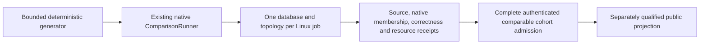

# ADR-103: Bounded scaled database comparison stage

Status: Accepted implementation contract; source, current full cohort and CI originals remain open. Related REQ/AC-SCALE-009..013 and KL-075. See [ScalingQualification](../Features/BenchmarkComparisons/ScalingQualification.md). Preserve [ScaledWorkloads](../Features/BenchmarkComparisons/ScaledWorkloads.md) and its independent ZoneTree raw-storage profile; this ADR concerns the full database comparison matrix.

## Decision

Keep the existing intensive 4,096-document/10,000-operation closed-loop comparison as a separate control. Add a new 100K/1M/5M real-record profile with 100K caller operations per applicable cell using the existing targets, comparison runner ownership, native topology implementations and isolated per-database GitHub workflow. Do not represent profile expansion alone as a valid implementation: the existing corpus and measurer materialize per-record documents/vectors and all operation arrays, so the scaled path must use bounded random-access generation and finite result/statistical retention. This stage measures existing common CRUD plus point lookup; it does not claim open-loop, SQL complex queries, skew stress, recovery, movement, endurance, or power-loss durability.

The profile IDs are `scaled-100k-c16`, `scaled-1m-c16`, and `scaled-5m-c16`, mapping exactly to 100,000/1,000,000/5,000,000 target records; every cell performs exactly100,000 measured calls, payload1,024 bytes, seed1729, warmup256, one repetition and concurrency16. Scenarios are PointRead, DocumentWrite, DocumentUpdate and DocumentDelete. Matrix is 9 target names × actual member counts1/2/3 × three profiles × four applicable scenarios, preserving native unsupported dispositions (324 cell identities). Each cell runs alone on a Linux GitHub runner and seeds/verifies the entire actual dataset before timing.

## Ordered implementation and code ownership

1. Tests-first: `tests/KeyLoad.ComparisonTests/Features/BenchmarkComparisons/Cases/ScaledComparisonProfileTests.cs`, `ScaledComparisonDatasetTests.cs`, `ScaledComparisonRunnerTests.cs`, and `ScaledFairnessManifestTests.cs` plus role-local assertions/helpers. Literal profile/generator/manifest vectors are independent, strict and never generated from runtime catalog output.
2. Library: add the scale profile and random-access dataset contracts under `benchmarks/KeyLoad.Comparisons/Features/BenchmarkComparisons/{Contracts,Corpus,Topology}`. Extend the existing ComparisonRunner/target/session path with a bounded scaled branch. It produces on-demand inputs, performs actual full native seed/readback verification, validates each measured result and discards it, and retains exact counters plus a fixed deterministic latency sample. Preserve old `BenchmarkDataset` and report behavior for the original 270 control cells. Keep every in-flight operation within fixed concurrency and await settlement on cancellation/timeout.
3. Worker-owned target adaptation touches existing database target adapters only when necessary to consume the bounded dataset and preserve the exact semantic read/write oracle. Do not create new provider or in-memory adapters. Unsupported genuine topology remains unsupported.
4. Root owns the canonical profile/workflow matrix, GitHub runner identity/hardware and per-resource effective limits, AppHost/RF topology observation, image/native membership/ACK proof, source/run/artifact authentication, aggregate completeness gate and website publication. New data must flow through these existing pipeline owners; no second workflow or harness.
5. Root integrates, performs source review, then runs exact canonical solution build, formatter/analyzers and required TUnit/normal/scalar/recovery/RF3 suites through Aspire. Actual database scale jobs execute only in the isolated Linux GitHub pipeline. Publish eligibility additionally requires full original native artifacts and same-hardware/resource/durability/correctness envelope.

## Manifest fields and no-mismatch rule

### Accepted bounded corpus and report seam

`IComparisonTarget.InitializeAsync` takes the sole `IComparisonCorpus` contract. Its members are `IComparisonSettings Settings`, `IReadOnlyList<BenchmarkDocument> Documents`, `IReadOnlyList<BenchmarkEdge> Edges`, `int GraphVertexCount`, `string Sha256`, `BenchmarkDocument CreateDocument(int number)` and `BenchmarkDocument Input(Scenario scenario, int repetition, int operation, bool warmup)`. The list interface permits bounded indexed generation and enumeration; it does not authorize retained per-record arrays. Existing `BenchmarkDataset` implements this interface explicitly and preserves its public immutable-array properties and control bytes.

`IComparisonSettings` exposes read-only integer properties `Documents`, `Operations`, `Warmup`, `Repetitions`, `Concurrency`, `PayloadBytes`, `Seed`, `Dimensions`, `TopK`, `TimeoutSeconds`, `GraphVertices`, `GraphFanOut` and `GraphDepth`. Existing `ComparisonOptions` implements it without changing its validation or one-million-record materialized-corpus cap. The separate sealed immutable `ScaledComparisonProfile`, constructed only through `Parse(string id)`, implements those settings and accepts exactly the three profile IDs/counts above. No invalid `ComparisonOptions` represents five million records. Scaled records retain no vector table; a native provider that requires a vector may generate its existing deterministic 32-dimension value for that one record only. S1 seeds no separate graph, event, queue or vector-search model unless a provider's native document representation requires it. Those native auxiliary fields and dimensions must be explicit in its target contract.

Scaled document generation preserves the existing `d` plus nine-digit ID and ordered `id,number,text,padding` JSON, with exactly 1,024 UTF-8 bytes. Point selection is `((uint)1729 + (uint)operation * 2654435761u) % N`. Write/update/delete warmup and measured identities use distinct bounded number blocks derived from N and Operations+Warmup. The scale corpus digest is ordered SHA-256 over little-endian length-prefixed UTF-8 ID then canonical four-field JSON for every record. Provider readback must independently validate the exact four fields, identity, numeric value and payload, then hash the observed values in that canonical order; it cannot hash generated expectations instead of validating actual rows.

`IComparisonSession.ReadCorpusAsync(CancellationToken cancellationToken)` returns `IAsyncEnumerable<FoundDocument>`. Supported S1 native adapters implement bounded ordered native paging/streaming, yielding all actual seeded document records once in increasing document-number order; duplicates, missing/extra records, payload mismatch and cancellation fail verification. Page buffers have an explicit finite cap. Do not add product transports or unbounded provider queries for this setup seam. A native capability absent from a target is an explicit failure/unavailability, never synthetic evidence. The common runner validates exact N and observed digest before timing and settles the enumerator and native sessions on failure.

The existing `ComparisonReport` gains nullable `ScaledComparisonProfile ScaledProfile`, omitted from JSON when null, and its `Options` parameter becomes nullable. Exactly one configuration is authoritative: original controls retain non-null `Options` and null/omitted `ScaledProfile`; scaled reports have null `Options` and the exact non-null `ScaledProfile`. Never populate a scaled report with default or capped control options. Missing/both configurations, profile/count mismatch, or a scaled report passed to the control-only publication admission fail closed. Existing control JSON, schema identity and report behavior remain unchanged. The same runner/report ownership carries scaled results; this is no second harness. Root freezes the scaled workflow/envelope version before pipeline admission.

Scaled measurement retains at most 4,096 latency values, selected by operation index using `evenly-spaced-operation-indices.v1`: for capacity K=4,096 and M=100,000 requested measured calls, sample index i is `floor(i*(M-1)/(K-1))`, for i=0..K-1. Completion order does not change selection; missing sample slots remain explicit. Quantiles are labelled sampled estimates. Exact requested/attempted/success/failure/deadline-timeout/rejection/unfinished counts are separate from samples and remain truthful on cancellation. All declared calls must be accounted for; a failed run cannot reduce its declared M or publish a success cohort.

The scaled cell manifest binds workflow schema, target, native count, profile, scenario, actual record count, measured operations, corpus digest, payload/schema/seed, source SHA, run/attempt/job/artifact hashes, Linux image, ephemeral runner-instance identity for provenance, stable machine hardware-class fingerprint, CPU identity/count, physical/available memory, cgroup CPU/memory, per-node and total database effective resource limits, measured per-cell CPU/RSS peaks, storage type/capacity, target native membership, read/ACK/durability mode, closed-loop schedule, `uniform-v1` shard distribution and explicit fanout/recovery/movement applicability. Equality is required for stable hardware class, effective budgets, storage/durability/ACK and corpus/workload contract before aggregation; ephemeral runner IDs and actual observed peaks are retained but are not equality keys. Every measured peak must be finite and within the effective envelope; different providers are not required to consume equal resources. The request-declared container limits alone do not establish observed effective resources. Unknown values are not equal. Partial, mixed, failed or unsupported required cells cannot update the published report.

## Rollout, rollback, and verification

Add only the new profile identity and bounded scaled execution stage; old `intensive-1k-c16`, existing270 control cohort, current site schema and historical artifacts remain unchanged. If a profile, native target, topology or manifest fails, retain the failure and do not publish that scale cohort. Rollback removes the scale profile and producer cells as one source/workflow change while preserving original control receipts. No database contents are shared across runners or between engine targets. Source code, fixture manifests and local measurements never qualify an actual database comparison or site claim.

Root owns workflow/AppHost/runner hardware/resource observations/aggregation/site joins. Worker owns feature-local scale profile/generator/runner files and ComparisonTests scale cases/helpers; target-specific files are worker-owned only if new-profile integration strictly requires them. Verification does not rely on local test or benchmark runs under ComparisonTests/Comparisons policies. There is no frontend work until a later complete source/run-bound public metrics projection is approved. Open-loop, shard-skew/fanout stress, recovery, movement, SQL complex-query comparison, endurance and powerloss are later separately frozen stages.
