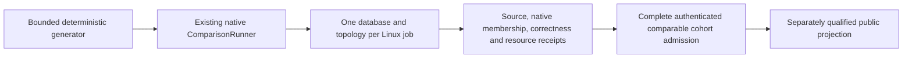

# ADR-103: Bounded scaled database comparison stage

The active inventory contains exactly 100k and 1m profiles for every database
and workload. SurrealDB/HelixDB increase the active inventory to 11 engines; the
closed-loop CRUD family has 264 identities. Original artifacts retain their
recorded settings as provenance.
[ADR-109](ADR-109-native-vector-comparisons.md) governs the vector/site
extension.
Status: Accepted implementation contract; source, current full cohort and CI originals remain open. Related REQ/AC-SCALE-009..015 and KL-075. See [ScalingQualification](../Features/BenchmarkComparisons/ScalingQualification.md). Preserve [ScaledWorkloads](../Features/BenchmarkComparisons/ScaledWorkloads.md) and its independent ZoneTree raw-storage profile; this ADR concerns the full database comparison matrix.

## Decision

Keep the existing intensive 4,096-document/10,000-operation closed-loop comparison as a separate control. Add a new 100K/1M real-record profile with 100K caller operations per applicable cell using the existing targets, comparison runner ownership, native topology implementations and isolated per-database GitHub workflow. Do not represent profile expansion alone as a valid implementation: the existing corpus and measurer materialize per-record documents/vectors and all operation arrays, so the scaled path must use bounded random-access generation and finite result/statistical retention. This stage measures existing common CRUD plus point lookup; it does not claim open-loop, SQL complex queries, skew stress, recovery, movement, endurance, or power-loss durability.

The profile IDs are `scaled-100k-c16` and `scaled-1m-c16`, mapping exactly to 100,000/1,000,000 target records; every cell performs exactly100,000 measured calls, payload1,024 bytes, seed1729, warmup256, one repetition and concurrency16. Scenarios are PointRead, DocumentWrite, DocumentUpdate and DocumentDelete. Matrix is 11 target names × actual member counts1/2/3 × two profiles × four applicable scenarios, preserving native unsupported dispositions (264 cell identities). Each cell runs alone on a Linux GitHub runner and seeds/verifies the entire actual dataset before timing.

## Ordered implementation and code ownership

1. Tests-first: `tests/KeyLoad.ComparisonTests/Features/BenchmarkComparisons/Cases/ScaledComparisonProfileTests.cs`, `ScaledComparisonDatasetTests.cs`, `ScaledComparisonRunnerTests.cs`, and `ScaledFairnessManifestTests.cs` plus role-local assertions/helpers. Literal profile/generator/manifest vectors are independent, strict and never generated from runtime catalog output.
2. Library: add the scale profile and random-access dataset contracts under `benchmarks/KeyLoad.Comparisons/Features/BenchmarkComparisons/{Contracts,Corpus,Topology}`. Extend the existing ComparisonRunner/target/session path with a bounded scaled branch. It produces on-demand inputs, performs actual full native seed/readback verification, validates each measured result and discards it, and retains exact counters plus a fixed deterministic latency sample. Preserve the current `BenchmarkDataset` control workload and report behavior for the 330 control cells. Keep every in-flight operation within fixed concurrency and await settlement on cancellation/timeout.
3. Worker-owned target adaptation touches existing database target adapters only when necessary to consume the bounded dataset and preserve the exact semantic read/write oracle. Do not create new provider or in-memory adapters. Unsupported genuine topology remains unsupported.
4. Root owns the canonical profile/workflow matrix, GitHub runner identity/hardware and per-resource effective limits, AppHost/RF topology observation, image/native membership/ACK proof, source/run/artifact authentication, aggregate completeness gate and website publication. New data must flow through these existing pipeline owners; no second workflow or harness.
5. Root integrates, performs source review, then runs exact canonical solution build, formatter/analyzers and required TUnit/normal/scalar/recovery/RF3 suites through Aspire. Actual database scale jobs execute only in the isolated Linux GitHub pipeline. Publish eligibility additionally requires full original native artifacts and same-hardware/resource/durability/correctness envelope.

### Accepted exact-source composite CI accounting

6. The existing `benchmarks/KeyLoad.Comparisons/Features/BenchmarkComparisons/isolated-contract.json` control workload parameters stay unchanged; ADR-109 extends the catalog to 330 cell identities. The current version-3 composite CI plan contains the exact version-1 control plan, two independently validated 132-cell scale subplans, and the 24 vector-profile subplans governed by ADR-109. Each of the eleven database groups receives 3 preflight + 30 control + 24 scale + 72 vector rows before the separately specified open-loop extension. `scripts/Features/BenchmarkComparisons/{scaled-isolated-plan.mjs,isolated-preflight.mjs}` own this plan/matrix; `benchmarks.yml` routes the eleven returned matrices and preserves each row's exact profile selectors. There is no second workflow/harness.
7. CRUD proof is partitioned into three exact profile cohorts: control, `scaled-100k-c16`, and `scaled-1m-c16`. The composite additionally requires the 24 separate vector-profile proofs under ADR-109. Every cohort retains the same authenticated source SHA/run/attempt/repository/ref/workflow; each worker, job, artifact, report, target, topology and profile is validated against exactly one matching profile-specific subplan. The collector/worker/aggregate modules under `scripts/Features/BenchmarkComparisons/` reject duplicate/missing rows and mixed identities. `scaled-cohort-aggregate-cli.mjs` performs one composite admission only after every control, scale and vector proof validates; it leaves the current `aggregate.json` control bytes/shape unchanged and emits each scale/vector profile aggregate and the bound cohort receipt.
8. `scaled/cohort-receipt.json` uses closed `schemaVersion: 1` and contains: common `{sourceRevision,runId,attempt,repository,ref,workflow}`; `control` `{profile,cellCount,aggregateSha256,cells}` where the exact 330 rows contain `{id,artifactId,artifactName,artifactDigest,workerSha256}`; `scaledProfiles` contains the two exact canonical IDs/count settings and 132 rows each, with `{id,target,nodeCount,scenario,disposition,artifactId,artifactName,artifactDigest,workerSha256}`; top-level `{qualified,failedIds,missingEvidence}` explicitly records scale qualification, sorted safe IDs of accounted failed/null cells, and sorted closed evidence-category keys. Missing actual hardware/server envelope evidence uses only `hardwareClass`, `effectiveServerResources`, `storageEnvelope`, or `serverCpuRss`; client-process counters and unlike host snapshots cannot substitute. `qualified` additionally requires empty `missingEvidence`. The validator compares all ID sets to the independent canonical plan and requires each `sha256:` archive digest and worker JSON digest to match authenticated proof. The control aggregate hash binds the unchanged validated 330 control rows. Each scaled profile contains exactly 132 scale rows. `qualified` is true only if all required measurable cells succeeded and every unsupported row is the exact frozen disposition; otherwise a complete, authenticated receipt records `qualified=false` and sorted `failedIds`, preserving null reports and fixed safe reasons. Missing, duplicate, corrupt, or mismatched rows reject active scale accounting. Stable hardware-class fingerprint and actual effective CPU/memory/storage limits must match within each comparable `(profile,nodeCount,scenario)` cohort; storage/durability/write-ACK, record count, payload, seed, same-profile corpus/workload identity, actual node count and profile are exact. Dataset digests are compared only within identical record-count/profile cohorts, never across different profile sizes. Target image/version must match that target's own canonical target manifest and are retained as exact per-target evidence, not compared for equality across unlike providers. Runner instance IDs and observed CPU/RSS peaks are provenance/measurements, not equality keys; peaks must be finite and within effective limits. Missing/unknown hardware or limits never match.
9. `tests/KeyLoad.UnitTests/Features/BenchmarkComparisons/Cases/` owns independent scale-plan exact-set, control-contract-unchanged, matrix job/artifact uniqueness, complete current-profile proof partition and receipt rejection oracles in role-local helpers. Existing cases to extend are `IsolatedPlanTests`, `IsolatedPlanRejectionTests`, `IsolatedAggregateProofTests`, `IsolatedAggregateEnvelopeTests`, and workflow-layout tests. Root owns the site projection contract governed by ADR-109 and the separate Website executor under ADR-112/ADR-114. Complete authenticated failures retain their explicit failed/null disposition; missing, corrupt or mixed evidence never becomes an eligible measurement or a full-scale success claim.

Rollback removes the scale selector/matrices/subplans/receipt together, preserving the original control plan/output and ADR-080 authenticated failed/null publication. Specialized scale query/model/recovery/movement/endurance work remains open.

## Manifest fields and no-mismatch rule

### Accepted bounded corpus and report seam

`IComparisonTarget.InitializeAsync` takes the sole `IComparisonCorpus` contract. Its members are `IComparisonSettings Settings`, `IReadOnlyList<BenchmarkDocument> Documents`, `IReadOnlyList<BenchmarkEdge> Edges`, `int GraphVertexCount`, `string Sha256`, `BenchmarkDocument CreateDocument(int number)` and `BenchmarkDocument Input(Scenario scenario, int repetition, int operation, bool warmup)`. The list interface permits bounded indexed generation and enumeration; it does not authorize retained per-record arrays. Existing `BenchmarkDataset` implements this interface explicitly and preserves its public immutable-array properties and control bytes.

`IComparisonSettings` exposes read-only integer properties `Documents`, `Operations`, `Warmup`, `Repetitions`, `Concurrency`, `PayloadBytes`, `Seed`, `Dimensions`, `TopK`, `TimeoutSeconds`, `GraphVertices`, `GraphFanOut` and `GraphDepth`. Existing `ComparisonOptions` implements it without changing its validation or one-million-record materialized-corpus cap. The separate sealed immutable `ScaledComparisonProfile` settings DTO in `Contracts`, admitted only through `Validation/ScaledComparisonProfileParser.Parse(string id)`, implements those settings and accepts exactly the two profile IDs/counts above. The lazy profile does not relax `ComparisonOptions` validation. Scaled records retain no vector table; a native provider that requires a vector may generate its existing deterministic 32-dimension value for that one record only. S1 seeds no separate graph, event, queue or vector-search model unless a provider's native document representation requires it. Those native auxiliary fields and dimensions must be explicit in its target contract.

Scaled document generation preserves the existing `d` plus nine-digit ID and ordered `id,number,text,padding` JSON, with exactly 1,024 UTF-8 bytes. Point selection is `((uint)1729 + (uint)operation * 2654435761u) % N`. Write/update/delete warmup and measured identities use distinct bounded number blocks derived from N and Operations+Warmup. The scale corpus digest is ordered SHA-256 over little-endian length-prefixed UTF-8 ID then canonical four-field JSON for every record. Provider readback must independently validate the exact four fields, identity, numeric value and payload, then hash the observed values in that canonical order; it cannot hash generated expectations instead of validating actual rows.

`IComparisonSession.ReadCorpusAsync(CancellationToken cancellationToken)` returns `IAsyncEnumerable<FoundDocument>`. Supported S1 native adapters implement bounded ordered native paging/streaming, yielding all actual seeded document records once in increasing document-number order; duplicates, missing/extra records, payload mismatch and cancellation fail verification. Page buffers have an explicit finite cap. Do not add product transports or unbounded provider queries for this setup seam. A native capability absent from a target is an explicit failure/unavailability, never synthetic evidence. The common runner validates exact N and observed digest before timing and settles the enumerator and native sessions on failure.

The existing `ComparisonReport` gains nullable `ScaledComparisonProfile ScaledProfile`, omitted from JSON when null, and its `Options` parameter becomes nullable. Exactly one configuration is authoritative: original controls retain non-null `Options` and null/omitted `ScaledProfile`; scaled reports have null `Options` and the exact non-null `ScaledProfile`. Never populate a scaled report with default or capped control options. Missing/both configurations, profile/count mismatch, or a scaled report passed to the control-only publication admission fail closed. Existing control JSON, schema identity and report behavior remain unchanged. The same runner/report ownership carries scaled results; this is no second harness. Root freezes the scaled workflow/envelope version before pipeline admission.

Scaled measurement retains at most 4,096 latency values, selected by operation index using `evenly-spaced-operation-indices.v1`: for capacity K=4,096 and M=100,000 requested measured calls, sample index i is `floor(i*(M-1)/(K-1))`, for i=0..K-1. Completion order does not change selection; missing sample slots remain explicit. Quantiles are labelled sampled estimates. Exact requested/attempted/success/failure/deadline-timeout/rejection/unfinished counts are separate from samples and remain truthful on cancellation. All declared calls must be accounted for; a failed run cannot reduce its declared M or publish a success cohort.

The scaled cell manifest binds workflow schema, target, native count, profile, scenario, actual record count, measured operations, corpus digest, payload/schema/seed, source SHA, run/attempt/job/artifact hashes, Linux image, ephemeral runner-instance identity for provenance, stable machine hardware-class fingerprint, CPU identity/count, physical/available memory, cgroup CPU/memory, per-node and total database effective resource limits, measured per-cell CPU/RSS peaks, storage type/capacity, target native membership, read/ACK/durability mode, closed-loop schedule, `uniform-v1` shard distribution and explicit fanout/recovery/movement applicability. Equality is required for stable hardware class, effective budgets, storage/durability/ACK and corpus/workload contract before aggregation; ephemeral runner IDs and actual observed peaks are retained but are not equality keys. Every measured peak must be finite and within the effective envelope; different providers are not required to consume equal resources. The request-declared container limits alone do not establish observed effective resources. Unknown values are not equal. Partial, mixed, failed or unsupported required cells cannot update the published report.

## Rollout, rollback, and verification

The `intensive-1k-c16` workload parameters and historical artifacts retain their original identity; ADR-109 extends the live catalog and site projection together. If a profile, native target, topology or manifest fails, retain the failure and do not publish that scale cohort. Rollback removes the scale profile and producer cells as one source/workflow change while preserving original control receipts. No database contents are shared across runners or between engine targets. Source code, fixture manifests and local measurements never qualify an actual database comparison or site claim.

Root owns workflow/AppHost/runner hardware/resource observations/aggregation/site joins. Worker owns feature-local scale profile/generator/runner files and ComparisonTests scale cases/helpers; target-specific files are worker-owned only if new-profile integration strictly requires them. Local functional regressions use the canonical Aspire-owned entry and remain development evidence. Native measurement and delivered-source qualification require their exact-source isolated Linux GitHub jobs. Public metrics require the complete authenticated source/run-bound projection and separate Website qualification under ADR-109 and ADR-112. Open-loop, shard-skew/fanout stress, recovery, movement, SQL complex-query comparison, endurance and powerloss are later separately frozen stages.

## Current scale evidence, forwarding and settlement contracts

`REQ/AC-SCALE-014..017` remain separate current acceptance contracts, including `REQ-SCALE-016` / `AC-SCALE-016` and `REQ-SCALE-017` / `AC-SCALE-017`. Their full
inputs, limits, failure mapping and real-test ownership are defined in the owning
[ScalingQualification specification](../Features/BenchmarkComparisons/ScalingQualification.md):
[resource evidence and forwarding](../Features/BenchmarkComparisons/ScalingQualification.md#accepted-scale-resource-evidence-and-aspire-forwarding-2026-10-05),
[the native cancellation regression](../Features/BenchmarkComparisons/ScalingQualification.md#native-probe-cancellation-regression-repair),
[Aspire forwarding](../Features/BenchmarkComparisons/ScalingQualification.md#accepted-prerequisite-aspire-scale-forwarding-reqac-scale-014),
and [original teardown settlement](../Features/BenchmarkComparisons/ScalingQualification.md#accepted-original-teardown-settlement-reqac-scale-017).
These criteria preserve validated typed options; the exact Aspire-owned test
entry; real native child/readiness/exit observations; original cancellation and
task identity; complete reader/owner settlement; and safe cleanup with primary
and cleanup failures retained. Local runs are development evidence; delivered
qualification remains exact-source Linux GitHub evidence.

The scale-resource collector remains one AppHost-owned observation of up to
three actual native server containers, separate from workload timing. Its
original sidecar stays bounded to 64 KiB, resource samples use the specified
five-second cadence and 1,680-sample/140-minute limits, and unavailable or
truncated observations remain unqualified. The original 30-second cleanup bound
is an escalation threshold, never permission to detach a task or emit a success
receipt. The canonical feature specification owns the detailed byte/PID/read
bounds, exact sidecar fields, TERM/KILL sequence and terminal-state oracles.
These contracts do not change control/scaled report schemas or authorize local
measurement in website evidence.

## Current open-loop source route and qualification boundary

REQ-SCALE-018 / AC-SCALE-018..021 define the independent fixed-arrival workload,
actual operation accounting, cancellation proof and joined native resource
lifecycle. Keep the centrally validated options, 16 native consumers, 64 queued
items, scheduled-arrival deadline, 4,096 latency samples, typed rejection/failure
mapping, original cancellation identity, retained task settlement and the existing
native topology/accuracy/resource oracles. The canonical measurement rates are
250, 1,000 and 4,000 operations per second over the two existing scaled profiles.
The native open-loop plan contains 792 measurements (72 per target, including its
144 explicit unsupported identities) and six KeyLoad three-node PointRead
cancellation proofs. A proof retains the actual first `Completed=1024` marker and
its typed identity/counter fields; cancellation-callback failure still joins every
original task, and concurrent disposal returns the same settlement task. It does not
replace or detach the original runner, cancellation, observation or disposal tasks. Host execution keeps the
validated native control/scaled/vector timeout options at 60/140/145 minutes and
the existing matrix bound of 256 rows. REQ-SCALE-022 / AC-SCALE-022 define the
closed per-cell terminal and separate authenticated open-loop cohort receipt.
REQ-SCALE-023 / AC-SCALE-023 define bounded matrix transport. The open-loop
execution/options/tooling joins also preserve REQ-CQ-013 / AC-CQ-034 / AC-CQ-038.
The complete current operational limits, artifact fields, CLI path rules and
regression map remain in the [ScalingQualification specification](../Features/BenchmarkComparisons/ScalingQualification.md#accepted-next-stage-fixed-rate-open-loop-s1).

The current source route is joined in `benchmarks.yml`: the plan CLI creates the
canonical isolated, scaled, vector, composite and open-loop plan artifacts. The
main closed-loop work comprises 1,386 identities (330 control, 264 scaled CRUD,
792 vector); three preflight identities per database remain separate. The
open-loop plan is also separate: it contains 792 measurements (72 per target) and
six KeyLoad cancellation proofs. The per-database matrix combines those sources:
129 original rows (three preflights plus 30 control, 24 scaled and 72 vector rows),
then 72 open-loop measurement rows per target and six additional KeyLoad proofs.
That yields 201 rows for each of ten comparator groups and 207 for KeyLoad, 2,217
rows total across the eleven groups. These matrix rows are not 2,217 comparable
measurements and do not change the canonical main cohort or its separate
2,530-file evidence inventory.

For matrix-size control, each workflow row transports only its `id`, `jobName`,
`target` and `kind`. Before native resource preparation, the same-run artifact
resolver validates the complete five-file plan inventory and resolves exactly one
full canonical row from the existing selectors. The compact projection must fit
the GitHub job-output limit of 1,048,576 UTF-16 bytes; full plan files and workload
settings remain the source of authority. Missing, altered, mixed or ambiguous
selectors fail before worker environment or resources are changed.

After worker completion, the current workflow downloads and authenticates the
original open-loop GitHub evidence, validates the closed terminal/archive and
complete workload/proof identity set, and writes the separate
`comparison-open-loop-intake` and `comparison-open-loop-cohort` artifacts. Per-cell measured artifacts use `comparison-open-loop-worker-{id}` and proof
artifacts use `comparison-open-loop-proof-{id}`; their qualification logs use the
matching distinct current prefixes. The collector/aggregator preserve measured,
unsupported, failed and cancellation-proof states; incomplete, mixed, missing or
corrupt evidence cannot become a qualified cohort. No public/product schema or new open-loop Website projection is enabled; existing
control/scaled report schemas, 264 closed-loop scale identities and Website
projection remain unchanged. Existing main-cohort, Website, functional coverage,
recovery, RF3 and all exact-source Linux gates remain distinct and mandatory.

Source presence and matrix/artifact planning are not executed native workloads.
No local source packet, successful build or partial receipt qualifies open-loop
performance. Keep the 792 measurement and six proof identities, native operation
oracles, resource bounds and terminal semantics pending until their actual
source-bound Linux evidence is retained. This route does not close the separate two-RF3 six-silo physical-owner movement
stages under [ADR-106](ADR-106-partition-owner-movement.md), or skew/fanout and
recovery qualification. Native comparison topologies remain one, two and three
actual members; the owner-movement topology has its own six-silo contract.
Preserve the separate 30-logical-cell TimeSeries family and its 60 scale-specific jobs plus six preflights under ADR-050
and ADR-059; neither family is folded into the 1,386/2,530 main cohort.
