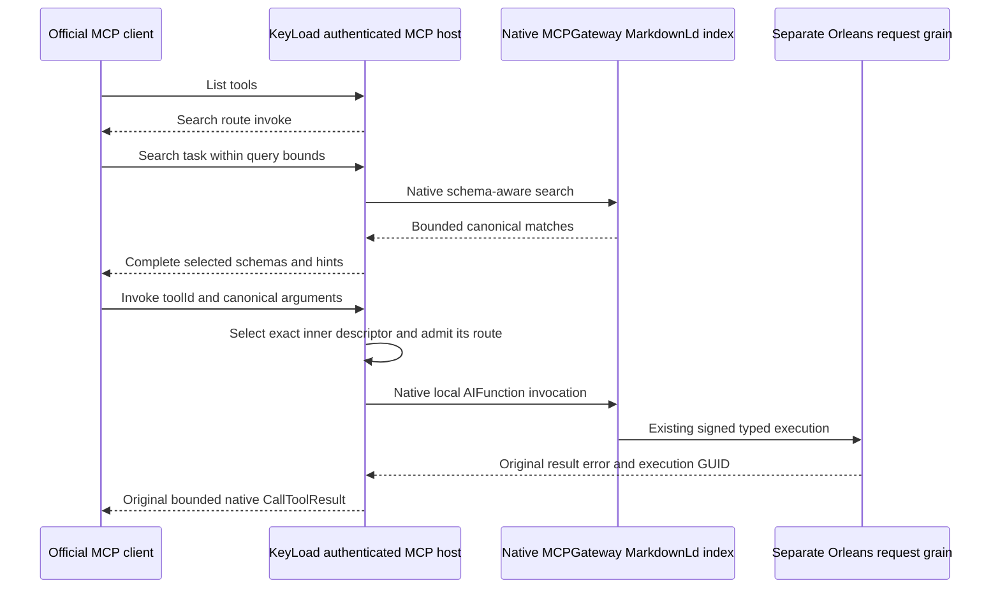

# ADR-104: Native ManagedCode gateway and graph-based MCP discovery

Status: Accepted for implementation; verification pending. Date:2026-10-05.
Owner: ClientApi integration lead. Related: [ClientApi ToolDiscovery](../Features/ClientApi/ToolDiscovery.md),
REQ-MCPGW-001..007 / AC-MCPGW-001..007, original KL-002/014/061/076/080,
[ADR-039](ADR-039-official-mcp-agent-api.md), [ADR-036](ADR-036-orleans-foundation.md),
[Authorization](../Features/Authorization.md), [TestInfrastructure](../Features/TestInfrastructure.md).

## Decision and reason

The owner requires our MCPGateway and Markdown-LD knowledge graph to make the
large tool inventory usable. Replace the public default all-operation MCP catalog
with the package's search/route/invoke meta-tool pattern. Use the actual published
ManagedCode.MCPGateway0.4.16 and ManagedCode.MarkdownLd.Kb0.2.10 native graph
APIs. Keep the canonical operation inventory inside KeyLoad and return selected
complete schemas/effect hints on demand.

Reuse KeyLoad's official stateless MCP host and fresh persisted authentication,
bounded framing/admission, typed operation decoder, signed Orleans gateway and
node-local RF3 owners. The package's outbound OAuth is not incoming authentication.
Its current aggregate MCP exporter lists every operation and normalizes results,
so adopt native factory/search/invoke APIs rather than that exporter. This is a
transport adapter over the original execution, not another operation dispatcher.

The exact wire, metadata permission boundary, index/input/output bounds,
canonical-adapter seam, cancellation/drain contract and test matrix are owned
once by ToolDiscovery. AC-MCP-001 separately verifies the current independently
enumerated 68-name internal canonical catalog and exact schemas/hints through the
official client; that count is not the three-name public initial listing. Metadata
is public operation documentation visible to a
fresh authenticated principal, never actual resources/data or an access grant.
Invocation revalidates persisted authorization even after discovery. The graph is
disposable metadata; ZoneTree remains canonical for every database model.

## Implementation contract

Owner extension 2026-10-05 adds TASK-MCPGW-GUIDANCE under REQ/AC-MCPGW-007.
The same official host exposes the one fixed Markdown resource and one static
no-argument prompt specified in ToolDiscovery, without adding an operation tool.
Luna lifecycle_wave owns new Server ClientApi/Guidance content, queries and native
transport handlers, plus focused Unit and genuine official SDK Integration cases.
Root owns per-request handler registration and Resources/Prompts capabilities in
McpServerComposition, review, gates and Git. Fresh persisted authentication and
existing control admission/output/privacy budgets apply. Native resource/prompt
objects are fresh per call; unknown names, nonempty cursors and arguments fail
before effects. Guidance is static source metadata, not model data, policy or
credential state. Rollout/rollback moves guide, native handlers, registration and
tests together; no data format changes. Build, normal/scalar and actual Aspire
RF3 tests must prove exact content, bounds, rejection and revoked credentials
before this extension is qualified.

1. Root freezes ClientApi REQ/AC, policy, architecture/source map and package
   identity. Pin only live-published packages; normal NuGet references, no local
   package or temporary project reference. Existing MCP/Orleans packages stay
   centrally pinned. Dependency defects follow the authorized owning repair,
   regression, patch/release/publication/feed-verification workflow.
2. TASK-MCPGW-CATALOG, Luna partition_pages: new server
   `Features/ClientApi/Discovery/` native graph catalog ownership, metadata hints
   and local `AIFunction` adapter; relevant new UnitTests
   `Features/ClientApi/{Cases,Helpers,Assertions}/` only. It uses the frozen
   `McpToolDispatcher.InvokeCanonicalAsync` integration seam, not another engine.
3. TASK-MCPGW-TRANSPORT, Luna lifecycle_wave: server
   `Features/ClientApi/{Contracts,Validation,Transport,Execution,Hosting,Serialization,Lifecycle}/`
   three-tool protocol and existing message filter/state/reply join; new same-slice
   protocol, admission and owner tests. Preserve whole-frame charging and
   actual typed `CallToolResult` lifetime. No catalog/graph-engine implementation.
4. Root reviews every packet against AC, joins singleton/host startup and
   central packages, migrates all official MCP callers/examples to the new meta
   pattern, retains independent complete internal-inventory/schema assertions,
   removes old public pagination/direct-tool dispatch, and integrates real SDK/MCP
   RF3 authority/cancellation/restart cases. Agent packets are source only until
   combined build and actual caller gates succeed.
5. Restore/Release build and analyzers; focused and related Aspire units, scalar,
   recovery and genuine RF3 through discovered endpoints; formatter and full
   required gates; main checkpoint commits/pushes with honest evidence. Original
   source/version/job/artifact Linux qualification closes acceptance. No skipped
   suite, static check or package presence counts as a runtime pass.

AppHost owns topology/test runner readiness, dependencies and shutdown. Root
alone owns shared solution/package/config/docs/Git joins; agents use private
packets, disjoint source ownership, no competing builds or sibling edits. Every
test maps to ToolDiscovery acceptance; no mock gateway or storage replaces real
native libraries/RF3 callers.

## Migration, rollback and unresolved qualification

This is an owner-authorized public discovery revision of ADR-039. The meta names
are the package's canonical pattern; existing database DTOs, SQL, HTTP SDK,
signed envelopes and persisted formats do not change. Migrate callers and docs
atomically and remove obsolete direct operation-tool routes. No second full
catalog endpoint or compatibility fallback remains. Source-only rollback reverts
the composition/caller migration together without touching data or receipts.

Native graph cancellation cannot promise immediate SPARQL interruption; owners
remain held until actual work settles. Fixed metadata/count/source/reply bounds
are required; total native index allocation/peak RAM, full operation parity,
revocation/concurrent identity, recovery/restart, genuine RF3 and complete
delivered-source Linux gates remain open. No production-readiness or performance
claim follows from this decision. ADR remains Accepted until all mapped evidence
exists.
