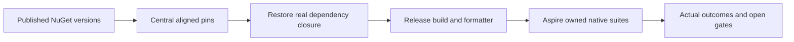

# ADR-105: Published NuGet dependency refresh

Status: Accepted; integrated build and runtime qualification pending.
Date: 2026-10-05.
Feature: [RepositoryGovernance](../Features/RepositoryGovernance.md),
REQ-NUGET-001..003 / AC-NUGET-001..003.

## Context and decision

The owner requests updating every NuGet dependency now. Inspect every central
PackageVersion, including transitive pins, and the Aspire.AppHost.Sdk pin against
the configured NuGet.org feed. Use the newest published stable release. Cartograph
and Cartograph.Catalog have only their existing 0.1.0-alpha release; keep that
published version. Do not introduce previews into stable package families.

The feed audit selects 17 upgrades: the three ManagedCode.Communication packages
10.3.1, ManagedCode.TimeSeries 10.1.1, ManagedCode.Storage.FileSystem 10.1.0,
ManagedCode.Orleans.Graph 10.4.2, ManagedCode.Orleans.Identity.Core 10.4.0,
the five Microsoft.Orleans packages 10.4.0, both Microsoft.CodeAnalysis packages
5.9.0, TUnit 1.72.16, StackExchange.Redis 3.3.1 and KurrentDB.Client 1.4.1.
All remaining central pins and Aspire.AppHost.Sdk are already current.

Retain central version management, native dependency APIs, .NET 10/C# 14,
warnings-as-errors and SDK-owned Roslyn compiler assets for analyzer tests.
Keep all Orleans packages and Roslyn peer packages aligned. Update active
version assertions and development-capture metadata with the selected packages;
retain immutable historical measurements and source receipts.

The first upgraded restore exposed NU1608: the existing transitive
Microsoft.CodeAnalysis.Workspaces.Common 5.0.0 requires Common exactly 5.0.0.
Add its published 5.9.0 central peer pin alongside Common/CSharp 5.9.0. This
aligns the existing dependency closure; it adds no new provider or compiler host
and preserves all diagnostics. AC-NUGET-001 covers 45 final central entries.

Updating only patches would leave requested published minor/major upgrades undone.
Floating versions would undermine reproducibility. Local replacement packages,
duplicated implementations and consumer workarounds are rejected. Any discovered
ManagedCode defect follows its owning-repository repair, release and verified-feed
delivery contract before consumer adoption.

## Implementation contract

1. TASK-NUGET-001: lead reads current policies and dirty manifest, audits all
   feed versions; read-only compatibility reviewer identifies active version
   checks and protected historical records. Join requires reviewed exact paths.
2. TASK-NUGET-002: lead alone owns Directory.Packages.props, this ADR, its index,
   RepositoryGovernance requirements and the refresh receipt/status entry.
   Update only selected version values, preserving concurrent package additions.
   The lead owns necessary TimeSeries comparison assertions and native Orleans
   development-capture metadata under their existing BenchmarkComparisons slices.
3. TASK-NUGET-003: restore, solution Release build, governance, formatter and
   Aspire-owned analyzers/unit/unit-scalar/recovery/RF3 suites; retain original
   failures and artifacts. Scope comparison regressions to changed version
   assertions through the same AppHost. Local evidence cannot qualify Linux
   GitHub runtime, public performance, endurance or power-loss durability.
4. TASK-NUGET-004: inspect combined diff, repeat canonical Release build after
   final edits and formatting, record exact outcomes; commit only this refresh
   stage when verified. Unrelated unfinished work remains owned by its author.

## Migration, rollback and failure contracts

No KeyLoad schema, serializer aliases/field IDs, protocol, persisted authority,
RF3 membership or node-local ownership changes are selected. The existing
recovery/serialization tests must detect dependency incompatibility. No rolling
upgrade or performance claim follows from version alignment or compilation.
Restore failure, downgrade, analyzer failure, runtime regression or missing
infrastructure leaves qualification open. A reproducible dependency defect must
be repaired at its actual owner; never suppress diagnostics to complete refresh.
Rollback restores only this stage's version/assertion changes, preserving other
checkout work and historical receipts. Product release remains separately gated.
