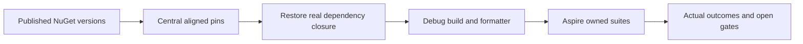

# ADR-105: Published NuGet dependency refresh

Status: Accepted; local dependency integration checked. Complete delivered-source qualification remains open.
Date: 2026-10-30.
Feature: [RepositoryGovernance](../Features/RepositoryGovernance.md).

## Context and decision

Every NuGet dependency is updated to its latest published version. Inspect every central
PackageVersion, including transitive pins, and the Aspire.AppHost.Sdk pin against
the configured NuGet.org feed. Use the newest published stable release. Cartograph
and Cartograph.Catalog have only their existing 0.1.0-alpha release; keep that
published version. Do not introduce previews into stable package families.

The 2026-10-30 feed audit selects ZoneTree 2.0.6 and Orleans 10.4.2, with Journaling and Durable
Jobs at 10.4.2-alpha.1, ManagedCode.Storage.Server/FileSystem 10.1.7 and
TUnit/TUnit.Aspire 1.76.45. The existing transitive Orleans.Client and
Orleans.Reminders dependencies are centrally pinned to 10.4.2 so the runtime
family remains aligned. The remaining central pins, Aspire.AppHost.Sdk and the
existing local tools are already current.
RapidMembership 10.4.6 is rebuilt against Orleans 10.4.1 in its owning repository.
Its release and all three public NuGet package source commits were verified
before consumer adoption; package publication and runtime qualification remain
separate gates.

Retain central version management, dependency APIs, .NET 10/C# 14,
warnings-as-errors and SDK-owned Roslyn compiler assets for analyzer tests.
Keep all Orleans packages and Roslyn peer packages aligned. Update active
version assertions and development-capture metadata with the selected packages;
retain immutable historical measurements and source receipts.

Microsoft.CodeAnalysis.Workspaces.Common stays pinned alongside Common/CSharp
at 5.9.0 to preserve their exact peer constraints and avoid NU1608. These pins
align the existing dependency closure; they add no new provider or compiler host
and preserve all diagnostics.

Updating only patches would leave requested published minor/major upgrades undone.
Floating versions would undermine reproducibility. Local replacement packages,
duplicated implementations and consumer workarounds are rejected. Any discovered
ManagedCode defect follows its owning-repository repair, release and verified-feed
delivery contract before consumer adoption.

```mermaid
flowchart LR
    Feed[Published NuGet versions] --> Pins[Central aligned pins]
    Pins --> Restore[Restore real dependency closure]
    Restore --> Build[Debug build and formatter]
    Build --> Tests[Aspire owned suites]
    Tests --> Receipt[Actual outcomes and open gates]
```

## Implementation contract

1. Audit current policies, the dirty manifest and all feed versions; identify active version checks and protected historical records. Reviewed exact paths join the change.
2. Directory.Packages.props owns the selected versions. Update active version assertions, Orleans development-capture metadata and current documentation while preserving concurrent package additions and immutable historical evidence.
3. Restore, solution Debug build, governance, formatter and Aspire-owned analyzers/unit/recovery/cluster suites; retain original failures and artifacts. Scope comparison checks to changed version assertions through the same AppHost. Linux GitHub qualification uses Release and remains distinct from local checks, public performance, endurance and power-loss durability.
4. Inspect the combined diff, complete the canonical Debug build after final edits and formatting, record exact outcomes, and commit only this refresh stage when verified. Unrelated unfinished work remains with its author.

## Rollout, rollback and failure contracts

Serializer aliases/field IDs, cluster membership and node-local ownership stay
with their current owners. The native MVCC storage format and data epoch are
specified in [NativeMvcc](../Features/StorageRecovery/NativeMvcc.md). The existing
recovery/serialization tests must detect dependency integration defects. No compatibility or performance claim follows from version alignment or compilation.
Restore failure, downgrade, analyzer failure, runtime regression or missing
infrastructure leaves qualification open. A reproducible dependency defect must
be repaired at its actual owner; never suppress diagnostics to complete refresh.
Rollback restores only this stage's version/assertion changes, preserving other
checkout work and historical receipts. Product release remains separately gated.
