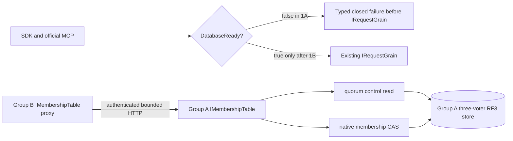

# ADR-106: Fenced movement of a complete atomic partition between physical owners

Status: Accepted for Stage 1A shared membership implementation only; later physical movement stages remain Proposed. Implementation and qualification pending.

## Context

The current product has one physical shard and one three-voter RF3 group. Source anchors include architecture-v0.3.uk.md §§4/6/28 and the exact original KL-036, KL-071 and KL-072 task blocks, ADR-016/017, current SCAT/PMAP contracts and the accepted PMOVE family-page contract. `AtomicPartitionPlacementV1` and startup are intentionally pinned to that single default owner at epoch 1. The bounded partition-family reader captures raw records from an already-owned committed view but explicitly excludes global catalog, global outcomes, shared accounting and installation. Current partition-scoped outcomes gain locators, while Global/Unknown outcomes remain non-movable. Current command epochs cover only the native Batch claim; most operation requests do not carry a trusted placement witness. Current queue-transfer receipts validate local current epoch 1, not a destination group lineage. These are real prerequisites, not a movement implementation.

The first topology stage has a separate verified blocker: src/KeyLoad.Server/Features/ClusterRouting/Hosting/OrleansSiloConfiguration.cs:66-68,91-95 registers ReplicaMembershipTable over each node local partition.Database, coordinator, and consensus, then uses options.ClusterId as the Orleans ClusterId. src/KeyLoad.Orleans/Features/ClusterRouting/Topology/ReplicaMembershipStore.cs:27-42 reads that local database and submits membership mutations through that local group. src/KeyLoad.AppHost/Features/ClusterReplication/Resources/ClusterResources.cs:24-43,46-90,96-108 currently creates one three-node group, one physical ID/incarnation, and per-group KeyLoad__Peers__0..2; it has no six-node profile. src/KeyLoad.Server/Features/ClusterReplication/Transport/ReplicaDiscoveryEndpoints.cs:36-51 exposes /health/ready only after local catalog readiness and local cohort check. Therefore same ClusterId across two disjoint stores does not yield one six-silo Orleans membership view, and local /health/ready is not a six-silo proof. A six-node profile is not ready until an authenticated shared membership authority and actual six-member membership oracle are specified and implemented. Separate group health, signed peer discovery, or matching cluster strings do not establish shared Orleans membership.

The architecture distinguishes immutable atomic transaction identity, physical shard, replica group, node-local host and Orleans activation. Moving a grain is not moving data. Source and destination groups have unrelated logs. Reusing a follower snapshot endpoint is not sufficient: current `ReplicaSnapshot` includes group incarnation and log index and its receiver installs a replica checkpoint into the same group's host, not a whole atomic partition into another physical owner.

## Decision proposal

Adopt an explicit durable physical-partition movement protocol with a stable database control authority. It is responsible for authoritative placement revisions, persisted policies, and the single global command identity/outcome namespace. Initially the current default shard may host that role; its authority scope is not moved. Source and destination are independent real RF3 groups with separate physical IDs, incarnations, voters, local ZoneTree stores and logs. Each remains a node-local `PartitionHost` owner.

All public callers retain current endpoint/SDK/MCP signatures and persisted authorization. Server and Orleans derive a signed internal operation grant from the stable control authority. It binds the full partition identity, current owner tuple/epoch, verified principal and policy epoch, operation kind and canonical fingerprint/command ID. Only a grant minted after persisted authorization and current placement resolution can reach a group. Every mutating capability must consume it in the same native apply transaction. After a switch, a source-local durable fence rejects delayed/stale work even if a request was routed earlier.

Cross-group user writes cannot be one local ZoneTree transaction. The control authority therefore records a durable command reservation before owner execution; the owner atomically applies domain state and an idempotency receipt; then the control authority finalizes the exact canonical global outcome. The public ACK waits for finalization. Crash ambiguity remains a retained pending operation and retries reconcile by the same principal/command/fingerprint. Do not return false success, repeat side effects, or create a second command-ID namespace. Persisted-policy revocation closes admission and cannot acknowledge until every previously issued mutation grant is terminal or the affected movement/owner is failed closed.

The selected initial KL-072 token policy is explicit invalidation, not position translation: every token or cursor whose meaning depends on a physical-group log position must either carry/check the source incarnation and placement epoch or be version-rejected at admission after switch with stable `TokenInvalidated`. New destination tokens use its own current epoch and log identity. At no point are independent Raft positions compared. Durable position translation is not an alternative in this ADR; it requires a separate owner decision before the contract changes.

The owner directory must be additive/versioned from current SCAT V1/PMAP V1. Do not mutate V1 or depend on old readers ignoring fields. A version/profile readiness gate rejects incompatible old binaries before the first movement record can become authoritative. The exact new generated aliases, IDs, command envelope, persistence keys, movement journal, bounds, status/error codes and upgrade rule are frozen in source before code.

## Requirements and acceptance

This ADR adopts draft `REQ-MOVE-001..007` and `AC-MOVE-001..007` in `PartitionTransfer.md` as proposed measurable acceptance. Critical safety invariants:

1. A complete atomic partition has exactly one writable physical owner at a committed monotonically increasing epoch.
2. Every acknowledged mutation has both one target-side atomic effect receipt and one finalized global command result; exact retry is stable across movement.
3. The destination image plus ordered tail is complete through a source fence before publication; source fencing is durable before route switch. Partition-local execution receipts and any required non-authoritative locator metadata move with the partition; canonical global outcomes and the global command identity index remain solely in the stable control authority.
4. Current persisted authorization is authoritative; a revocation ACK fences all previously admitted grants.
5. Unknown/global outcome or missing history/locator, unvalidated shared state, unsupported asset, incompatible format, missing source/destination quorum, or failed join blocks cutover and cleanup.
6. A failure before publication may roll back only under a proven still-current control-authority record and complete source. After publication recovery is forward only.
7. No physical file, lock, replica log or open store handle moves with an Orleans activation or Core grain.

## Ordered implementation and ownership

1. TASK-MOVE-1A is an explicit topology-only AppHost profile selected by new setting KeyLoadTests:ClusterRouting:Profile=two-rf3 alongside the existing KeyLoadTests:Suite=rf3 entry. It creates exactly six containers, node1 through node6, with Group A=node1,node2,node3 and Group B=node4,node5,node6. Each group has three fixed voters, one shared Orleans cluster identity, and per-group physical identities. Actual current node environment keys are reused: KeyLoad__ClusterId is identical for all six; KeyLoad__PhysicalShardId and KeyLoad__Incarnation are identical within each group and distinct between groups; KeyLoad__Peers__0..2 is the exact ordered vector for that group (Group A uses http://node1:8080, http://node2:8080, http://node3:8080); KeyLoad__PublicEndpoint, KeyLoad__SiloAddress, KeyLoad__SiloPort and KeyLoad__DataDirectory are unique per node; KeyLoad__AllowPrivateNetworkHttp remains explicit. Containers target HTTP port8080 and silo port11111; each /data mount maps to a distinct AppHost-owned root/nodeN directory. ClusterOptions.ServiceId stays the current KeyLoad. Current RequestInterfaceVersion=4, ReplicaTransportProtocol.Version=3, and discovery-MAC version2 stay unchanged unless a new cross-group membership protocol contract proves an append-only alias/IDs and compatibility bump is necessary. Existing generated aliases/IDs remain unchanged: ReplicaSiloDiscovery keyload.replica.discovery.v2 IDs0–6; PhysicalShardCatalog keyload.contract.physical-shard-catalog.v1 IDs0–2; PhysicalShardRecord keyload.contract.physical-shard-record.v1 IDs0–3; NodeStatus keyload.contract.node-status.v1 IDs0–8; SCAT/PMAP contracts unchanged. The new six-node profile must not enable benchmark voter mode or relax ReplicaConfiguration production quorum checks. New AppHost source-map and config-schema tests prove exactly6 resources, two groups of3, unique data paths/IDs/incarnations, same ClusterId/ServiceId, exact same-group peer vectors, disjoint voter vectors, non-mixed current image and strict rejection of partial/malformed topology overrides. Existing limits are unchanged per group: MaxAppendEntries64, MaxAppendBytes16MiB, SnapshotChunkBytes262144, MaxSnapshotBytes4GiB, and the production three-voter majority; this profile cannot raise limits or enable BenchmarkTopology.

   The original R2 implementation proposal required a shared membership authority before the two-group topology could qualify. R3 now supplies a proposed bounded native membership protocol and startup boundary below; this is still a private proposal, not implementation or runtime evidence. The current `ReplicaMembershipTableSnapshot` alias `keyload.orleans.membership.snapshot.v1` IDs0–1, `ReplicaMembershipRow` alias `keyload.orleans.membership.row.v1` IDs0–8, and `MembershipMutation` alias `keyload.core.v1.MembershipMutation` IDs0–2 remain unchanged.

   In the two-group Stage 1A profile, all public database reads and writes remain closed before `IRequestGrain` lookup until Stage 1B. Group A may finish its existing local physical-catalog bootstrap while it is the only started group. Group B deliberately skips that request-grain bootstrap: after both groups share an Orleans directory, a request grain may execute through either physical group, so this existing bootstrap cannot assert local ownership. Group B therefore has no committed physical catalog, and its `DatabaseReady` state remains false. Stage 1A proves only one six-silo Orleans membership view and two separately configured RF3 control/data groups. It does not prove that the groups compose as one usable database. The existing three-node RF3 profile and data operations remain unchanged. Tests compare each node's actual native membership view to actual signed discoveries from all six silos, and separately prove both three-voter domains and node-local store/log/lock isolation. `ReplicaSiloDiscovery` and `NodeStatus` do not supply a trusted catalog tuple; no Group B catalog assertion is made in 1A.

   Owners: root owns AppHost selector/profile and six-node resource graph; Orleans owns shared membership adapter/protocol and separates silo-joined from user-data admission; Replication owns two genuine independently configured RF3 quorum/barrier domains; Server owns node-local PartitionHost/startup gates; Unit tests own literal config/native-model tests; Integration tests own actual six-node membership/status and SDK/MCP fail-closed evidence. No data owner directory, command reservation or cross-group data operation is implemented in 1A.
2. TASK-MOVE-1B is separate. Once 1A is proven, add an additive committed owner directory, persisted-policy control authority, and durable global command reservation→owner atomic receipt→global finalization. Assign a newly created empty PartitionRef to the additional group and route actual SDK/MCP operations. Global (verified principal,CommandId) uniqueness/outcome stays singular; owner receipts are atomic with target effects; UnknownWriteOutcome remains pending for reconciliation, never false success. Acknowledgement waits for outcome finalization. Every mutating operation kind is classified, authorization runs from persisted policy before a server-minted owner-bound grant, and the same-view apply fence checks epoch. Revocation closes new grants and joins already issued grants. No existing records move in 1B. Core/Orleans/Replication/Server and public integration ownership follows the feature map; no parallel dispatcher.
3. TASK-MOVE-IMAGE adds the new versioned complete image manifest, bounded source snapshot and private destination installation under the destination PartitionHost; verify independently without publishing routing. Move partition-local execution receipts and only non-authoritative locator metadata pointing back to outcomes that remain in the stable control authority; do not copy global StoredOutcome records or the global command index. Owners: Core ClusterRouting manifest/pages; Server StorageRecovery ownership/install; Storage.ZoneTree native file cut/copy/reopen; Replication authenticated stream transport. No grain opens or deletes files.
4. TASK-MOVE-TAIL writes one bounded ordered per-partition tail atomically with each source mutation, transfers/applies it idempotently, closes admission and durably fences source at a final source sequence; destination proves its installed image+tail equality. Owners: Core commit/outcome, Replication transport/sequence, Server host/apply lifecycle, Orleans one-request admission/drain.
5. TASK-MOVE-SWITCH performs a CAS against current owner tuple/revision/MoveId and publishes the destination with epoch+1 only after durable source fence and destination receipts. Old source remains fenced; retries and restart resolve recorded phase. Owners: Core/ClusterRouting control command, Orleans route, Server readiness; root owns any Abstractions native alias/ID additions after schema freeze.
6. TASK-MOVE-TOKEN implements the selected explicit invalidation policy: every persisted/response cursor whose meaning includes a group log position must carry/check owner incarnation+placement epoch or be version-rejected at admission after switch with TokenInvalidated. Destination-issued tokens use its own lineage. No position-translation branch is part of this contract.
7. TASK-MOVE-RF3 supplies genuine AppHost-managed six-node SDK and official MCP tests at every failure phase and runs exact-source Linux gates. Root owns shared fixture, operational waves, CI and status updates.

## Bounds, migration and rollback

Before TASK-MOVE-IMAGE, freeze maximum image bytes/records/families, per-operation/tail bytes, retained staging disk, transfer concurrency, deadline/cancellation and tail backlog behavior from current read/write budgets and physical resource limits. Every manifest/page/frame has checked accounting and checksum; oversized/incomplete transfers reject before install. The source may reject/throttle writes before tail capacity is exhausted. Every attempt is MoveId-idempotent and bounded; no unbounded retries.

Use a new native format/profile and writer-stopped compatibility transition if required. Before publication, cleanup may discard only a destination generation proven unpublished and unreferenced, after original streams/handles/locks are joined. After publication, never rollback catalog epoch or un-fence old source; recover forward or stop for operator repair. Keep the last verified source/destination recovery evidence until the complete destination is authoritative and all required retention horizons expire. Backups/restore must contain control authority, owner map, pending command reservations/outcomes, migration phase and all owner images; restoring data without the authority map is not a valid database restore.

## Verification and unresolved gate

Required evidence includes strict Release build/analyzers/formatter, real ZoneTree native corruption/reopen tests, real process recovery at every phase, two independently configured three-voter RF3 groups under the Aspire AppHost, actual .NET SDK and official MCP calls, old-owner stale-write rejection, command dedupe and policy-revocation controls, token invalidation controls, and exact-source Linux artifacts. Unit tests, a single RF3 group, PMOVE page tests, or same-group voter restart cannot qualify movement. This ADR remains Proposed until the global control authority and cross-group operation protocol are accepted, every test passes, and root records the complete gate evidence.


## R4 — Authenticated shared membership authority for topology Stage 1A

This amendment proposes only the Stage 1A membership prerequisite. It does not approve Stage 1B, owner routing, public multi-owner writes, partition copy, migration or rollback.

### Decision

R4 is based on the central `Microsoft.Orleans.* 10.4.0` pin in `Directory.Packages.props` (lines 23–27), not `ManagedCode.Communication.Orleans 10.3.1`. Pinned `Orleans.Core.xml` lists cancellation-aware `IMembershipTable` Async overloads and warns that its defaults may cancel only caller wait while tokenless work completes. Pinned MembershipTableManager uses `UpdateRowAsync` both for its own status row and for remote suspicion/death targets. Existing `ReplicaMembershipSnapshot` has no count limit; native cleanup removes only Dead rows older than the supplied cutoff. Stage 1A therefore adds explicit two-RF3-only encoded row/snapshot/replay bounds, retains complete historical rows, and counts the expected six active generations separately for readiness.


Use exactly one membership table, persisted in Group A's existing RF3 control store, for the full six-silo Orleans cluster. Group A's `IMembershipTable` remains the current `ReplicaMembershipTable`; Group B registers a generated-native, bounded HTTP `IMembershipTable` proxy to Group A. The HTTP authority listener runs in the existing Kestrel server before Orleans but rejects authority work while no provider is published. After native `built.StartAsync`, `OrleansNode` records `SiloJoined` and then completes Group A's existing `PhysicalShardCatalogStartup`. After Group A's catalog initialization succeeds, as the final successful startup step before `OrleansNode.StartAsync` completes, it publishes the actual Group A `IMembershipTable` instance from the Orleans host provider to `ReplicaMembershipAuthorityOwner` and sets `AuthorityReady`; the Kestrel handler borrows that reference only through the owner. It invokes this actual local provider, so reads use its existing control read barrier and changes use native Membership mutation/CAS on Group A's three-voter RF3 log. Group B never reads its own membership record and has no fallback provider.

The new endpoint is `/internal/orleans/membership/v1` with a dedicated request/reply HMAC domain, closed generated native DTOs and protocol version 1. It does not reuse/extend `PeerSecurity`'s bodyless discovery contract, does not add a `ReplicaRpc` operation, and does not change RequestInterfaceVersion 4, replica envelope 3, discovery MAC 2, or existing persisted membership aliases. The current `keyload.orleans.membership.snapshot.v1` IDs0–1, `keyload.orleans.membership.row.v1` IDs0–8, and existing membership mutation/record formats remain byte-compatible.

Group B startup waits on this HTTP provider during native `IMembershipTable.InitializeMembershipTableAsync`; no Orleans grain/client call is made before the silo is admitted. The proxy implements the cancellation-aware Async methods for ReadAll, ReadRow, InsertRow, UpdateRow, UpdateIAmAlive and CleanupDefunct, preserving rows, table versions, row/table ETags and exact native CAS booleans. It is not a local provider plus fallback. Its resources are joined before native provider/client disposal. AppHost starts Group A, awaits all `/health/silo` and `/health/membership-authority` phases, then starts Group B. This keeps Group A’s catalog bootstrap ahead of Group B and the shared distributed directory.

Group B skips `PhysicalShardCatalogStartup`'s request-grain catalog bootstrap in Stage 1A. With one distributed Orleans directory, that bootstrap can execute on a different physical owner; local placement hints are not an ownership fence. Group B therefore remains without a committed physical catalog and all six nodes remain `DatabaseReady=false`. Existing `/health/ready` is not redefined as silo readiness. A separate sanitized `/health/silo` status allows AppHost to order membership initialization; its reply reveals no membership rows, addresses or credentials. A sanitized membership-ready status is true only after one complete table snapshot has all six expected current, unique runtime SiloAddress generations Active; bounded non-current historical generations may also remain in the snapshot. Neither status opens a public database operation.

### Exact wire contract

New generated records are owned by the ClusterRouting slice and use these IDs, unchanged after implementation:

| Type | Alias | IDs |
|---|---|---|
| `ReplicaMembershipAuthorityEntryV1` | `keyload.orleans.membership.authority.entry.v1` | 0 Address; 1 Status; 2 ProxyPort; 3 Host; 4 Name; 5 Started; 6 Alive; 7 Suspects; 8 RowETag |
| `ReplicaMembershipAuthorityCallV1` | `keyload.orleans.membership.authority.call.v1` | 0 Version; 1 ClusterId; 2 AuthorityPhysicalShardId; 3 AuthorityIncarnation; 4 CallerPhysicalShardId; 5 CallerIncarnation; 6 CallerVoterId; 7 CallerSiloAddress; 8 RequestId; 9 Operation; 10 TargetSiloAddress; 11 CandidateEntry; 12 ExpectedTableVersion; 13 ExpectedTableVersionETag; 14 ExpectedRowETag; 15 CleanupBeforeUtcTicks |
| `ReplicaMembershipAuthorityReplyV1` | `keyload.orleans.membership.authority.reply.v1` | 0 Version; 1 AuthorityPhysicalShardId; 2 AuthorityIncarnation; 3 RequestId; 4 RequestNonce; 5 ResultKind:int; 6 nullable ErrorCode; 7 ErrorDetailCode:int; 8 Applied; 9 TableVersion; 10 TableVersionETag; 11 Rows |

Membership operation enum values are fixed: ReadAll=1, ReadRow=2, InsertRow=3, UpdateRow=4, UpdateIAmAlive=5, CleanupDefunct=6. DeleteTable is absent from the proxy API and remains rejected for Group B; whole-cluster reset is an offline six-silo AppHost-owned operation. The wire row carries all `MembershipEntry` fields and suspicions required by the native provider; it does not become a new persisted format. `ReplicaMembershipAuthorityEntryV1` uses the existing native suspect type only after the exact pinned Orleans serializer confirms that DTO is supported. The transport implementation must include a generated-serializer round trip for suspicion entries and a real proxy startup/shutdown control proving native `DeleteMembershipTableEntries` is not invoked as an implicit fallback or whole-table reset; explicit remote deletion remains unsupported. `ResultKind : int` is explicit append-only `Completed=1` or `Failed=2`. Completed uses nullable ErrorCode=null and ErrorDetailCode.None=0; Applied is the actual native mutation result, false for reads/non-applied CAS, and Rows are complete. Failed has non-null existing ErrorCode, a non-None fixed detail, Applied=false, no rows, TableVersion=0 and empty TableVersionETag. Closed `ErrorDetailCode : int` values are None=0, MalformedRequest=1, AuthenticationFailed=2, UnsupportedVersion=3, AuthorityMismatch=4, CallerGroupMismatch=5, UnsupportedOperation=6, RequestLimit=7, ReplyLimit=8, MembershipCapacity=9, AuthorityUnavailable=10, PersistedTableCorrupt=11, DeleteUnsupported=12. Map malformed/unknown operation to Validation; authentication/authority/group identity failure to Unauthenticated; version/remote delete to UnsupportedCapability; request/reply/membership bounds to ResourceExhausted; missing/quorum/deadline to OwnershipLost; persisted malformed membership to Corruption. Each detail maps to fixed local text without exception or identity data.

The HTTP authentication headers are single-valued: `X-KeyLoad-Membership-Cluster`, `X-KeyLoad-Membership-Authority-Physical`, `X-KeyLoad-Membership-Authority-Incarnation`, `X-KeyLoad-Membership-Caller-Physical`, `X-KeyLoad-Membership-Caller-Incarnation`, `X-KeyLoad-Membership-Caller-Voter`, `X-KeyLoad-Membership-Caller-Silo`, `X-KeyLoad-Membership-TimestampTicks`, `X-KeyLoad-Membership-Nonce`, and `X-KeyLoad-Membership-Signature`. Timestamp is invariant decimal UTC ticks; nonce is base64url of 16 cryptographically random bytes without padding; IDs are canonical lowercase `N`; SiloAddress must round-trip through `ToParsableString()`. Require one Content-Length, checked before body streaming. Request MAC input is ASCII domain `keyload-orleans-membership-authority-request-v1` plus LF, followed by each UTF-8 method/path/identity/timestamp/nonce field with a big-endian UInt32 byte-length prefix, then big-endian UInt64 exact body length and 32 raw SHA-256 bytes of the exact original body. Reply MAC uses domain `keyload-orleans-membership-authority-reply-v1` plus LF, the same length-prefix rule for authority identity, RequestId, echoed nonce and HTTP status, then body length and exact-body digest. Compare HMACs in fixed time before native deserialization; the exact original bytes, not decoded/reserialized objects, are authenticated. HTTP redirect, query strings, duplicate/missing headers, trailing data and cap+1 bodies are rejected. No log includes secrets, headers, payload, addresses or IDs. Group B signs with its existing group PeerSecret; Group A validates the exact trusted B group tuple and signs replies with its own existing PeerSecret; B pins A's expected tuple/credential. These group-scoped credentials are separate from user AdminKey/SigningKey and never appear in status or diagnostics.

Strict runtime setting keys: `KeyLoad__MembershipAuthority__Mode`=`local|authority|proxy`; `local` rejects every authority-only key and is the unchanged three-node default. Only the fixed six-node two-RF3 AppHost profile may select `authority` or `proxy`; proxy nodes require `...__AuthorityPhysicalShardId`, `...__AuthorityIncarnation`, `...__AuthorityEndpoints__0..2`, `...__AuthorityPeerSecret`; authority nodes require `...__TrustedGroup__PhysicalShardId`, `...__TrustedGroup__Incarnation`, `...__TrustedGroup__VoterIds__0..2`, `...__TrustedGroup__SiloEndpoints__0..2` (canonical host:port; resolved and pinned at process startup), `...__TrustedGroup__PeerSecret`. Existing `KeyLoad__ClusterId`, `__PhysicalShardId`, `__Incarnation`, `__Peers__0..2`, `__SiloAddress`, `__SiloPort`, and `__AllowPrivateNetworkHttp` keep their current meanings. The standard three-node topology leaves Mode=local and requires none of these settings.

### Exact resource/operation bounds

The total call deadline is exactly 30 seconds from `ReplicaMembershipProtocol.RequestTimeout = ReplicaProtocol.ReadBarrierTimeout` (10 seconds) + `ReplicaProtocol.CommandTimeout` (20 seconds). It spans gate admission, connect/body read, provider operation, serialization and response verification. `Directory.Packages.props` pins all `Microsoft.Orleans.*` packages to 10.4.0; `ManagedCode.Communication.Orleans` is separately 10.3.1. Pinned `IMembershipTable` exposes cancellation-aware Async methods for Initialize, Delete, Cleanup, ReadRow, ReadAll, Insert, Update and UpdateIAmAlive. The provider and proxy implement/use those overloads and pass the original linked request/startup token into their shared native read/CAS algorithms. Tokenless compatibility methods delegate to the same algorithms. Do not use Orleans default tokenless adapters: Orleans XML states these cancel the caller wait while underlying operations continue. All calls in this protocol have a native cancellation-aware overload, so remove the extra proposed `ExecuteAuthorityCallAsync` method; the handler uses the borrowed provider’s corresponding native Async operation and tracks/join its lease. Keep the 120-second total Group B startup deadline, 250ms retry and 500ms connect cap. In two-RF3 mode only, request body <=65,536 bytes, reply <=262,144 bytes, encoded persisted snapshot <=262,144 bytes, row <=4,096 bytes, total retained rows <=48, suspects/row <=6, and address/host/name/suspect-address <=256 UTF-8 bytes. The 48-row bound is a new explicit profile limit, sized for six current members plus 42 retained historical generations; it is not an existing Orleans limit. `ReadAll` returns all rows or fails `ResourceExhausted`, never truncates. Readiness checks exactly six expected current Active SiloAddress generations separately from the total row count. Preflight row-count and field-size limits before creating a changed row array; serialize snapshots and replies through cap+1 bounded writers. Exceeding a capacity fails `ResourceExhausted` without retaining/persisting an over-bound row, snapshot or reply; no row is deleted or evicted to admit a generation. The normal local three-node mode is unchanged. Each process admits at most eight authority calls and retains at most 16,384 live nonces for two monotonic minutes. Only expired replay entries may be removed; a full live replay set rejects before provider work. Timestamp is invariant UTC ticks within +/-30 seconds of receiver UTC. The nonce remains 16 random bytes encoded as 22 unpadded base64url ASCII bytes. Retry uses a fresh nonce and exact native CAS expectations.

Membership mutations preserve the native trust and concurrency model. The caller is authenticated as one configured fixed replica-group domain, since the existing peer secret is group-shared; the exact group tuple and canonical caller generation are signed. `InsertRow` and `UpdateIAmAlive` require candidate address equal to caller address. `UpdateRow` may target any existing exact membership row: pinned Orleans 10.4.0 MembershipTableManager uses it for own status, for suspicion votes against arbitrary silos, and to mark those targets Dead (`InnerTryToSuspectOrKill` and `DeclareDead`). The authority requires TargetSiloAddress, candidate address and existing row key to match, then preserves native table-version/row-ETag CAS. It cannot insert through UpdateRow. Cleanup remains native Dead+cutoff. DeleteTable is not proxied.

### Errors, compatibility and readiness

Malformed auth, stale/replayed nonce, identity or signature mismatch is `Unauthenticated`; unknown shape/operation is `Validation`; old protocol version or remote delete is `UnsupportedCapability`; missing authority/quorum/deadline is `OwnershipLost`; bound exhaustion is `ResourceExhausted`; persisted snapshot corruption remains `Corruption`. Unavailability never returns partial rows or authorizes startup. Server error bodies/details are safe fixed enum mappings; raw exception text and payload never cross the wire.

The new membership wire version is independent and exactly 1. Standard three-node RF3 keeps local provider behavior. The two-RF3 test profile requires all six exact same immutable current image before starting containers; old/mixed binaries do not participate in this topology and no rolling-upgrade compatibility is claimed. New membership clients reject wrong version/authority identity before invoking the local provider. Incompatible/missing membership evidence leaves membership-ready false. AppHost image proof and endpoint protocol checks do not replace each other.

The readiness state machine is explicit: SiloJoined follows native startup; AuthorityReady follows Group A’s local catalog initialization and provider publication; the shared membership provider can retain historical generations. MembershipReady requires the six expected current unique SiloAddress generations to be Active in a complete view, with no unexpected active current member; non-current history remains visible and the total need not equal six. Neither status opens database readiness.

### Ordered implementation and source ownership

1. **TASK-MOVE-MEMBERSHIP-WIRE:** add the three new generated contracts, protocol constants/closed operation enum, strict bounded serializer tests, dedicated HMAC and replay verifier. Owners: Abstractions/Orleans `ClusterRouting/Contracts`, `Models`, `Serialization`, `Authentication`, `Validation`; root owns IDs and current-path source map. Preserve every existing membership/replica alias.
2. **TASK-MOVE-MEMBERSHIP-PROVIDER:** implement `ReplicaMembershipAuthorityClientTable : IMembershipTable` as a full forwarding adapter for the cancellation-aware 10.4.0 Async methods for ReadAll, ReadRow, InsertRow, UpdateRow, UpdateIAmAlive and CleanupDefunct; no fallback. Preserve ETags/table versions/suspect arrays and caller tokens. Tokenless methods delegate to the same shared algorithms. Group A's authority handler invokes the corresponding native Async method on its borrowed actual `IMembershipTable`; no separate `ExecuteAuthorityCallAsync` entry or membership implementation is added. Preserve insertion/heartbeat ownership, but permit authenticated-group native CAS updates to any existing target row for suspicion/death. Owners: Orleans `ClusterRouting/Topology` and Server `ClusterReplication/Transport`, `ClusterRouting/Hosting`.
3. **TASK-MOVE-MEMBERSHIP-START:** strict NodeOptions mode settings, one shared request deadline/lifetime, Server's authenticated Kestrel endpoint, split `/health/silo`, membership-ready and DatabaseReady gates; skip Group B catalog bootstrap; public `ExecuteAsync` rejection before grain lookup. Owners: Server `ClusterRouting/Hosting`, `Transport`, `Validation`, `Models`; do not expand `RequestGrain` or create a separate dispatcher.
4. **TASK-MOVE-MEMBERSHIP-APPHOST:** add the explicit two-RF3 AppHost resource profile, exact current image proof, three Group A health dependencies before Group B start, reverse shutdown ordering, unique data/log/lock roots, and fail-before-start tests for bad profiles. Existing `rf3` profile remains byte/behavior compatible. Owner: AppHost `ClusterRouting/Resources` and TestInfrastructure settings.
5. **TASK-MOVE-MEMBERSHIP-TESTS:** current native serializer/auth/CAS model tests, actual six-container Aspire startup/membership readiness/no-local-fallback/quorum-down/restart/replay and negative SDK/MCP no-dispatch tests. Owners: Unit and Integration `ClusterRouting` Cases/Helpers/Assertions; tests must observe actual native table and status paths, not synthetic six-row constants as proof.

### Verification and exit gate

Before accepting 1A, run strict solution build/analyzers/formatter, Unit/Suite existing 3-node regressions, and the actual AppHost RF3 six-node scenario on exact-source Linux. Required runtime observations: Group A becomes silo-joined before B starts; B joins using authenticated authority v1; a single Group A quorum-backed membership snapshot contains all six exact current `SiloAddress` generations; independent 3-voter group status and per-node stores/logs/locks remain separate; Group A authority failure with one down node still works and loss of majority fails closed; no public SDK/MCP operation reaches RequestGrain; shutdown drains B provider calls, then A endpoint calls, before secrets/hosts/stores are disposed. No local or same-group test substitutes. The topology stage alone does not qualify owner movement; Stage 1B remains prerequisite for `DatabaseReady` and any cross-owner read/write.

```mermaid
sequenceDiagram
    participant H as Aspire AppHost
    participant A as Group A RF3 (membership authority)
    participant B as Group B RF3 (membership proxy)
    participant D as Distributed Orleans directory
    H->>A: Start three current nodes
    A->>A: Local ReplicaMembershipTable over Group A quorum
    A-->>H: /health/silo for all three
    A->>A: Complete local catalog bootstrap
    A-->>H: /health/membership-authority for all three
    H->>B: Start three current nodes
    B->>A: Signed native membership call v1 over Kestrel
    A->>A: Read barrier or CAS in Group A RF3 table
    A-->>B: Signed exact native result
    B->>D: Join using same ClusterId and ServiceId
    H->>A: Poll one shared membership readiness view
    H->>B: Poll one shared membership readiness view
    Note over A,B: DatabaseReady stays false; no IRequestGrain data dispatch in Stage 1A
```



## Accepted deferred Group B pin lifecycle, 2026-10-05

REQ/AC-MEMBERSHIP-007 in PartitionTransfer refines TASK-MOVE-1A before code.
Aspire's B-after-A-authority barrier is retained. The authority resolves only a
validated configured B hostname after original-body authentication, within the
original call deadline and eight-call admission. Three per-voter gates serialize
actual native DNS tasks; a complete 1..8-address result is checked against the
signed canonical caller before one immutable lifetime pin is published. Failed
attempts publish nothing and perform no store work. Successful pins never refresh
silently; address replacement requires a fresh authority lifetime.

The source reason is a startup dependency cycle: eager B DNS during A composition
requires resources deliberately blocked behind A readiness. The selected
lifecycle removes that cycle without accepting caller-chosen hosts, unpinned
operations or a local-provider fallback. Actual native DNS/HTTP concurrency,
rejection/cancellation and six-container startup/failover/cleanup tests must
qualify it. Native membership CAS, persisted authority, schema/byte limits and
public data-admission closure remain unchanged. Root owns the join and gates;
Luna lifecycle_wave owns only the guarded implementation/test packet. There is
no data/wire migration; rollback disables the new profile.

## Accepted six-generation oracle and native parameter handoff, 2026-10-05

REQ/AC-MEMBERSHIP-008 in PartitionTransfer closes the source oracle gap before
implementation. The already-generated B physical ID/incarnation and secret are
the same named Aspire ParameterResources used by the actual six-container model
and resolved privately through native GetValueAsync in its owned test wave.
No independently generated verifier credential, identity or membership provider
is permitted. Decode the secret only within an owned joined/zeroed lifetime.

The profile-only membership health reply carries a bounded closed fingerprint
and counts derived from one actual native ReadAll call per node, including B's
real proxy path. Its domain-separated length-framed SHA256 binds the six exact
current Active SiloAddress generations without exposing addresses or row data.
The independent integration oracle authenticates discovery from all six actual
nodes using the shared A ClusterId and each distinct group incarnation/key,
computes the expected active-generation digest, and compares all six native-view
health responses. Boolean readiness alone does not prove this acceptance.

Implement in order: same-resource AppHost handoff; bounded native view digest and
closed health reply; six-node signed-discovery verifier; actual Aspire oracle
and negative native controls; strict build/format and original exact-source Linux
RF3 evidence. All code remains inside ClusterRouting responsibility folders.
Existing three-node discovery helper, persisted membership, native CAS, MAC and
serializer identities, wire caps, public closure, failover and original task
teardown stay unchanged. Root owns integration/evidence; lifecycle_wave owns the
guarded source/test packet. The additive health shape is confined to the new
membership-only profile. Rollback disables that profile; Stage 1B data readiness
and physical movement acceptance remain unqualified.

## Accepted native authority route and provider ownership, 2026-10-05

REQ/AC-MEMBERSHIP-009 and TASK-MOVE-1A repair two inspected source gaps before
integration: the authority handler was not mapped, and externally registered
disposable instances had no actual disposal owner. The exact native POST route,
provider-owned factory/type registration, handler/DNS/call joins before endpoint
credentials/gates and owner CTS disposal, failure preservation and negative
admission contracts are frozen in PartitionTransfer before code.

Implement in order: map the existing handler once in server composition; register
its exact owner and endpoint with native DI ownership; preserve existing silo
close/join then Kestrel stop/join then root-provider disposal; add native
composition/lifecycle regressions and execute the existing actual six-container
Aspire startup/authentication/teardown flow. lifecycle_wave owns the private
guarded ServerConfiguration/transport/test correction; root owns source review,
integration, strict checks, original Linux RF3 evidence and commit. No wire/data
migration or public database opening occurs. Rollback disables the new profile;
an unmapped route or undisposed owner cannot be reported as delivered membership.
