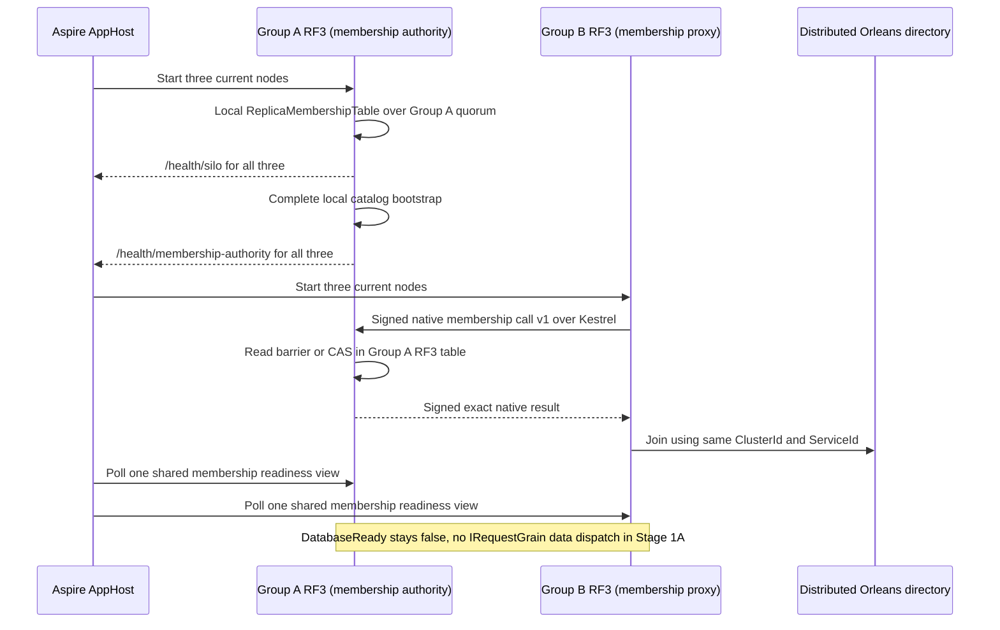
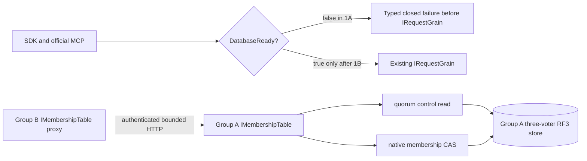
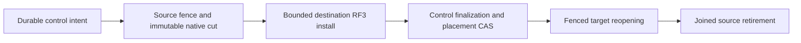

# ADR-106: Fenced movement of a complete atomic partition between physical owners

Status: Accepted for Stage 1A shared membership implementation only; later physical movement stages remain Proposed. Implementation and qualification pending.

## Context

The current product has one physical shard and one three-voter RF3 group. Source anchors include architecture-v0.3.uk.md §§4/6/28 and the exact original KL-036, KL-071 and KL-072 task blocks, ADR-016, current SCAT/PMAP contracts and the accepted PMOVE family-page contract. `AtomicPartitionPlacementV1` and startup are intentionally pinned to that single default owner at epoch 1. The bounded partition-family reader captures raw records from an already-owned committed view but explicitly excludes global catalog, global outcomes, shared accounting and installation. Current partition-scoped outcomes gain locators, while Global/Unknown outcomes remain non-movable. Current command epochs cover only the native Batch claim; most operation requests do not carry a trusted placement witness. Current queue-transfer receipts validate local current epoch 1, not a destination group lineage. These are real prerequisites, not a movement implementation.

The first topology stage has a separate verified blocker: src/KeyLoad.Server/Features/ClusterRouting/Hosting/OrleansSiloConfiguration.cs:66-68,91-95 registers ReplicaMembershipTable over each node local partition.Database, coordinator, and consensus, then uses options.ClusterId as the Orleans ClusterId. src/KeyLoad.Orleans/Features/ClusterRouting/Topology/ReplicaMembershipStore.cs:27-42 reads that local database and submits membership mutations through that local group. src/KeyLoad.AppHost/Features/ClusterReplication/Resources/ClusterResources.cs:24-43,46-90,96-108 currently creates one three-node group, one physical ID/incarnation, and per-group KeyLoad__Peers__0..2; it has no six-node profile. src/KeyLoad.Server/Features/ClusterReplication/Transport/ReplicaDiscoveryEndpoints.cs:36-51 exposes /health/ready only after local catalog readiness and local cohort check. Therefore same ClusterId across two disjoint stores does not yield one six-silo Orleans membership view, and local /health/ready is not a six-silo proof. A six-node profile is not ready until an authenticated shared membership authority and actual six-member membership oracle are specified and implemented. Separate group health, signed peer discovery, or matching cluster strings do not establish shared Orleans membership.

The architecture distinguishes immutable atomic transaction identity, physical shard, replica group, node-local host and Orleans activation. Moving a grain is not moving data. Source and destination groups have unrelated logs. Reusing a follower snapshot endpoint is not sufficient: current `ReplicaSnapshot` includes group incarnation and log index and its receiver installs a replica checkpoint into the same group's host, not a whole atomic partition into another physical owner.

## Decision proposal

Adopt an explicit durable physical-partition movement protocol with a stable database control authority. It is responsible for authoritative placement revisions, persisted policies, and the single global command identity/outcome namespace. Initially the current default shard may host that role; its authority scope is not moved. Source and destination are independent real RF3 groups with separate physical IDs, incarnations, voters, local ZoneTree stores and logs. Each remains a node-local `PartitionHost` owner.

All public callers retain current endpoint/SDK/MCP signatures and persisted authorization. Server and Orleans derive a signed internal operation grant from the stable control authority. It binds the full partition identity, current owner tuple/epoch, verified principal and policy epoch, operation kind and canonical fingerprint/command ID. Only a grant minted after persisted authorization and current placement resolution can reach a group. Every mutating capability must consume it in the same native apply transaction. After a switch, a source-local durable fence rejects delayed/stale work even if a request was routed earlier.

Cross-group user writes cannot be one local ZoneTree transaction. The control authority therefore records a durable command reservation before owner execution; the owner atomically applies domain state and an idempotency receipt; then the control authority finalizes the exact canonical global outcome. The public ACK waits for finalization. Crash ambiguity remains a retained pending operation and retries reconcile by the same principal/command/fingerprint. Do not return false success, repeat side effects, or create a second command-ID namespace. Persisted-policy revocation closes admission and cannot acknowledge until every previously issued mutation grant is terminal or the affected movement/owner is failed closed.

The selected initial KL-072 token policy is explicit invalidation, not position translation: every token or cursor whose meaning depends on a physical-group log position must either carry/check the source incarnation and placement epoch or be version-rejected at admission after switch with stable `TokenInvalidated`. New destination tokens use its own current epoch and log identity. At no point are independent Raft positions compared. Durable position translation is not an alternative in this ADR; it requires a separate owner decision before the contract changes.

The owner directory must be additive and versioned from current SCAT V1/PMAP V1. Do not mutate V1 or rely on readers ignoring new fields. A version/profile readiness gate requires every participating node to support the complete owner-fencing contract before the first movement record can become authoritative. The exact new generated aliases, IDs, command envelope, persistence keys, movement journal, bounds, status/error codes and current homogeneous-cohort admission rule are frozen before code.

## Requirements and acceptance

This ADR adopts draft `REQ-MOVE-001..007` and `AC-MOVE-001..007` in `PartitionTransfer.md` as proposed measurable acceptance. Critical safety invariants:

1. A complete atomic partition has exactly one writable physical owner at a committed monotonically increasing epoch.
2. Every acknowledged mutation has both one target-side atomic effect receipt and one finalized global command result; exact retry is stable across movement.
3. The destination image plus ordered tail is complete through a source fence before publication; source fencing is durable before route switch. Partition-local execution receipts and any required non-authoritative locator metadata move with the partition; canonical global outcomes and the global command identity index remain solely in the stable control authority.
4. Current persisted authorization is authoritative; a revocation ACK fences all previously admitted grants.
5. Unknown/global outcome or missing history/locator, unvalidated shared state, unsupported asset, incompatible format, missing source/destination quorum, or failed join blocks cutover and cleanup.
6. A failure before publication may roll back only under a proven still-current control-authority record and complete source. After publication recovery is forward only.
7. No physical file, lock, replica log or open store handle moves with an Orleans activation or Core grain.

## Ordered implementation and ownership

1. TASK-MOVE-1A is an explicit topology-only AppHost profile selected by new setting KeyLoadTests:ClusterRouting:Profile=two-rf3 alongside the existing KeyLoadTests:Suite=rf3 entry. It creates exactly six containers, node1 through node6, with Group A=node1,node2,node3 and Group B=node4,node5,node6. Each group has three fixed voters, one shared Orleans cluster identity, and per-group physical identities. Actual current node environment keys are reused: KeyLoad__ClusterId is identical for all six; KeyLoad__PhysicalShardId and KeyLoad__Incarnation are identical within each group and distinct between groups; KeyLoad__Peers__0..2 is the exact ordered vector for that group (Group A uses http://node1:8080, http://node2:8080, http://node3:8080); KeyLoad__PublicEndpoint, KeyLoad__SiloAddress, KeyLoad__SiloPort and KeyLoad__DataDirectory are unique per node; KeyLoad__AllowPrivateNetworkHttp remains explicit. Containers target HTTP port8080 and silo port11111; each /data mount maps to a distinct AppHost-owned root/nodeN directory. ClusterOptions.ServiceId stays the current KeyLoad. Current RequestInterfaceVersion=4, ReplicaTransportProtocol.Version=3, and discovery-MAC version2 stay unchanged unless a new cross-group membership protocol contract proves an append-only alias/IDs and compatibility bump is necessary. Existing generated aliases/IDs remain unchanged: ReplicaSiloDiscovery keyload.replica.discovery.v2 IDs0–6; PhysicalShardCatalog keyload.contract.physical-shard-catalog.v1 IDs0–2; PhysicalShardRecord keyload.contract.physical-shard-record.v1 IDs0–3; NodeStatus keyload.contract.node-status.v1 IDs0–8; SCAT/PMAP contracts unchanged. The new six-node profile must not enable benchmark voter mode or relax ReplicaConfiguration production quorum checks. New AppHost source-map and config-schema tests prove exactly6 resources, two groups of3, unique data paths/IDs/incarnations, same ClusterId/ServiceId, exact same-group peer vectors, disjoint voter vectors, non-mixed current image and strict rejection of partial/malformed topology overrides. Existing limits are unchanged per group: MaxAppendEntries64, MaxAppendBytes16MiB, SnapshotChunkBytes262144, MaxSnapshotBytes4GiB, and the production three-voter majority; this profile cannot raise limits or enable BenchmarkTopology.

   The original R2 implementation proposal required a shared membership authority before the two-group topology could qualify. R3 now supplies a proposed bounded native membership protocol and startup boundary below; this is still a private proposal, not implementation or runtime evidence. The current `ReplicaMembershipTableSnapshot` alias `keyload.orleans.membership.snapshot.v1` IDs0–1, `ReplicaMembershipRow` alias `keyload.orleans.membership.row.v1` IDs0–8, and `MembershipMutation` alias `keyload.core.v1.MembershipMutation` IDs0–2 remain unchanged.

   In the two-group Stage 1A profile, all public database reads and writes remain closed before `IRequestGrain` lookup until Stage 1B. Group A may finish its existing local physical-catalog bootstrap while it is the only started group. Group B deliberately skips that request-grain bootstrap: after both groups share an Orleans directory, a request grain may execute through either physical group, so this existing bootstrap cannot assert local ownership. Group B therefore has no committed physical catalog, and its `DatabaseReady` state remains false. Stage 1A proves only one six-silo Orleans membership view and two separately configured RF3 control/data groups. It does not prove that the groups compose as one usable database. The existing three-node RF3 profile and data operations remain unchanged. Tests compare each node's actual native membership view to actual signed discoveries from all six silos, and separately prove both three-voter domains and node-local store/log/lock isolation. `ReplicaSiloDiscovery` and `NodeStatus` do not supply a trusted catalog tuple; no Group B catalog assertion is made in 1A.

   Owners: root owns AppHost selector/profile and six-node resource graph; Orleans owns shared membership adapter/protocol and separates silo-joined from user-data admission; Replication owns two genuine independently configured RF3 quorum/barrier domains; Server owns node-local PartitionHost/startup gates; Unit tests own literal config/native-model tests; Integration tests own actual six-node membership/status and SDK/MCP fail-closed evidence. No data owner directory, command reservation or cross-group data operation is implemented in 1A.
2. TASK-MOVE-1B is separate. Once 1A is proven, add an additive committed owner directory, persisted-policy control authority, and durable global command reservation→owner atomic receipt→global finalization. Assign a newly created empty PartitionRef to the additional group and route actual SDK/MCP operations. Global (verified principal,CommandId) uniqueness/outcome stays singular; owner receipts are atomic with target effects; UnknownWriteOutcome remains pending for reconciliation, never false success. Acknowledgement waits for outcome finalization. Every mutating operation kind is classified, authorization runs from persisted policy before a server-minted owner-bound grant, and the same-view apply fence checks epoch. Revocation closes new grants and joins already issued grants. No existing records move in 1B. Core/Orleans/Replication/Server and public integration ownership follows the feature map; no parallel dispatcher.
3. TASK-MOVE-IMAGE adds the new versioned complete image manifest, bounded source snapshot and private destination installation under the destination PartitionHost; verify independently without publishing routing. Move partition-local execution receipts and only non-authoritative locator metadata pointing back to outcomes that remain in the stable control authority; do not copy global StoredOutcome records or the global command index. Owners: Core ClusterRouting manifest/pages; Server StorageRecovery ownership/install; Storage.ZoneTree native file cut/copy/reopen; Replication authenticated stream transport. No grain opens or deletes files.
4. TASK-MOVE-TAIL writes one bounded ordered per-partition tail atomically with each source mutation, transfers/applies it idempotently, closes admission and durably fences source at a final source sequence; destination proves its installed image+tail equality. Owners: Core commit/outcome, Replication transport/sequence, Server host/apply lifecycle, Orleans one-request admission/drain.
5. TASK-MOVE-SWITCH performs a CAS against current owner tuple/revision/MoveId and publishes the destination with epoch+1 only after durable source fence and destination receipts. Old source remains fenced; retries and restart resolve recorded phase. Owners: Core/ClusterRouting control command, Orleans route, Server readiness; root owns any Abstractions native alias/ID additions after schema freeze.
6. TASK-MOVE-TOKEN implements the selected explicit invalidation policy: every persisted/response cursor whose meaning includes a group log position must carry/check owner incarnation+placement epoch or be version-rejected at admission after switch with TokenInvalidated. Destination-issued tokens use its own lineage. No position-translation branch is part of this contract.
7. TASK-MOVE-RF3 supplies genuine AppHost-managed six-node SDK and official MCP tests at every failure phase and runs exact-source Linux gates. Root owns shared fixture, operational waves, CI and status updates.

## Movement bounds and rollback

Before TASK-MOVE-IMAGE, freeze maximum image bytes/records/families, per-operation/tail bytes, retained staging disk, transfer concurrency, deadline/cancellation and tail backlog behavior from current read/write budgets and physical resource limits. Every manifest/page/frame has checked accounting and checksum; oversized/incomplete transfers reject before install. The source may reject/throttle writes before tail capacity is exhausted. Every attempt is MoveId-idempotent and bounded; no unbounded retries.

Use a separately reviewed native format/profile contract if required. Before publication, cleanup may discard only a destination generation proven unpublished and unreferenced, after original streams/handles/locks are joined. After publication, never rollback catalog epoch or un-fence old source; recover forward or stop for operator repair. Keep the last verified source/destination recovery evidence until the complete destination is authoritative and all required retention horizons expire. Backups/restore must contain control authority, owner map, pending command reservations/outcomes, movement phase and all owner images; restoring data without the authority map is not a valid database restore.

## Verification and unresolved gate

Required evidence includes strict Release build/analyzers/formatter, real ZoneTree native corruption/reopen tests, real process recovery at every phase, two independently configured three-voter RF3 groups under the Aspire AppHost, actual .NET SDK and official MCP calls, old-owner stale-write rejection, command dedupe and policy-revocation controls, token invalidation controls, and exact-source Linux artifacts. Unit tests, a single RF3 group, PMOVE page tests, or same-group voter restart cannot qualify movement. This ADR remains Proposed until the global control authority and cross-group operation protocol are accepted, every test passes, and root records the complete gate evidence.

## R4 — Authenticated shared membership authority for topology Stage 1A

This amendment proposes only the Stage 1A membership prerequisite. It does not approve Stage 1B, owner routing, public multi-owner writes, partition copy, or rollback.

### Decision

R4 is based on the central `Microsoft.Orleans.* 10.4.0` pin in `Directory.Packages.props` (lines 23–27), not `ManagedCode.Communication.Orleans 10.3.1`. Pinned `Orleans.Core.xml` lists cancellation-aware `IMembershipTable` Async overloads and warns that its defaults may cancel only caller wait while tokenless work completes. Pinned MembershipTableManager uses `UpdateRowAsync` both for its own status row and for remote suspicion/death targets. Existing `ReplicaMembershipSnapshot` has no count limit; native cleanup removes only Dead rows older than the supplied cutoff. Stage 1A therefore adds explicit two-RF3-only encoded row/snapshot/replay bounds, retains complete historical rows, and counts the expected six active generations separately for readiness.

Use exactly one membership table, persisted in Group A's existing RF3 control store, for the full six-silo Orleans cluster. Group A's `IMembershipTable` remains the current `ReplicaMembershipTable`; Group B registers a generated-native, bounded HTTP `IMembershipTable` proxy to Group A. The HTTP authority listener runs in the existing Kestrel server before Orleans but rejects authority work while no provider is published. After native `built.StartAsync`, `OrleansNode` records `SiloJoined` and then completes Group A's existing `PhysicalShardCatalogStartup`. After Group A's catalog initialization succeeds, as the final successful startup step before `OrleansNode.StartAsync` completes, it publishes the actual Group A `IMembershipTable` instance from the Orleans host provider to `ReplicaMembershipAuthorityOwner` and sets `AuthorityReady`; the Kestrel handler borrows that reference only through the owner. It invokes this actual local provider, so reads use its existing control read barrier and changes use native Membership mutation/CAS on Group A's three-voter RF3 log. Group B never reads its own membership record and has no fallback provider.

The new endpoint is `/internal/orleans/membership/v1` with a dedicated request/reply HMAC domain, closed generated native DTOs and protocol version 1. It does not reuse/extend `PeerSecurity`'s bodyless discovery contract, does not add a `ReplicaRpc` operation, and does not change RequestInterfaceVersion 4, replica envelope 3, discovery MAC 2, or existing persisted membership aliases. The current `keyload.orleans.membership.snapshot.v1` IDs0–1, `keyload.orleans.membership.row.v1` IDs0–8, and existing membership mutation/record formats remain byte-compatible.

Group B startup waits on this HTTP provider during native `IMembershipTable.InitializeMembershipTableAsync`; no Orleans grain/client call is made before the silo is admitted. The proxy implements the cancellation-aware Async methods for ReadAll, ReadRow, InsertRow, UpdateRow, UpdateIAmAlive and CleanupDefunct, preserving rows, table versions, row/table ETags and exact native CAS booleans. It is not a local provider plus fallback. Its resources are joined before native provider/client disposal. AppHost starts Group A, awaits all `/health/silo` and `/health/membership-authority` phases, then starts Group B. This keeps Group A’s catalog bootstrap ahead of Group B and the shared distributed directory.

Group B skips `PhysicalShardCatalogStartup`'s request-grain catalog bootstrap in Stage 1A. With one distributed Orleans directory, that bootstrap can execute on a different physical owner; local placement hints are not an ownership fence. Group B therefore remains without a committed physical catalog and all six nodes remain `DatabaseReady=false`. Existing `/health/ready` is not redefined as silo readiness. A separate sanitized `/health/silo` status allows AppHost to order membership initialization; its reply reveals no membership rows, addresses or credentials. A sanitized membership-ready status is true only after one complete table snapshot has all six expected current, unique runtime SiloAddress generations Active; bounded non-current historical generations may also remain in the snapshot. Neither status opens a public database operation.

### Exact wire contract

New generated records are owned by the ClusterRouting slice and use these IDs, unchanged after implementation:

| Type | Alias | IDs |
|---|---|---|
| `ReplicaMembershipAuthorityEntryV1` | `keyload.orleans.membership.authority.entry.v1` | 0 Address; 1 Status; 2 ProxyPort; 3 Host; 4 Name; 5 Started; 6 Alive; 7 Suspects; 8 RowETag |
| `ReplicaMembershipAuthorityCallV1` | `keyload.orleans.membership.authority.call.v1` | 0 Version; 1 ClusterId; 2 AuthorityPhysicalShardId; 3 AuthorityIncarnation; 4 CallerPhysicalShardId; 5 CallerIncarnation; 6 CallerVoterId; 7 CallerSiloAddress; 8 RequestId; 9 Operation; 10 TargetSiloAddress; 11 CandidateEntry; 12 ExpectedTableVersion; 13 ExpectedTableVersionETag; 14 ExpectedRowETag; 15 CleanupBeforeUtcTicks |
| `ReplicaMembershipAuthorityReplyV1` | `keyload.orleans.membership.authority.reply.v1` | 0 Version; 1 AuthorityPhysicalShardId; 2 AuthorityIncarnation; 3 RequestId; 4 RequestNonce; 5 ResultKind:int; 6 nullable ErrorCode; 7 ErrorDetailCode:int; 8 Applied; 9 TableVersion; 10 TableVersionETag; 11 Rows |

Membership operation enum values are fixed: ReadAll=1, ReadRow=2, InsertRow=3, UpdateRow=4, UpdateIAmAlive=5, CleanupDefunct=6. DeleteTable is absent from the proxy API and remains rejected for Group B; whole-cluster reset is an offline six-silo AppHost-owned operation. The wire row carries all `MembershipEntry` fields and suspicions required by the native provider; it does not become a new persisted format. `ReplicaMembershipAuthorityEntryV1` uses the existing native suspect type only after the exact pinned Orleans serializer confirms that DTO is supported. The transport implementation must include a generated-serializer round trip for suspicion entries and a real proxy startup/shutdown control proving native `DeleteMembershipTableEntries` is not invoked as an implicit fallback or whole-table reset; explicit remote deletion remains unsupported. `ResultKind : int` is explicit append-only `Completed=1` or `Failed=2`. Completed uses nullable ErrorCode=null and ErrorDetailCode.None=0; Applied is the actual native mutation result, false for reads/non-applied CAS, and Rows are complete. Failed has non-null existing ErrorCode, a non-None fixed detail, Applied=false, no rows, TableVersion=0 and empty TableVersionETag. Closed `ErrorDetailCode : int` values are None=0, MalformedRequest=1, AuthenticationFailed=2, UnsupportedVersion=3, AuthorityMismatch=4, CallerGroupMismatch=5, UnsupportedOperation=6, RequestLimit=7, ReplyLimit=8, MembershipCapacity=9, AuthorityUnavailable=10, PersistedTableCorrupt=11, DeleteUnsupported=12. Map malformed/unknown operation to Validation; authentication/authority/group identity failure to Unauthenticated; version/remote delete to UnsupportedCapability; request/reply/membership bounds to ResourceExhausted; missing/quorum/deadline to OwnershipLost; persisted malformed membership to Corruption. Each detail maps to fixed local text without exception or identity data.

The HTTP authentication headers are single-valued: `X-KeyLoad-Membership-Cluster`, `X-KeyLoad-Membership-Authority-Physical`, `X-KeyLoad-Membership-Authority-Incarnation`, `X-KeyLoad-Membership-Caller-Physical`, `X-KeyLoad-Membership-Caller-Incarnation`, `X-KeyLoad-Membership-Caller-Voter`, `X-KeyLoad-Membership-Caller-Silo`, `X-KeyLoad-Membership-TimestampTicks`, `X-KeyLoad-Membership-Nonce`, and `X-KeyLoad-Membership-Signature`. Timestamp is invariant decimal UTC ticks; nonce is base64url of 16 cryptographically random bytes without padding; IDs are canonical lowercase `N`; SiloAddress must round-trip through `ToParsableString()`. Require one Content-Length, checked before body streaming. Request MAC input is ASCII domain `keyload-orleans-membership-authority-request-v1` plus LF, followed by each UTF-8 method/path/identity/timestamp/nonce field with a big-endian UInt32 byte-length prefix, then big-endian UInt64 exact body length and 32 raw SHA-256 bytes of the exact original body. Reply MAC uses domain `keyload-orleans-membership-authority-reply-v1` plus LF, the same length-prefix rule for authority identity, RequestId, echoed nonce and HTTP status, then body length and exact-body digest. Compare HMACs in fixed time before native deserialization; the exact original bytes, not decoded/reserialized objects, are authenticated. HTTP redirect, query strings, duplicate/missing headers, trailing data and cap+1 bodies are rejected. No log includes secrets, headers, payload, addresses or IDs. Group B signs with its existing group PeerSecret; Group A validates the exact trusted B group tuple and signs replies with its own existing PeerSecret; B pins A's expected tuple/credential. These group-scoped credentials are separate from user AdminKey/SigningKey and never appear in status or diagnostics.

Strict runtime setting keys: `KeyLoad__MembershipAuthority__Mode`=`local|authority|proxy`; `local` rejects every authority-only key and is the unchanged three-node default. Only the fixed six-node two-RF3 AppHost profile may select `authority` or `proxy`; proxy nodes require `...__AuthorityPhysicalShardId`, `...__AuthorityIncarnation`, `...__AuthorityEndpoints__0..2`, `...__AuthorityPeerSecret`; authority nodes require `...__TrustedGroup__PhysicalShardId`, `...__TrustedGroup__Incarnation`, `...__TrustedGroup__VoterIds__0..2`, `...__TrustedGroup__SiloEndpoints__0..2` (canonical host:port; resolved and pinned at process startup), `...__TrustedGroup__PeerSecret`. Existing `KeyLoad__ClusterId`, `__PhysicalShardId`, `__Incarnation`, `__Peers__0..2`, `__SiloAddress`, `__SiloPort`, and `__AllowPrivateNetworkHttp` keep their current meanings. The standard three-node topology leaves Mode=local and requires none of these settings.

### Exact resource/operation bounds

The total call deadline is exactly 30 seconds from `ReplicaMembershipProtocol.RequestTimeout = ReplicaProtocol.ReadBarrierTimeout` (10 seconds) + `ReplicaProtocol.CommandTimeout` (20 seconds). It spans gate admission, connect/body read, provider operation, serialization and response verification. `Directory.Packages.props` pins all `Microsoft.Orleans.*` packages to 10.4.0; `ManagedCode.Communication.Orleans` is separately 10.3.1. Pinned `IMembershipTable` exposes cancellation-aware Async methods for Initialize, Delete, Cleanup, ReadRow, ReadAll, Insert, Update and UpdateIAmAlive. The provider and proxy implement/use those overloads and pass the original linked request/startup token into their shared native read/CAS algorithms. Tokenless compatibility methods delegate to the same algorithms. Do not use Orleans default tokenless adapters: Orleans XML states these cancel the caller wait while underlying operations continue. All calls in this protocol have a native cancellation-aware overload, so remove the extra proposed `ExecuteAuthorityCallAsync` method; the handler uses the borrowed provider’s corresponding native Async operation and tracks/join its lease. Keep the 120-second total Group B startup deadline, 250ms retry and 500ms connect cap. In two-RF3 mode only, request body <=65,536 bytes, reply <=262,144 bytes, encoded persisted snapshot <=262,144 bytes, row <=4,096 bytes, total retained rows <=48, suspects/row <=6, and address/host/name/suspect-address <=256 UTF-8 bytes. The 48-row bound is a new explicit profile limit, sized for six current members plus 42 retained historical generations; it is not an existing Orleans limit. `ReadAll` returns all rows or fails `ResourceExhausted`, never truncates. Readiness checks exactly six expected current Active SiloAddress generations separately from the total row count. Preflight row-count and field-size limits before creating a changed row array; serialize snapshots and replies through cap+1 bounded writers. Exceeding a capacity fails `ResourceExhausted` without retaining/persisting an over-bound row, snapshot or reply; no row is deleted or evicted to admit a generation. The normal local three-node mode is unchanged. Each process admits at most eight authority calls and retains at most 16,384 live nonces for two monotonic minutes. Only expired replay entries may be removed; a full live replay set rejects before provider work. Timestamp is invariant UTC ticks within +/-30 seconds of receiver UTC. The nonce remains 16 random bytes encoded as 22 unpadded base64url ASCII bytes. Retry uses a fresh nonce and exact native CAS expectations.

Membership mutations preserve the native trust and concurrency model. The caller is authenticated as one configured fixed replica-group domain, since the existing peer secret is group-shared; the exact group tuple and canonical caller generation are signed. `InsertRow` and `UpdateIAmAlive` require candidate address equal to caller address. `UpdateRow` may target any existing exact membership row: pinned Orleans 10.4.0 MembershipTableManager uses it for own status, for suspicion votes against arbitrary silos, and to mark those targets Dead (`InnerTryToSuspectOrKill` and `DeclareDead`). The authority requires TargetSiloAddress, candidate address and existing row key to match, then preserves native table-version/row-ETag CAS. It cannot insert through UpdateRow. Cleanup remains native Dead+cutoff. DeleteTable is not proxied.

### Errors, compatibility and readiness

Malformed auth, stale/replayed nonce, identity or signature mismatch is `Unauthenticated`; unknown shape/operation is `Validation`; unsupported protocol version or remote delete is `UnsupportedCapability`; missing authority/quorum/deadline is `OwnershipLost`; bound exhaustion is `ResourceExhausted`; persisted snapshot corruption remains `Corruption`. Unavailability never returns partial rows or authorizes startup. Server error bodies/details are safe fixed enum mappings; raw exception text and payload never cross the wire.

The new membership wire version is independent and exactly 1. Standard three-node RF3 keeps local provider behavior. The two-RF3 test profile requires all six exact same immutable current image before starting containers; every node in this topology uses the same verified current image and supports the frozen membership contract. New membership clients reject wrong version/authority identity before invoking the local provider. Incompatible/missing membership evidence leaves membership-ready false. AppHost image proof and endpoint protocol checks do not replace each other.

The readiness state machine is explicit: SiloJoined follows native startup; AuthorityReady follows Group A’s local catalog initialization and provider publication; the shared membership provider can retain historical generations. MembershipReady requires the six expected current unique SiloAddress generations to be Active in a complete view, with no unexpected active current member; non-current history remains visible and the total need not equal six. Neither status opens database readiness.

### Ordered implementation and source ownership

1. **TASK-MOVE-MEMBERSHIP-WIRE:** add the three new generated contracts, protocol constants/closed operation enum, strict bounded serializer tests, dedicated HMAC and replay verifier. Owners: Abstractions/Orleans `ClusterRouting/Contracts`, `Models`, `Serialization`, `Authentication`, `Validation`; root owns IDs and current-path source map. Preserve every existing membership/replica alias.
2. **TASK-MOVE-MEMBERSHIP-PROVIDER:** implement `ReplicaMembershipAuthorityClientTable : IMembershipTable` as a full forwarding adapter for the cancellation-aware 10.4.0 Async methods for ReadAll, ReadRow, InsertRow, UpdateRow, UpdateIAmAlive and CleanupDefunct; no fallback. Preserve ETags/table versions/suspect arrays and caller tokens. Tokenless methods delegate to the same shared algorithms. Group A's authority handler invokes the corresponding native Async method on its borrowed actual `IMembershipTable`; no separate `ExecuteAuthorityCallAsync` entry or membership implementation is added. Preserve insertion/heartbeat ownership, but permit authenticated-group native CAS updates to any existing target row for suspicion/death. Owners: Orleans `ClusterRouting/Topology` and Server `ClusterReplication/Transport`, `ClusterRouting/Hosting`.
3. **TASK-MOVE-MEMBERSHIP-START:** strict NodeOptions mode settings, one shared request deadline/lifetime, Server's authenticated Kestrel endpoint, split `/health/silo`, membership-ready and DatabaseReady gates; skip Group B catalog bootstrap; public `ExecuteAsync` rejection before grain lookup. Owners: Server `ClusterRouting/Hosting`, `Transport`, `Validation`, `Models`; do not expand `RequestGrain` or create a separate dispatcher.
4. **TASK-MOVE-MEMBERSHIP-APPHOST:** add the explicit two-RF3 AppHost resource profile, exact current image proof, three Group A health dependencies before Group B start, reverse shutdown ordering, unique data/log/lock roots, and fail-before-start tests for bad profiles. Existing `rf3` profile remains byte/behavior compatible. Owner: AppHost `ClusterRouting/Resources` and TestInfrastructure settings.
5. **TASK-MOVE-MEMBERSHIP-TESTS:** current native serializer/auth/CAS model tests, actual six-container Aspire startup/membership readiness/no-local-fallback/quorum-down/restart/replay and negative SDK/MCP no-dispatch tests. Owners: Unit and Integration `ClusterRouting` Cases/Helpers/Assertions; tests must observe actual native table and status paths, not synthetic six-row constants as proof.

### Verification and exit gate

Before accepting 1A, run strict solution build/analyzers/formatter, Unit/Suite existing 3-node regressions, and the actual AppHost RF3 six-node scenario on exact-source Linux. Required runtime observations: Group A becomes silo-joined before B starts; B joins using authenticated authority v1; a single Group A quorum-backed membership snapshot contains all six exact current `SiloAddress` generations; independent 3-voter group status and per-node stores/logs/locks remain separate; Group A authority failure with one down node still works and loss of majority fails closed; no public SDK/MCP operation reaches RequestGrain; shutdown drains B provider calls, then A endpoint calls, before secrets/hosts/stores are disposed. No local or same-group test substitutes. The topology stage alone does not qualify owner movement; Stage 1B remains prerequisite for `DatabaseReady` and any cross-owner read/write.

## Accepted deferred Group B pin lifecycle, 2026-10-05

REQ/AC-MEMBERSHIP-007 in PartitionTransfer refines TASK-MOVE-1A before code.
Aspire's B-after-A-authority barrier is retained. The authority resolves only a
validated configured B hostname after original-body authentication, within the
original call deadline and eight-call admission. Three per-voter gates serialize
actual native DNS tasks; a complete 1..8-address result is checked against the
signed canonical caller before one immutable lifetime pin is published. Failed
attempts publish nothing and perform no store work. Successful pins never refresh
silently; address replacement requires a fresh authority lifetime.

The source reason is a startup dependency cycle: eager B DNS during A composition
requires resources deliberately blocked behind A readiness. The selected
lifecycle removes that cycle without accepting caller-chosen hosts, unpinned
operations or a local-provider fallback. Actual native DNS/HTTP concurrency,
rejection/cancellation and six-container startup/failover/cleanup tests must
qualify it. Native membership CAS, persisted authority, schema/byte limits and
public data-admission closure remain unchanged. Root owns the join and gates;
Luna lifecycle_wave owns only the guarded implementation/test packet. There is
no stored-data or wire-contract change; rollback disables the new profile.

## Accepted six-generation oracle and native parameter handoff, 2026-10-05

REQ/AC-MEMBERSHIP-008 in PartitionTransfer closes the source oracle gap before
implementation. The already-generated B physical ID/incarnation and secret are
the same named Aspire ParameterResources used by the actual six-container model
and resolved privately through native GetValueAsync in its owned test wave.
No independently generated verifier credential, identity or membership provider
is permitted. Decode the secret only within an owned joined/zeroed lifetime.

The profile-only membership health reply carries a bounded closed fingerprint
and counts derived from one actual native ReadAll call per node, including B's
real proxy path. Its domain-separated length-framed SHA256 binds the six exact
current Active SiloAddress generations without exposing addresses or row data.
The independent integration oracle authenticates discovery from all six actual
nodes using the shared A ClusterId and each distinct group incarnation/key,
computes the expected active-generation digest, and compares all six native-view
health responses. Boolean readiness alone does not prove this acceptance.

Implement in order: same-resource AppHost handoff; bounded native view digest and
closed health reply; six-node signed-discovery verifier; actual Aspire oracle
and negative native controls; strict build/format and original exact-source Linux
RF3 evidence. All code remains inside ClusterRouting responsibility folders.
Existing three-node discovery helper, persisted membership, native CAS, MAC and
serializer identities, wire caps, public closure, failover and original task
teardown stay unchanged. Root owns integration/evidence; lifecycle_wave owns the
guarded source/test packet. The additive health shape is confined to the new
membership-only profile. Rollback disables that profile; Stage 1B data readiness
and physical movement acceptance remain unqualified.

## Accepted native authority route and provider ownership, 2026-10-05

REQ/AC-MEMBERSHIP-009 and TASK-MOVE-1A repair two inspected source gaps before
integration: the authority handler was not mapped, and externally registered
disposable instances had no actual disposal owner. The exact native POST route,
provider-owned factory/type registration, handler/DNS/call joins before endpoint
credentials/gates and owner CTS disposal, failure preservation and negative
admission contracts are frozen in PartitionTransfer before code.

Implement in order: map the existing handler once in server composition; register
its exact owner and endpoint with native DI ownership; preserve existing silo
close/join then Kestrel stop/join then root-provider disposal; add native
composition/lifecycle regressions and execute the existing actual six-container
Aspire startup/authentication/teardown flow. lifecycle_wave owns the private
guarded ServerConfiguration/transport/test correction; root owns source review,
integration, strict checks, original Linux RF3 evidence and commit. No stored-data or wire-contract change or public database opening occurs. Rollback disables the new profile;
an unmapped route or undisposed owner cannot be reported as delivered membership.

Ownership movement and current same-view session tokens retain the contract in [ADR-017](ADR-017-ownership-session-tokens.md). Unknown or unverifiable lineage invalidates explicitly.

## Native immutable-image oracle repair

TASK-MEMBERSHIP-IMAGE-ORACLE implements the existing AC-MEMBERSHIP-006 pre-start
identity check using pinned Aspire13.6.0 semantics. The native
[`WithImageSHA256` implementation](https://github.com/dotnet/aspire/blob/v13.6.0/src/Aspire.Hosting/ContainerResourceBuilderExtensions.cs)
stores its supplied digest unchanged; the native SHA256 setter clears Tag, as
defined by [ContainerImageAnnotation](https://source.dot.net/Aspire.Hosting/ApplicationModel/ContainerImageAnnotation.cs.html). Native
[`TryGetContainerImageName`](https://github.com/dotnet/aspire/blob/v13.6.0/src/Aspire.Hosting/ApplicationModel/ResourceExtensions.cs)
adds the `@sha256:` separator for the runtime reference. The accepted KeyLoad
builder already supplies the unprefixed digest correctly. Repair only the
existing test oracle: the unprefixed digest remains exact, and a pinned image
requires null Tag. The prior retained-tag correction was wrong and original922
RF3 rejected the valid model before startup.
Root freezes this contract before the worker changes
`tests/KeyLoad.IntegrationTests/Features/ClusterRouting/Assertions/TwoRf3MembershipImageAssertions.cs`
and new `Cases/TwoRf3MembershipImageModelTests.cs` in that same slice;
root reviews and joins strict build/format and the unchanged actual six-container
startup, signed membership, closed-client and teardown flow. Require exact
accepted repository, null Tag, digest and exact resolved reference for all
six nodes before Start. unpack_atomicity Luna prepares a guarded private packet.
The actual KeyLoad AppHost BuildAsync-only regression rejects a test-owned digest
change without mutating any annotation, then accepts the restored healthy model.
Controlled model input is not an authenticated registry receipt or runtime image;
the existing genuine six-container Linux test remains required. No image/provider replacement, deployment
change, bound increase or omitted assertion is required. Rollback changes only
the test expectation and regression; actual Linux RF3 evidence remains required
and unqualified. Root owns strict integration checks and original evidence.

The added controlled BuildAsync model regression is validation evidence only.
Aspire testing resumes the normal AppHost entry point; absence of an explicit
StartAsync call is not a guarantee that resources never start. Joined application
disposal and owned-root cleanup remain mandatory. The real homogeneous image,
six-silo startup, membership and public fail-closed cases still qualify runtime.

## Accepted TASK-MEMBERSHIP-FLAT-CONFIG refinement (2026-10-07)

Related AC-MEMBERSHIP-001/002/006 and AC-MEMBERSHIP-CONFIG-001 in
ClusterRouting/PartitionTransfer. Original Linux run37569205558 source57532
fails before health because its AppHost emits nested TrustedGroup keys while the
unchanged native settings/binder/strict validator owns flat property names.
Freeze the single supported flat names before source correction. No dual-format
acceptance, migration, secret/trust change or old-format compatibility is added.

Ordered stages: root freezes this contract; Luna privately changes only AppHost
Features/ClusterRouting/Resources/TwoRf3ClusterResources.cs key constants and
matching feature-local UnitTests whole model/binding regressions; root verifies
source guards, joins, builds, executes native normal/scalar and the genuine
six-silo Aspire Docker SDK/MCP scenario, then commits/pushes. Every original
membership/readiness/admission/identity/cleanup gate remains mandatory. Preserve
the three-node local profile and all authority/proxy server validation.

Rollback restores only those current-stage key/test changes while retaining
original failure artifacts. There is no persisted rollout; the corrected
AppHost emits the existing settings shape. Source integration and exact-source
Linux/runtime qualification remain open; do not mark this ADR Implemented.

The Accepted [ADR-119](ADR-119-tunit-owned-local-membership-image.md) refinement
assigns TASK-MEMBERSHIP-TUNIT-LOCAL-IMAGE and AC-MEMBERSHIP-001/002/006 local image
ownership/proof to the TUnit case, existing Aspire prerequisite and exact-tag
cleanup. It changes no membership or database ownership protocol; the strict
GitHub route and original Linux gates remain mandatory and unqualified here.

### TASK-MEMBERSHIP-NATIVE-HEALTH-MAPPING-001 (accepted source repair; runtime pending)

REQ/AC-MEMBERSHIP-002/003/008 and NativeTUnitEntry's existing fixture-owned six-silo gate require distinct native states, not generic HTTP availability. Actual local R322 failed1/1 at904.656s with zero4200-source/896-image drift. Group A native HTTP repeatedly returned404 for /health/membership-authority while AppHost WaitForAuthority kept Group B pending;15-minute initiating cancellation then canceled creation of node4-6. Original60-second DCP watch failures and secondary OfflineFileNotFound cleanup remain original separate evidence, not inferred primary causes.

Freeze before code: Server ClusterRouting Transport/ReplicaMembershipHealthEndpoints.cs maps GET /health/silo to200 only after existing OrleansNode.SiloJoined and actual published native Grains factory are present, otherwise503. GET /health/membership-authority returns200 only in validated Authority mode after existing node native join/factory publication and ReplicaMembershipAuthorityOwner.IsReady (real IMembershipTable provider published only after Group A native silo/catalog startup, and admission still open); Local/Proxy/unpublished/closed states return503. No address/catalog/credential/payload is disclosed; boolean routes return empty status only. Owner.IsReady is the same existing native authority endpoint admission gate; no replacement provider, probe/reflection, unconditionalHealthy or application-request dispatch is introduced.

Group A early authority health MUST NOT require six Active rows, or Group B's native WaitFor gate would deadlock. Existing GET /health/membership-ready remains unchanged: actual native ReadAll/proxy path, six exact Active generations/fingerprint, bounded historical rows and local membership presence. Both group database-ready routes remain503 and SDK/officialMCP deny before request-grain dispatch. AppHost dependencies and all original container/image identities, deadlines, cancellation/reader/node/storage/lock/image joins remain unchanged.

Existing real TwoRf3MembershipProfileTests.AcMembership001To003UsesOneSixSiloMembershipAndKeepsBothDatabaseGroupsClosed is the regression: native Group A authority gate permits Group B startup, independent actual six-silo fingerprint/membership and per-node silo200/membership200/data503/authorityA200-B503/publicSDK-MCP-denial oracles remain exact. Source review cannot claim the before-catalog startup observation or runtime success; those existing acceptance criteria remain required. Root owns guarded join, strict solutionbuild, fresh exact native six-silo gate and mandatory full Linux suites. No watch timeout/configuration is raised. Rollback removes both missing route mappings together with this task contract only; existing three-node readiness/ownership contracts remain unchanged.

### TASK-MEMBERSHIP-MCP-CLOSED-INIT-ORACLE: exact earliest official admission denial

Freeze before test correction under REQ/AC-MEMBERSHIP-003/008 and existing ADR-106 Stage1A: actual R347 six-silo run failed1/1 at49.656s after the native authority routes admitted Group B. The real official SDK2.2.0 session creation failed in SendDiscoverAsync, before a tool invocation, with HTTP503 and exactly OwnershipLost / “The physical shard catalog is not ready for public admission.”. Preserve the original failed log/TRX/source-image witness; it is not a passing membership gate.

DatabaseIdentityMiddleware routes every /mcp request through McpHttpPipeline, which resolves persisted credentials through DatabaseCredentialResolver.ReadAsync and OrleansNode.ExecuteCoreAsync before native SDK framing/session processing. Stage1A DatabaseReady=false throws the catalog admission error before Grains lookup and request dispatch. Thus a successful official SDK connection is an invalid Stage1A test precondition. The real official discovery/initialization request must be rejected at that earliest boundary. Do not bypass authentication/initialization to manufacture read/write CallToolResult values. Actual SDK read and command denials remain mandatory at both groups; actual official tool read/write interoperability stays independently mandatory in data-ready RF3 and future Stage1B, and is not claimed from failed session creation.

The owning ClusterRouting readiness assertion must use real McpOfficialClient.ConnectAsync and require the exact native HttpRequestException503, a bounded original native response-body message, precisely five problem fields type/title/status/detail/errorCode with the literal catalog-not-ready values, and no bearer credential disclosure. Any other503, generic server fault, wrong body/extra field, successful connection, timeout, cancellation or cleanup error fails. Unexpected successful native owners are disposed; existing connection failure cleanup preserves primary and cleanup errors. No alternate transport, fake provider/handler, retry, timing change, production seam or successful-session branch is admitted.

The original SDK QueryCapabilities/Commit calls remain and now compare every typed safe problem field. This earliest source-bound pre-grain rejection implies no user data/catalog/outcome effect; this test does not claim a complete persisted-store snapshot from Initialize. Following both group denials, repeat genuine all-six silo/membership/data/authority health and independent signed native fingerprint checks to prove system-control operations remain healthy while data stays closed. All existing image/profile/two-three-voter/membership/privacy/cleanup and Stage1B boundaries remain. Root owns guarded join, full build and actual native six-silo operation proof plus mandatory Linux/recovery/standardRF3 gates. No runtime PASS, movement acceptance or production qualification follows from authored source.

## TASK-OWNER-DIRECTORY-1B-001: configured two-owner startup registration

This private implementation stage is a prerequisite for KL036/KL037, not remote
query fanout or partition movement. REQ-OWNER-REGISTER-001 maps to
AC-OWNER-REGISTER-001: the real node-local canonical directory operation must
prove fresh persisted administrator authorization, exact literal native record
bytes, CAS, immutable-command replay, logged denial replay, complete unchanged
post-failure state and native reopen followed by a healthy operation.
REQ-OWNER-REGISTER-002 maps to AC-OWNER-REGISTER-002: only the explicitly enabled
configured two-RF3 topology may verify all three destination endpoint proofs and
submit the same canonical registration body through unique request grains.
REQ-OWNER-REGISTER-003 maps to AC-OWNER-REGISTER-003: malformed/overbound or
unconfigured owner evidence must fail closed; the destination public SDK/MCP
data admission remains closed and all accepted native work is joined on stop.

Directory version1 is additive to SCAT/PMAP V1 and bounded to exactly the two
configured owners, each with three exact native endpoint voter identities. The
maximum eight PartitionQuery leaves remains a separate bound. Native binary
records contain stable owner tuples and configured endpoints only; no credential,
principal claims, transient silo address, probe nonce, MAC or observation timing.
Canonical registration identity binds the exact bounded tuple/CAS native body
under its frozen domain. Each issuer independently verifies current destination
proof before signing identical durable command bytes. Registration is not a
persisted index/checkpoint, user grant, remote routing authority or global cut.

Startup subscribes to native advisory silo events before an initial actual
membership ReadAll check, coalesces notifications in one bounded owned signal,
and verifies fresh six-silo membership before any registration. Endpoint identity
is the receiving node's actual PartitionHost/native signed discovery identity;
PreferLocalPlacement or a NodeStatus NodeId does not prove endpoint placement.
The receiving owner uses its own configured credential through a separately
authorized native RequestGrain and revalidates current local persisted authority
after the local quorum barrier. Default RF3 behavior is unchanged. Cancellation
and original failures settle native children, readers, subscriptions and worker
before membership provider/silo/storage disposal; no retry-to-green or widened
execution deadline. Implementation and native qualification remain pending.

Authored native Core operation mappings (execution pending):
- AcOwnerRegister001NativeRegistrationReplayAndReopenRetainCompleteLiteralDirectory
  covers actual canonical register, same-ID replay, changed-content conflict, full
  native directory/source bytes and native reopen/healthy continuation.
- AcOwnerRegister001DeniedLoggedFailureReplaysWithoutDirectoryEffectThenHealthyRegistration
  covers persisted nonadministrator denial, retained failure replay/post-failure
  full image/cut equality and legitimate canonical registration/read continuation.

These two methods do not qualify endpoint probes or actual two-owner startup.
AC-OWNER-REGISTER-002/003 require the actual controller and Aspire six-silo flows,
currently incomplete. No native IDs, census count or runtime PASS is inferred.

### TASK-OWNER-DIRECTORY-1B-001 current configured topology implementation gate
The opt-in is exactly `KeyLoadTests:ClusterRouting:RegisterPhysicalOwners=true` under validated ephemeral `two-rf3`; absent/false preserves the default membership-only topology. An explicit registration setting without that profile or a nonliteral value rejects. Each A issuer independently verifies all three configured native B endpoint proofs and emits the same deterministic tuple/CAS-zero command body; nonce, signature, clock and observed silo addresses never enter the durable body. A native advisory subscription precedes the initial actual membership check, with one coalesced signal and one original execution lifetime. Public GroupA/GroupB admission remains closed.
`PhysicalOwnerRegistrationRf3Tests.AcOwnerRegister001To003RegistersConfiguredOwnersThenJoinsAllNodesAndReopensLiteralDirectory` exercises actual configured startup, completed native registration observation, fresh SDK/official MCP closed admission, full all-three-A literal directory bytes, B absence, joined shutdown/file-lock release and same-store full-image/position reopen. Two `PhysicalOwnerDirectoryWholeFlowTests` exercise real ZoneTree canonical apply, exact native replay, changed-body conflict, logged permission failure, CAS failure and healthy directory reads. These authored gates map REQ/AC-OWNER-REGISTER-001..003; native execution is pending. They do not complete KL036 owner assignment/movement or KL037 public remote fanout.

### Native compiler integration: owner admission and joined disposal

The physical-owner probe owner receives centrally bound and validated `PhysicalOwnerExecutionOptions` from `KeyLoad:PhysicalOwnerExecution`. MaximumAdmissions defaults to8 and may only be reduced to1..8; the frozen16KiB body limit and original request lifetime remain unchanged. A single boolean DropWrite membership wake is advisory/coalesced, never a queued operation or authority proof. Options are validated before physical ownership and shared with the borrowed native silo container. Every original native client, address pin, replay cache, cancellation source and work lease has direct observed disposal after its original worker/requests join. Partial construction and native admission failure retain the original error plus cleanup errors; an operation releases only its own frame/permit and never disposes the borrowed parent owner. This implements the already frozen owner lifetime and bound, without suppression, provider substitution, timing changes or new acceptance claims.

The exact probe operation returns its permit before disposing the final native work lease. Registry drain therefore dominates permit return before semaphore disposal; both original failures are retained. No operation disposes the borrowed parent owner.

The configured probe-client owner holds both native HttpClient and SocketsHttpHandler. HTTP borrows its handler (disposeHandler=false); parent disposal directly observes both after requests join. Failed creation joins acquired handler/pins and retains every original failure.

## TASK-OWNER-DOCUMENT-1B-002: configured A-to-B document read stage

REQ-OWNER-DOC-001..006 map respectively to AC-OWNER-DOC-001..006. This implementation stage is explicitly opt-in ephemeral two-RF3 data admission, dependent on the configured native owner directory. Default RF3 is unchanged. Only explicit immutable PMAP assignments to the exact registered destination may route an existing document Get request. Local effects and non-routed reads reject foreign ownership before effects or token creation; general fanout and remote writes remain open.

The source captures current persisted principal identity/tenant/policy epoch and exact PMAP/directory fence after native quorum admission. A domain-separated configured peer signature carries identity and scope, never grants, roles or credentials. B independently authorizes its matching current persisted principal during its actual native document read cut through a unique RequestGrain/CQRS child. Physical placement hints scope and restore the native RequestContext value and do not authorize execution. Original deadlines, cancellation and admission limits dominate all owned transport/child work. Source rechecks its fence after the reply; no transparent retry or cross-owner position comparison is permitted.

The reply's private native witness binds the actual destination node/incarnation/read generation, partition owner and policy/applied cut. Public callers receive only the authorized DocumentResult. SDK GetAsync, official keyload_documents_get and the existing SQL CALL share the same execution. Existing minimum CommitToken is evaluated on B, not A. No persisted text/index checkpoint or global snapshot is claimed.

Implementation order: registered-owner PMAP validation/local execution fence; typed private document witness and same-cut reader; bounded signed peer transport and fresh destination admission; explicit startup ownership and joined shutdown; real ZoneTree denial/repair/healthy flows; real owned six-silo SDK/MCP/CALL denial, literal result, original B receipt replay and restart. Each stage remains unqualified until its actual native operation gates run. Source-only assertions are not acceptance. Existing ADR106/ADR100 ownership, ADR002 retained failure, authorization and document-session contracts remain in force.

## Fresh policy and native transport ownership join

Source and destination each require their own current persisted DocumentsRead grant before physical placement/token diagnostics; source epoch/tenant/map/directory are rechecked after the remote reply. The destination child again loads fresh persisted identity at its actual quorum-backed read cut. The source transport owns both native HttpClient and SocketsHttpHandler directly; HttpClient borrows its handler, and shutdown joins all original work before observing both disposals and address-pin disposal. Current root physical-owner lifecycle/configuration fixes and ADR106 native integration appendix must survive this stage. SDK and official MCP both exercise existing Q1 CALL, with no new catalog/dialect entry.

## Authored native operation trace and join boundaries

AC-OWNER-DOC-002 → RemoteDocumentNativeOwnerTests.AcOwnerDoc002RegisteredRemoteMapRejectsLocalWriteAndReplaysFailureBeforeHealthyLocalEffect (real native registered map, retained exact failure replay, both full store images/cuts and independent literal healthy source document). AC-OWNER-DOC-003/005 → RemoteDocumentNativeOwnerTests.AcOwnerDoc003And005SourcePolicyChangeInvalidatesCapturedRouteWithoutDestinationEffect (actual policy epoch change, stale fence rejection/full state, fresh native route and complete healthy B document/witness). AC-OWNER-DOC-003/005/006 → RemoteDocumentNativeReadTests (real persisted B denial→epoch2 grant→literal read, unchanged original receipt replay/native reopen; exact original precanceled token/no result/full state→healthy). Cancellation authored here is admission cancellation, not an observed in-progress remote cancellation claim.

AC-OWNER-DOC-001..006 → RemoteDocumentRf3Tests.AcOwnerDoc001To006DestinationFreshDenialGrantPublicReadReceiptReplayAndOwnedRestart: actual owned six-silo profile and image; fresh A identity/B no-grant SDK+official MCP denial with same-node cut invariance and literal B document; real B policy2 grant; SDK/MCP document read and both existing Q1 CALL routes under original B minimum receipt; complete immutable B receipt mutation/token/durability and same-ID official MCP replay; actual selected B node4 namespace kill/owned restart before fresh literal read/replay under unchanged original deadline; original clients/owned resources joined with retained primary/cleanup errors. This proves no availability while selected endpoint is stopped, generic voter failover or remote writes.

Root integration: preserve current directory probe options/permit-before-lease drain and native lifecycle compiler fixes, build all generated native serializers/aliases, run genuine discovery to bind new parameterized identities/source ranges/DLL/PDB, execute normal/scalar native unit and ordinary (unexpanded local-image/coverage selection) six-silo RF3 filter /*/*/RemoteDocumentRf3Tests/*. Unit filters /*/*/RemoteDocumentNativeOwnerTests/* and /*/*/RemoteDocumentNativeReadTests/*. Existing public get/CALL schemas and catalog counts do not change. Owned private aliases and new internal GrainReadKind require fresh native generated compilation; no fabricated schemas/digests/UIDs are provided. MCP owned safe-detail parity packets are a join prerequisite for the exact denial oracle. Whole KL036/037 fanout/global policy/movement/performance and Linux qualification remain open.

### Independent complete document/witness value oracle

Independently literal DocumentResult and OwnedDocumentReadResultV1 comparisons use complete canonical JsonDefaults bytes, preserving every document reference/revision/JSON/redaction and private owner/policy/applied/storage-cut field. Native object-reference/backreference encoding is not treated as value equality between independently materialized objects. Original captured immutable receipt/replay bytes and literal mutation native bytes remain exact native comparisons; full canonical store images and cut invariance remain unchanged.

### Stage XVII combined integration

The initial combined catalog and unpublished native read-kind order are frozen in docs/Features/ClientApi.md, Stage XVII composed native integration contract. Preserve all existing REQ/AC gates, default-off/opt-in admission, original operation budgets, scoped witnesses and node-owned joined lifetimes. Root-reviewed shared seams, full native compile/format and genuine normal/scalar/process/public RF3 tests remain required before acceptance. This appendix is an implementation contract, not an Implemented or runtime qualification claim.

## TASK-KL036-CONTROLLED-MOVE-002: ordered current-source control and transfer stage

This private source stage implements original REQ-MOVE-002..007 / AC-MOVE-002..007, not a migration or measured qualification. The immutable RemoteDocument/KL037 composed101 is its prerequisite. Stable control owns current original StoredOutcome bytes and global principal/CommandId/scope/fingerprint identity; target owns only separately bound local effect receipts. Global credentials/policies/outcomes are never copied into a target data-owner image. Source/control and destination keep distinct RF3/node-local stores/journals/positions.

The ordered contract is control intent → same-view source fence → complete bounded native image/tail → target RF3 installed/effect receipt → control exact outcome finalization and monotonic PMAP publication → target admission → joined source retirement. Prepublication abort requires original control source ownership and joined target staging; postpublication recovery only advances. Original parent token/deadline and native caps are never reset. All mutable target effects reuse native DatabaseEngine atomic dispatch under real replication; no network await is inside apply.

PhysicalShardRecord keeps the group's base epoch. A PMAP partition epoch may exceed that base only with the exact durable published MoveId/owner/install lineage. Physical ID/incarnation/voters and logical partition epoch are separately checked; no group-wide epoch change or source/destination position comparison. Existing Batch epoch claims remain consistency conditions; fresh Batch uses actual new partition epoch, while server-created processing/subscription batches derive it from the same trusted view.

New first-release generated contracts use version1 with no legacy reader or format conversion: public PartitionMoveRequest IDs0 MoveId,1 Partition,2 DestinationPhysicalShardId,3 ExpectedPlacementRevision,4 Mode; PartitionMoveResult IDs0 MoveId,1 Partition,2 Phase,3 SourceOwner,4 DestinationOwner,5 SourceCut,6 InstalledReceipt,7 PublishedPlacement. Mode is Transfer1/Resume2/Abort3; persisted phases are Prepared1/Fenced2/Captured3/Transferring4/Installed5/Published6/Retired7/Aborted8. Exact per-phase native persistence and protected transport fields are frozen before their implementation. Movement state never grants authority to public callers.

The existing unique request/CQRS boundary and configured physical-owner signed transport own coordination. Public administrator operation route `/v1/admin/partitions/move` and tool `keyload_admin_partition_move` require fresh persisted administrator admission and bounded discovery; SDK/official MCP/Q1 CALL share it. Target grant proves current control identity/policy/complete operation fingerprint and current physical/partition lineage, never caller roles. Unknown/ambiguous scope/history, over-bound/incomplete image, missing derived readiness or unknown result remain closed.

Required real native two-store, process-cut and actual six-silo SDK/official-MCP operations retain original receipts, full literal image/index/model state, duplicate/cross-partition conflicts, policy grant fences, cancellation/no partial state, abort/forward resume, old-token rejection/new-token read and healthy target effects. Source-authored code/docs do not close KL036 or establish Linux/fault/endurance/performance gates. Root owns integration/native execution; independent peer review binds complete sealed source.

### Durable original-command ledger (implementation stage)
The control ledger key is derived from the existing `CommandOutcomeKeyResolver.ForNew` identity bytes: global, unknown and full `PartitionRef` namespaces remain independent. Its native v1 record freezes that identity, the original canonical fingerprint, exact destination owner/placement witness and the issued effect ID. A retained admitted record cannot be replaced by a new target effect ID after an uncertain response. Only a real target RF3 `CommitReceipt` matching the retained effect ID, target incarnation, exact logical partition and admitted placement epoch may advance the record to EffectAcknowledged. Finalization retains that exact target receipt plus original `OperationResult` payload and their generated-native checksum; neither reconstructed receipt fields nor an invented commit position are authority. An original nonempty control outcome reference may finalize an already-existing original command without replaying the target effect. The ledger's phase is not target-write readiness; movement publication also requires the separate completed transfer/control fence.

The one retained source image capture shares one original `ReadExecutionBudget` and the current `MaxScanRecords` across every native family/page (including native lookahead and control-owned outcome rows); the observer rejects before native row copying. Per-page `MaxBatchMutations` does not reset that aggregate admission. The current `MaxQueryReadBytes`, native page envelope bound and independent node-resident reservation remain required. An over-capacity partition fails closed before installation; this stage does not enlarge existing limits or claim an unbounded transfer.

The configured private movement peer envelope has a distinct generated-native v1 alias and signing purpose. It binds the stable MoveId, exact logical partition, persisted control/source/target owner tuples, current control-intent digest, separately scoped native stage, monotonic page ordinal, original absolute expiry, unique nonce, and exact bounded native body. Receiver admission checks configured signed peer identity and exact native placement/control witness before its unique database child grain may issue receiver-local native command authority. A public admin request is not an internal peer proof; stale or wrong-group envelopes cannot install rows or open writes. Reply envelopes bind the same nonce/stage and retain actual native result bytes; no caller-supplied CommitReceipt is admitted as target proof.

The immutable intent checksum uses generated native `PartitionMoveIntent` v1, IDs0..7: version, MoveId, full PartitionRef, persisted principal, original policy epoch, original source placement resolution, destination owner, original control admission position. Mutable phase/sourceCut/install receipt/published row are excluded; they require their separate current-state fence. The original control admission position is never rewritten by later transitions. Signed peer envelopes must match this exact digest; matching MoveId alone is insufficient.

The moved-effect admission retains a generated-native persisted delegation record, not a caller role or API-key copy. It binds the exact existing command identity/fingerprint, retained effect ID, immutable MoveId, published target placement, actual fresh A `PrincipalRecord` (including policy epoch, expiration, row/field grants), absolute original operation expiry and original control admission position. B verifies the configured control proof and installs that exact bounded record through its own native ordered RF3 effect path before use. The effect executor must scope delegated authority only to that exact model operation and partition; global configuration, credentials, membership and administration remain control-owned and cannot be delegated by this record. Fresh policy changes at A cannot acknowledge until all previously admitted B effects from the affected policy epoch have finalized or definitively aborted; no network is awaited within the A or B synchronous apply gate. This is an explicit control policy-fence stage, not a current implicit capability of copied principal rows.

Target page admission validates the existing closed native family inventory, exact full-partition native key prefix, strict key order, exact native raw values including any legal empty value, bounded item/frame counts and source raw-key/value checksum before its one native transaction stages bytes. Control-owned outcome/locator families cannot be installed. Retrying the same staged page ordinal requires byte-identical original native page bytes; changed content conflicts without replacing the retained page. Staging remains invisible under the persisted target fence and cannot itself publish PMAP or reopen writes. New movement stage keys are operational control records, not a silently added canonical model family; physical backup/recovery includes them and logical movement includes their explicit lineage/phase witnesses.

Private phase minting is internal to the verified Server/Core composition: public JSON normalization and public `CreateNativeOperation` cannot create it. The locally issued native phase command contains only stable version/MoveId/full scope/control/source/destination/intent digest/stage/ordinal/body. Network nonce and proof expiry are checked by receiver admission and excluded from the original phase fingerprint, so a fresh signed retry cannot change retained native command content. The elected group's Core verifies the receiver-issued native Store signing authority before one canonical dispatcher application. Public movement remains a separate parent-only operation.

### Controlled transfer: source resource identity and node-retained image
The configured peer admission verifies the actual logged control grant before issuing the receiver-local native phase. The grant binds the real original grant journal command/position, current persisted operator policy epoch, exact phase command/native body, full partition scope, actual source/destination tuple and original absolute expiry. Pending grant counters prevent policy/resource alteration until actual ordered receiver settlement; expiry alone does not settle a possibly dispatched phase.

The immutable source image includes the bounded actual scoped ResourceDefinition snapshots admitted by that control grant. The descriptor digest binds ordered family metadata and existing canonical typed resource fingerprint. Page/install issue compares the exact canonical current grant snapshots with this original descriptor; destination-global resource policies and original global command outcomes are not overwritten. The node-local image owner reserves raw plus bounded metadata memory from the existing node cache budget before capture, returns only a descriptor/handle through CQRS, and joins all real page borrowers before releasing the reservation and authentic source settlement. This is modeled retained admission, not an RSS claim.

Implementation and native qualification remain pending until the complete transfer/install/control-finalize/write-reopening flow and real operation/process/RF3 cases are executed. No partial phase is MoveReady.

### Captured-image release settlement
Capture is a read capability; its complete image is never a logged payload. After the actual source owner closes and joins capture/page borrowers and releases its reservation, that owner submits the original signed Capture envelope under its original PhaseCommandId through SubmitVerified. The native logged Capture settlement checks the original persisted fence, source owner and admitted request bounds and returns only its real journal receipt. It does not repeat capture, assert a descriptor digest, install data or announce MoveReady. Control A acknowledges only this real source journal bound to the original Capture grant. Cancellation or handle disposal does not synthesize journal settlement.

### Ordered source command fence
Inside the original atomic commit owner, freshly authorized partition-scoped commands first resolve any original retained outcome. A new command then checks the actual persisted movement fence before clock validation or model effects. Only the private native movement phase bypasses this fence. Thus exact acknowledged replay retains its original receipt while new source effects fail closed with the scoped movement diagnostic. This check does not replace full-scope/global-command classification or background-work quiescence; those remain explicit movement admission boundaries.

### Incremental closed target import and blob storage authority
Installation is page-bounded under original native journal/apply ownership. Each admitted original page is retained for exact source verification and is installed once into a still-closed target scope; publication waits for complete final family verification and actual target receipt. Blob Head/State use the same current format: only storage Incarnation is rebound to the actual destination. Original IntegrityIncarnation, integrity hash, content, upload identity/status, reservation and absolute expiry remain unchanged. Active uploads are not silently aborted. Existing native quota arithmetic charges each imported head/state once to destination physical accounting under the captured exact resource policy; source original/global authority is retained until explicit finalization/retirement. This is controlled movement of current records, not a storage-format migration or whole-store restore. Target/global policy disagreement fails closed; no destination-global ResourceDefinition overwrite.

### Native control advance
The logged control advance freezes a captured descriptor only after its exact original Capture grant has a real settled source journal. It binds scope/source cut, original resource identity and descriptor digest; no synthetic read or target receipt is accepted. Later installed advance accepts only the authenticated actual destination installation receipt for that admitted descriptor and exact native partition/incarnation. Control publication remains a separate native finalize barrier.

### Terminal callable subset and closed public boundary
The source-only callable subset implements all eighteen private logged phases, including actual page-bounded installation, protected publication lineage, source retirement and ordered target/source abort with real settled grants. These implementations require native compilation and operation qualification. No public MoveReady or public dispatch is enabled by this subset. Ordinary access to a retained target movement stage remains fenced even after technical publication until the separate permanent control-A authorization/outcome bridge exists; Published alone is not database authority. The public A-authority bridge, fresh-A dispatch validator, full terminal process/RF3 regression execution and original task closure remain open. Original control outcome namespaces and policy authority remain A.

## TASK-MOVE-VERIFIED-TRANSPORT-001: configured native movement execution

REQ-MOVE-002..007 / AC-MOVE-002..007; ADR-106. This is a docs-first implementation stage for the exact configured A/B topology, not complete movement qualification. A remains control; only A-to-B and B-to-A are admitted. Default RF3 and public user grants do not enable private movement. Physical incarnations, ordered voters, full atomic partition and logical ownership epoch remain distinct.

The receiver admits one bounded native POST body only after configured control MAC purpose, exact destination/source/control tuples, actual native silo/DNS pin, nonce, original absolute expiry and authentic settled A authorization journal match. Local control execution preserves its actual freshly persisted A operator; noncontrol receiver execution uses its own ordinary persisted bootstrap administrator plus the separate authenticated A grant. No copied credentials, client roles, internal-principal bypass or public native-factory mint is allowed. SubmitVerifiedAsync re-verifies the exact Core-issued native authority and reuses original coordinator admission/ordering; every apply and read retains its own unique native request grain and CQRS boundary.

Initial Capture is readonly. A single PartitionHost-owned CacheMemoryBudget is borrowed, not recreated from the same options. Before image allocation reserve checked 2*MaximumImageBytes + MaximumRecords*512 + actual PartitionRecordFamilies.All.Length*512 + 2*measured native Resources bytes +4096. Named constants model construction/retention overhead; MaximumRecords is immutable and downward bounded by MaxScanRecords. Existing byte/entry admission rejects before capture; no RSS or performance claim follows. Descriptor retains complete scoped resource definitions using canonical typed fingerprint identity, never global catalog/credentials. Every Page reloads fresh Core scope/fence/admin before borrowing; native page serialization finishes inside the actual borrower lease. Result/frame bytes remain within existing limits.

Capture reconciliation pins the original configured voter and phase command ID, joins the retained producer and returns the original still-open handle after fresh scope validation. It never allocates a replacement under that same ID. Release joins every borrower and releases original image reservation before submitting the original Capture settlement command. Only its actual native journal may authorize A acknowledgement. Expiry cannot fabricate release, settlement or a new authority lifetime.

A real SourceBeginAbort journal closes canonical capture admission before source runtime closure. Abort then closes scoped admission, cancels and joins retained captures and every page/image borrower before terminal source apply. Original caller tokens/deadlines are preserved through the existing budget stage-cancellation lease. Closure retains bounded existing native-work admissions until actual Abort journal confirmation or joined host shutdown. Original primary/cancellation and every cleanup failure remain retained. Publish/Retire/Abort consume actual native preceding grant/receipt/body proofs; neither local memory release nor a read cut is a write acknowledgement.

Sender performs one actual SendAsync with a fresh transport nonce and unchanged durable phase body/ID/grant/expiry. After submission an unsigned, missing or invalid terminal is UnknownWriteOutcome with original diagnostic retained; cancellation is unchanged. A signed definitive reply is exact. The caller retains original identity and reconciles that receiver/control lineage before any next phase; no hidden retry, alternate owner, new ID or deadline expansion occurs. Runtime closes admissions and joins original operations/source borrowers before transport/pins/ledger/stores dispose.

Ownership: Server ClusterRouting Authentication/Transport/Execution/Lifecycle/Admission owns configured verifier, sender, receiver and source image lifetime; Orleans ClusterRouting Identity/Execution/Contracts plus existing codec/read/command grains own private signed CQRS; Core coordinator seam reuses native authority. Core durable phases/public admin parent and genuine mixed-model/process/six-silo tests are separately composed owned stages. Native supporting cases currently include ActualConfiguredPeerPrepareRetainsOriginalReceiptAndMixedStateAcrossColdReopen and ActualPersistedGrantFencesSourceAndRetainsOriginalMixedReceiptAcrossColdReopen. Complete capture/install/publication/retirement/abort process and SDK/official MCP gates remain required; source code alone closes no AC or original KL036 task. Rollback before publication remains explicit durable abort, never data omission or migration fallback.

### Completed receiver subset / blocked sender admission (transport R2)

TASK-MOVE-VERIFIED-TRANSPORT-001 retains REQ-MOVE-002..007 / AC-MOVE-002..007. Receiver configured MAC admission, private native apply, Capture/Page/Release and joined source closure are the callable composition subset. Execution remains explicitly opt-in and disabled by default. Public movement dispatch is not enabled by this subset: the sender rejects with Unsupported before signing or sending until an actual fresh A quorum/applied cut and persisted control/grant/operator check are bound. This is an incomplete admission boundary, not successful placeholder behavior; receiver-only native flows cannot establish public sender qualification. No phase ID/body/grant/expiry, authority, limits or catalog is changed.

### Direct native movement phase compile bridge (source candidate)

**REQ-MOVE-NATIVE-001** — The direct native prerequisite uses two distinct
canonical owners and their own durable replica log/materializer; every effect
is locally signed and genuinely committed/applied. Six real loopback listeners
supply validated peer origins/native endpoints. This is not six-silo RF3 proof.
**AC-MOVE-NATIVE-001** — `ControlledPartitionMovementSeedTests` verifies complete
literal document/vector/topic/queue/blob state, original full receipt replay,
changed-payload conflict, source-control outcome authority and cold reopen.
**AC-MOVE-NATIVE-002** — `ControlledPartitionMovementPrepareTests` verifies real
configured MAC denial/no effects, actual Prepare, same-ID replay/content
conflict and unchanged native state across cold reopen.
**AC-MOVE-NATIVE-003** — `ControlledPartitionMovementGrantTests` executes real A
Authorize/Fence/ACK/AcceptFence, complete literal journals/grant/control and
original acknowledged mixed receipt replay through cold reopen.
**AC-MOVE-NATIVE-004** — `ControlledPartitionMovementCaptureTests` executes the
same prerequisite then actual configured Capture/Page/Release. Before Release,
complete source raw bytes/cut/log remain unchanged. Independent original
source records determine every family count/raw-byte/content digest; control
outcomes produce no target pages. The small fixture requires one page per
nonempty transferable family. Aggregate digest includes literal ordered
resources. Joined Release produces the original Capture journal17; actual A
ACK18 and settled-grant Advance19 produce Captured, then cold reopen retains
complete mixed state and original control-owned outcomes.

Capture request bounds derive deterministically downward from validated DB and
host cache configuration, including checked resource metadata ceiling; runtime
still measures actual grant resources and enforces original reservation caps.
Original request body/absolute expiry are immutable; fresh transport nonce
cannot create another capture. All original owner/materializer/page/image
work and disposals join with retained primary and cleanup faults. Independently
literal values use complete canonical JSON bytes; original captured native
receipts/replays preserve exact ordered native bytes.

TASK-KL036-NATIVE-PHASE-COMPILE-001 maps REQ/AC above to the four exact native
classes under UnitTests/ClusterRouting and real shared CrashHost native owners.
Required root gates: fresh full generated build/format, genuine census and
normal/scalar tests. No native execution is claimed by this source packet.
Install/publication/retire/abort, four-child crash proof, public SDK/official MCP
six-silo movement, complete-model coverage and Linux qualification remain open;
this prerequisite neither closes KL036 nor changes existing MOVE acceptance.

### R708 native Server ownership correction

The callable default-disabled movement subset retains REQ/AC movement trust and lifetime contracts. HTTP transport/pin ownership and scoped abort-work registry become separate responsibility owners; no MAC bytes, alias IDs, bounds, expiry, grant or journal semantics change. All original producers/borrowers join before direct owned token/pin/replay disposal. Partial capture resources retain primary plus every cleanup failure; fatal propagation remains explicit. Endpoint limits borrow centrally validated IOptions<DatabaseLimits>. Original R708 diagnostics are retained; source repair is not native or Linux qualification. Root alone builds and runs genuine phases after guarded integration.
