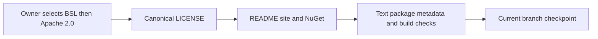

# ADR-107: Business Source License 1.1

Status: Accepted. Date: 2026-10-05. Owner: KeyLoad owner and lead integrator.
Requirements: REQ-LIC-001..003 / AC-LIC-001..003 in
[ReleaseDelivery](../Features/ReleaseDelivery.md#license-distribution).

## Decision

Use the unmodified Business Source License 1.1 Notice, Terms and Covenants from
[SurrealDB's license](https://github.com/surrealdb/surrealdb/blob/main/LICENSE),
with KeyLoad parameters. ManagedCode remains the named licensor. The Additional
Use Grant permits application use, including production, while reserving
Database Service use for a separate commercial license. Retain SurrealDB's exact
definition: third parties can create, manage or control schemas or tables;
direct employees and contractors acting on the user's behalf are excluded.

The owner finally selects Apache License 2.0 as the Change License. Change Date is
2030-10-05; the standard fourth-anniversary rule also applies. The root LICENSE
contains the complete operative text. Describe the current distribution as
source available. Third-party and independently owned dependency licenses stay
with their owners. This decision does not modify rights already granted for
previously distributed copies, runtime behavior or product qualification gates.

## Implementation and verification contract

1. TASK-LIC-001: the lead records root policy and this ReleaseDelivery contract
   before metadata changes. This bounded license/metadata task uses one
   integration owner because the authoritative text and its consumers must agree.
2. TASK-LIC-002: the lead owns LICENSE, Directory.Build.props, README.md and the
   BenchmarkComparisons site metadata plus its existing SiteMetadata TUnit
   assertions. NuGet uses PackageLicenseFile and packs the actual root file;
   CopyToPublishDirectory also retains it in published server/CLI payloads.
   Preserve Three.js manifests, vendor files and every external notice.
3. TASK-LIC-003: compare Notice/Terms/Covenants byte-for-byte with the retrieved
   upstream text; inspect real local NuGet license bytes and nuspec; parse the
   site's real JSON-LD; run governance and final canonical Release build.
   Existing full-builder SiteMetadata tests remain the runtime metadata proof
   through the Aspire-owned site entry when authentic evidence is available.
   Missing evidence or unrelated build failures are recorded, never relabeled green.
4. Delivery uses the current branch and the owner's authorized current-change
   commit. No release workflow dispatch, new dependency, storage migration or
   alteration of immutable historical measurements is part of this task.

Rollback changes future distribution source coherently; it cannot revoke rights
already granted. A later license decision requires explicit owner direction.
Public database APIs, persisted data, SDK transport, performance and RF3 topology
are N/A because this decision changes only licensing and its distribution metadata.

## Development evidence

On 2026-10-05, the exact standard-text comparison, source JSON-LD, governance and
original Three.js byte checks passed. A real local KeyLoad.Client NuGet package
contains a file-type LICENSE declaration and the exact root license bytes.
Canonical Release build remains blocked by CS1573 in OrleansNode.cs for the
membershipAuthority XML parameter documentation. The owned no-build publish
probes stalled and were stopped; publish-output proof and the authentic full
site-builder suite remain unverified. These limitations keep this ADR Accepted.

