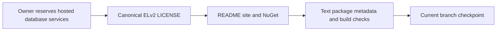

# ADR-107: Elastic License 2.0

Status: Accepted. Date: 2026-10-05. Owner: KeyLoad owner and lead integrator.
Requirements: REQ-LIC-001..003 / AC-LIC-001..003 in
[ReleaseDelivery](../Features/ReleaseDelivery.md#license-distribution).

## Decision

The owner's final requirement is to permit application use while reserving
third-party hosted/managed database services for separate authorization from
ManagedCode. Use the unmodified [Elastic License 2.0](https://www.elastic.co/licensing/elastic-license)
text from its [authoritative source](https://github.com/elastic/elasticsearch/blob/main/licenses/ELASTIC-LICENSE-2.0.txt).
Identify KeyLoad and ManagedCode in a separate copyright/licensor header.

ELv2 permits use, modification and redistribution, including commercial
applications. Its hosted/managed-service limitation applies when third parties
receive access to a substantial set of the software's features or functionality;
it is not a prohibition on running one's own application in a cloud provider.
The standard license-key and notice-preservation limitations also remain intact.
The [official FAQ](https://www.elastic.co/licensing/elastic-license/faq) illustrates
application use and the hosted-service boundary.

This final scope supersedes the earlier BSL decision and its proposed transition
date. ELv2 contains no automatic Apache conversion, Change Date or GPL covenant.
The root LICENSE contains the complete operative text. Current distributions
are source available. Third-party and independently owned dependency licenses
stay with their owners. Previously distributed copies retain their granted
rights; this decision changes future distributions, not runtime behavior or
product qualification gates.

## Implementation and verification contract

1. TASK-LIC-001: the lead records root policy and this ReleaseDelivery contract
   before metadata changes. This bounded license/metadata task uses one
   integration owner because the authoritative text and its consumers must agree.
2. TASK-LIC-002: the lead owns LICENSE, Directory.Build.props, README.md and the
   BenchmarkComparisons site metadata plus its existing SiteMetadata TUnit
   assertions. NuGet uses PackageLicenseFile and packs the actual root file;
   CopyToPublishDirectory also retains it in published server/CLI payloads.
   Preserve Three.js manifests, vendor files and every external notice.
3. TASK-LIC-003: compare the complete ELv2 body byte-for-byte with the retrieved
   official source; inspect real local NuGet license bytes and nuspec; parse the
   site's real JSON-LD; run governance and final canonical Release build.
   Existing full-builder SiteMetadata tests remain the runtime metadata proof
   through the Aspire-owned site entry when authentic evidence is available.
   Missing evidence or unrelated build failures are recorded, never relabeled green.
4. Delivery uses a scoped commit on the current branch and a normal main push,
   followed by a fresh read of GitHub's main LICENSE. Preserve unrelated changes.
   No release workflow dispatch, new dependency, storage migration or alteration
   of immutable historical measurements is part of this task.

Rollback changes future distribution source coherently; it cannot revoke rights
already granted. A later license decision requires explicit owner direction.
Public database APIs, persisted data, SDK transport, performance and RF3 topology
are N/A because this decision changes only licensing and its distribution metadata.

## Development evidence

On 2026-10-06, the complete ELv2 body matches the retrieved authoritative text
byte-for-byte. README, actual source JSON-LD, file-based NuGet/publish metadata,
unchanged third-party vendor bytes and repository governance checks pass.
A real local no-build KeyLoad.Client package and KeyLoad.Server publish output
both contain the exact current LICENSE. These probes use existing compiled
binaries and prove license packaging, not new runtime qualification.

The final canonical Release build fails with eight KLD0035/KLD0036 diagnostics
in KeyLoad.Abstractions, triggered by concurrent analyzer work outside this
license change. No diagnostics were suppressed and no unrelated code was repaired.
The complete site-builder and database suites remain unverified for this change;
these limits keep the ADR Accepted. A source push does not qualify or deploy the
website, database, recovery or RF3 behavior.

