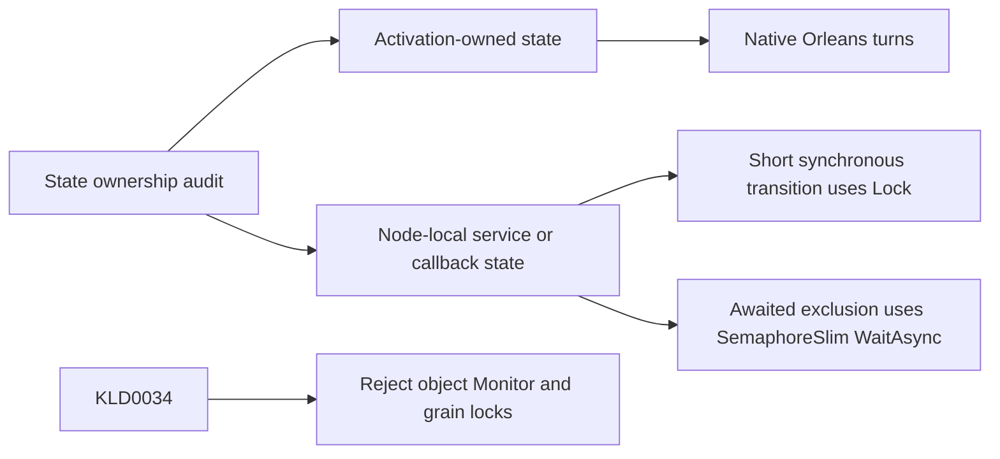

# ADR-108: Typed synchronization and Orleans state ownership

Status: Accepted (implementation and verification pending)
Date: 2026-10-05

## Decision and invariants

The owner rejects `private readonly object lifecycle = new()` and equivalent
Monitor gates. [CodeQuality](../Features/CodeQuality.md) REQ-CQ-010 and
AC-CQ-025..027 define the acceptance contract. Orleans activation state uses its
native turn scheduler; reentrancy and escaped callbacks still require review.
Node-local hosts, storage owners, HTTP services, transport callbacks and test
collectors are shared outside that scheduling boundary.

Use System.Threading.Lock for short synchronous shared-state transitions. Use
SemaphoreSlim.WaitAsync with cancellation and finally-release for exclusion that
must span awaits. Publishing a shared shutdown task is a synchronous transition;
its actual shutdown work and caller wait remain outside the gate. Do not blindly
remove lifecycle, ordered apply, journal, storage-reader or admission ownership.
Replace Monitor wait/pulse disposal coordination with a dedicated typed disposal
Lock. NativeTextProjection retains its synchronous IDisposable contract and holds
this gate through reader join/cleanup. Reader settlement uses independent state
and physical gates, so it can complete while disposal callers serialize; no await
occurs under Lock and the existing host performs cleanup outside grain scheduling.
Concurrent and repeated callers still retry cleanup after a failure.

Removing all gates would break shared-service lifetime invariants. Converting all
short transitions to asynchronous APIs would unnecessarily change public contracts.
The chosen split preserves existing signatures and scheduling while rejecting
object/Monitor gates through source-owned compiler rule KLD0034. Identity sentinel
objects that are never locked remain valid. No performance gain is claimed.

## Ordered implementation and joins

| Task | Owner / scope | Depends on | Output and join condition |
|---|---|---|---|
| TASK-CQ-SYNC-001 | Runtime worker: Core, Storage.ZoneTree, Replication, Orleans, Diagnostics | This accepted owner correction | Audited typed gates; no grain-state lock; preserving lifecycle diff |
| TASK-CQ-SYNC-002 | Server worker: Server and AppHost only | This contract | Typed gates, disposal completion repair and shared-service ownership review |
| TASK-CQ-SYNC-003 | Analyzer worker: Analyzers and Analyzers.Tests only | Frozen KLD0034 / AC-CQ-025 | Native compiler rule and complete semantic regression flows |
| TASK-CQ-SYNC-004 | Lead: benchmark/test gate updates, shared docs, review and verification | 001..003 | Integrated diff; formatter/build; Aspire suite evidence; scoped checkpoint |

Workers read nearest local policy and preserve unrelated changes; same-file
OrleansNode edits must preserve its pre-existing diff. No worker owns shared
configuration or documentation. Use the repository's capable Luna worker policy
for independent scopes; the lead reviews every diff and runs integration gates.
No new package, public API, persistence format, topology or trust change occurs.
Rollout is a coherent source rebuild; rollback reverts the typed-gate change and
its compiler rule together without deleting persisted data or weakening other
rules. Focused tests use real lifecycle/cache/replica operations and native Roslyn
compilations. Full acceptance retains unit/scalar/process recovery and Aspire-owned
Docker RF3 SDK/MCP suites, Linux CI, coverage and all pre-existing qualification
gates. A failing unrelated source gate is reported, never hidden or taken over.

## Evidence

Initial inventory found object gates in shared services and test collectors,
including OrleansNode, PartitionHost, ReplicaConsensus, ClusterCoordinator and
ZoneTreePointCacheLifecycle, plus Monitor wait/pulse disposal coordination in
NativeTextProjection. Typed-gate refactoring covers 64 fields and two helper parameters;
the new real native-reader disposal/reopen regression is authored. Local compiler,
Aspire analyzer and blocker evidence is retained in the
development receipt (report removed from repository).
Full solution build/formatter and runtime gates remain open because unrelated
concurrent source prerequisites fail; this decision remains Accepted.
