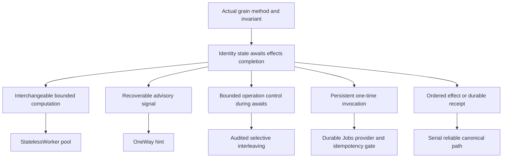

# ADR-110: native Orleans execution and scheduling primitives

Status: Accepted for per-method selection and audit; runtime/provider adoption
pending. Date: 2026-10-05. Integration owner: KeyLoad lead.
Requirements and acceptance: REQ/AC-ORL-001..010 in
[ClusterRouting ExecutionPrimitives](../Features/ClusterRouting/ExecutionPrimitives.md).

## Context and decision

The owner asks KeyLoad to use Orleans' StatelessWorker, OneWay, durable jobs and
reentrancy/interleaving facilities where their guarantees fit. The current unique
request/read grains already allow independent requests; partition commands and
due coordination carry stronger ordered-effect and reliable-outcome contracts.
Increasing grain concurrency without auditing awaits, identity, storage lifetime
and admission can violate those contracts while multiplying retained work.

The owner's follow-up explicitly includes local Orleans services and a broad
documentation review, including messaging/pub-sub and transactions. Extend the
selection inventory before choosing new providers or contracts; preserve the
existing native replica/due GrainServices and silo-local storage/lifecycle owners.

Adopt a per-grain/method selection contract rather than enabling attributes
globally. The owning feature contains the canonical source audit, candidate
matrix, bounds, REQ/AC, planned tests and execution joins. Its decisions preserve
ADR-036's separate request grain, ADR-082's native CQRS lifetime/identity, ADR-003's
RF3 receipt and ADR-094's canonical recurring/saga due state.

Use bounded StatelessWorker pools for proven interchangeable computation;
loss-tolerant OneWay for advisory hints with an independent recovery path; narrow
AlwaysInterleave/MayInterleave control when waits prevent useful progress; and
ReadOnly only for an actually pure compatible read method. Whole-grain Reentrant
requires all-method invariant review and measured justification. None of these
attributes grants CPU parallelism within one Orleans turn or moves file ownership.

Evaluate native Durable Jobs for one-time persistent wake-ups with idempotent
canonical effects. The repository pins Orleans 10.4.0, whose matching Durable
Jobs package remains `10.4.0-alpha.1`. It is not registered in this source. The
package and persistent journal/catalog provider, atomic enqueue/reconciliation,
privacy, retry/admission and homogeneous rollout contracts must be frozen before
integration. This ADR accepts their evaluation; it does not choose a provider or
authorize replacing canonical ZoneTree schedule/saga state with a volatile queue.

## Alternatives and consequences

Blanket Reentrant/AlwaysInterleave would admit turns beside mutable operations
and weaken the existing partition/due serialization. ReadOnly on the generic
read dispatcher would include heterogeneous backup/admin lifecycle work. Marking
request/read grains StatelessWorker would multiply identities/pools and change
the unique signed request boundary without a demonstrated benefit. Those options
are rejected for the inspected methods.

Converting command/due RPCs to OneWay loses callee errors and terminal receipts.
Using a timer as persistent work loses the schedule on activation failure;
reminders persist recurring definitions but do not retain every missed tick.
Neither supplies the selected one-time at-least-once job semantics. Existing
canonical due sweeps remain the recovery authority until a real native adapter
passes its provider/fault gates.

The selected approach can improve independent computation and responsive
operation control while retaining ordered effects. It adds explicit resource and
fault tests and may add native prerelease/provider maintenance. Performance,
durability and production readiness remain unproven by this decision.

## Implementation contract

1. TASK-ORL-AUDIT joins disjoint read-only native API and current grain reviews;
   root owns shared contracts, configuration, docs and integration. The reviews
   make no source/dependency/test changes.
2. TASK-ORL-CONTRACT records the owner rule first, freezes the feature's method
   matrix, maps each REQ to AC/test/evidence and adds architecture/catalog/status
   navigation. Static governance, changed-link review and Mermaid render prove
   this documentation stage only; AC-ORL-001 has an explicit review exception.
   TASK-ORL-CAPABILITY-REVIEW joins disjoint read-only state/time, messaging and
   runtime/lifecycle reviews against the complete official documentation families.
   Root owns the integrated inventory and REQ/AC-ORL-007..010; research alone
   neither registers a provider nor grants a new database consistency guarantee.
3. TASK-ORL-WORKERS, CONTROL and HINTS start only when the owning feature's
   concrete operation, quotas, exact methods and immutable/lifetime/trust
   contracts are resolved. Writes are disjoint feature-local role folders in
   `src/KeyLoad.Orleans/Features/ClusterRouting/` and the actual affected slice;
   tests mirror those slices. Root alone joins generated contracts and call graph.
4. TASK-ORL-JOBS resolves the native API and persistent provider/reconciliation
   gate first. Messaging owns `Features/Messaging/Grains/`, `Contracts/` and
   `Execution/`, matching Core canonical due owners and real process/RF3 tests.
   Server/AppHost composition and central package pins have one root owner.
   No added provider or experimental opt-in bypasses required architecture review.
5. TASK-ORL-VERIFY runs the candidate's meaningful operation tests, final canonical
   Release build/format/analyzers, Aspire unit/scalar/recovery/RF3 suites and
   required coverage/fault gates. Actual SDK/MCP caller evidence and comparable
   Linux GitHub measurements precede capability or acceleration claims.

The feature specification is the canonical task graph, dependency/start/join,
flow/test/bound and migration source. No candidate task is complete merely because
an attribute compiles. Failed or incomplete proof does not unblock its dependants.
New public control APIs, provider formats or dependency defects need the owning
contract and, for ManagedCode defects, its mandatory published repair/release.

Rollout/rollback retain original request aliases, persisted authorization,
ZoneTree state, ordered apply and RF3 recovery journals. Stop admission and join
live work before disabling a candidate. Reconcile persistent job delivery against
canonical generations before provider removal; no format/data migration is
performed by this documentation stage.

## Native sources checked against Orleans 10.4.0

- [Stateless worker grains](https://learn.microsoft.com/en-us/dotnet/orleans/grains/stateless-worker-grains): interchangeable activations and per-identity/per-silo limits.
- [Request scheduling](https://learn.microsoft.com/en-us/dotnet/orleans/grains/request-scheduling): non-reentrancy, selective interleaving and turns across awaits.
- [Concurrency attributes v10.4.0](https://github.com/dotnet/orleans/blob/v10.4.0/src/Orleans.Core.Abstractions/Concurrency/GrainAttributeConcurrency.cs): interface/class attribute placement and the native IInvokable MayInterleave predicate.
- [One-way requests](https://learn.microsoft.com/en-us/dotnet/orleans/grains/oneway): absence of callee completion/error acknowledgement.
- [Durable Jobs v10.4.0 README](https://github.com/dotnet/orleans/blob/v10.4.0/src/Orleans.DurableJobs/README.md): native one-time at-least-once manager/handler and provider requirements.
- [Durable Jobs v10.4.0 public API](https://github.com/dotnet/orleans/blob/v10.4.0/src/api/Orleans.DurableJobs/Orleans.DurableJobs.cs): native manager, handler, run context, registration and bounds.
- [Orleans v10.4.0 release](https://github.com/dotnet/orleans/releases/tag/v10.4.0): matching prerelease Durable Jobs status.
